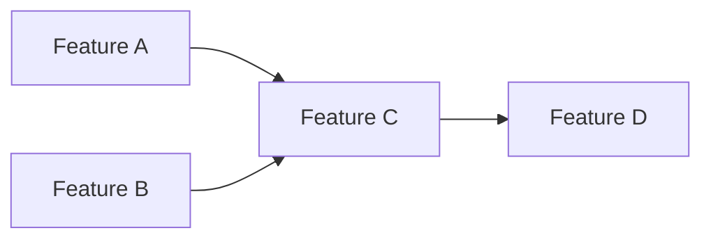

# OpenCode Agents Guidance

## Project: sqlvibe - SQLite-Compatible Database Engine in Go

This document provides guidance for OpenCode agents working on the sqlvibe project.

---

## 1. Project Overview

**Goal**: Implement a SQLite-compatible database engine in Go that achieves blackbox-level correctness compared to real SQLite.

**Language**: Go (Golang)  
**Architecture**: Modular subsystem design (PB, DS, QP, QE, TM)

---

## 2. Important Restrictions

### 2.1 Git Operations

- **NEVER use force push** (`git push --force`, `git push -f`)
- Always create meaningful commit messages
- Commit frequently to maintain clear history

### 2.2 Bugfix Commits

When fixing bugs, the commit message MUST include:
- `#bugfix` tag at the beginning
- Clear description of what was fixed

**Format**:
```
#bugfix: Description of the fix

- Root cause explanation
- What was changed
- How this fixes the issue
```

**Example**:
```
#bugfix: Fix page boundary check in B-Tree split

- The split function was not correctly handling the case where
  the left page would be exactly at capacity
- Changed split logic to ensure both pages have minimum fill
- Added test case for boundary condition
```

### 2.3 Code Quality

- **NEVER** use type suppression (`as any`, `@ts-ignore`, `@ts-expect-error`)
- **NEVER** leave empty catch blocks
- **NEVER** delete failing tests to "pass"
- Always fix root causes, not symptoms

---

## 3. Development Workflow

### 3.1 Before Starting Work

1. Read the relevant documentation in `docs/`
2. Understand the current phase and task priorities
3. Check existing tests to understand expected behavior

### 3.2 Implementation Rules

1. **Each Iteration Must Deliver Valid Results**
   - Never implement partial features that cannot be tested
   - Every change should result in a working system
   - If blocked, ask for clarification

2. **Test-Driven Development**
   - Write tests before or alongside implementation
   - Run SQLite comparison tests frequently
   - Verify against real SQLite outputs

3. **SQLite Compatibility**
   - Run blackbox tests against real SQLite
   - Document any intentional deviations
   - Aim for 100% compatibility on covered features

### 3.3 Verification Requirements

Before marking a task complete, verify:

- [ ] Unit tests pass
- [ ] Integration tests pass  
- [ ] SQLite comparison tests pass
- [ ] No regressions in previous features
- [ ] Code follows project conventions

### 3.4 Commit When Task is Complete

**When a task is complete, make and push commits in time:**

1. After completing any task or subtask, commit immediately
2. Run tests first to ensure everything works
3. Create a meaningful commit message describing what was done
4. Push to remote so progress is tracked

```
# Example workflow after completing a task
go test ./...
git add -A
git commit -m "feat: Implement B-Tree search operation

- Added search method to B-Tree structure
- Handles both leaf and interior nodes
- Added unit tests"
git push
```

**Commit timing rules:**
- Commit within the same session when task completes
- Never leave completed work uncommitted
- If working across multiple sessions, commit before stopping

### 3.5 Track Progress Against Plan

During development, always reference the current plan:

1. **Read the plan** - Start each session by reading `docs/plan-VERSION.md`
2. **Find next task** - Look for incomplete items in Success Criteria
3. **Update status** - Mark tasks as completed in the plan after finishing:
   ```markdown
   ## Success Criteria
   - [x] Feature A implemented and tested  ← completed
   - [ ] Feature B implemented and tested  ← pending
   ```
4. **Commit and push EVERY time** - After marking tasks complete OR any plan change:
   ```
   git add -A
   git commit -m "docs: Update plan-v0.3.x progress"
   git push
   ```
5. **When all tasks complete** - It's time to release:
   - Run full test suite
   - Create tag and push
   - Update HISTORY.md
   - Merge to main

### 3.6 Handling New Tasks

When user adds new tasks during development:

1. **Refine the DAG first** - Update the Implementation DAG to show dependencies
2. **Analyze dependencies** - Determine what can run in parallel, what depends on what
3. **Update Success Criteria** - Add new tasks with `[ ]` status
4. **Commit and push immediately** - Never proceed without committing plan changes:
   ```
   git add -A
   git commit -m "docs: Add new task to plan-v0.3.x"
   git push
   ```
5. **Implement according to DAG** - Never start implementation without following the DAG order

```
Example: User adds "Feature X" mid-iteration

1. Update DAG (mermaid format):
   ```mermaid
   graph LR
       A[Feature A] --> B[Feature B]
       B --> X[Feature X]
       B --> C[Feature C]
   ```

2. Add to Success Criteria:
   - [x] Feature A implemented
   - [ ] Feature B implemented
   - [ ] Feature X implemented  ← new
   - [ ] Feature C implemented

3. Commit and push plan changes immediately

4. Implement following DAG order
```

---

## 4. Iteration Planning

### 4.1 Creating a Plan

When planning an iteration (unless user specifies a version):

1. **Check HISTORY.md** for the last released version
2. **Determine next version**: increment the minor version (e.g., v0.2.x → v0.3.x)
3. **Gather requirements** from `docs/sqlite.reqs.md` and `docs/sql1999.reqs.md`
4. **Rank requirements** by priority (HIGH → MEDIUM → LOW)
5. **Create** `docs/plan-VERSION.md` with selected features

### 4.2 Plan File Format

```markdown
# Plan v0.3.x

## Goal
Brief description of this iteration's goal.

## Requirements

### HIGH Priority
- Feature A (from sqlite.reqs.md / sql1999.reqs.md)
- Feature B

### MEDIUM Priority
- Feature C
- Feature D

### LOW Priority
- Feature E

## Implementation DAG



## Detailed Design

### Feature A
- **Parser changes**: Describe what needs to be added to the parser
- **Engine changes**: Describe what needs to be added to the execution engine
- **Files affected**: List files to modify

### Feature B
- **Parser changes**: ...
- **Engine changes**: ...
- **Files affected**: ...

## Success Criteria
- [ ] Feature A implemented and tested
- [ ] Feature B implemented and tested

## Notes
Any additional context or considerations.
```

### 4.3 Planning Process

```
1. Read docs/sqlite.reqs.md and docs/sql1999.reqs.md
2. Filter by priority (HIGH first)
3. Select feasible features for this iteration
4. Analyze each feature:
   - What parser changes needed?
   - What engine changes needed?
   - What are the dependencies between features?
5. Create docs/plan-v0.3.x.md with detailed design and DAG (mermaid format)
6. Commit and push the plan
7. Get user approval before starting implementation
```

---

## 5. Release Process

### 5.1 Version Tagging

When a version is complete:

1. Tag the release: `git tag -a vX.Y.Z -m "Release vX.Y.Z"`
2. Push tag: `git push origin vX.Y.Z`
3. Merge to main branch

### 5.2 Release Notes

After tagging, update `docs/HISTORY.md` with:

```markdown
## **vX.Y.Z** (YYYY-MM-DD)

### Features
- List new features

### Known Issues
- List known issues or leave empty

### Fixed Bugs
- Extract from git: `git log --oneline vX.Y.Z...HEAD --grep="#bugfix"`
- List each bugfix commit

### Tests
- Update test count
```

### 5.3 Release Checklist

- [ ] All tests pass
- [ ] Tag created and pushed
- [ ] Merged to main branch
- [ ] HISTORY.md updated with release notes

---

## 6. Commit Guidelines

### 6.1 When to Commit

- After completing a task or subtask
- After fixing a bug
- After adding significant tests
- Before starting risky refactoring

### 6.2 Commit Message Format

```
<type>: <short description>

<long description if needed>
```

**Types**:
- `feat`: New feature
- `fix`: Bugfix (use #bugfix prefix)
- `refactor`: Code refactoring
- `test`: Test additions/changes
- `docs`: Documentation changes
- `chore`: Build/tooling changes

**Examples**:
```
feat: Implement B-Tree search operation

- Added search method to B-Tree
- Handles both leaf and interior nodes
- Added unit tests for search

#bugfix: Fix integer overflow in page number calculation

- Changed uint32 to uint64 for large database support
- Added boundary checks
- Added test for edge case
```

### 6.3 Commit Size

- Prefer smaller, focused commits over large changes
- Each commit should be logically self-contained
- If a change is large, consider splitting into multiple commits

---

## 7. Subsystem-Specific Guidance

### 7.1 Platform Bridges (PB)

- Keep OS-specific code isolated
- Use interfaces for testability
- Handle errors gracefully

### 7.2 Data Storage (DS)

- Follow SQLite file format exactly
- Test with existing SQLite databases
- Verify page-level operations with hex dumps

### 7.3 Query Processing (QP)

- Use goyacc for parser generation
- Provide clear error messages with line/column numbers
- Test error handling thoroughly

### 7.4 Query Execution (QE)

- Follow SQLite VM opcode semantics
- Test edge cases (NULLs, type conversions)
- Verify result correctness against SQLite

### 7.5 Transaction Monitor (TM)

- Test crash recovery scenarios
- Verify ACID properties
- Test concurrent access patterns

---

## 8. Testing Strategy

### 8.1 Test Categories

1. **Unit Tests**: Test individual components in isolation
2. **Integration Tests**: Test subsystem interactions
3. **SQLite Comparison Tests**: Run same SQL, compare results
4. **Stress Tests**: Large data, concurrent operations

### 8.2 SQLite Testing

Run comparison tests frequently:

```bash
# Run SQLite compatibility tests
go test ./test/sqllogictest/...

# Compare specific SQL
go test -run TestSQLiteComparison
```

### 8.3 Test Data

- Use the test data in `test/` directory
- Create edge case tests for NULLs, boundaries
- Test with both small and large datasets

### 8.4 TS Test Suite Naming Convention

All compatibility tests MUST follow the TS (Test Suite) naming convention to ensure proper grouping and identification.

#### 8.4.1 Naming Format

```
Test<TestsuiteName>_F<FeatureNumber>_<TestCaseName>_L<Level>
```

**Components**:
| Component | Description | Example |
|-----------|-------------|---------|
| `Test` | Go test prefix | `Test` |
| `TestsuiteName` | Test suite identifier | `SQL1999`, `SQLite` |
| `F<FeatureNumber>` | SQL Feature ID (3-digit zero-padded) | `F301`, `F302`, `F451` |
| `TestCaseName` | Descriptive test case name | `NumericTypes`, `StringTypes` |
| `L<Level>` | Test level | `L1`, `L2`, `L3` |

**Example**:
```go
// SQL:1999 Feature F301 - Numeric Types
func TestSQL1999_F301_NumericTypes_L1(t *testing.T) { ... }

// SQL:1999 Feature F304 - Character Types  
func TestSQL1999_F304_CharacterTypes_L1(t *testing.T) { ... }
```

#### 8.4.2 Test Levels

| Level | Name | Storage Backend | Description |
|-------|------|-----------------|-------------|
| **L1** | Fundamental | `:memory:` | Basic functionality tests, no persistence required |
| **L2** | FileBased | Temporary file | Tests requiring file storage, transactions |
| **L3** | EdgeCases | `:memory:` or file | Boundary conditions, stress tests |

**Rules**:
- **L1 tests MUST use `:memory:` backend** - no file I/O
- **L2 tests use temporary files** - must clean up after
- **L3 tests can use either** - depending on edge case

#### 8.4.3 SQL:1999 Feature IDs

Reference from `docs/sql1999.reqs.md`:

| Feature ID | Feature Name | Description |
|------------|--------------|-------------|
| F301 | Numeric Types | NUMERIC, DECIMAL, SMALLINT, INTEGER, BIGINT, REAL, DOUBLE, FLOAT |
| F302 | Character Types | CHAR, VARCHAR, CLOB, NCHAR, NVARCHAR, NCLOB |
| F303 | Date/Time Types | DATE, TIME, TIMESTAMP, INTERVAL |
| F451 | Character Set | Character set support, collation |
| ... | ... | See `docs/sql1999.reqs.md` for full list |

#### 8.4.4 Test Structure

```go
// Level 1: Fundamental test with :memory:
func TestSQL1999_F301_NumericTypes_L1(t *testing.T) {
    sqlvibePath := ":memory:"
    sqlitePath := ":memory:"
    
    tests := []struct {
        name     string
        sql      string
        expected string
    }{...}
    
    for _, tt := range tests {
        t.Run(tt.name, func(t *testing.T) {
            // Test sqlvibe vs SQLite
        })
    }
}

// Level 2: File-based test
func TestSQL1999_F302_CharacterTypes_L2(t *testing.T) {
    // Create temp file for both sqlvibe and SQLite
    sqlvibeFile := tempFile(t)
    sqliteFile := tempFile(t)
    defer os.Remove(sqlvibeFile)
    defer os.Remove(sqliteFile)
    // ... test code
}
```

#### 8.4.5 Migration of Existing Tests

When renaming existing tests to TS convention:

1. **Identify the test's feature** from `docs/sql1999.reqs.md`
2. **Determine the appropriate level** (L1/L2/L3)
3. **Rename following the format**: `Test<Testsuite>_F<Feature>_<Name>_L<Level>`
4. **Update backend if needed**: L1 tests MUST use `:memory:`
5. **Verify test still passes** before committing

**Example migration**:
```
Before: TestSQL1999_CH03_Numbers
After:  TestSQL1999_F301_NumericTypes_L1
```

#### 8.4.6 Test Organization

- **Group by Testsuite**: All SQL1999 tests together, all SQLite tests together
- **Group by Feature**: Within a testsuite, group by Feature ID (F301, F302, etc.)
- **Group by Level**: L1 tests first, then L2, then L3

```go
// Group order in file:
// 1. SQL1999 Feature F301 tests
func TestSQL1999_F301_NumericTypes_L1(t *testing.T) { ... }
func TestSQL1999_F301_NumericTypes_L2(t *testing.T) { ... }

// 2. SQL1999 Feature F302 tests
func TestSQL1999_F302_CharacterTypes_L1(t *testing.T) { ... }

// 3. SQLite compatibility tests
func TestSQLite_BasicSelect_L1(t *testing.T) { ... }
```

#### 8.4.7 Verification Checklist

Before committing TS-named tests, verify:

- [ ] Name follows format: `Test<Testuite>_F<Feature>_<Name>_L<Level>`
- [ ] Feature ID matches SQL:1999 spec (check `docs/sql1999.reqs.md`)
- [ ] L1 tests use `:memory:` backend
- [ ] L2/L3 tests use appropriate storage
- [ ] Test passes with sqlvibe vs SQLite comparison
- [ ] No regressions in existing tests

---

## 9. Documentation

### 9.1 Code Documentation

- Document public interfaces
- Explain complex algorithms in comments
- Use meaningful variable/function names

### 9.2 Project Documentation

- Update `docs/` when making architectural changes
- Keep PHASES.md current with progress
- Document any design decisions

---

## 10. File Structure

```
sqlvibe/
├── cmd/              # CLI application
├── pkg/              # Public API
├── internal/         # Internal packages
│   ├── pb/          # Platform Bridges
│   ├── ds/          # Data Storage
│   ├── qp/          # Query Processing
│   ├── qe/          # Query Execution
│   └── tm/          # Transaction Monitor
├── test/            # Test files
│   └── sqllogictest/
├── docs/            # Documentation
├── go.mod
├── go.sum
└── Makefile
```

---

## 11. Build and Test Commands

```bash
# Build the project
go build ./...

# Run all tests
go test ./...

# Run SQLite comparison tests
go test ./test/sqllogictest/...

# Run specific test
go test -run TestName ./...

# Generate parser
make parser

# Format code
go fmt ./...

# Run linter
go vet ./...
```

---

## 12. Getting Help

1. Read `docs/ARCHITECTURE.md` for system design
2. Read `docs/PHASES.md` for implementation plan
3. Check existing tests for expected behavior
4. If stuck, consult with Oracle agent

---

## Summary

- **No force push ever**
- Use `#bugfix` prefix for bug fixes
- Each iteration must deliver valid results
- Test against SQLite frequently
- Commit frequently with meaningful messages
- Follow code quality standards
