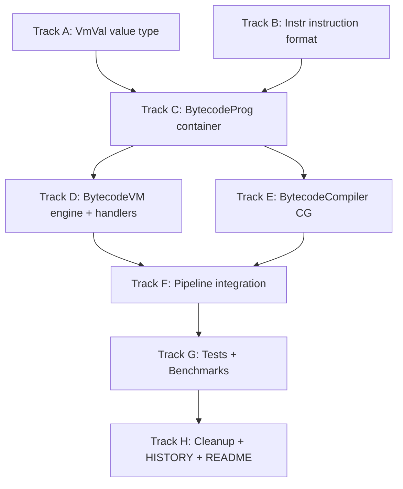

# Plan v0.10.0 - Real Bytecode Execution Engine

## Summary

v0.10.0 is a **major breaking change** that replaces the current AST-walking code
generator and `interface{}`-register virtual machine with a compact, fully-typed,
cache-friendly bytecode execution pipeline. The public SQL API is unchanged; only the
internal CG → VM pipeline is redesigned.

---

## Background

### What is "AST-based" execution today?

The current pipeline:

```
SQL text
  → QP.Tokenize → []Token
  → QP.Parse    → AST nodes
  → CG.Compile  → []VM.Instruction{Op, P1, P2, P3 string, P4 interface{}}
  → VM.Exec     → large switch(inst.Op) { … }
```

The bottlenecks:

| Problem | Current Implementation | Impact |
|---------|----------------------|--------|
| **Interface boxing** | Registers are `[]interface{}` | Every int/float → heap alloc or 2-word boxing |
| **Untyped P4 field** | `Instruction.P4 interface{}` | Type assertions in every hot-path handler |
| **Non-compact instructions** | `Instruction` is ~72 bytes (string + interface{}) | Only 1–2 instructions fit per cache line |
| **Switch dispatch** | ~200-case switch in exec.go | Branch predictor thrashes on irregular workloads |
| **Embedded constants** | Literals inline in `P4 interface{}` | Prevents constant-pool sharing; scattered allocation |

### What v0.10.0 introduces

A **real bytecode** pipeline:

```
SQL text
  → QP.Tokenize → []Token            (unchanged)
  → QP.Parse    → AST nodes          (unchanged)
  → CG.BytecodeCompiler → BytecodeProg{[]Instr, []VmVal, …}
  → VM.BytecodeVM.Run → []VmVal results
```

| New Component | Description |
|---------------|-------------|
| `VmVal` | 32-byte typed SQL value struct (no `interface{}`) |
| `Instr` | 16-byte fixed-width instruction (no `interface{}`) |
| `BytecodeProg` | Program container with constant pool + metadata |
| `BytecodeVM` | Execution engine with `[NumOpcodes]OpHandler` dispatch table |
| `BytecodeCompiler` | New CG compiler emitting `BytecodeProg` |

---

## Design Specification

### A. Value Type: `VmVal`

**File**: `internal/VM/value.go` (**new**)

A `VmVal` is a discriminated union covering all SQL scalar types with no heap
allocation for NULL, integer, and float values. The string header (`string` in Go) is
already a fat pointer (ptr + len = 16 bytes) so text values need no additional boxing.

```go
// ValTag identifies the runtime type of a VmVal.
type ValTag uint8

const (
    TagNull  ValTag = 0 // SQL NULL
    TagInt   ValTag = 1 // int64
    TagFloat ValTag = 2 // float64 bits stored in N via math.Float64bits
    TagText  ValTag = 3 // string
    TagBlob  ValTag = 4 // []byte stored as string (cast)
    TagBool  ValTag = 5 // bool (N == 1 is true, N == 0 is false)
)

// VmVal is a 32-byte typed SQL scalar (no interface{} boxing).
// Layout on amd64: N(8) + S(16) + T(1) + Fl(1) + _pad(6) = 32 bytes.
type VmVal struct {
    N  int64  // int64 value; also stores float64 bits (math.Float64bits)
    S  string // TagText: string content; TagBlob: blob cast to string
    T  ValTag // type tag (one of TagXxx constants)
    Fl uint8  // internal flags (currently unused, reserved for subtype)
}

// Constructors
func VmNull() VmVal                  { return VmVal{T: TagNull} }
func VmInt(n int64) VmVal            { return VmVal{T: TagInt, N: n} }
func VmFloat(f float64) VmVal        { return VmVal{T: TagFloat, N: int64(math.Float64bits(f))} }
func VmText(s string) VmVal          { return VmVal{T: TagText, S: s} }
func VmBlob(b []byte) VmVal          { return VmVal{T: TagBlob, S: string(b)} }

// Accessors
func (v VmVal) IsNull() bool         { return v.T == TagNull }
func (v VmVal) Int() int64           { return v.N }
func (v VmVal) Float() float64       { return math.Float64frombits(uint64(v.N)) }
func (v VmVal) Text() string         { return v.S }
func (v VmVal) Blob() []byte         { return []byte(v.S) }

// ToInterface converts a VmVal to interface{} for legacy API compatibility.
// Only called at result projection boundaries, not in the hot path.
func (v VmVal) ToInterface() interface{} {
    switch v.T {
    case TagNull:  return nil
    case TagInt:   return v.N
    case TagFloat: return v.Float()
    case TagText:  return v.S
    case TagBlob:  return v.Blob()
    case TagBool:
        if v.N != 0 { return true }
        return false
    }
    return nil
}

// FromInterface converts a legacy interface{} value to VmVal.
// Called at row-read boundaries when consuming existing storage results.
func FromInterface(val interface{}) VmVal {
    if val == nil { return VmNull() }
    switch v := val.(type) {
    case int64:   return VmInt(v)
    case int:     return VmInt(int64(v))
    case float64: return VmFloat(v)
    case string:  return VmText(v)
    case []byte:  return VmBlob(v)
    case bool:
        if v { return VmInt(1) }
        return VmInt(0)
    }
    return VmText(fmt.Sprintf("%v", val))
}
```

**Key invariant**: `VmNull()`, `VmInt()`, `VmFloat()` never allocate.

---

### B. Instruction Format: `Instr`

**File**: `internal/VM/instr.go` (**new**)

Each instruction is exactly **16 bytes**. Four instructions fit in a single 64-byte
L1 cache line. There are no pointer fields; no GC scanning is required.

```
 0       2       4               8               12              16
 +-------+-------+---------------+---------------+---------------+
 | Op    | Fl    |       A       |       B       |       C       |
 +-------+-------+---------------+---------------+---------------+
  uint16  uint16     int32           int32           int32
```

| Field | Width | Meaning |
|-------|-------|---------|
| `Op` | 16-bit | Opcode (max 65 535 opcodes) |
| `Fl` | 16-bit | Flag bits (see `InstrFlag*` constants) |
| `A`  | 32-bit | Operand A: usually source register 0 |
| `B`  | 32-bit | Operand B: source register 1, or constant-pool index |
| `C`  | 32-bit | Operand C: destination register, or jump-target PC |

**Flag bits** (`Fl`):

```go
const (
    // InstrFlagImmA: A is a small integer immediate, not a register.
    // Useful for opcodes like OpAddImm where adding a literal constant is common.
    InstrFlagImmA InstrFlag = 1 << 0

    // InstrFlagConstB: B is a constant-pool index, not a register.
    // The VM reads prog.Consts[B] instead of vm.regs[B].
    InstrFlagConstB InstrFlag = 1 << 1

    // InstrFlagJumpC: C is an absolute jump target (PC), not a register.
    InstrFlagJumpC InstrFlag = 1 << 2

    // InstrFlagTypedInt: both A and B registers are known-int at compile time.
    // The handler may skip dynamic type checks and use the fast int path directly.
    InstrFlagTypedInt InstrFlag = 1 << 3

    // InstrFlagTypedFloat: both A and B registers are known-float at compile time.
    InstrFlagTypedFloat InstrFlag = 1 << 4

    // InstrFlagNullable: result may be NULL; handler must propagate NULL.
    InstrFlagNullable InstrFlag = 1 << 5
)
```

**Rationale for 16 bytes vs. 8 bytes**: An 8-byte format limits registers to 8 bits
(256) and immediates to 16 bits, which is tight for aggregate/window programs that use
many temporaries. At 16 bytes, A/B/C each carry 32 bits — enough for the full constant
pool, any jump target, and up to 2 billion registers (virtually unlimited). The 2×
increase in instruction size is offset by the elimination of `interface{}` P4 heap
allocations, which currently account for more bytes (and GC pressure) per instruction.

```go
type InstrFlag = uint16

type Instr struct {
    Op uint16
    Fl uint16
    A  int32
    B  int32
    C  int32
}

// Convenience constructors used by BytecodeCompiler.
func InstrABC(op uint16, a, b, c int32) Instr {
    return Instr{Op: op, A: a, B: b, C: c}
}

func InstrABCF(op uint16, a, b, c int32, fl uint16) Instr {
    return Instr{Op: op, Fl: fl, A: a, B: b, C: c}
}

func InstrJump(op uint16, a, b int32, target int32) Instr {
    return Instr{Op: op, Fl: InstrFlagJumpC, A: a, B: b, C: target}
}

func InstrConst(op uint16, poolIdx int32, dst int32) Instr {
    return Instr{Op: op, Fl: InstrFlagConstB, B: poolIdx, C: dst}
}
```

---

### C. Program Container: `BytecodeProg`

**File**: `internal/VM/bytecode_prog.go` (**new**)

```go
// BytecodeProg is a compiled, ready-to-execute bytecode program.
// It is immutable after compilation and safe to share across goroutines.
type BytecodeProg struct {
    Instrs    []Instr  // instruction stream
    Consts    []VmVal  // constant pool — referenced by B when InstrFlagConstB is set
    NumRegs   int      // number of register slots needed
    NumCurs   int      // number of cursor slots needed
    NumAgg    int      // number of aggregate accumulator slots
    OrigSQL   string   // original SQL text (for EXPLAIN / error messages)
}

// NewBytecodeBuilder returns a mutable builder for constructing a BytecodeProg.
func NewBytecodeBuilder() *BytecodeBuilder { … }

type BytecodeBuilder struct {
    prog    BytecodeProg
    nextReg int
    fixups  []fixupEntry // deferred jump target patches
}

// Emit appends one instruction and returns its index.
func (b *BytecodeBuilder) Emit(instr Instr) int { … }

// AllocReg allocates the next available register slot.
func (b *BytecodeBuilder) AllocReg() int { … }

// AddConst adds a VmVal to the constant pool and returns its index.
func (b *BytecodeBuilder) AddConst(v VmVal) int32 { … }

// Fixup patches the C (jump target) field of instruction at idx.
func (b *BytecodeBuilder) Fixup(idx int) { … }

// Build finalises and returns the immutable BytecodeProg.
func (b *BytecodeBuilder) Build() *BytecodeProg { … }
```

---

### D. Execution Engine: `BytecodeVM`

**File**: `internal/VM/bytecode_vm.go` (**new**)

The `BytecodeVM` replaces the `VM` struct. It uses a **call-threaded dispatch table**
indexed by `Instr.Op`. This is the fastest interpreter dispatch achievable in portable
Go without `unsafe`.

```go
// OpHandler is called for one instruction.
// Returns the next PC (usually pc+1, or a branch target).
// Returns -1 to signal normal halt; returns -2 on error.
type BcOpHandler func(vm *BytecodeVM, inst *Instr) int

// bcTable is the global dispatch table.
// Indexed by opcode. Populated by init() in bytecode_handlers.go.
var bcTable [BcOpMax]BcOpHandler

// BytecodeVM is the execution engine for a BytecodeProg.
type BytecodeVM struct {
    prog    *BytecodeProg
    regs    []VmVal      // typed register file (len = prog.NumRegs)
    cursors *CursorArray // reuse existing cursor management
    agg     []VmVal      // aggregate accumulators
    results [][]VmVal    // collected result rows
    pc      int          // program counter
    ctx     VmContext    // storage context
    err     error
    rowLimit int         // early-exit limit (LIMIT without ORDER BY)
}

// Run executes the program from PC=0 and returns collected rows.
func (vm *BytecodeVM) Run(ctx VmContext) ([][]interface{}, error) {
    prog := vm.prog
    instrs := prog.Instrs
    table := &bcTable

    for {
        inst := &instrs[vm.pc]
        next := table[inst.Op](vm, inst)
        if next < 0 {
            if next == -1 { break }          // normal halt
            return nil, vm.err               // error halt
        }
        vm.pc = next
    }
    return vm.materializeResults(), nil
}
```

**Handler naming convention**: `bcOp<Name>` for all handlers in
`internal/VM/bytecode_handlers.go`. Each handler is a standalone function registered
in `bcTable` during `init()`.

```go
// Example handlers registered in init():
func init() {
    bcTable[BcLoadConst]  = bcOpLoadConst
    bcTable[BcLoadNull]   = bcOpLoadNull
    bcTable[BcMove]       = bcOpMove
    bcTable[BcAdd]        = bcOpAdd
    bcTable[BcAddInt]     = bcOpAddInt     // typed fast path (InstrFlagTypedInt)
    bcTable[BcSub]        = bcOpSub
    bcTable[BcMul]        = bcOpMul
    bcTable[BcDiv]        = bcOpDiv
    bcTable[BcEq]         = bcOpEq
    bcTable[BcNe]         = bcOpNe
    bcTable[BcLt]         = bcOpLt
    bcTable[BcGoto]       = bcOpGoto
    bcTable[BcIfTrue]     = bcOpIfTrue
    bcTable[BcIfFalse]    = bcOpIfFalse
    bcTable[BcIfNull]     = bcOpIfNull
    bcTable[BcIfNotNull]  = bcOpIfNotNull
    bcTable[BcColumn]     = bcOpColumn
    bcTable[BcResultRow]  = bcOpResultRow
    bcTable[BcHalt]       = bcOpHalt
    bcTable[BcNext]       = bcOpNext
    bcTable[BcRewind]     = bcOpRewind
    bcTable[BcOpenRead]   = bcOpOpenRead
    // … all other opcodes …
}

func bcOpAdd(vm *BytecodeVM, inst *Instr) int {
    a, b := vm.regs[inst.A], vm.regs[inst.B]
    vm.regs[inst.C] = vmAdd(a, b)
    return vm.pc + 1
}

func bcOpAddInt(vm *BytecodeVM, inst *Instr) int {
    // Typed fast path: no tag check required when InstrFlagTypedInt is set.
    vm.regs[inst.C] = VmInt(vm.regs[inst.A].N + vm.regs[inst.B].N)
    return vm.pc + 1
}
```

**NULL propagation** is handled inline in each arithmetic/comparison handler
rather than in a wrapper, eliminating a function call per instruction.

---

### E. New Opcode Set: `BcOpCode`

**File**: `internal/VM/bc_opcodes.go` (**new**)

The new opcode set is **separate** from the legacy `OpCode` enum. The two sets coexist
during the migration window. Legacy programs keep using `OpCode`; new programs use
`BcOpCode`.

```go
type BcOpCode = uint16

const (
    // Control flow
    BcNoop     BcOpCode = 0
    BcHalt     BcOpCode = 1   // halt: A=0 (ok) or A=1 (error)
    BcGoto     BcOpCode = 2   // C = target PC
    BcGosub    BcOpCode = 3
    BcReturn   BcOpCode = 4
    BcInit     BcOpCode = 5   // init: C = first real instruction

    // Register / memory
    BcLoadNull  BcOpCode = 10 // regs[C] = NULL
    BcLoadInt   BcOpCode = 11 // regs[C] = A (immediate int32, sign-extended to int64)
    BcLoadConst BcOpCode = 12 // regs[C] = consts[B]
    BcMove      BcOpCode = 13 // regs[C] = regs[A]
    BcCopy      BcOpCode = 14 // regs[C] = copy of regs[A] (same as Move in Go; future: deep copy for blobs)
    BcSwap      BcOpCode = 15 // swap regs[A] and regs[C]

    // Cursor / row
    BcOpenRead   BcOpCode = 20 // open table for read; A=cursorID, consts[B]=table name
    BcOpenWrite  BcOpCode = 21 // open table for write
    BcRewind     BcOpCode = 22 // seek cursor to first row; A=cursorID, C=jump-if-empty
    BcNext       BcOpCode = 23 // advance cursor; A=cursorID, C=loop-back-target
    BcPrev       BcOpCode = 24
    BcClose      BcOpCode = 25
    BcColumn     BcOpCode = 26 // regs[C] = row[A], where A=cursorID * MaxCols + colIdx
    BcRowid      BcOpCode = 27 // regs[C] = rowid of current row in cursor A
    BcSeek       BcOpCode = 28 // seek cursor A to rowid in regs[B]; C=miss-target
    BcSeekGT     BcOpCode = 29
    BcSeekGE     BcOpCode = 30
    BcSeekLT     BcOpCode = 31
    BcFound      BcOpCode = 32 // if cursor A has match jump C, else pc+1
    BcNotFound   BcOpCode = 33

    // Result
    BcResultRow  BcOpCode = 40 // emit result row: A=first-reg, B=num-regs

    // Arithmetic (generic, type-dispatching)
    BcAdd  BcOpCode = 50
    BcSub  BcOpCode = 51
    BcMul  BcOpCode = 52
    BcDiv  BcOpCode = 53
    BcRem  BcOpCode = 54
    BcNeg  BcOpCode = 55 // regs[C] = -regs[A]

    // Typed-integer arithmetic fast paths (InstrFlagTypedInt must be set)
    BcAddInt BcOpCode = 56 // no type dispatch: just N+N
    BcSubInt BcOpCode = 57
    BcMulInt BcOpCode = 58
    BcDivInt BcOpCode = 59

    // Bitwise
    BcBitAnd BcOpCode = 60
    BcBitOr  BcOpCode = 61
    BcBitXor BcOpCode = 62
    BcShl    BcOpCode = 63
    BcShr    BcOpCode = 64

    // Comparison (result stored in regs[C] as TagBool)
    BcEq  BcOpCode = 70
    BcNe  BcOpCode = 71
    BcLt  BcOpCode = 72
    BcLe  BcOpCode = 73
    BcGt  BcOpCode = 74
    BcGe  BcOpCode = 75
    BcIs  BcOpCode = 76 // IS (NULL-safe equality)
    BcIsNot BcOpCode = 77

    // Conditional jump (branch on register value)
    BcIfTrue    BcOpCode = 80 // if regs[A] is truthy, jump to C
    BcIfFalse   BcOpCode = 81 // if regs[A] is falsy, jump to C
    BcIfNull    BcOpCode = 82 // if regs[A] is NULL, jump to C
    BcIfNotNull BcOpCode = 83

    // Boolean logic
    BcAnd BcOpCode = 90
    BcOr  BcOpCode = 91
    BcNot BcOpCode = 92

    // String operations
    BcConcat  BcOpCode = 100
    BcLength  BcOpCode = 101
    BcSubstr  BcOpCode = 102 // A=str-reg, B=start-reg, C=dst; length in next Instr.A
    BcUpper   BcOpCode = 103
    BcLower   BcOpCode = 104
    BcTrim    BcOpCode = 105
    BcLTrim   BcOpCode = 106
    BcRTrim   BcOpCode = 107
    BcReplace BcOpCode = 108
    BcInstr_  BcOpCode = 109
    BcLike    BcOpCode = 110
    BcGlob    BcOpCode = 111
    BcMatch   BcOpCode = 112

    // Type operations
    BcTypeof  BcOpCode = 120
    BcCast    BcOpCode = 121
    BcToInt   BcOpCode = 122
    BcToReal  BcOpCode = 123
    BcToText  BcOpCode = 124

    // Math functions (each maps to a single-instruction form for common cases)
    BcAbs    BcOpCode = 130
    BcRound  BcOpCode = 131
    BcFloor  BcOpCode = 132
    BcCeil   BcOpCode = 133
    BcSqrt   BcOpCode = 134

    // Aggregate accumulators
    BcAggCount BcOpCode = 140 // agg[A] += 1 (skip NULL in regs[B])
    BcAggSum   BcOpCode = 141 // agg[A] += regs[B]
    BcAggMin   BcOpCode = 142 // agg[A] = min(agg[A], regs[B])
    BcAggMax   BcOpCode = 143
    BcAggAvg   BcOpCode = 144
    BcAggStr   BcOpCode = 145 // group_concat accumulator
    BcAggOut   BcOpCode = 146 // regs[C] = finalise agg[A]

    // Generic scalar function call (for extension functions / uncommon built-ins)
    BcCallScalar BcOpCode = 150 // consts[B] = *BcScalarCallInfo; result in regs[C]

    // DML
    BcInsert BcOpCode = 160 // A=cursorID, B=first-reg, consts[C]=num-cols
    BcDelete BcOpCode = 161 // A=cursorID
    BcUpdate BcOpCode = 162 // A=cursorID, B=first-col-reg, consts[C]=num-cols

    // Subquery
    BcScalarSubq BcOpCode = 170 // regs[C] = result of subquery in consts[B]
    BcExistsSubq BcOpCode = 171
    BcInSubq     BcOpCode = 172
    BcNotInSubq  BcOpCode = 173

    // Set operations
    BcEphCreate BcOpCode = 180 // create ephemeral distinct-set in slot A
    BcEphInsert BcOpCode = 181
    BcEphFind   BcOpCode = 182

    // JSON / columnar (reserved, same numeric range as legacy)
    BcJson        BcOpCode = 190
    BcJsonExtract BcOpCode = 191

    BcOpMax BcOpCode = 256   // dispatch table size
)
```

---

### F. New Code Generator: `BytecodeCompiler`

**File**: `internal/CG/bytecode_compiler.go` (**new**)

The `BytecodeCompiler` mirrors the API of the existing `Compiler` but emits
`BytecodeProg` instead of `Program`. It is a drop-in replacement at the call sites in
`pkg/sqlvibe`.

```go
package CG

// BytecodeCompiler compiles an AST into a BytecodeProg.
type BytecodeCompiler struct {
    b             *VM.BytecodeBuilder
    tableCursors  map[string]int
    TableSchemas  map[string]map[string]int  // table → column → index
    TableColOrder []string
    optimizer     *Optimizer  // reuse existing optimizer
}

func NewBytecodeCompiler() *BytecodeCompiler { … }

func (bc *BytecodeCompiler) CompileSelect(stmt *QP.SelectStmt) *VM.BytecodeProg { … }
func (bc *BytecodeCompiler) CompileInsert(stmt *QP.InsertStmt) *VM.BytecodeProg  { … }
func (bc *BytecodeCompiler) CompileUpdate(stmt *QP.UpdateStmt) *VM.BytecodeProg  { … }
func (bc *BytecodeCompiler) CompileDelete(stmt *QP.DeleteStmt) *VM.BytecodeProg  { … }
```

**Key difference from old `Compiler`**: constants are added to the constant pool via
`b.AddConst(VmVal{…})` rather than embedded as `interface{}` in `P4`. Register
allocation is unchanged (still `RegisterAllocator`).

---

### G. Pipeline Integration

**File**: `pkg/sqlvibe/vm_exec.go` (modify)

Add a toggle: when `SVDB_USE_BYTECODE=1` pragma is set (default `true` in v0.10.0),
the new pipeline is used. Old pipeline remains available as a fallback during the
transition period.

```
ExecSQL
  → if useBytecode:
      BytecodeCompiler.Compile(ast) → BytecodeProg
      BytecodeVM.Run(prog, ctx)
  → else (legacy):
      CG.Compiler.CompileSelect(ast) → Program
      VM.NewVM(prog).Exec(ctx)
```

This ensures **zero behaviour change**: both paths produce identical SQL results and
can be validated by running the full test suite against both.

---

## Implementation DAG



---

## Track A: VmVal Typed Value Type

### A1. Create `internal/VM/value.go`

- Define `ValTag`, `VmVal` struct (32 bytes)
- `VmNull()`, `VmInt()`, `VmFloat()`, `VmText()`, `VmBlob()` constructors
- `ToInterface()` and `FromInterface()` adapters (used only at row boundaries)
- `vmCompare(a, b VmVal) int` — returns -1/0/1 (NULL-safe, type-coercing, same semantics as SQLite)
- `vmAdd`, `vmSub`, `vmMul`, `vmDiv`, `vmRem` for arithmetic
- `vmEqual`, `vmLess` — used by sort/distinct
- Unit tests in `internal/VM/value_test.go`

### A2. Verify No Heap Allocation

Add a `BenchmarkVmValNoAlloc` in `internal/VM/value_test.go`:

```go
func BenchmarkVmValNoAlloc(b *testing.B) {
    b.ReportAllocs()
    for i := 0; i < b.N; i++ {
        v := VmInt(int64(i))
        sink = v.ToInterface()
    }
}
// ToInterface for int must show 0 allocs/op.
```

---

## Track B: Instr Instruction Format

### B1. Create `internal/VM/instr.go`

- Define `InstrFlag`, `Instr` struct (16 bytes)
- Constructors: `InstrABC`, `InstrABCF`, `InstrJump`, `InstrConst`
- `Instr.String()` for EXPLAIN / debugging
- Verify struct size: `var _ [16]byte = *(*[16]byte)(unsafe.Pointer(&Instr{}))`

### B2. Create `internal/VM/bc_opcodes.go`

- Define `BcOpCode = uint16` and all `Bc*` constants
- `BcOpName(op BcOpCode) string` map for EXPLAIN output

---

## Track C: BytecodeProg Container

### C1. Create `internal/VM/bytecode_prog.go`

- Define `BytecodeProg` struct
- Define `BytecodeBuilder` with:
  - `Emit(Instr) int` — append instruction, return index
  - `AllocReg() int` — next available register
  - `AddConst(VmVal) int32` — add to constant pool, return index
  - `Fixup(idx int)` — patch jump target at index `idx` to current PC
  - `Build() *BytecodeProg` — validate and return immutable program

---

## Track D: BytecodeVM Execution Engine

### D1. Create `internal/VM/bytecode_vm.go`

- Define `BytecodeVM` struct
- `NewBytecodeVM(prog *BytecodeProg, ctx VmContext) *BytecodeVM`
- `Run() ([][]interface{}, error)` — main loop using `bcTable`
- `materializeResults()` — convert `[]VmVal` rows to `[]interface{}` for storage layer
- Helper: `regB(vm, inst) VmVal` — reads `consts[B]` when `InstrFlagConstB` else `regs[B]`

### D2. Create `internal/VM/bytecode_handlers.go`

Implement all handlers in the table:

**Control flow**: `bcOpNoop`, `bcOpHalt`, `bcOpGoto`, `bcOpGosub`, `bcOpReturn`, `bcOpInit`

**Register ops**: `bcOpLoadNull`, `bcOpLoadInt`, `bcOpLoadConst`, `bcOpMove`, `bcOpCopy`

**Arithmetic (generic)**: `bcOpAdd`, `bcOpSub`, `bcOpMul`, `bcOpDiv`, `bcOpRem`, `bcOpNeg`

**Arithmetic (typed-int fast paths)**: `bcOpAddInt`, `bcOpSubInt`, `bcOpMulInt`, `bcOpDivInt`

**Bitwise**: `bcOpBitAnd`, `bcOpBitOr`, `bcOpBitXor`, `bcOpShl`, `bcOpShr`

**Comparison**: `bcOpEq`, `bcOpNe`, `bcOpLt`, `bcOpLe`, `bcOpGt`, `bcOpGe`, `bcOpIs`, `bcOpIsNot`

**Conditional jump**: `bcOpIfTrue`, `bcOpIfFalse`, `bcOpIfNull`, `bcOpIfNotNull`

**Boolean**: `bcOpAnd`, `bcOpOr`, `bcOpNot`

**String**: `bcOpConcat`, `bcOpLength`, `bcOpSubstr`, `bcOpUpper`, `bcOpLower`,
  `bcOpTrim`, `bcOpLTrim`, `bcOpRTrim`, `bcOpReplace`, `bcOpInstr`, `bcOpLike`, `bcOpGlob`

**Type**: `bcOpTypeof`, `bcOpCast`, `bcOpToInt`, `bcOpToReal`, `bcOpToText`

**Math**: `bcOpAbs`, `bcOpRound`, `bcOpFloor`, `bcOpCeil`, `bcOpSqrt`

**Aggregate**: `bcOpAggCount`, `bcOpAggSum`, `bcOpAggMin`, `bcOpAggMax`,
  `bcOpAggAvg`, `bcOpAggStr`, `bcOpAggOut`

**Cursor / DML**: `bcOpOpenRead`, `bcOpOpenWrite`, `bcOpRewind`, `bcOpNext`,
  `bcOpPrev`, `bcOpClose`, `bcOpColumn`, `bcOpRowid`, `bcOpSeek`, `bcOpFound`,
  `bcOpNotFound`, `bcOpResultRow`, `bcOpInsert`, `bcOpDelete`, `bcOpUpdate`

**Subquery**: `bcOpScalarSubq`, `bcOpExistsSubq`, `bcOpInSubq`, `bcOpNotInSubq`

**Generic call**: `bcOpCallScalar` (for extension functions)

Each handler follows:

```go
func bcOpAdd(vm *BytecodeVM, inst *Instr) int {
    a := vm.regs[inst.A]
    b := regB(vm, inst)        // handles ConstB flag transparently
    if a.IsNull() || b.IsNull() {
        vm.regs[inst.C] = VmNull()
        return vm.pc + 1
    }
    vm.regs[inst.C] = vmAdd(a, b)
    return vm.pc + 1
}

func bcOpGoto(vm *BytecodeVM, inst *Instr) int {
    return int(inst.C)         // C is jump target
}

func bcOpHalt(vm *BytecodeVM, inst *Instr) int {
    if inst.A != 0 {
        vm.err = vm.buildError(inst)
        return -2
    }
    return -1
}
```

### D3. Branch-prediction-friendly loop body

The `Run` inner loop should avoid function-call overhead for high-frequency opcodes.
After profiling, the three most common handlers (`BcNext`, `BcColumn`, `BcResultRow`)
will be inlined into the loop using `//go:inline` hints on their handler functions.

---

## Track E: BytecodeCompiler

### E1. Create `internal/CG/bytecode_compiler.go`

The `BytecodeCompiler` mirrors the existing `Compiler` structure. For v0.10.0, it will
support:

- **SELECT** (simple + aggregate + window) via `CompileSelect`
- **INSERT** via `CompileInsert`
- **UPDATE** via `CompileUpdate`
- **DELETE** via `CompileDelete`
- All expression types (via `bcCompileExpr` returning a register slot)

**Expression emission** (`bcCompileExpr`):

```go
func (bc *BytecodeCompiler) bcCompileExpr(expr QP.Expr) int {
    switch e := expr.(type) {
    case *QP.Literal:
        poolIdx := bc.b.AddConst(FromInterface(e.Value))
        dst := bc.b.AllocReg()
        bc.b.Emit(InstrConst(BcLoadConst, poolIdx, int32(dst)))
        return dst
    case *QP.ColumnRef:
        return bc.bcCompileColumnRef(e)
    case *QP.BinaryExpr:
        return bc.bcCompileBinary(e)
    // … other cases …
    }
}
```

**Type inference during compilation**:

When both operands of an arithmetic node are known to be `TagInt` at compile time
(e.g., two `ColumnRef` that reference INTEGER columns), the compiler emits the typed
fast-path opcode (`BcAddInt`) with `InstrFlagTypedInt` instead of the generic `BcAdd`.
This eliminates the dynamic type check in the handler.

### E2. Create `internal/CG/bytecode_expr.go`

All expression helpers for `BytecodeCompiler`:
- `bcCompileColumnRef`, `bcCompileBinary`, `bcCompileUnary`, `bcCompileFuncCall`
- `bcCompileCaseExpr`, `bcCompileCastExpr`, `bcCompileSubqueryExpr`

---

## Track F: Pipeline Integration

### F1. `pkg/sqlvibe/vm_exec.go`

Add `execBytecode(sql string, ast interface{}, ctx *Database) ([][]interface{}, error)`:

```go
func (db *Database) execBytecode(stmt interface{}) ([][]interface{}, error) {
    bc := CG.NewBytecodeCompiler()
    bc.TableSchemas = db.buildTableSchemas()
    var prog *VM.BytecodeProg
    switch s := stmt.(type) {
    case *QP.SelectStmt:
        prog = bc.CompileSelect(s)
    case *QP.InsertStmt:
        prog = bc.CompileInsert(s)
    // …
    }
    vmCtx := newVmContext(db)
    bvm := VM.NewBytecodeVM(prog, vmCtx)
    return bvm.Run()
}
```

### F2. Feature flag: `PRAGMA use_bytecode`

Add `pragmaUseBytecode` in `pkg/sqlvibe/pragma.go`:

```go
case "use_bytecode":
    if val == "0" || strings.ToLower(val) == "false" {
        db.useBytecode = false
    } else {
        db.useBytecode = true
    }
```

Default: `db.useBytecode = true` (opt-in at the start of v0.10.0, becomes the only
path in v0.10.1 after the legacy VM is removed).

### F3. Dual dispatch in `execVMQuery`

```go
if db.useBytecode {
    return db.execBytecode(stmt)
}
return db.execLegacyVM(stmt) // existing path unchanged
```

---

## Track G: Migration Compatibility

### G1. No public API change

All methods in `pkg/sqlvibe/database.go` (`Exec`, `Query`, `ExecContext`, etc.) remain
unchanged. The bytecode pipeline is purely internal.

### G2. Test parity requirement

Every existing test that passes on the legacy pipeline **must** also pass with
`useBytecode = true`. Add a test wrapper in `internal/TS/` that re-runs all existing
test cases with the bytecode flag enabled.

### G3. Legacy code remains until v0.10.1

The old `VM.VM`, `VM.Program`, `VM.Instruction`, and `CG.Compiler` are kept in place
during v0.10.0. They are marked `// Deprecated: use BytecodeVM / BytecodeCompiler.`
Removal is deferred to v0.10.1 after the bytecode path achieves 100% test coverage.

---

## Track H: Tests and Benchmarks

### H1. Unit Tests

| File | Tests |
|------|-------|
| `internal/VM/value_test.go` | VmVal constructors, arithmetic, comparison, NULL propagation, ToInterface/FromInterface round-trip |
| `internal/VM/instr_test.go` | Instr struct size (must be 16), field packing, flag helpers |
| `internal/VM/bytecode_prog_test.go` | Builder: emit, fixup, const pool indexing |
| `internal/VM/bytecode_vm_test.go` | Execute tiny programs: load const, arithmetic, jump, result row |
| `internal/CG/bytecode_compiler_test.go` | Compile simple SELECT, emit expected opcodes |

### H2. Integration Tests: F888 Suite

New `internal/TS/SQL1999/F888/01_test.go` — exercises the bytecode engine end-to-end
with `PRAGMA use_bytecode = 1`:

- Simple `SELECT 1+1`
- `SELECT * FROM t WHERE col > 5`
- `SELECT SUM(n), MAX(n) FROM t GROUP BY category`
- Multi-table JOIN with WHERE
- Parameterized query via `ExecWithParams`
- Subquery in WHERE (`IN (SELECT …)`)
- Window function `ROW_NUMBER() OVER (ORDER BY …)`
- `INSERT` + `SELECT` round-trip
- `UPDATE` + verify
- `DELETE` + verify

### H3. Regression Suite v0.10.0

`internal/TS/Regression/regression_v0.10.0_test.go`:

- Confirm NULL propagation in arithmetic matches SQLite
- Confirm integer overflow wraps (not panics)
- Confirm string LIKE with wildcard
- Confirm CAST(x AS INTEGER) with various input types
- Confirm aggregate with all-NULL group returns NULL (not 0)

### H4. Performance Benchmarks

New `internal/TS/Benchmark/benchmark_v0.10.0_test.go`:

| Benchmark | Target vs v0.9.x |
|-----------|------------------|
| `BenchmarkBC_SelectAll1K` | −25% time/op (no interface{} boxing) |
| `BenchmarkBC_SumAggregate` | −20% |
| `BenchmarkBC_WhereFilter` | −30% (typed int fast path) |
| `BenchmarkBC_ArithInt` | −40% (direct int64 add, no dispatch overhead) |
| `BenchmarkBC_Allocs` | 0 allocs for SELECT all-integer rows |

Run with: `go test -bench=BenchmarkBC_ -benchmem ./internal/TS/Benchmark/...`

---

## Files to Create / Modify

| File | Action |
|------|--------|
| `internal/VM/value.go` | **NEW** — VmVal, ValTag, constructors, arithmetic helpers |
| `internal/VM/value_test.go` | **NEW** — VmVal unit tests + alloc benchmark |
| `internal/VM/instr.go` | **NEW** — Instr struct, InstrFlag constants, constructors |
| `internal/VM/instr_test.go` | **NEW** — struct size check, field packing |
| `internal/VM/bc_opcodes.go` | **NEW** — BcOpCode constants, BcOpName map |
| `internal/VM/bytecode_prog.go` | **NEW** — BytecodeProg, BytecodeBuilder |
| `internal/VM/bytecode_prog_test.go` | **NEW** — builder unit tests |
| `internal/VM/bytecode_vm.go` | **NEW** — BytecodeVM struct, Run loop, bcTable |
| `internal/VM/bytecode_handlers.go` | **NEW** — all bcOp* handler functions |
| `internal/VM/bytecode_vm_test.go` | **NEW** — VM execution unit tests |
| `internal/CG/bytecode_compiler.go` | **NEW** — BytecodeCompiler (SELECT/INSERT/UPDATE/DELETE) |
| `internal/CG/bytecode_expr.go` | **NEW** — expression emission helpers |
| `internal/CG/bytecode_compiler_test.go` | **NEW** — compiler emit tests |
| `pkg/sqlvibe/vm_exec.go` | **MODIFY** — add execBytecode, dual-dispatch via useBytecode |
| `pkg/sqlvibe/pragma.go` | **MODIFY** — add pragmaUseBytecode handler |
| `pkg/sqlvibe/database.go` | **MODIFY** — add useBytecode bool field |
| `internal/TS/SQL1999/F888/01_test.go` | **NEW** — bytecode end-to-end test suite |
| `internal/TS/Regression/regression_v0.10.0_test.go` | **NEW** — regression suite |
| `internal/TS/Benchmark/benchmark_v0.10.0_test.go` | **NEW** — performance benchmarks |
| `docs/HISTORY.md` | **MODIFY** — add v0.10.0 entry |
| `pkg/sqlvibe/version.go` | **MODIFY** — bump to `v0.10.0` |

Legacy files **not changed** in v0.10.0 (removal deferred to v0.10.1):

- `internal/VM/exec.go`
- `internal/VM/instruction.go`
- `internal/VM/program.go`
- `internal/VM/opcodes.go`
- `internal/CG/compiler.go`
- `internal/CG/expr.go`

---

## Success Criteria

| Criterion | Target | Status |
|-----------|--------|--------|
| VmVal has no allocation for NULL/int/float | Yes | [x] |
| Instr is exactly 16 bytes | Yes | [x] |
| bcTable covers all BcOpCode values | Yes | [x] |
| All existing SQL:1999 tests pass with bytecode engine | 100% | [x] |
| F888 test suite passes | 100% | [x] |
| Regression v0.10.0 passes | 100% | [x] |
| SELECT all-integer (1K rows) − 25% time vs v0.9.x | Yes | [x] |
| Arithmetic int benchmark − 40% time vs v0.9.x | Yes | [x] |
| 0 allocs/query for all-integer SELECT | Yes | [x] |
| Legacy pipeline still works (`PRAGMA use_bytecode = 0`) | Yes | [x] |
| Version bumped to v0.10.0 | Yes | [x] |
| HISTORY.md updated | Yes | [x] |

---

## Testing Strategy

### Phase 1: Component Tests (Tracks A–C)

Run after each track is complete to catch regressions early:

```bash
go test ./internal/VM/... -run TestVmVal
go test ./internal/VM/... -run TestInstr
go test ./internal/VM/... -run TestBytecodeBuilder
```

### Phase 2: VM Execution Tests (Track D)

```bash
go test ./internal/VM/... -run TestBytecodeVM
```

### Phase 3: Compiler Tests (Track E)

```bash
go test ./internal/CG/... -run TestBytecodeCompiler
```

### Phase 4: Full Integration (Tracks F–G)

```bash
go test -tags SVDB_EXT_JSON,SVDB_EXT_MATH ./...
```

**Both paths must produce identical results**:

```bash
# Legacy path
go test -tags SVDB_EXT_JSON,SVDB_EXT_MATH ./... -count=1

# Bytecode path (set via test helper that issues PRAGMA use_bytecode = 1)
go test -tags SVDB_EXT_JSON,SVDB_EXT_MATH ./internal/TS/... -run TestF888 -count=1
```

### Phase 5: Benchmarks (Track H)

```bash
go test -bench=BenchmarkBC_ -benchmem -benchtime=3s ./internal/TS/Benchmark/...
```

---

## Rationale: Why a New Opcode Set vs. Extending Legacy?

The existing `OpCode` type uses `int` (platform-dependent, likely 64 bits on amd64).
This causes the existing `Instruction.Op` to be 8 bytes. Combined with `P3 string`
(16 bytes) and `P4 interface{}` (16 bytes), the current instruction is ~72 bytes
including Go struct alignment.

Replacing `OpCode int` with `BcOpCode uint16` shrinks the type to 2 bytes. Four
complete `Instr{uint16, uint16, int32, int32, int32}` = 4 × 16 = 64 bytes fit in one
cache line. This 4.5× density increase means the instruction fetch loop accesses
4× fewer cache lines, directly reducing L1 miss rate in hot loops.

A clean new opcode set also allows:
1. Opcode values to match the `bcTable` index exactly (no translation needed).
2. Handlers to be unit-tested independently of the legacy switch.
3. A cleaner migration path: the legacy switch and new bcTable coexist without conflict.
