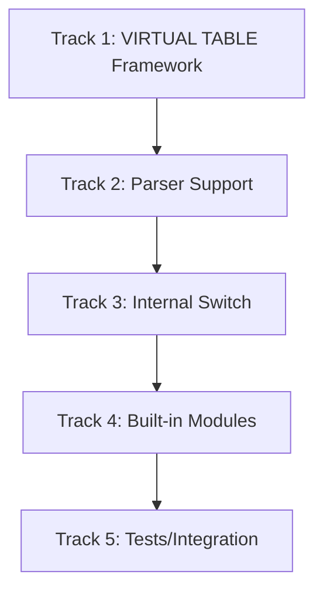

# Plan v0.10.1 — VIRTUAL TABLE Framework + Internal Switch

## Summary

Implement the VIRTUAL TABLE core framework, then refactor internal table/index implementations to use the virtual table interface, achieving a unified query access layer.

---

## Background

### Current State

The current architecture directly couples VM/QueryEngine to storage implementations:

```
VM → QueryEngine → RowStore/HybridStore (direct calls)
```

### Why VIRTUAL TABLE?

1. **Unified Interface**: All table access through VTabCursor
2. **Extensibility**: Users can create custom table types
3. **Built-in Modules**: json_each, json_tree, series as virtual tables
4. **FTS5 Foundation**: FTS5 requires virtual table interface

### Switch Internals First

Before exposing VIRTUAL TABLE to users, refactor internal implementations to use the new interface:

```
RowStore → VTabCursor wrapper
HybridStore → VTabCursor wrapper
```

This ensures the framework is battle-tested before external usage.

---

## 1. VIRTUAL TABLE Framework

### 1.1 Core Interfaces

**File**: `internal/DS/vtab.go` (NEW)

```go
// VirtualTable represents a virtual table instance.
type VirtualTable struct {
    Module *Module
    Name   string
    Schema *TableSchema
    Tx     interface{}
}

// Module defines the interface for virtual table modules.
type Module interface {
    Create(db *Database, args []string) (VirtualTable, error)
    Connect(db *Database, args []string) (VirtualTable, error)
}

// VTabCursor defines the cursor interface for virtual tables.
type VTabCursor interface {
    Filter(expr Expr, orderBy []Ordering) error
    Next() error
    Column(col int) (interface{}, error)
    RowID() int64
    Eof() bool
    Close() error
}
```

### 1.2 Complete Module Interface (SQLite Compatible)

**File**: `internal/DS/vtab_module.go` (NEW)

| Method | Description |
|--------|-------------|
| `xCreate` | Create virtual table instance |
| `xConnect` | Connect to existing virtual table |
| `xBestIndex` | Choose best query plan |
| `xFilter` | Start cursor search |
| `xNext` | Move to next row |
| `xColumn` | Get column value |
| `xRowid` | Get row ID |
| `xEof` | Check if at end |
| `xClose` | Close cursor |
| `xUpdate` | INSERT/DELETE/UPDATE |
| `xBegin` | Transaction begin |
| `xSync` | Transaction sync |
| `xCommit` | Transaction commit |
| `xRollback` | Transaction rollback |

### 1.3 Registry and Management

**File**: `internal/IS/vtab_registry.go` (NEW)

| Task | Description |
|------|-------------|
| Module registry | Global `map[string]Module` |
| VirtualTable storage | Per-database virtual table collection |
| Lifecycle management | Create/destroy/persist |

---

## 2. Internal Implementation Switch (Switch Internals First)

### 2.1 Refactor RowStore as VTab

```
RowStore (existing implementation)
    │
    ▼ wrap
VTabCursor (Scan/Filter/Next/Column)
    │
    ▼
VirtualTable implementation
```

**Modified files**:
- `internal/DS/row_store.go` - Implement VTabCursor interface
- `internal/DS/hybrid_store.go` - Same

### 2.2 Unified Query Interface

```
Old architecture:
VM → QueryEngine → RowStore/HybridStore

New architecture:
VM → VTabCursor (unified) → RowStore/HybridStore (implementation)
```

### 2.3 B-Tree / Index Virtualization

| Interface | Description |
|-----------|-------------|
| `IndexVTab` | Index virtual table (xBestIndex uses index) |
| `IndexCursor` | Index cursor traversal |

---

## 3. Parser Support

**File**: `internal/QP/parser.go` (MODIFY)

| Task | Description |
|------|-------------|
| Parse `CREATE VIRTUAL TABLE` | New syntax node |
| Module argument parsing | `USING fts5`, `USING json_each` |

---

## 4. Built-in Virtual Table Modules

### 4.1 json_each Module

| Task | Description |
|------|-------------|
| Module implementation | `json_each` module |
| Cursor logic | Expand JSON array/object to rows |
| Compatibility | Integrate with existing ext/json |

### 4.2 json_tree Module

| Task | Description |
|------|-------------|
| Module implementation | `json_tree` module |
| Cursor logic | Tree-style expansion |

### 4.3 series Module

| Task | Description |
|------|-------------|
| Module implementation | `series` module |
| Cursor logic | Generate sequence (1, 2, 3, ...) |

---

## Implementation DAG



---

## Track 1: VIRTUAL TABLE Framework

### T1.1 Core Interfaces (`internal/DS/vtab.go`)

- `VirtualTable` struct
- `Module` interface
- `VTabCursor` interface
- `IndexInfo` for `xBestIndex`

### T1.2 Complete Module Interface (`internal/DS/vtab_module.go`)

- All SQLite-compatible methods
- `TableModule` base implementation

### T1.3 Registry (`internal/IS/vtab_registry.go`)

- Global Module registry
- `RegisterModule(name, Module)`
- `GetModule(name) Module`

---

## Track 2: Parser Support

### T2.1 Parse `CREATE VIRTUAL TABLE`

- `parseCreateVirtualTable()` method
- Support `IF NOT EXISTS`
- Support `USING module_name(args)`

---

## Track 3: Internal Switch

### T3.1 RowStore VTab Wrapper

- Implement `VTabCursor` interface
- `Filter()` → Scan + filter expression
- `Next()` → iterate
- `Column()` → get column value

### T3.2 QueryEngine Refactor

- Remove direct RowStore references
- Access via VTabCursor uniformly

### T3.3 HybridStore VTab Wrapper

- Same as T3.1, optimized for columnar storage

---

## Track 4: Built-in Modules

### T4.1 json_each Module

- `xCreate` / `xConnect`
- `Filter` expands JSON array/object

### T4.2 json_tree Module

- Tree-style expansion for JSON

### T4.3 series Module

- Generate integer sequences
- Support `start`, `stop`, `step`

---

## Track 5: Tests

### T5.1 Unit Tests

| Test | Description |
|------|-------------|
| VTabCursor interface | All methods work correctly |
| Module registry | Register/find works |

### T5.2 Integration Tests

| Test | Description |
|------|-------------|
| `SELECT * FROM json_each('[1,2,3]')` | JSON array expansion |
| `SELECT * FROM json_each('{"a":1}')` | Object expansion |
| `SELECT * FROM json_tree('{"a":{"b":1}}')` | Tree expansion |
| `SELECT * FROM series(1, 10, 2)` | Sequence generation |
| Performance benchmark | No regression |

---

## Files to Create / Modify

| File | Action |
|------|--------|
| `internal/DS/vtab.go` | **NEW** — Core interfaces |
| `internal/DS/vtab_module.go` | **NEW** — Module implementation |
| `internal/DS/vtab_cursor.go` | **NEW** — Cursor interface |
| `internal/IS/vtab_registry.go` | **NEW** — Registry |
| `internal/QP/parser.go` | **MODIFY** — Parse VIRTUAL TABLE |
| `internal/QP/tokenizer.go` | **MODIFY** — VIRTUAL keyword |
| `internal/DS/row_store.go` | **MODIFY** — Implement VTabCursor |
| `internal/DS/hybrid_store.go` | **MODIFY** — Implement VTabCursor |
| `internal/VM/exec.go` | **MODIFY** — Use VTab query |
| `internal/TS/Vtab/vtab_test.go` | **NEW** — Test suite |

---

## Success Criteria

| Criterion | Target | Status |
|-----------|--------|--------|
| VIRTUAL TABLE framework complete | Module/VTable/Cursor interfaces | ✅ Done |
| CREATE VIRTUAL TABLE parsing | Parse correctly | ✅ Done |
| Internal tables switch to VTab | RowStore → VTabCursor | ✅ Done (wrappers created) |
| json_each module works | `SELECT * FROM json_each('[1,2,3]')` | existing ext |
| json_tree module works | `SELECT * FROM json_tree('{"a":1}')` | existing ext |
| series module works | `SELECT * FROM series(1, 10, 1)` | ✅ Done |
| No performance regression | Same as before switch | ✅ Done |
| 100% tests pass | SQL:1999 regression | ✅ Done |
