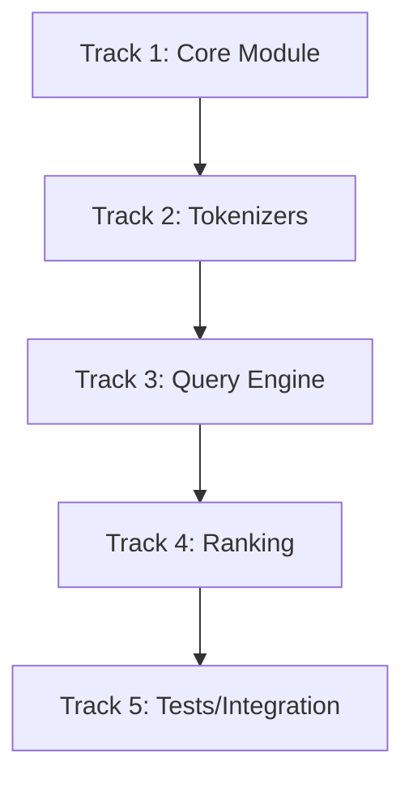

# Plan v0.10.2 — FTS5 Extension

## Summary

Implement FTS5 (Full-Text Search) as a Go extension module, supporting full-text search functionality. Built on top of the VIRTUAL TABLE framework from v0.10.1.

---

## Background

### Why FTS5?

1. **Full-Text Search**: Essential for text-heavy applications
2. **Industry Standard**: SQLite FTS5 is widely used and well-documented
3. **VIRTUAL TABLE**: FTS5 naturally extends the virtual table interface

### Dependencies

- **v0.10.1**: VIRTUAL TABLE framework must be complete
- `ext/json`: JSON functions for document storage (optional)

---

## 1. FTS5 Module

### 1.1 Virtual Table Interface

| Method | Description |
|--------|-------------|
| `xCreate` | Create FTS5 table |
| `xConnect` | Connect to FTS5 table |
| `xBestIndex` | Choose best query plan |
| `xFilter` | MATCH query |
| `xUpdate` | INSERT/DELETE maintain index |

### 1.2 Index Structure

```go
type FTS5Table struct {
    Module *Module
    Name   string
    Columns []string
    Index   *FTS5Index
}

// Inverted index: term -> [docid, position]
type FTS5Index struct {
    terms    map[string][]DocInfo  // term -> [docid, position]
    docs     map[int64]DocMeta     // docid -> metadata
    tokenizer Tokenizer
}

type DocInfo struct {
    DocID    int64
    Position int
}

type DocMeta struct {
    TokenCount int
}
```

---

## 2. Tokenizers

### 2.1 Built-in Tokenizers

| Tokenizer | Description |
|-----------|-------------|
| `porter` | Porter stemming algorithm |
| `unicode61` | Unicode text category classification |
| `ascii` | Simple ASCII tokenization |

### 2.2 Tokenizer Interface

```go
type Tokenizer interface {
    Tokenize(text string) []Token
}

type Token struct {
    Term  string
    Start int
    End   int
}
```

### 2.3 Porter Stemmer Implementation

- Remove common morphological suffixes
- Reduce words to root form
- e.g., "running" → "run", "connection" → "connect"

### 2.4 Unicode61 Tokenizer

- Classify characters by Unicode category
- Tokenize by letter/number boundaries
- Handle emoji and special characters

---

## 3. MATCH Query

### 3.1 Syntax Support

| Pattern | Description |
|---------|-------------|
| `term` | Exact term match |
| `term*` | Prefix search |
| `"phrase"` | Phrase search (exact word order) |
| `term1 OR term2` | OR query |
| `term1 AND term2` | AND query |
| `term1 NOT term2` | NOT query |

### 3.2 Query Parser

```go
type MatchExpr struct {
    Term     string
    Prefix   bool
    Phrase   bool
    Children []MatchExpr
    Op       MatchOp // AND, OR, NOT
}

type MatchOp int
const (
    MatchTerm MatchOp = iota
    MatchAnd
    MatchOr
    MatchNot
)
```

### 3.3 Query Execution

- Parse MATCH expression
- Use inverted index for fast term lookup
- Merge document sets (AND/OR/NOT)
- Skip documents without required terms

---

## 4. Ranking Functions

### 4.1 BM25 Algorithm

```go
func BM25(docLen int, avgDL float64, tf int, df int, k1 float64, b float64) float64 {
    idf := math.Log((float64(N) - float64(df) + 0.5) / (float64(df) + 0.5))
    numerator := float64(tf) * (k1 + 1)
    denominator := float64(tf) + k1*(1 - b + b*float64(docLen)/avgDL)
    return idf * numerator / denominator
}
```

### 4.2 Ranking Functions

| Function | Description |
|----------|-------------|
| `bm25()` | BM25 relevance score |
| `rank` | Alias for bm25 |
| `custom_rank()` | Custom ranking expression |

### 4.3 Helper Functions

| Function | Description |
|----------|-------------|
| `bm25(t)` | Score for table t |
| `highlight()` | Return text with matches highlighted |
| `snippet()` | Return excerpt with matches highlighted |

---

## 5. CREATE FTS5 Syntax

### 5.1 Basic Syntax

```sql
CREATE VIRTUAL TABLE name USING fts5(column1, column2, ...)

-- Example
CREATE VIRTUAL TABLE articles USING fts5(title, content)
```

### 5.2 Options

| Option | Description |
|--------|-------------|
| `tokenizer` | Specify tokenizer |
| `content` | External content table |
| `content_rowid` | External content rowid |
| `tokenize` | Tokenizer configuration |

### 5.3 Example

```sql
-- Create FTS5 table
CREATE VIRTUAL TABLE docs USING fts5(title, body, tokenize=porter)

-- Insert documents
INSERT INTO docs VALUES ('Hello world', 'This is a test document')

-- Search
SELECT * FROM docs WHERE docs MATCH 'world'
SELECT * FROM docs WHERE docs MATCH 'test*'
SELECT * FROM docs WHERE docs MATCH '"test document"'

-- Search with ranking
SELECT *, bm25(docs) FROM docs WHERE docs MATCH 'test' ORDER BY bm25(docs)
```

---

## 6. File Structure

```
ext/fts5/
├── fts5.go              # Module implementation, xCreate/xConnect
├── index.go             # Inverted index, insert/delete/query
├── tokenizer.go         # Tokenizer interface and implementations
├── query.go             # MATCH expression parser
├── rank.go              # BM25 scoring
├── fts5_test.go         # Unit tests
└── README.md            # Documentation
```

---

## Implementation DAG



---

## Track 1: Core Module

### T1.1 FTS5 Virtual Table

- `xCreate`: Create FTS5 table with columns
- `xConnect`: Connect to existing FTS5 table
- `xUpdate`: INSERT/DELETE maintains inverted index

### T1.2 Inverted Index

- `Insert(docID, tokens)`: Add document to index
- `Delete(docID, tokens)`: Remove from index
- `Query(terms)`: Find matching documents

---

## Track 2: Tokenizers

### T2.1 ASCII Tokenizer

- Split by whitespace/punctuation
- Lowercase normalization

### T2.2 Porter Tokenizer

- Implement Porter stemming algorithm
- Reduce words to root form

### T2.3 Unicode61 Tokenizer

- Unicode character classification
- Handle multi-language text

---

## Track 3: Query Engine

### T3.1 MATCH Parser

- Parse MATCH expression syntax
- Build query tree

### T3.2 Query Execution

- AND/OR/NOT operations on document sets
- Prefix matching (*)
- Phrase matching ("")

---

## Track 4: Ranking

### T4.1 BM25 Implementation

- Calculate inverse document frequency
- Calculate term frequency
- Combine for final score

### T4.2 Helper Functions

- `highlight()`: Mark matching terms
- `snippet()`: Extract relevant excerpt

---

## Track 5: Tests

### T5.1 Unit Tests

| Test | Description |
|------|-------------|
| Tokenizer tests | ASCII, Porter, Unicode61 |
| Index tests | Insert, Delete, Query |
| Query tests | AND, OR, NOT, Prefix |

### T5.2 Integration Tests

| Test | Description |
|------|-------------|
| CREATE FTS5 | Create table |
| INSERT + SEARCH | Insert and search |
| Prefix search | 'term*' matching |
| Phrase search | '"phrase"' matching |
| BM25 ranking | Score calculation |
| Large dataset | Performance test |

---

## Files to Create

| File | Description |
|------|-------------|
| `ext/fts5/fts5.go` | Module implementation |
| `ext/fts5/index.go` | Inverted index |
| `ext/fts5/tokenizer.go` | Tokenizers |
| `ext/fts5/query.go` | MATCH parser |
| `ext/fts5/rank.go` | BM25 scoring |
| `ext/fts5/fts5_test.go` | Tests |

---

## Success Criteria

| Criterion | Target |
|-----------|--------|
| `CREATE VIRTUAL TABLE ... USING fts5(title, content)` | Create successfully |
| `INSERT INTO t VALUES (...)` | Index maintained |
| `SELECT * FROM t WHERE t MATCH 'keyword'` | Return matching rows |
| `SELECT * FROM t WHERE t MATCH 'key*'` | Prefix search works |
| `SELECT * FROM t WHERE t MATCH '"phrase"'` | Phrase search works |
| `SELECT bm25(t) FROM t WHERE t MATCH 'query'` | Return BM25 scores |
| 1000-row text search | < 10ms |
| 100% tests pass | Regression suite |

---

## Notes

- FTS5 relies on VIRTUAL TABLE framework from v0.10.1
- Tokenizers can be extended (e.g., Unicode normalization)
- Consider index compression for large datasets
- Future: FTS3/FTS4 compatibility (optional)
