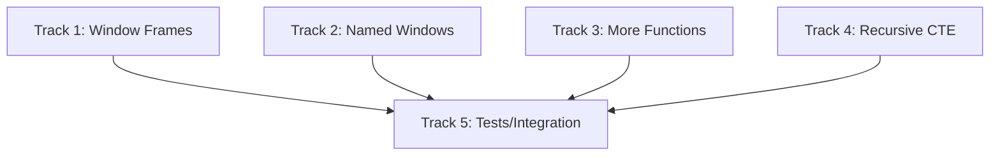

# Plan v0.10.3 — Advanced SQL Features + Window Function Enhancements

## Summary

Enhance SQL capabilities with advanced window function support, more built-in functions, and recursive CTE improvements. Built on top of VIRTUAL TABLE framework from v0.10.1.

---

## Background

### Current State

The database already has solid SQL support:
- ✅ Window functions: ROW_NUMBER, RANK, DENSE_RANK, LAG, LEAD, FIRST_VALUE, LAST_VALUE
- ✅ CTEs: Non-recursive and recursive
- ✅ INTERSECT / EXCEPT with ALL
- ✅ IIF / COALESCE / IFNULL / NULLIF
- ✅ Partial indexes, expression indexes

### What's Missing

1. **Window Frame**: ROWS/RANGE BETWEEN frames
2. **Named Windows**: WINDOW clause
3. **More Functions**: JSON, Math, String
4. **Recursive CTE**: Multiple CTEs, materialization hints

---

## 1. Window Function Enhancements

### 1.1 Window Frame Support

**Current**: Basic window functions work without explicit frames

**Goal**: Support explicit frame specifications

```sql
-- ROWS frame
SELECT SUM(x) OVER (ROWS BETWEEN 1 PRECEDING AND 1 FOLLOWING) FROM t
SELECT SUM(x) OVER (ROWS UNBOUNDED PRECEDING) FROM t
SELECT SUM(x) OVER (ROWS CURRENT ROW) FROM t

-- RANGE frame
SELECT SUM(x) OVER (RANGE BETWEEN UNBOUNDED PRECEDING AND CURRENT ROW) FROM t
```

| Frame Type | Description |
|------------|-------------|
| `ROWS` | Physical row boundaries |
| `RANGE` | Logical boundaries (peers) |
| `GROUPS` | Peer groups |

| Frame Bounds | Description |
|--------------|-------------|
| `UNBOUNDED PRECEDING` | All rows before current |
| `N PRECEDING` | N rows before current |
| `CURRENT ROW` | Current row |
| `N FOLLOWING` | N rows after current |
| `UNBOUNDED FOLLOWING` | All rows after current |

### 1.2 Named Windows

```sql
SELECT 
    name,
    salary,
    SUM(salary) OVER w AS dept_total,
    AVG(salary) OVER w AS dept_avg
FROM employees
WINDOW w AS (PARTITION BY department ORDER BY hire_date)
```

| Task | Description |
|------|-------------|
| Parse WINDOW clause | `WINDOW w AS (...)` |
| Reference named windows | `OVER w` |
| Override window specs | `OVER w ORDER BY x` |

### 1.3 Additional Window Functions

| Function | Description |
|----------|-------------|
| `NTILE(n)` | Distribute rows into N buckets |
| `CUME_DIST()` | Cumulative distribution |
| `NTH_VALUE(n)` | N-th value in window |

---

## 2. Enhanced Recursive CTE

### 2.1 Multiple Recursive CTEs

```sql
WITH
    cte1 AS (SELECT 1 AS n),
    cte2 AS (SELECT n+1 FROM cte1 WHERE n < 10)
SELECT * FROM cte1 UNION ALL SELECT * FROM cte2
```

### 2.2 Recursive with Materialization

```sql
-- Force materialization for complex recursions
WITH RECURSIVE cnt(x) AS (
    SELECT 1
    UNION ALL
    SELECT x+1 FROM cnt WHERE x < 1000000
) SELECT x FROM cnt
```

### 2.3 Lateral Recursion

```sql
-- PostgreSQL-style LATERAL
SELECT * FROM t1, LATERAL (SELECT * FROM t2 WHERE t2.id = t1.id) AS sub
```

---

## 3. Additional Built-in Functions

### 3.1 JSON Functions

| Function | Description |
|----------|-------------|
| `JSON_TYPE(json, path)` | Get type of value at path |
| `JSON_VALID(json)` | Check if valid JSON |
| `JSON_QUOTE(json)` | Quote JSON string |
| `JSON_ARRAY_LENGTH(json)` | Array length |
| `JSON_KEYS(json)` | Array of keys |

### 3.2 Math Functions

| Function | Description |
|----------|-------------|
| `POWER(x, y)` | x raised to power y |
| `MOD(x, y)` | Remainder of x/y |
| `LOG(x)` | Natural logarithm |
| `LOG10(x)` | Base-10 logarithm |
| `EXP(x)` | e raised to power x |
| `LN(x)` | Natural logarithm (alias) |

### 3.3 String Functions

| Function | Description |
|----------|-------------|
| `INSTR(haystack, needle)` | Position of substring |
| `SUBSTR` alias | Already exists |
| `HEX(x)` | Convert to hex |
| `UNHEX(x)` | Convert from hex |
| `LTRIM` | Already exists |
| `RTRIM` | Already exists |

### 3.4 Aggregate Functions

| Function | Description |
|----------|-------------|
| `GROUP_CONCAT(expr, sep)` | Concatenate with separator |
| `GROUP_CONCAT(expr ORDER BY ...)` | With ORDER BY |
| `TOTAL(x)` | Sum of values (returns REAL) |

---

## 4. SQL Syntax Enhancements

### 4.1 Table Value Constructor

```sql
-- VALUES as derived table
SELECT * FROM (VALUES (1, 'a'), (2, 'b'), (3, 'c')) AS t(x, y)
```

### 4.2 Row Value / Tuple

```sql
-- Tuple comparison
SELECT * FROM t WHERE (a, b) = (1, 2)
SELECT * FROM t WHERE (a, b) > (1, 2)
```

### 4.3 LATERAL Subqueries

```sql
SELECT * FROM t1, LATERAL (SELECT * FROM t2 WHERE t2.id = t1.id)
```

---

## Implementation DAG



---

## Track 1: Window Frame Support

### T1.1 Parse Window Frames

- Modify `WindowFuncExpr` to include Frame specification
- Parse `ROWS/RANGE/GROUPS BETWEEN ...`
- Parse frame bounds

### T1.2 Implement Frame Execution

- `computeWindowFrame()` function
- Handle ROWS, RANGE, GROUPS modes
- Handle PRECEDING/FOLLOWING/CURRENT ROW

### T1.3 Test Window Frames

| Test | Description |
|------|-------------|
| `ROWS BETWEEN 1 PRECEDING AND 1 FOLLOWING` | Sliding window |
| `ROWS UNBOUNDED PRECEDING` | Running total |
| `RANGE BETWEEN UNBOUNDED PRECEDING` | Peer handling |

---

## Track 2: Named Windows

### T2.1 Parse WINDOW Clause

```go
type WindowDef struct {
    Name    string
    Spec    *WindowSpec
}

type SelectStmt struct {
    // ... existing fields
    Windows []WindowDef // new
}
```

### T2.2 Resolve Named Windows

- Look up window by name in SELECT context
- Allow override: `OVER w ORDER BY x`

### T2.3 Test Named Windows

| Test | Description |
|------|-------------|
| `WINDOW w AS (...)` | Define named window |
| `OVER w` | Reference named window |
| `OVER w ORDER BY x` | Override |

---

## Track 3: Additional Functions

### T3.1 JSON Functions

- `JSON_TYPE`: Return type string
- `JSON_VALID`: Return 1/0
- `JSON_QUOTE`: Return quoted string
- `JSON_ARRAY_LENGTH`: Parse and count

### T3.2 Math Functions

- `POWER`: math.Pow
- `MOD`: x % y
- `LOG`/`LOG10`: math.Log
- `EXP`: math.Exp

### T3.3 String/Aggregate Functions

- `INSTR`: strings.Index
- `HEX`/`UNHEX`: encoding/hex
- `GROUP_CONCAT` with ORDER BY

---

## Track 4: Recursive CTE Enhancements

### T4.1 Multiple Recursive CTEs

- Support multiple CTEs with recursive flag
- Detect cycles properly

### T4.2 Materialization Hints

- Add `MATERIALIZED` / `NOT MATERIALIZED` hints

---

## Track 5: Tests

### T5.1 Window Function Tests

| Test Suite | Description |
|------------|-------------|
| Window Frames | ROWS, RANGE, GROUPS |
| Named Windows | WINDOW clause |
| Window Aggregates | SUM/AVG/COUNT over frames |

### T5.2 Function Tests

| Test Suite | Description |
|------------|-------------|
| JSON Functions | JSON_TYPE, JSON_VALID |
| Math Functions | POWER, LOG, EXP |
| String Functions | INSTR, HEX |

### T5.3 CTE Tests

| Test Suite | Description |
|------------|-------------|
| Multiple Recursive | Multiple CTEs |
| Materialization | Hints |

---

## Files to Create / Modify

| File | Action | Description |
|------|--------|-------------|
| `internal/QP/parser.go` | MODIFY | Window frame, WINDOW clause |
| `internal/VM/exec.go` | MODIFY | Window frame execution |
| `internal/VM/query_engine.go` | MODIFY | Add functions |
| `pkg/sqlvibe/window.go` | MODIFY | Frame handling |
| `ext/json/json.go` | MODIFY | Add JSON functions |
| `ext/math/math.go` | MODIFY | Add math functions |
| `internal/TS/SQL1999/W0xx/` | NEW | Window frame tests |

---

## Success Criteria

| Criterion | Target |
|-----------|--------|
| Window frames work | `ROWS BETWEEN ...` |
| Named windows work | `WINDOW w AS (...) OVER w` |
| JSON functions | JSON_TYPE, JSON_VALID |
| Math functions | POWER, LOG, EXP |
| GROUP_CONCAT with ORDER BY | Works |
| Multiple recursive CTEs | Works |
| 100% tests pass | SQL:1999 regression |
