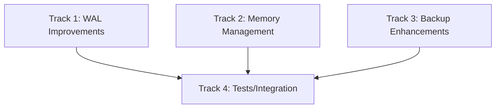

# Plan v0.10.4 — Storage Enhancements

## Summary

Enhance storage capabilities with WAL improvements, memory management, and backup features. Optimized for embedded database use cases.

---

## Background

### Current State

The database already has solid storage support:
- ✅ Compression: NONE, RLE, LZ4, GZIP
- ✅ PRAGMA: cache_size, max_memory, compression
- ✅ WAL mode with checkpoint
- ✅ Full and incremental backup

### v0.10.4 Focus

For embedded scenarios, focus on:
1. **WAL Improvements**: Truncate, sync modes
2. **Memory Management**: Budget enforcement, row limits
3. **Backup**: Streaming backup

---

## 1. WAL Improvements

### 1.1 WAL Truncate Mode

**Current**: WAL grows until manually checkpointed

**Goal**: Auto-truncate WAL after checkpoint

```sql
PRAGMA wal_autocheckpoint = 1000  -- checkpoint every 1000 pages
PRAGMA wal_truncate = ON         -- truncate WAL after checkpoint
```

| Task | Description |
|------|-------------|
| `PRAGMA wal_truncate` | Truncate WAL file after successful checkpoint |
| Track WAL size | Monitor WAL growth |
| Configurable threshold | Truncate only if WAL > N bytes |

### 1.2 Synchronous Modes

**Current**: Default sync behavior

**Goal**: Support all SQLite synchronous modes

```sql
PRAGMA synchronous = OFF      -- No sync, fastest
PRAGMA synchronous = NORMAL   -- Normal (default)
PRAGMA synchronous = FULL      -- Full sync, safest
PRAGMA synchronous = EXTRA     -- Extra paranoid
```

| Mode | Description | Durability |
|------|-------------|------------|
| OFF | No sync | Low |
| NORMAL | Sync at commit | Medium |
| FULL | Sync after each write | High |
| EXTRA | Sync twice | Highest |

### 1.3 Journal Size Limit

```sql
PRAGMA journal_size_limit = 10000  -- max 10KB
PRAGMA journal_size_limit = 0      -- unlimited (default)
```

---

## 2. Memory Management

### 2.1 Cache Memory Budget

**Current**: `PRAGMA cache_size` sets page count

**Goal**: Enforce actual memory budget

```sql
PRAGMA cache_memory = 10485760  -- 10MB budget
```

| Task | Description |
|------|-------------|
| Track memory usage | Monitor actual bytes used by cache |
| Evict on budget | Evict pages when limit reached |
| Soft/hard limits | Configurable behavior |

### 2.2 Row Store Limits

For embedded use cases with memory constraints:

```sql
PRAGMA max_rows = 1000000  -- max 1M rows in memory
```

| Task | Description |
|------|-------------|
| Track row count | Per-table row count |
| Enforce limit | Reject inserts when at limit |
| Fallback to disk | Optionally spill to disk |

### 2.3 Memory Stats

```sql
PRAGMA memory_stats
```

| Column | Description |
|--------|-------------|
| page_cache_used | Current page cache bytes |
| page_cache_max | Configured max |
| row_store_used | Row store bytes |
| wal_size | WAL file bytes |
| total_memory | Total memory used |

---

## 3. Backup Enhancements

### 3.1 Streaming Backup

**Current**: Full backup loads entire DB

**Goal**: Memory-efficient streaming for large databases

```go
// API: Streaming backup with callback
func (db *Database) BackupToWithCallback(path string, callback func(rowsCopied int) error) error
```

| Task | Description |
|------|-------------|
| Chunked copy | Copy in chunks to limit memory |
| Progress callback | Report progress |
| Cancellation support | Cancel mid-backup |

### 3.2 Backup to Writer

```go
// API: Backup to any io.Writer
func (db *Database) BackupToWriter(w io.Writer) error
```

| Task | Description |
|------|-------------|
| io.Writer interface | Backup to any destination |
| JSON Lines format | Existing format |
| Compression wrapper | Auto-compress |

### 3.3 Backup Metadata

Include more info in backup manifest:

```go
type BackupManifest struct {
    // ... existing
    Version        string    // sqlvibe version
    PageSize       int
    Compression    string
    TableCount     int
    RowCount       int64
    BackupTime     time.Time
}
```

---

## Implementation DAG



---

## Track 1: WAL Improvements

### T1.1 WAL Truncate

- `PRAGMA wal_truncate = ON/OFF`
- Truncate after checkpoint if enabled
- Configurable size threshold

### T1.2 Synchronous Modes

- Parse synchronous levels
- Implement sync strategies
- Test durability vs performance

### T1.3 Journal Size Limit

- Implement `PRAGMA journal_size_limit`
- Check before WAL write
- Truncate if exceeded

---

## Track 2: Memory Management

### T2.1 Cache Memory Budget

- Track actual memory usage
- Implement eviction policy
- Add `PRAGMA cache_memory`

### T2.2 Row Store Limits

- Per-table row counting
- Add `PRAGMA max_rows`
- Enforce limits

### T2.3 Memory Stats PRAGMA

- Return current memory stats
- Include all memory components

---

## Track 3: Backup Enhancements

### T3.1 Streaming Backup

- Chunked backup implementation
- Progress callback
- Cancellation support

### T3.2 Backup to Writer

- Implement `io.Writer` interface
- Support compression

### T3.3 Enhanced Manifest

- Add metadata fields
- Version tracking

---

## Track 4: Tests

### T4.1 WAL Tests

| Test | Description |
|------|-------------|
| `PRAGMA wal_truncate` | Truncate after checkpoint |
| `PRAGMA synchronous` | All modes work |
| `PRAGMA journal_size_limit` | Limit enforced |

### T4.2 Memory Tests

| Test | Description |
|------|-------------|
| `PRAGMA cache_memory` | Memory budget enforced |
| `PRAGMA max_rows` | Row limit enforced |
| `PRAGMA memory_stats` | Returns correct values |

### T4.3 Backup Tests

| Test | Description |
|------|-------------|
| Streaming backup | Large DB backup |
| Progress callback | Callback called |
| Restore and verify | Data integrity |

---

## Files to Create / Modify

| File | Action | Description |
|------|--------|-------------|
| `pkg/sqlvibe/pragma.go` | MODIFY | Add new PRAGMAs |
| `internal/DS/wal.go` | MODIFY | WAL truncate, size limit |
| `internal/DS/cache.go` | MODIFY | Memory budget tracking |
| `internal/DS/row_store.go` | MODIFY | Row count limits |
| `pkg/sqlvibe/backup.go` | MODIFY | Streaming backup |
| `pkg/sqlvibe/database.go` | MODIFY | Memory stats |

---

## Success Criteria

| Criterion | Target |
|-----------|--------|
| `PRAGMA wal_truncate` works | Truncates WAL after checkpoint |
| `PRAGMA synchronous` all modes | OFF/NORMAL/FULL/EXTRA work |
| `PRAGMA journal_size_limit` | Enforces limit |
| `PRAGMA cache_memory` | Memory budget enforced |
| `PRAGMA max_rows` | Row limit enforced |
| `PRAGMA memory_stats` | Returns correct stats |
| Streaming backup | Works for large DBs |
| No performance regression | Same as v0.10.3 |
| 100% tests pass | Regression suite |
