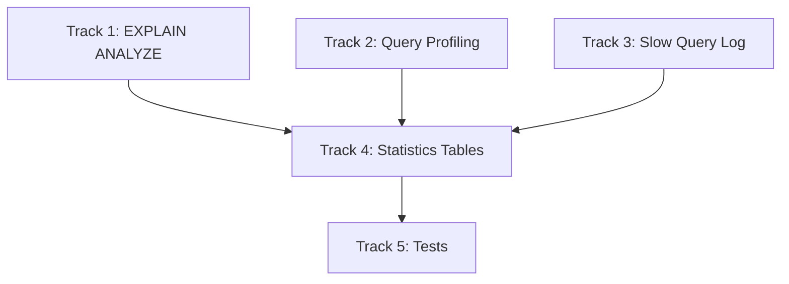

# Plan v0.10.5 — Observability + Statistics

## Summary

Enhance observability with EXPLAIN ANALYZE, query profiling, slow query logging, and extended statistics tables. These features help developers debug and optimize queries in embedded applications.

---

## Background

### Current Observability State

The database already has basic observability:
- ✅ EXPLAIN (shows query plan)
- ✅ EXPLAIN QUERY PLAN
- ✅ ANALYZE (collects table statistics)
- ✅ sqlite_stat1 table
- ✅ PRAGMA optimize

### v0.10.5 Focus

Add runtime performance analysis and extended statistics:

| Feature | Description |
|---------|-------------|
| EXPLAIN ANALYZE | Runtime execution statistics |
| Query Profiling | Track query execution metrics |
| Slow Query Log | Log queries exceeding threshold |
| Statistics Tables | Extended stats with sqlvibe_ prefix |

Extract explain into SVDB_EXT_EXPLAIN, since it is a debug feature which is not delivered in release mode

---

## 1. EXPLAIN ANALYZE

### 1.1 Runtime Statistics

Add execution metrics to EXPLAIN output:

```sql
EXPLAIN ANALYZE SELECT * FROM t WHERE x > 5
```

| Statistic | Description |
|-----------|-------------|
| `run_time` | Total execution time (ms) |
| `rows_scanned` | Number of rows examined |
| `rows_returned` | Number of rows returned |
| `index_used` | Index name if used |
| `table_scans` | Number of table scans |

### 1.2 Implementation

```go
type ExplainAnalyzeResult struct {
    Opcode    string
    P1        int
    P2        int
    P3        int
    Plan      string
    RunTimeMs float64
    RowsScanned int64
    RowsReturned int64
}
```

| Task | Description |
|------|-------------|
| Track execution time | Wrap query execution with timer |
| Count rows scanned | Increment counter during scan |
| Track index usage | Log which index used |
| Format output | Add ANALYZE column to EXPLAIN |

### 1.3 Example Output

```
QUERY PLAN
|--SCAN t (USING INDEX idx_x)
ANALYZE
|   opcode    | p1 | p2 | p3 | run_time_ms | rows_scanned | rows_returned |
|------------|----|----|----|-------------|--------------|---------------|
| OpenRead   | 0  | 0  | 0  | 0.001       | 0            | 0             |
| SeekGE     | 0  | 1  | 0  | 0.002       | 0            | 0             |
| Next       | 0  | 1  | 0  | 0.150       | 10000        | 5000          |
| Column     | 0  | 1  | 0  | 0.200       | 5000         | 5000          |
| ResultRow  | 0  | 2  | 0  | 0.201       | 5000         | 5000          |

Total run time: 0.201 ms, 5000 rows scanned, 5000 rows returned
```

---

## 2. Query Profiling

### 2.1 PRAGMA profile

Enable per-query profiling:

```sql
PRAGMA profile = ON
SELECT * FROM t WHERE x > 5
PRAGMA profile = OFF
```

### 2.2 Profile Output

| Column | Description |
|--------|-------------|
| `query` | SQL text (truncated to 100 chars) |
| `plan` | Query plan summary |
| `time_ms` | Execution time in milliseconds |
| `rows` | Rows returned |

### 2.3 Implementation

```go
type QueryProfile struct {
    Query     string
    Plan      string
    TimeMs    float64
    Rows      int64
    Timestamp time.Time
}
```

| Task | Description |
|------|-------------|
| Enable/disable | `PRAGMA profile = ON/OFF` |
| Collect stats | Wrap query execution |
| Store profiles | Ring buffer of last N profiles |
| Access via SQL | `PRAGMA profile` returns profiles |

---

## 3. Slow Query Log

### 3.1 PRAGMA slowlog

Log queries exceeding threshold:

```sql
PRAGMA slowlog = 1000    -- log queries > 1000ms
PRAGMA slowlog = 0      -- disable
```

### 3.2 Log Format

| Field | Description |
|-------|-------------|
| `timestamp` | When query executed |
| `query` | Full SQL text |
| `duration_ms` | Execution time |
| `plan` | Query plan |

### 3.3 Implementation

```go
type SlowQueryLog struct {
    ThresholdMs int64              // threshold from PRAGMA
    Enabled     bool               // threshold > 0
    LogFile     string             // optional log file path
    callback    func(QueryLogEntry) // optional callback
}

type QueryLogEntry struct {
    Timestamp  time.Time
    Query      string
    DurationMs float64
    Plan       string
}
```

| Task | Description |
|------|-------------|
| Set threshold | `PRAGMA slowlog = N` |
| Check duration | After each query |
| Log if exceeded | Write to log/ callback |
| Optional file | `PRAGMA slowlog_file = 'path'` |

---

## 4. Statistics Tables (sqlvibe_ prefix)

### 4.1 Table Overview

| Table Name | Description |
|------------|-------------|
| `sqlvibe_stat` | ANALYZE statistics (replaces sqlite_stat1) |
| `sqlvibe_stat_columns` | Per-column statistics |
| `sqlvibe_stat_indexes` | Index statistics |
| `sqlvibe_stat_queries` | Query profile history |
| `sqlvibe_stat_slow` | Slow query log |

### 4.2 sqlvibe_stat

```sql
CREATE TABLE sqlvibe_stat (
    tbl     TEXT,      -- table name
    idx     TEXT,      -- index name (NULL for table)
    stat    TEXT,      -- statistics (row count, etc.)
    sample  TEXT       -- sample values
);
```

### 4.3 sqlvibe_stat_columns

```sql
CREATE TABLE sqlvibe_stat_columns (
    tbl     TEXT,      -- table name
    col     TEXT,      -- column name
    n_dist  INTEGER,   -- number of distinct values
    min_val TEXT,      -- minimum value
    max_val TEXT,      -- maximum value
    avg_len REAL       -- average value length
);
```

### 4.4 sqlvibe_stat_indexes

```sql
CREATE TABLE sqlvibe_stat_indexes (
    tbl     TEXT,      -- table name
    idx     TEXT,      -- index name
    unique  INTEGER,   -- 1 if UNIQUE
    seq     INTEGER,   -- column sequence in index
    col     TEXT,      -- column name
    desc    INTEGER    -- 1 if DESC
);
```

### 4.5 sqlvibe_stat_queries

```sql
CREATE TABLE sqlvibe_stat_queries (
    id      INTEGER PRIMARY KEY,
    query   TEXT,       -- truncated query
    plan    TEXT,        -- query plan
    time_ms REAL,        -- execution time
    rows    INTEGER,     -- rows returned
    ts      TIMESTAMP    -- timestamp
);
```

### 4.6 sqlvibe_stat_slow

```sql
CREATE TABLE sqlvibe_stat_slow (
    id      INTEGER PRIMARY KEY,
    query   TEXT,        -- full query
    time_ms REAL,        -- execution time
    plan    TEXT,        -- query plan
    ts      TIMESTAMP    -- timestamp
);
```

---

## Implementation DAG



---

## Track 1: EXPLAIN ANALYZE

### T1.1 Execution Timer

- Wrap query execution with microsecond timer
- Track per-operation timing

### T1.2 Row Counting

- Count rows scanned during execution
- Count rows returned
- Track index usage

### T1.3 Output Format

- Add ANALYZE section to EXPLAIN
- Show total run time
- Show row statistics

---

## Track 2: Query Profiling

### T2.1 PRAGMA profile

- `PRAGMA profile = ON/OFF`
- Enable/disable profiling

### T2.2 Profile Collection

- Ring buffer of last 100 profiles
- Store query, plan, time, rows

### T2.3 Access via SQL

- `PRAGMA profile` returns profiles
- Read from sqlvibe_stat_queries

---

## Track 3: Slow Query Log

### T3.1 PRAGMA slowlog

- `PRAGMA slowlog = N` (milliseconds)
- 0 = disabled

### T3.2 Log Implementation

- Check query duration after execution
- If > threshold, log to sqlvibe_stat_slow

### T3.3 Optional Callback

- `PRAGMA slowlog_callback = 'func_name'`
- Allow custom logging

---

## Track 4: Statistics Tables

### T4.1 sqlvibe_stat (replacement)

- Same structure as sqlite_stat1
- Auto-created on ANALYZE

### T4.2 sqlvibe_stat_columns

- Per-column statistics
- Min, max, distinct count

### T4.3 sqlvibe_stat_indexes

- Index metadata
- Column order, direction

### T4.4 sqlvibe_stat_queries

- Query profile history
- Ring buffer in memory

### T4.5 sqlvibe_stat_slow

- Slow query log
- Persisted to table

---

## Track 5: Tests

### T5.1 EXPLAIN ANALYZE Tests

| Test | Description |
|------|-------------|
| Run time reported | Time shown in output |
| Rows scanned | Count matches |
| Index used | Shows index name |

### T5.2 Profiling Tests

| Test | Description |
|------|-------------|
| PRAGMA profile ON | Profiles collected |
| PRAGMA profile | Returns profiles |
| Ring buffer | Old profiles evicted |

### T5.3 Slow Log Tests

| Test | Description |
|------|-------------|
| Below threshold | Not logged |
| Above threshold | Logged |
| PRAGMA slowlog = 0 | Disabled |

### T5.4 Stats Tables Tests

| Test | Description |
|------|-------------|
| sqlvibe_stat after ANALYZE | Contains data |
| sqlvibe_stat_columns | Column stats |
| sqlvibe_stat_queries | Query history |

---

## Files to Create / Modify

| File | Action | Description |
|------|--------|-------------|
| `pkg/sqlvibe/explain.go` | MODIFY | Add EXPLAIN ANALYZE |
| `pkg/sqlvibe/pragma.go` | MODIFY | Add profile, slowlog PRAGMAs |
| `pkg/sqlvibe/profile.go` | NEW | Query profiling |
| `pkg/sqlvibe/database.go` | MODIFY | Integrate profiling |
| `internal/IS/stats_tables.go` | NEW | Statistics tables |
| `internal/VM/exec.go` | MODIFY | Track execution stats |

---

## Success Criteria

| Criterion | Target |
|-----------|--------|
| EXPLAIN ANALYZE works | Shows runtime stats |
| PRAGMA profile = ON | Profiles collected |
| PRAGMA profile | Returns query profiles |
| PRAGMA slowlog = N | Logs slow queries |
| sqlvibe_stat table | Contains ANALYZE data |
| sqlvibe_stat_queries | Query history |
| sqlvibe_stat_slow | Slow query log |
| No performance impact | Profiling disabled by default |
| 100% tests pass | Regression suite |
