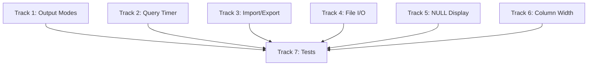

# Plan v0.10.6 — CLI Enhancements

## Summary

Enhance the CLI shell (sv-cli) with output modes, query timer, import/export, file I/O, NULL display, and column width controls. These improvements make the CLI more useful for development and debugging.

---

## Background

### Current CLI State

The CLI already has basic functionality:
- ✅ SQL execution
- ✅ `.tables`
- ✅ `.schema`
- ✅ `.indexes`
- ✅ `.ext`
- ✅ `.headers`
- ✅ Basic table output

### v0.10.6 Focus

Add essential CLI features for embedded database use:

| Feature | Description |
|---------|-------------|
| Output modes | csv, table, list, json |
| Query timer | Show execution time |
| Import/Export | CSV/JSON file I/O |
| File I/O | .read, .output |
| NULL display | Custom NULL representation |
| Column width | Adjustable column widths |

---

## 1. Output Modes

### 1.1 Modes

| Mode | Description | Example |
|------|-------------|---------|
| `csv` | Comma-separated | `1,alice,25` |
| `table` | ASCII table with borders | `| id | name |` |
| `list` | Column: value | `id: 1` |
| `json` | JSON array | `[{"id":1}]` |

### 1.2 Implementation

```go
type OutputMode int

const (
    ModeTable OutputMode = iota
    ModeCSV
    ModeList
    ModeJSON
)
```

### 1.3 Commands

```bash
.mode csv
.mode table
.mode list
.mode json
.mode           # Show current mode
```

---

## 2. Query Timer

### 2.1 Timer Toggle

```bash
.timer on       # Show query execution time
.timer off      # Hide timer (default)
```

### 2.2 Output Format

```
Run time: 0.234 ms
```

### 2.3 Implementation

```go
type TimerConfig struct {
    Enabled bool
}

func (t *TimerConfig) Measure(start time.Time) time.Duration {
    elapsed := time.Since(start)
    if t.Enabled {
        fmt.Printf("Run time: %.3f ms\n", elapsed.Seconds()*1000)
    }
    return elapsed
}
```

---

## 3. Import/Export

### 3.1 Import CSV

```bash
.import path/to/file.csv table_name
```

| Feature | Description |
|--------|-------------|
| Auto-detect delimiter | Comma, tab, semicolon |
| Header row | First row as column names |
| Create table | Auto-create if not exists |
| Types | Infer INTEGER, REAL, TEXT |

### 3.2 Export

```bash
.export csv path/to/file.csv
.export json path/to/file.json
.export table table_name path/to/file.csv
```

### 3.3 Implementation

```go
func (cli *CLI) ImportCSV(path string, tableName string) error
func (cli *CLI) ExportCSV(path string, query string) error
func (cli *CLI) ExportJSON(path string, query string) error
```

---

## 4. File I/O

### 4.1 Read SQL File

```bash
.read path/to/file.sql
```

Execute SQL commands from a file.

### 4.2 Output Redirection

```bash
.output path/to/file.txt
SELECT * FROM t;
.output stdout
```

Redirect query output to a file.

### 4.3 Implementation

```go
func (cli *CLI) ReadFile(path string) error
func (cli *CLI) SetOutput(path string) error
func (cli *CLI) SetOutputStdout() error
```

---

## 5. NULL Display

### 5.1 Custom NULL String

```bash
.nullvalue NULL       # Default
.nullvalue '(null)'   # Custom
.nullvalue ''         # Empty string
```

### 5.2 Implementation

```go
type NULLDisplayConfig struct {
    Value string  // displayed for NULL
}
```

---

## 6. Column Width

### 6.1 Set Column Widths

```bash
.width 10 20 30       # Set widths for columns 1, 2, 3
.width                # Show current widths
.width -1            # Auto-size column N
```

### 6.2 Implementation

```go
type ColumnWidthConfig struct {
    Widths []int  // per-column width, -1 = auto
}

func (c *ColumnWidthConfig) Format(value interface{}, colIdx int) string
```

---

## Implementation DAG



---

## Track 1: Output Modes

### T1.1 Mode Parser

- Parse `.mode csv|table|list|json`
- Store current mode

### T1.2 Formatters

- `formatTable(rows)` - ASCII table
- `formatCSV(rows)` - CSV output
- `formatList(rows)` - List format
- `formatJSON(rows)` - JSON output

### T1.3 Test Cases

| Test | Description |
|------|-------------|
| `.mode csv` | Proper CSV output |
| `.mode table` | ASCII table with borders |
| `.mode list` | Column: value format |
| `.mode json` | Valid JSON array |

---

## Track 2: Query Timer

### T2.1 Timer Toggle

- Parse `.timer on|off`
- Store timer state

### T2.2 Measure Time

- Wrap query execution with timer
- Print elapsed time

### T2.3 Test Cases

| Test | Description |
|------|-------------|
| `.timer on` then query | Shows time |
| `.timer off` then query | No time shown |
| `.timer` | Shows current state |

---

## Track 3: Import/Export

### T3.1 Import CSV

- Read CSV file
- Parse headers
- Infer column types
- Create table if needed
- Insert data

### T3.2 Export CSV

- Execute query
- Write results to CSV
- Include headers

### T3.3 Export JSON

- Execute query
- Convert to JSON
- Write to file

### T3.4 Test Cases

| Test | Description |
|------|-------------|
| `.import file.csv t` | Import CSV into table |
| `.export csv file.csv` | Export to CSV |
| `.export json file.json` | Export to JSON |

---

## Track 4: File I/O

### T4.1 Read SQL File

- Read file content
- Split by semicolon
- Execute each statement

### T4.2 Output Redirection

- Open output file
- Redirect stdout to file
- Restore on `.output stdout`

### T4.3 Test Cases

| Test | Description |
|------|-------------|
| `.read file.sql` | Execute SQL from file |
| `.output file.txt` then query | Output to file |
| `.output stdout` | Restore stdout |

---

## Track 5: NULL Display

### T5.1 NULL Value Config

- Parse `.nullvalue STRING`
- Store NULL display string

### T5.2 Apply to Output

- Replace nil values with custom string
- Apply in all formatters

### T5.3 Test Cases

| Test | Description |
|------|-------------|
| `.nullvalue N/A` | NULL shows as "N/A" |
| `.nullvalue ''` | NULL shows as "" |

---

## Track 6: Column Width

### T6.1 Width Parser

- Parse `.width N1 N2 N3...`
- Parse `.width -N` for auto
- Store widths

### T6.2 Apply to Output

- Truncate/pad columns
- Apply in table formatter

### T6.3 Test Cases

| Test | Description |
|------|-------------|
| `.width 10` | First column 10 chars |
| `.width -1` | Auto-size column 1 |

---

## Track 7: Tests

### T7.1 Integration Tests

| Test | Description |
|------|-------------|
| Output modes | All modes produce correct format |
| Timer | Shows correct time |
| Import | CSV imports correctly |
| Export | CSV/JSON exports correctly |
| File I/O | Read/write works |
| NULL display | Custom NULL shown |
| Column width | Columns sized correctly |

---

## Files to Create / Modify

| File | Action | Description |
|------|--------|-------------|
| `cmd/sv-cli/main.go` | MODIFY | Add all CLI commands |
| `cmd/sv-cli/formatter.go` | NEW | Output formatters |
| `cmd/sv-cli/importer.go` | NEW | Import functionality |
| `cmd/sv-cli/exporter.go` | NEW | Export functionality |

---

## Success Criteria

| Criterion | Target |
|-----------|--------|
| `.mode csv` | CSV output works |
| `.mode table` | ASCII table works |
| `.mode list` | List format works |
| `.mode json` | JSON output works |
| `.timer on` | Shows execution time |
| `.import file.csv t` | Imports CSV |
| `.export csv file` | Exports CSV |
| `.read file.sql` | Executes SQL file |
| `.output file` | Redirects output |
| `.nullvalue TEXT` | Custom NULL display |
| `.width N` | Column width works |
| 100% tests pass | Regression suite |
