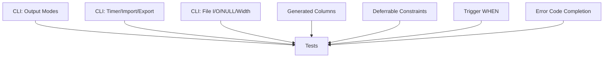

# Plan v0.10.6 — CLI Enhancements + Features + Compatibility

## Summary

Enhance the CLI shell with output modes, query timer, import/export, file I/O, NULL display, and column width controls. Add generated columns, deferrable constraints, trigger WHEN clauses, and complete error codes.

---

## Background

### Current State

The database has solid core functionality. This version adds:
- CLI improvements for development/debugging
- Advanced SQL features (generated columns, deferrable constraints)
- Trigger enhancements
- Error code completion

---

## Part 1: CLI Enhancements

### 1. Output Modes

| Mode | Description |
|------|-------------|
| `csv` | Comma-separated |
| `table` | ASCII table with borders |
| `list` | Column: value format |
| `json` | JSON array |

### 2. Query Timer

```bash
.timer on       # Show execution time
.timer off
```

### 3. Import/Export

```bash
.import file.csv table   # Import CSV
.export csv file.csv    # Export to CSV
.export json file.json  # Export to JSON
```

### 4. File I/O

```bash
.read file.sql        # Execute SQL file
.output file.txt      # Redirect output
.output stdout        # Restore output
```

### 5. NULL Display

```bash
.nullvalue TEXT       # Custom NULL string
```

### 6. Column Width

```bash
.width 10 20          # Set column widths
.width -1            # Auto-size
```

---

## Part 2: Generated Columns

### 2.1 Syntax

```sql
CREATE TABLE t (
    id INTEGER PRIMARY KEY,
    first_name TEXT,
    last_name TEXT,
    full_name TEXT GENERATED ALWAYS AS (first_name || ' ' || last_name) STORED,
    price REAL,
    tax REAL GENERATED ALWAYS AS (price * 0.1) STORED
);
```

### 2.2 Implementation

| Task | Description |
|------|-------------|
| Parse GENERATED ALWAYS AS | New syntax in column definition |
| STORED keyword | Materialize on write |
| Expression evaluation | Compute generated values |
| Read generated columns | Return computed values |

### 2.3 Types

| Type | Description |
|------|-------------|
| `VIRTUAL` | Computed on read (not stored) |
| `STORED` | Computed on write (persisted) |

---

## Part 3: Deferrable Constraints

### 3.1 Syntax

```sql
CREATE TABLE t (
    id INTEGER PRIMARY KEY,
    parent_id INTEGER REFERENCES t(id) DEFERRABLE INITIALLY DEFERRED
);

-- Or immediate (default)
CREATE TABLE t (
    id INTEGER PRIMARY KEY,
    parent_id INTEGER REFERENCES t(id) DEFERRABLE INITIALLY IMMEDIATE
);

-- Not deferrable (default)
CREATE TABLE t (
    id INTEGER PRIMARY KEY,
    parent_id INTEGER REFERENCES t(id) NOT DEFERRABLE
);
```

### 3.2 Implementation

| Task | Description |
|------|-------------|
| Parse DEFERRABLE | New syntax in column/table constraints |
| INITIALLY DEFERRED | Check at transaction end |
| INITIALLY IMMEDIATE | Check at each statement |
| NOT DEFERRABLE | Check immediately (default) |

### 3.3 Transaction Behavior

```sql
BEGIN;
INSERT INTO child VALUES (1, 999);  -- parent doesn't exist yet
COMMIT;  -- constraint checked here for DEFERRED
```

---

## Part 4: Trigger WHEN Clause

### 4.1 Syntax

```sql
CREATE TRIGGER update_auth
    BEFORE UPDATE ON users
    WHEN old.role != 'admin'
BEGIN
    UPDATE log SET action = 'update' WHERE user_id = old.id;
END;

CREATE TRIGGER log_insert
    AFTER INSERT ON orders
    WHEN NEW.total > 1000
BEGIN
    INSERT INTO alerts VALUES ('Large order', NEW.id);
END;
```

### 4.2 Implementation

| Task | Description |
|------|-------------|
| Parse WHEN clause | New syntax in trigger definition |
| Evaluate condition | Check WHEN before trigger body |
| Skip if false | Don't execute trigger body |

---

## Part 5: Error Code Completion

### 5.1 Current State

Partial typed error codes exist. Complete coverage needed.

### 5.2 Error Codes to Add

| Code | Description |
|------|-------------|
| SVDB_CONSTRAINT_NOT_NULL | NOT NULL violation |
| SVDB_CONSTRAINT_UNIQUE | UNIQUE violation |
| SVDB_CONSTRAINT_CHECK | CHECK violation |
| SVDB_CONSTRAINT_FOREIGN_KEY | FK violation |
| SVDB_DIVISION_BY_ZERO | Division by zero |
| SVDB_INVALID_TYPE | Type mismatch |
| SVDB_INVALID_VALUE | Invalid value |

### 5.3 Implementation

| Task | Description |
|------|-------------|
| Add error codes | Define new codes in error_code.go |
| Replace fmt.Errorf | Use typed errors |
| IsErrorCode helper | Already exists, ensure full usage |

---

## Implementation DAG



---

## Files to Create / Modify

| File | Action | Description |
|------|--------|-------------|
| `cmd/sv-cli/main.go` | MODIFY | CLI commands |
| `cmd/sv-cli/formatter.go` | NEW | Output formatters |
| `cmd/sv-cli/importer.go` | NEW | Import |
| `cmd/sv-cli/exporter.go` | NEW | Export |
| `internal/QP/parser.go` | MODIFY | Generated columns, deferrable, trigger WHEN |
| `internal/QP/tokenizer.go` | MODIFY | New keywords |
| `pkg/sqlvibe/database.go` | MODIFY | Generated column handling |
| `pkg/sqlvibe/error_code.go` | MODIFY | Add error codes |
| `pkg/sqlvibe/database.go` | MODIFY | Deferrable constraint checking |

---

## Success Criteria

| Criterion | Target |
|-----------|--------|
| CLI output modes | csv/table/list/json work |
| CLI timer | Shows execution time |
| CLI import/export | CSV/JSON import/export works |
| Generated columns | Computed on insert/update |
| Deferrable constraints | Deferred checking works |
| Trigger WHEN | Condition evaluated |
| Error codes | All common errors typed |
| 100% tests pass | Regression suite |
