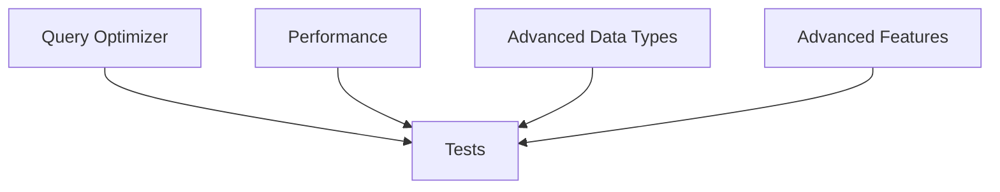

# Plan v0.10.7 — Query Optimizer + Advanced Data Types + Advanced Features

## Summary

This version combines query optimization, performance enhancements, advanced data types, and advanced SQL features. It significantly improves query performance and adds powerful capabilities for embedded applications.

---

## Part 1: Query Optimizer

### 1.1 Index-Only Scan (Covering Index)

Avoid reading table pages when all needed columns are in the index.

```sql
CREATE INDEX idx_cover ON t(a, b, c);  -- covers a, b, c
SELECT a, b, c FROM t WHERE a = 1;     -- index-only scan
```

| Task | Description |
|------|-------------|
| Detect covering index | Check if query columns are in index |
| Skip table read | Only read index pages |
| Return index data | Use index values directly |

### 1.2 Cost-Based Query Planning

Use ANALYZE statistics to choose best plan.

```sql
-- With sqlvibe_stat data
SELECT * FROM t WHERE x > 100;
-- Uses stats to decide: index scan vs full scan
```

| Task | Description |
|------|-------------|
| Read statistics | Use sqlvibe_stat data |
| Estimate selectivity | Use column statistics |
| Choose index | Select best available index |
| Compare costs | Full scan vs index scan |

### 1.3 Skip Scan

Index skip scan for queries with leading column not in WHERE.

```sql
CREATE INDEX idx ON t(a, b);
SELECT * FROM t WHERE b = 5;  -- skip scan possible
```

| Task | Description |
|------|-------------|
| Detect skip scan | Leading column not in WHERE |
| Scan index | Skip leading column |
| Merge results | Combine partial scans |

### 1.4 Predicate Pushdown

Push WHERE clauses to storage layer.

```sql
SELECT * FROM (SELECT * FROM t WHERE x > 10) WHERE x < 100;
-- Push both conditions to storage
```

| Task | Description |
|------|-------------|
| Identify pushable | Simple WHERE on derived tables |
| Push to storage | Filter at storage layer |
| Reduce data | Less data transferred |

---

## Part 2: Performance

### 2.1 Parallel Table Scan

Multi-threaded scan for large tables.

```sql
PRAGMA threads = 4;  -- use 4 threads
SELECT * FROM large_table;  -- parallel scan
```

| Task | Description |
|------|-------------|
| Split ranges | Divide table into chunks |
| Parallel scan | Scan chunks concurrently |
| Merge results | Combine parallel results |

### 2.2 Query Cache Enhancements

Improve existing result cache.

| Enhancement | Description |
|------------|-------------|
| Cache invalidation | Better tracking of invalidation |
| Cache size limit | Configurable cache size |
| Prepared statement cache | Cache compiled plans |

```sql
PRAGMA query_cache_size = 100;  -- cache 100 queries
```

### 2.3 Batch Insert Optimization

Batch multiple inserts together.

```sql
INSERT INTO t VALUES (1, 'a'), (2, 'b'), (3, 'c'), ...;
-- Optimized batch processing
```

| Task | Description |
|------|-------------|
| Batch processing | Group inserts |
| Reduce fsync | Single sync for batch |
| Return count | Return affected rows |

---

## Part 3: Advanced Data Types

### 3.1 UUID Type

Universally Unique Identifier support.

```sql
CREATE TABLE users (
    id UUID PRIMARY KEY DEFAULT gen_random_uuid(),
    name TEXT
);

SELECT gen_random_uuid();  -- generate UUID
```

| Function | Description |
|----------|-------------|
| `gen_random_uuid()` | Generate random UUID v4 |
| `UUID` | Column type |

### 3.2 DECIMAL / NUMERIC

Exact numeric for financial applications.

```sql
CREATE TABLE accounts (
    id INTEGER PRIMARY KEY,
    balance DECIMAL(15, 2)
);

SELECT 100.00 + 200.00;  -- exact precision
```

| Type | Description |
|------|-------------|
| `DECIMAL(p, s)` | Exact precision |
| `NUMERIC(p, s)` | Alias for DECIMAL |

### 3.3 DateTime Enhancements

Enhanced datetime functions.

```sql
SELECT datetime('now', 'localtime');
SELECT date('2024-01-01', '+1 month');
SELECT strftime('%Y-%m-%d', 'now');
```

| Function | Description |
|----------|-------------|
| `datetime(t, modifier)` | DateTime with modifiers |
| `date(t, modifier)` | Date extraction |
| `time(t, modifier)` | Time extraction |
| `strftime(format, t)` | Format datetime |

### 3.4 TIME Type

```sql
CREATE TABLE schedules (
    id INTEGER PRIMARY KEY,
    start_time TIME,
    end_time TIME
);
```

---

## Part 4: Advanced Features

### 4.1 Materialized Views

Pre-computed query results.

```sql
CREATE MATERIALIZED VIEW sales_summary AS
SELECT date, SUM(amount) AS total
FROM sales
GROUP BY date;

-- Refresh when needed
REFRESH MATERIALIZED VIEW sales_summary;
```

| Command | Description |
|---------|-------------|
| `CREATE MATERIALIZED VIEW` | Create pre-computed view |
| `REFRESH MATERIALIZED VIEW` | Refresh view data |

### 4.2 Array Type

```sql
CREATE TABLE tags (
    id INTEGER PRIMARY KEY,
    tags TEXT[]  -- array of text
);

INSERT INTO tags VALUES (1, ARRAY['go', 'database']);
SELECT tags[1] FROM tags;  -- 1-indexed
```

| Feature | Description |
|---------|-------------|
| `TEXT[]` | Array of text |
| `INTEGER[]` | Array of integers |
| `array[1,2,3]` | Array literal |
| `arr[1]` | Array access |

### 4.3 JSON Path

Enhanced JSON querying.

```sql
SELECT json_extract('{"a":{"b":1}}', '$.a.b');  -- 1
SELECT json_extract('{"a":[1,2,3]}', '$.a[0]');  -- 1
SELECT json_set('{"a":1}', '$.b', 2);  -- {"a":1,"b":2}
```

| Function | Description |
|----------|-------------|
| `json_extract(json, path)` | Extract value at path |
| `json_set(json, path, value)` | Set value at path |
| `json_remove(json, path)` | Remove value |
| `json_type(json, path)` | Get type at path |

### 4.4 Enhanced Subqueries

```sql
-- LATERAL subquery
SELECT * FROM t1, LATERAL (SELECT * FROM t2 WHERE t2.id = t1.id);

-- Subquery in FROM
SELECT * FROM (SELECT * FROM t) AS sub;
```

---

## Implementation DAG



---

## Files to Create / Modify

| File | Action | Description |
|------|--------|-------------|
| `internal/VM/exec.go` | MODIFY | Index-only scan |
| `internal/QP/optimizer.go` | MODIFY | Cost-based planning |
| `internal/DS/index_engine.go` | MODIFY | Skip scan |
| `internal/DS/hybrid_store.go` | MODIFY | Predicate pushdown |
| `internal/VM/exec.go` | MODIFY | Parallel scan |
| `pkg/sqlvibe/database.go` | MODIFY | Query cache |
| `internal/VM/value.go` | MODIFY | UUID type |
| `internal/VM/query_engine.go` | MODIFY | DECIMAL type |
| `internal/QP/parser.go` | MODIFY | ARRAY type |
| `ext/json/json.go` | MODIFY | JSON path functions |
| `pkg/sqlvibe/database.go` | MODIFY | Materialized views |

---

## Success Criteria

| Criterion | Target |
|-----------|--------|
| Index-only scan | Uses covering index without table read |
| Cost-based planning | Uses ANALYZE stats for plan selection |
| Skip scan | Works for leading column not in WHERE |
| Parallel scan | Multi-threaded for large tables |
| UUID support | gen_random_uuid() works |
| DECIMAL type | Exact precision arithmetic |
| ARRAY type | Array literals and access |
| JSON path | Full path syntax supported |
| Materialized views | CREATE/REFRESH works |
| 100% tests pass | Regression suite |
