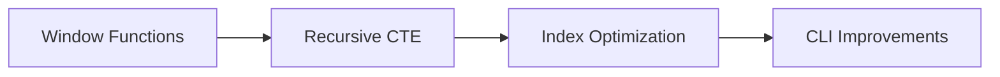

# sqlvibe v0.10.8 Implementation Plan

## Overview
This release focuses on advanced SQL:1999 features, performance improvements for large datasets, and major CLI usability upgrades.

---

## Major Features

### 1. SQL:1999 Window Functions
- Implement ROW_NUMBER, RANK, DENSE_RANK, NTILE, LEAD, LAG, FIRST_VALUE, LAST_VALUE, etc.
- Extend parser and AST for window function syntax (OVER, PARTITION BY, ORDER BY, frame specs)
- VM opcodes for window function execution
- Optimize for partitioned/ordered data using columnar storage and bitmap indexes
- Add comprehensive unit and regression tests

### 2. Recursive CTE Support (WITH RECURSIVE)
- Extend parser and AST for WITH RECURSIVE syntax
- Implement anchor and recursive member logic in codegen and VM
- Support UNION/UNION ALL in recursive CTEs
- Stack/queue management for recursion state
- Add tests for tree/graph traversal, transitive closure

### 3. Index Optimization for Large Datasets
- Profile and refactor skip list for cache locality and SIMD traversal
- Optimize bitmap index (RoaringBitmap) for sparse/dense data
- Add batch and parallel index operations
- Benchmark with large synthetic/real datasets
- Add regression tests for correctness and performance

### 4. CLI Improvements
- Interactive shell (REPL mode)
- Persistent query history
- Auto-complete for SQL keywords, tables, columns (schema cache)
- Multi-line input, result pagination
- Command shortcuts (.tables, .schema, .exit)
- CLI usability and edge case tests

---

## Success Criteria
- All window functions and recursive CTEs match SQLite results
- Indexes scale to millions of rows with low latency and efficient memory
- CLI is robust, user-friendly, and feature-complete
- All new features covered by unit, integration, and regression tests

---

## Implementation DAG

---

## Success Checklist
- [ ] Window functions implemented and tested
- [ ] Recursive CTEs implemented and tested
- [ ] Index optimizations completed and benchmarked
- [ ] CLI improvements completed and tested
- [ ] All tests pass, no regressions
- [ ] Documentation updated

---

## Notes
- All features must be SQLite-compatible for covered SQL
- Performance and usability are top priorities
- Update HISTORY.md and docs upon completion
