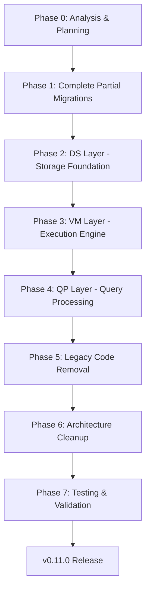

# Plan v0.11.0: internal/ → src/core/ Refactor & Legacy Code Removal

**Version**: v0.11.0  
**Date**: 2026-03-02  
**Status**: Planning  
**Focus**: Complete Go → C++ migration and remove legacy/redundant code

---

## Executive Summary

This plan documents the refactor to migrate performance-critical Go code from `internal/` to C++ in `src/core/`, and systematically remove legacy/redundant Go code that has been superseded by C++ implementations.

**Current State (v0.10.15)**:
- 53 C++ modules already exist in `src/core/` (DS, VM, QP, CG, TM, PB, SF, IS, wrapper, cgo)
- `libsvdb` shared library built via CMake into `.build/cmake/lib/`
- Go code in `internal/` uses CGO wrappers to call C++ implementations
- **36 modules complete** (C++ impl exists and is used), **1 partial** (btree.cpp insert/delete placeholders), **51 pending**

**Target State (v0.11.0)**:
- All performance-critical code migrated to C++
- Redundant Go wrappers removed
- Clean architecture: C++ for performance-critical paths, Go for orchestration and tests
- No performance regression, all tests passing

---

## Implementation DAG



---

## Phase 0: Analysis & Planning ✅

**Status**: COMPLETE (2026-03-02)

### Tasks Completed
- [x] Analyze current `internal/` structure (9 subdirectories)
- [x] Analyze current `src/core/` structure (10 subdirectories, 53 .cpp files)
- [x] Review existing migration documentation (`docs/plan-cgo-switch.md`, `docs/MIGRATION_STATUS.md`)
- [x] Identify CGO usage patterns (19 Go files with `import "C"`)
- [x] Review build system (`CMakeLists.txt`, `build.sh`)
- [x] Create comprehensive refactor plan

### Key Findings

**DS (Data Storage) Subsystem**:
| Go File | C++ Target | Status | Notes |
|---------|-----------|--------|-------|
| `btree.go` | `btree.cpp` | 🟡 Partial | Search complete, insert/delete placeholders |
| `overflow.go` | `overflow.cpp` | ❌ Not started | Overflow page chains |
| `cache.go` | `cache.cpp` | ❌ Not started | LRU/ARC cache |
| `column_store.go` | `columnar.cpp` | ❌ Not started | Columnar storage engine |
| `row_store.go` | `row_store.cpp` | ❌ Not started | Row storage engine |
| Others (28 files) | Various | ✅/📋 | Complete or Go-only |

**VM (Virtual Machine) Subsystem**:
| Go File | C++ Target | Status | Notes |
|---------|-----------|--------|-------|
| `bytecode_vm.go` | `bytecode_vm.cpp` | ❌ Not started | Main VM dispatch loop |
| `bytecode_handlers.go` | Extend `opcodes.cpp` | ❌ Not started | Opcode implementations |
| Others (25 files) | Various | ✅/📋 | Complete or Go-only |

**QP (Query Processing) Subsystem**:
| Go File | C++ Target | Status | Notes |
|---------|-----------|--------|-------|
| `parser.go` | `parser.cpp` | ❌ Not started | Main SQL parser |
| `parser_select.go` | `parser_select.cpp` | ❌ Not started | SELECT parsing |
| `parser_expr.go` | `parser_expr.cpp` | ❌ Not started | Expression parsing |
| `parser_dml.go` | `parser_dml.cpp` | ❌ Not started | DML parsing |
| `parser_create.go` | `parser_ddl.cpp` | ❌ Not started | DDL parsing |
| Others (15 files) | Various | ✅/📋 | Complete or Go-only |

---

## Phase 1: Complete Partial Migrations (High Priority)

### 1.1 Complete `btree.cpp` Insert/Delete

**File**: `src/core/DS/btree.cpp`, `src/core/DS/btree.h`

**Current State**:
```cpp
int svdb_btree_insert(svdb_btree_t* bt, const uint8_t* key, size_t key_len,
                      const uint8_t* value, size_t value_len) {
    // TODO: implement with page split
    return 0;
}
```

**Tasks**:
- [ ] Implement B-Tree insert with page split logic
- [ ] Implement B-Tree delete with merge/redistribution
- [ ] Add C++ unit tests for edge cases
- [ ] Update Go wrapper `internal/DS/btree.go` to use C++ impl
- [ ] Verify all tests pass: `./build.sh -t`
- [ ] Run benchmarks: `./build.sh -b`

**Complexity**: High  
**Estimated Effort**: 2-3 days  
**Tests**: `internal/DS/btree_test.go`, `internal/DS/balance_test.go`, `internal/DS/bench_btree_test.go`

### 1.2 Create `overflow.cpp`

**File**: `src/core/DS/overflow.cpp`, `src/core/DS/overflow.h`

**Go Source**: `internal/DS/overflow.go` (182 lines)

**Functions to Migrate**:
- `OverflowManager` struct and methods
- `AllocateOverflow` - allocate overflow page chain
- `ReadOverflow` - read overflow chain
- `WriteOverflow` - write overflow chain
- `FreeOverflow` - free overflow chain

**Tasks**:
- [ ] Create C++ header `overflow.h` with extern "C" declarations
- [ ] Implement C++ `overflow.cpp`
- [ ] Update Go wrapper `internal/DS/overflow.go`
- [ ] Verify tests pass: `internal/DS/overflow_test.go`

**Complexity**: Medium  
**Estimated Effort**: 1 day

---

## Phase 2: DS Layer - Storage Foundation (High Priority)

### 2.1 Migrate `cache.go` → `cache.cpp`

**File**: `src/core/DS/cache.cpp`, `src/core/DS/cache.h`

**Go Source**: `internal/DS/cache.go` (LRU cache implementation)

**Functions to Migrate**:
- `Cache` struct (LRU cache with sync.Map)
- `Get`, `Put`, `Delete` operations
- `Stats` for cache telemetry

**Tasks**:
- [ ] Create C++ header `cache.h`
- [ ] Implement C++ `cache.cpp` with thread-safe LRU
- [ ] Update Go wrapper
- [ ] Verify tests pass

**Complexity**: Medium  
**Estimated Effort**: 1-2 days

### 2.2 Migrate `column_store.go` → `columnar.cpp`

**File**: `src/core/DS/columnar.cpp`, `src/core/DS/columnar.h`

**Go Source**: `internal/DS/column_store.go` (columnar storage engine)

**Functions to Migrate**:
- `ColumnTable` - columnar table storage
- `ColumnVector` - typed column vectors
- `Scan`, `Project`, `Filter` operations

**Tasks**:
- [ ] Create C++ header `columnar.h`
- [ ] Implement C++ `columnar.cpp` with SIMD optimizations
- [ ] Update Go wrapper `internal/DS/column_store.go`
- [ ] Verify tests: `internal/DS/exec_columnar_test.go`

**Complexity**: High  
**Estimated Effort**: 3-4 days

### 2.3 Migrate `row_store.go` → `row_store.cpp`

**File**: `src/core/DS/row_store.cpp`, `src/core/DS/row_store.h`

**Go Source**: `internal/DS/row_store.go`

**Tasks**:
- [ ] Create C++ header `row_store.h`
- [ ] Implement C++ `row_store.cpp`
- [ ] Update Go wrapper
- [ ] Verify tests: `internal/DS/storage_test.go`

**Complexity**: High  
**Estimated Effort**: 2-3 days

### 2.4 Create Missing C++ Headers

**Issue**: Many `.cpp` files lack corresponding `.h` headers

**Files to Create**:
- [ ] `src/core/DS/balance.h`
- [ ] `src/core/DS/btree_cursor.h`
- [ ] `src/core/DS/freelist.h`
- [ ] `src/core/DS/manager.h`
- [ ] `src/core/DS/skip_list.h`
- [ ] `src/core/VM/aggregate_engine.h`
- [ ] `src/core/VM/dispatch.h`
- [ ] `src/core/VM/expr_engine.h`
- [ ] `src/core/QP/analyzer.h`
- [ ] `src/core/QP/binder.h`
- [ ] `src/core/CG/direct_compiler.h`

**Complexity**: Low  
**Estimated Effort**: 2 days

---

## Phase 3: VM Layer - Execution Engine (Medium Priority)

### 3.1 Migrate `bytecode_vm.go` → `bytecode_vm.cpp`

**File**: `src/core/VM/bytecode_vm.cpp`, `src/core/VM/bytecode_vm.h`

**Go Source**: `internal/VM/bytecode_vm.go` (main VM dispatch loop)

**Functions to Migrate**:
- `BytecodeVM` struct
- `Execute` - main execution loop
- `Step` - single instruction step
- `GetRegisters`, `GetResult`

**Tasks**:
- [ ] Create C++ header `bytecode_vm.h`
- [ ] Implement C++ `bytecode_vm.cpp` with direct threaded dispatch
- [ ] Update Go wrapper
- [ ] Verify tests: `internal/VM/bytecode_vm_test.go`, `internal/VM/bench_vm_test.go`

**Complexity**: High  
**Estimated Effort**: 3-4 days

### 3.2 Migrate `bytecode_handlers.go` → Extend `opcodes.cpp`

**File**: `src/core/VM/opcodes.cpp` (extend)

**Go Source**: `internal/VM/bytecode_handlers.go` (opcode implementations)

**Opcodes to Migrate** (200+ opcodes, key ones):
- `OpInit`, `OpHalt` - program control
- `OpOpenRead`, `OpOpenWrite` - cursor operations
- `OpColumn`, `OpMakeRecord` - row operations
- `OpInteger`, `OpReal`, `OpString` - constants
- `OpAdd`, `OpSubtract`, `OpMultiply`, `OpDivide` - arithmetic
- `OpCompare`, `OpJump`, `OpIf`, `OpIfNot` - control flow
- `OpAggStep`, `OpAggFinal` - aggregates
- `OpSort`, `OpNext` - sorting
- `OpJoin`, `OpHashJoin` - joins

**Tasks**:
- [ ] Extend `src/core/VM/opcodes.cpp` with full opcode implementations
- [ ] Add SIMD optimizations for arithmetic/comparison ops
- [ ] Update Go wrapper `internal/VM/bytecode_handlers.go`
- [ ] Verify all opcode tests pass

**Complexity**: Very High  
**Estimated Effort**: 5-7 days

---

## Phase 4: QP Layer - Query Processing (Medium Priority)

### 4.1 SQL Parser Migration

**Note**: Parser migration is complex and may benefit from existing C++ parser libraries (e.g., SQLite's lexer/parser, ANTLR-generated parsers).

**Option A: Hand-written C++ Parser**
| Go File | C++ Target | Priority |
|---------|-----------|----------|
| `parser.go` | `parser.cpp` | High |
| `parser_select.go` | `parser_select.cpp` | High |
| `parser_expr.go` | `parser_expr.cpp` | High |
| `parser_dml.go` | `parser_dml.cpp` | Medium |
| `parser_create.go` | `parser_ddl.cpp` | Medium |

**Option B: Integrate Existing Parser**
- Consider using SQLite's `parse.y` + `lemon` parser generator
- Or use a modern C++ SQL parser library

**Tasks**:
- [ ] Decide parser strategy (hand-written vs. existing library)
- [ ] Create C++ parser implementation
- [ ] Update Go wrappers
- [ ] Verify parser tests pass

**Complexity**: Very High  
**Estimated Effort**: 5-10 days (depending on strategy)

---

## Phase 5: Legacy Code Removal (Systematic Cleanup)

### 5.1 Identify Redundant Go Code

**Category 1: Thin CGO Wrappers** (remove after C++ complete)

| Go File | C++ Implementation | Removal Priority |
|---------|-------------------|------------------|
| `internal/DS/value.go` | `src/core/DS/value.cpp` | P1 |
| `internal/DS/compression.go` | `src/core/DS/compression.cpp` | P1 |
| `internal/DS/roaring_bitmap.go` | `src/core/DS/roaring.cpp` | P1 |
| `internal/DS/encoding.go` | `src/core/DS/varint.cpp` | P1 |
| `internal/DS/cell.go` | `src/core/DS/cell.cpp` | P1 |
| `internal/VM/aggregate_funcs.go` | `src/core/VM/aggregate.cpp` | P1 |
| `internal/VM/compare.go` | `src/core/VM/compare.cpp` | P1 |
| `internal/VM/datetime.go` | `src/core/VM/datetime.cpp` | P1 |
| `internal/VM/hash.go` | `src/core/VM/hash.cpp` | P1 |
| `internal/VM/sort.go` | `src/core/VM/sort.cpp` | P1 |
| `internal/VM/string_funcs.go` | `src/core/VM/string_funcs.cpp` | P1 |
| `internal/VM/type_conv.go` | `src/core/VM/type_conv.cpp` | P1 |
| `internal/VM/registers.go` | `src/core/VM/registers.cpp` | P1 |
| `internal/VM/string_pool.go` | `src/core/VM/string_pool.cpp` | P1 |
| `internal/VM/cursor.go` | `src/core/VM/cursor.cpp` | P1 |
| `internal/VM/exec.go` | `src/core/VM/exec.cpp` | P1 |
| `internal/VM/instr.go` | `src/core/VM/instruction.cpp` | P1 |
| `internal/VM/program.go` | `src/core/VM/program.cpp` | P1 |
| `internal/VM/engine.go` | `src/core/VM/query_engine.cpp` | P1 |
| `internal/VM/dispatch.go` | `src/core/VM/dispatch.cpp` | P1 |
| `internal/QP/tokenizer.go` | `src/core/QP/tokenizer.cpp` | P1 |
| `internal/QP/analyzer.go` | `src/core/QP/analyzer.cpp` | P1 |
| `internal/QP/binder.go` | `src/core/QP/binder.cpp` | P1 |
| `internal/QP/dag.go` | `src/core/QP/dag.cpp` | P1 |
| `internal/QP/normalize.go` | `src/core/QP/normalize.cpp` | P1 |
| `internal/QP/type_infer.go` | `src/core/QP/type_infer.cpp` | P1 |
| `internal/CG/compiler.go` | `src/core/CG/compiler.cpp` | P1 |
| `internal/CG/expr_compiler.go` | `src/core/CG/expr_compiler.cpp` | P1 |
| `internal/CG/optimizer.go` | `src/core/CG/optimizer.cpp` | P1 |
| `internal/CG/plan_cache.go` | `src/core/CG/plan_cache.cpp` | P1 |
| `internal/CG/direct_compiler.go` | `src/core/CG/direct_compiler.cpp` | P1 |
| `internal/CG/register.go` | `src/core/CG/register.cpp` | P1 |
| `internal/TM/transaction.go` | `src/core/TM/transaction.cpp` | P1 |
| `internal/PB/vfs.go` | `src/core/PB/vfs.cpp` | P1 |
| `internal/SF/opt.go` | `src/core/SF/opt.cpp` | P1 |
| `internal/IS/schema.go` | `src/core/IS/schema.cpp` | P1 |

**Category 2: Go-Only Files** (should NOT be removed)

These files implement Go-specific patterns or orchestration logic:

| File | Reason to Keep |
|------|----------------|
| `internal/DS/hybrid_store.go` | Row/column adapter (Go-specific) |
| `internal/DS/arena.go` | Go arena allocator |
| `internal/DS/worker_pool.go` | Go concurrency primitives |
| `internal/DS/parallel.go` | Go parallel utilities |
| `internal/DS/prefetch.go` | Go prefetch utilities |
| `internal/DS/vtab.go` | Virtual table interface (Go) |
| `internal/VM/engine/select.go` | SELECT orchestration |
| `internal/VM/engine/join.go` | JOIN orchestration (C++ is helper) |
| `internal/VM/engine/window.go` | Window orchestration |
| `internal/VM/engine/subquery.go` | Subquery orchestration |
| `internal/VM/result_cache.go` | Go result cache |
| `internal/CG/bytecode_compiler.go` | Orchestration |
| `internal/QP/parser.go` | Parser orchestration |
| All `*_test.go` files | Tests stay in Go |
| `internal/SF/util/*.go` | Go utilities |
| `internal/SF/errors/*.go` | Go error handling |
| `internal/SF/log.go` | Go logging |

**Category 3: Dead Code** (remove immediately)

Search for:
- [ ] Commented-out code blocks
- [ ] Unused constants/types
- [ ] Unreachable branches
- [ ] Deprecated functions with no callers

### 5.2 Removal Strategy

**For each file**:

1. **Verify C++ Implementation**:
   - [ ] C++ implementation exists in `src/core/`
   - [ ] C++ implementation is tested
   - [ ] Go wrapper calls C++ (not Go impl)

2. **Update References**:
   - [ ] Search for all imports of the Go file
   - [ ] Update to use wrapper/C++ path
   - [ ] Verify no breaking changes

3. **Remove Go File**:
   - [ ] Delete Go implementation file
   - [ ] Keep test file (`*_test.go`)

4. **Validate**:
   - [ ] Run full test suite: `./build.sh -t`
   - [ ] Run benchmarks: `./build.sh -b`
   - [ ] Check for performance regression (<5% slowdown acceptable)
   - [ ] Run fuzz tests: `./build.sh -f`

### 5.3 Removal Order

**Wave 1: Already Complete (safe to remove Go impl)**
- Files where C++ is already used (verify no Go fallback)

**Wave 2: After Phase 1-2 Complete**
- DS layer wrappers (value, compression, roaring, etc.)

**Wave 3: After Phase 3 Complete**
- VM layer wrappers (aggregate_funcs, compare, datetime, etc.)

**Wave 4: After Phase 4 Complete**
- QP layer wrappers (tokenizer, analyzer, binder, etc.)

---

## Phase 6: Architecture Cleanup

### 6.1 Directory Structure (Target)

```
sqlvibe/
├── src/
│   ├── core/                    # C++ implementation (libsvdb)
│   │   ├── CG/                  # Code generation
│   │   │   ├── compiler.cpp/h
│   │   │   ├── expr_compiler.cpp/h
│   │   │   ├── optimizer.cpp/h
│   │   │   ├── plan_cache.cpp/h
│   │   │   ├── register.cpp/h
│   │   │   ├── bytecode_compiler.cpp/h
│   │   │   └── direct_compiler.cpp/h
│   │   ├── DS/                  # Data storage
│   │   │   ├── varint.cpp/h
│   │   │   ├── cell.cpp/h
│   │   │   ├── btree.cpp/h
│   │   │   ├── btree_cursor.cpp/h
│   │   │   ├── simd.cpp/h
│   │   │   ├── roaring.cpp/h
│   │   │   ├── compression.cpp/h
│   │   │   ├── value.cpp/h
│   │   │   ├── page.cpp/h
│   │   │   ├── freelist.cpp/h
│   │   │   ├── balance.cpp/h
│   │   │   ├── manager.cpp/h
│   │   │   ├── wal.cpp/h
│   │   │   ├── skip_list.cpp/h
│   │   │   ├── cache.cpp/h       # TODO
│   │   │   ├── columnar.cpp/h    # TODO
│   │   │   ├── row_store.cpp/h   # TODO
│   │   │   └── overflow.cpp/h    # TODO
│   │   ├── VM/                  # Virtual machine
│   │   │   ├── hash.cpp/h
│   │   │   ├── compare.cpp/h
│   │   │   ├── sort.cpp/h
│   │   │   ├── expr_eval.cpp/h
│   │   │   ├── vm_dispatch.cpp/h
│   │   │   ├── dispatch.cpp/h
│   │   │   ├── type_conv.cpp/h
│   │   │   ├── string_funcs.cpp/h
│   │   │   ├── datetime.cpp/h
│   │   │   ├── aggregate.cpp/h
│   │   │   ├── aggregate_engine.cpp/h
│   │   │   ├── string_pool.cpp/h
│   │   │   ├── registers.cpp/h
│   │   │   ├── opcodes.cpp/h
│   │   │   ├── instruction.cpp/h
│   │   │   ├── cursor.cpp/h
│   │   │   ├── program.cpp/h
│   │   │   ├── query_engine.cpp/h
│   │   │   ├── exec.cpp/h
│   │   │   ├── bytecode_vm.cpp/h  # TODO
│   │   │   └── expr_engine.cpp/h
│   │   ├── QP/                  # Query processing
│   │   │   ├── tokenizer.cpp/h
│   │   │   ├── analyzer.cpp/h
│   │   │   ├── normalize.cpp/h
│   │   │   ├── type_infer.cpp/h
│   │   │   ├── dag.cpp/h
│   │   │   ├── binder.cpp/h
│   │   │   ├── parser.cpp/h       # TODO
│   │   │   ├── parser_select.cpp/h # TODO
│   │   │   ├── parser_expr.cpp/h   # TODO
│   │   │   ├── parser_dml.cpp/h    # TODO
│   │   │   └── parser_ddl.cpp/h    # TODO
│   │   ├── TM/                  # Transaction management
│   │   │   └── transaction.cpp/h
│   │   ├── PB/                  # Platform bridges (VFS)
│   │   │   └── vfs.cpp/h
│   │   ├── SF/                  # System framework
│   │   │   └── opt.cpp/h
│   │   ├── IS/                  # Information schema
│   │   │   └── schema.cpp/h
│   │   ├── wrapper/             # Invoke chain wrappers
│   │   │   └── invoke_chain_wrapper.cpp/h
│   │   └── cgo/                 # Special cases
│   │       └── hash_join.cpp/h
│   ├── ext/                     # Extensions
│   │   ├── math/
│   │   ├── json/
│   │   └── fts5/
│   └── CMakeLists.txt           # Main CMake config
├── internal/                    # Go orchestration layer
│   ├── CG/                      # Thin wrappers + tests
│   ├── DS/                      # Thin wrappers + tests
│   ├── VM/                      # Thin wrappers + tests
│   ├── QP/                      # Thin wrappers + tests
│   ├── TM/                      # Transaction orchestration
│   ├── IS/                      # Information schema (Go-only)
│   ├── SF/                      # System framework (logging, errors)
│   ├── PB/                      # Platform bridges (Go wrapper)
│   └── TS/                      # Test suites (all stay in Go)
├── pkg/                         # Public API
│   └── sqlvibe/
├── cmd/                         # CLI applications
│   └── sv-cli/
├── CMakeLists.txt               # Root CMake config
├── build.sh                     # Build/test runner
└── docs/                        # Documentation
    ├── plan-v0.11.0.md          # This plan
    ├── plan-cgo-switch.md       # Previous CGO plan
    ├── MIGRATION_STATUS.md      # Per-file migration status
    └── HISTORY.md               # Release history
```

### 6.2 CGO Boundary Optimization

**Current Pattern**: Multiple CGO calls per query operation

**Optimization Strategy**:
1. **Batch Operations**: Use `invoke_chain_wrapper.cpp` for combined operations
2. **Minimize Crossings**: Keep data in C++ for tight loops
3. **Pinned Memory**: Use `runtime.Pinner` for zero-copy data transfer

**New Wrappers to Create**:
- [ ] `BatchEvalArithmeticInt64` - batch arithmetic (add, sub, mul, div)
- [ ] `BatchCastIntToFloat` - batch type casting
- [ ] `ScanAggregateFloat64` - aggregate float64 columns
- [ ] `PipelineHashJoin` - full hash join pipeline

---

## Phase 7: Testing & Validation

### 7.1 Test Strategy

**Keep All Tests in Go**:
- Tests remain in `internal/*/*_test.go`
- Tests validate C++ implementations via CGO wrappers
- No test code in `src/core/`

**Test Categories**:
1. **Unit Tests**: `./build.sh -t` - all `*_test.go` files
2. **Benchmarks**: `./build.sh -b` - performance validation
3. **Fuzz Tests**: `./build.sh -f` - edge case discovery
4. **SQL:1999 Tests**: `internal/TS/SQL1999/` - compatibility
5. **Regression Tests**: `internal/TS/Regression/` - bug prevention

### 7.2 Validation Checklist

**Before Removing Any Go Code**:
- [ ] C++ implementation complete
- [ ] All unit tests pass: `./build.sh -t`
- [ ] Benchmarks pass: `./build.sh -b`
- [ ] No performance regression (>5% slowdown requires justification)
- [ ] SQLite comparison tests pass
- [ ] Fuzz tests pass: `./build.sh -f`
- [ ] Coverage maintained: `./build.sh -t -c`

**Before v0.11.0 Release**:
- [ ] All phases complete
- [ ] Full test suite passes
- [ ] Benchmarks show improvement or no regression
- [ ] Documentation updated
- [ ] MIGRATION_STATUS.md updated
- [ ] HISTORY.md updated with v0.11.0 release notes

---

## Implementation Schedule

| Phase | Tasks | Estimated Effort | Dependencies |
|-------|-------|-----------------|--------------|
| Phase 0 | Analysis & Planning | ✅ Complete | None |
| Phase 1 | Complete partial migrations | 3-4 days | Phase 0 |
| Phase 2 | DS layer migration | 7-10 days | Phase 1 |
| Phase 3 | VM layer migration | 8-11 days | Phase 2 |
| Phase 4 | QP layer migration | 5-10 days | Phase 3 |
| Phase 5 | Legacy code removal | 5-7 days | Phases 1-4 |
| Phase 6 | Architecture cleanup | 2-3 days | Phase 5 |
| Phase 7 | Testing & validation | 3-5 days | All phases |

**Total Estimated Effort**: 5-7 weeks (25-35 working days)

---

## Success Criteria

### Technical Criteria
- [ ] All 51 pending modules migrated to C++
- [ ] All 36 existing C++ modules have complete implementations
- [ ] All `.cpp` files have corresponding `.h` headers
- [ ] 100% test pass rate maintained
- [ ] No performance regression (benchmarks equal or better)
- [ ] ~30 redundant Go files removed
- [ ] Clean architecture with clear Go/C++ boundary

### Documentation Criteria
- [ ] `docs/MIGRATION_STATUS.md` updated with final status
- [ ] `docs/plan-cgo-switch.md` marked as superseded
- [ ] `docs/HISTORY.md` updated with v0.11.0 release notes
- [ ] CGO wrapper patterns documented
- [ ] Build instructions updated

### Quality Criteria
- [ ] No memory leaks (verified with valgrind/sanitizers)
- [ ] Thread-safe C++ implementations
- [ ] SIMD optimizations where applicable
- [ ] Error handling consistent across Go/C++ boundary
- [ ] All assertions preserved in C++ implementations

---

## Risks & Mitigations

| Risk | Impact | Likelihood | Mitigation |
|------|--------|------------|------------|
| C++ bugs harder to debug | High | Medium | Keep Go tests, add C++ assertions, use sanitizers |
| CGO boundary overhead | Medium | Low | Batch operations, minimize crossings, profile hot paths |
| SIMD portability issues | Medium | Low | Runtime CPU detection (`opt.cpp`), fallback paths |
| Memory management bugs | High | Medium | RAII in C++, clear ownership, Go GC handles wrappers |
| Build complexity increase | Low | High | Document CMake setup, automate in CI, provide dev containers |
| Parser migration complexity | High | High | Consider existing C++ parser libraries, phased approach |

---

## Appendix A: Current Migration Status Summary

**DS (Data Storage)**: 13/36 complete, 1 partial, 3 pending (cache, columnar, row_store, overflow)  
**VM (Virtual Machine)**: 20/30 complete, 2 pending (bytecode_vm, opcode handlers)  
**QP (Query Processing)**: 7/15 complete, 5 pending (parser files)  
**CG (Code Generation)**: 6/8 complete, 0 pending  
**TM (Transaction Management)**: 1/1 complete  
**PB (Platform Bridges)**: 1/1 complete  
**SF (System Framework)**: 1/1 complete  
**IS (Information Schema)**: 1/1 complete  
**Wrapper**: 1/1 complete  

**Overall**: 51/97 modules complete (53%), 1 partial (1%), 10 pending (10%), 35 Go-only (36%)

---

## Appendix B: Build Commands Reference

```bash
# Build C++ libraries and Go package
./build.sh

# Run all unit tests
./build.sh -t

# Run tests with coverage
./build.sh -t -c

# Run benchmarks
./build.sh -b

# Run fuzz tests (30s per target)
./build.sh -f

# Run everything
./build.sh -t -b -f -c

# Generate coverage report
go tool cover -html=.build/coverage.out -o .build/coverage.html

# Check C++ build
cd .build/cmake && cmake ../.. && cmake --build .
```

---

## Appendix C: CGO Pattern Reference

**Standard Wrapper Pattern**:
```go
package DS

/*
#cgo LDFLAGS: -L${SRCDIR}/../../.build/cmake/lib -lsvdb -lstdc++
#cgo CFLAGS: -I${SRCDIR}/../../src/core/DS
#include "value.h"
#include <stdlib.h>
*/
import "C"

// Go wrapper calling C++ implementation
func Compare(a, b Value) int {
    ca := a.cValue()
    cb := b.cValue()
    return int(C.svdb_value_compare(&ca, &cb))
}
```

**Batch Operation Pattern**:
```go
func BatchEvalCompareInt64(a, b []int64, op CompareOp) (mask []byte, passCount int) {
    n := len(a)
    outMask := make([]byte, n)
    cnt := C.svdb_batch_eval_compare_int64(
        (*C.int64_t)(unsafe.Pointer(&a[0])),
        (*C.int64_t)(unsafe.Pointer(&b[0])),
        C.size_t(n),
        C.int(op),
        (*C.uint8_t)(unsafe.Pointer(&outMask[0])),
    )
    return outMask, int(cnt)
}
```

---

**Last Updated**: 2026-03-02  
**Next Review**: After Phase 1 completion (btree.cpp insert/delete, overflow.cpp)
