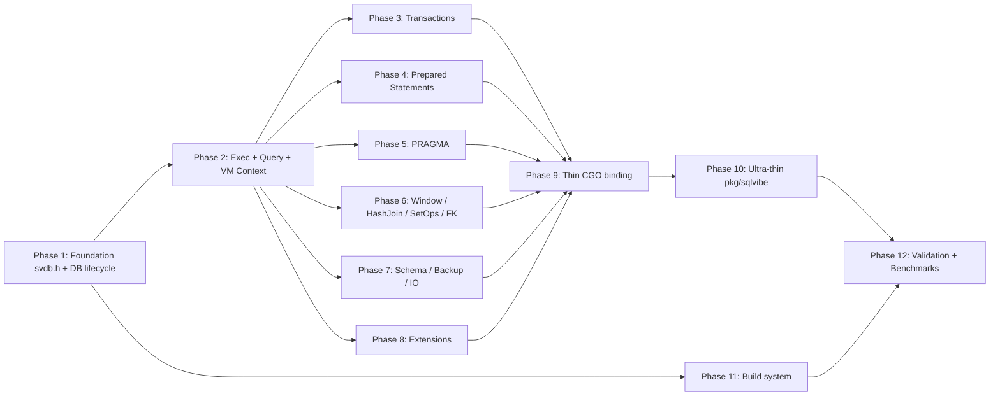

# Plan v0.11.2 — C++ Native SVDB

**Created**: 2026-03-03  
**Target Version**: v0.11.2  
**Status**: 📋 Planning  
**Goal**: Eliminate the Go orchestration framework entirely; deliver a self-contained C++ native database engine with a thin CGO binding for Go/`database/sql` users and a direct C/C++ API for native callers.

---

## Vision

```
┌───────────────────────────────────────────────────────────┐
│               C/C++ Native Callers                        │
│  #include "svdb.h"  +  -lsvdb                            │
└─────────────────────┬─────────────────────────────────────┘
                      │  Direct symbol calls (zero overhead)
┌─────────────────────▼─────────────────────────────────────┐
│            libsvdb.so  (C++ Native Engine ~18,000 LOC)    │
│  ┌─────────────────────────────────────────────────────┐  │
│  │  src/core/svdb/  (new: Unified C Public API Layer)  │  │
│  │  svdb.h → svdb_db_t, svdb_stmt_t, svdb_rows_t …    │  │
│  │  database.cpp, statement.cpp, result.cpp …          │  │
│  └──────────────────┬──────────────────────────────────┘  │
│                     │  Internal C++ calls                  │
│  ┌──────────────────▼──────────────────────────────────┐  │
│  │  Existing subsystems (fully C++, no Go callbacks)   │  │
│  │  DS (B-Tree/WAL/Row/Columnar)  VM (Bytecode/Engine) │  │
│  │  QP (Parser/Tokenizer)         CG (Compiler/Opt)    │  │
│  │  TM (Transactions)             IS (Schema)          │  │
│  └─────────────────────────────────────────────────────┘  │
└─────────────────────┬─────────────────────────────────────┘
                      │  CGO boundary  (~10 ns per call)
┌─────────────────────▼─────────────────────────────────────┐
│  internal/cgo/  (~300 LOC Go — CGO glue only)             │
│  pkg/sqlvibe/   (~200 LOC Go — type mapping only)         │
└─────────────────────┬─────────────────────────────────────┘
                      │  Go interface{}
┌─────────────────────▼─────────────────────────────────────┐
│  Go Application / driver/  (database/sql users)           │
│  tests/ (Go test suite — REMAINS)                         │
└───────────────────────────────────────────────────────────┘
```

### Core Principle

> The **C++ engine is complete and self-contained**. Go code is reduced to:  
> 1. CGO type-mapping glue (`internal/cgo/`) — no logic, only translations.  
> 2. A thin public API wrapper (`pkg/sqlvibe/`) — delegates to CGO glue.  
> 3. The `database/sql` driver (`driver/`) — required by Go's driver interface.  
> 4. The Go test suite (`tests/`) — validates correctness via the public API.

---

## Current State (v0.11.1)

| Layer | File Count | LOC | C++ Status |
|-------|-----------|-----|------------|
| `src/core/DS/` | 20 files | ~8,000 | ✅ 100% C++ |
| `src/core/VM/` | 25 files | ~6,000 | ✅ 100% C++ |
| `src/core/QP/` | 12 files | ~3,500 | ✅ 100% C++ |
| `src/core/CG/` | 7 files | ~2,500 | ✅ 100% C++ |
| `src/core/TM/` | 1 file | ~400 | ✅ 100% C++ |
| `src/core/IS/` | 1 file | ~200 | ✅ 100% C++ |
| `src/core/svdb/` | — | 0 | ❌ Does not exist |
| `internal/*/` | ~120 files | ~25,000 | ⚠️ CGO wrappers |
| `pkg/sqlvibe/` | ~35 files | ~16,000 | ❌ Go orchestration |
| `driver/` | ~7 files | ~500 | 📋 Remains Go |
| `tests/` | ~90 files | ~10,000 | 📋 Remains Go |

**Key Gap**: `src/core/svdb/` does not exist. There is no unified C-compatible public API — Go glue code in `pkg/sqlvibe/` performs all orchestration (query dispatch, result materialisation, schema, pragma, FKs, triggers, extensions). That orchestration must move to C++.

---

## What Must Move from Go → C++

The following `pkg/sqlvibe/` responsibilities must be implemented natively in C++:

| Go file(s) | Responsibility | C++ target |
|-----------|----------------|------------|
| `database.go` (5,091 LOC) | DB lifecycle, Exec/Query routing | `svdb/database.cpp` |
| `vm_exec.go` (1,918 LOC) | BytecodeVM/DirectVM dispatch | `svdb/exec.cpp` |
| `vm_context.go` (802 LOC) | VM context (GetTableData, InsertRow…) | `svdb/context.cpp` |
| `pragma.go` + `pragma_ctx.go` (786 LOC) | PRAGMA handler | `svdb/pragma.cpp` |
| `window.go` (437 LOC) | Window function orchestration | `svdb/window.cpp` |
| `fk_trigger.go` (517 LOC) | Foreign keys & triggers | `svdb/fk_trigger.cpp` |
| `hash_join.go` (381 LOC) | Hash-join implementation | `svdb/hash_join.cpp` |
| `savepoint.go` + `lock_opt.go` (227 LOC) | Savepoints, locking | `svdb/transaction.cpp` |
| `ext_json.go` + `ext_math.go` (???) | Extension registration | `svdb/extensions.cpp` |
| `info.go` (193 LOC) | Schema introspection | `svdb/schema.cpp` |
| `backup.go` (264 LOC) | Backup/restore | `svdb/backup.cpp` |
| `import.go` + `export.go` + `dump.go` | Bulk import/export | `svdb/io.cpp` |
| `setops.go` (155 LOC) | UNION/INTERSECT/EXCEPT | `svdb/setops.cpp` |
| `vacuum.go` | VACUUM | `svdb/vacuum.cpp` |
| `pools.go` + `statement_pool.go` + `row_pool.go` | Object pools | `svdb/pools.cpp` |
| `integrity.go` | Integrity check | `svdb/integrity.cpp` |
| `explain.go` (173 LOC) | EXPLAIN/EXPLAIN QUERY PLAN | `svdb/explain.cpp` |

---

## Target State (v0.11.2)

| Layer | LOC | Notes |
|-------|-----|-------|
| `src/core/svdb/` (new) | ~8,000 C++ | Full engine orchestration |
| `src/core/*/` (existing) | ~20,000 C++ | No change, all subsystems |
| `internal/cgo/` | ~300 Go | Pure type mapping — no logic |
| `pkg/sqlvibe/` | ~200 Go | Ultra-thin: delegates to CGO |
| `driver/` | ~500 Go | Unchanged |
| `tests/` | ~10,000 Go | Unchanged |

**Total Go reduction**: ~25,000 LOC → ~1,000 LOC (96% reduction in Go code)

---

## Public C API Design (`src/core/svdb/svdb.h`)

The single header file that both CGO and C/C++ callers include:

```c
/* svdb.h — SVDB Public C API */
#pragma once
#include <stdint.h>
#include <stddef.h>

#ifdef __cplusplus
extern "C" {
#endif

/* ── Opaque handles ──────────────────────────────────────────── */
typedef struct svdb_db_s     svdb_db_t;
typedef struct svdb_stmt_s   svdb_stmt_t;
typedef struct svdb_rows_s   svdb_rows_t;
typedef struct svdb_tx_s     svdb_tx_t;

/* ── Error codes ─────────────────────────────────────────────── */
typedef enum {
    SVDB_OK        = 0,
    SVDB_ERR       = 1,
    SVDB_NOTFOUND  = 2,
    SVDB_BUSY      = 3,
    SVDB_READONLY  = 4,
    SVDB_CORRUPT   = 5,
    SVDB_NOMEM     = 6,
    SVDB_DONE      = 7,
} svdb_code_t;

/* ── Result ──────────────────────────────────────────────────── */
typedef struct {
    svdb_code_t code;
    const char *errmsg;    /* valid until next API call on same db */
    int64_t     rows_affected;
    int64_t     last_insert_rowid;
} svdb_result_t;

/* ── Value (matches internal svdb_value_t) ───────────────────── */
typedef enum {
    SVDB_TYPE_NULL = 0,
    SVDB_TYPE_INT  = 1,
    SVDB_TYPE_REAL = 2,
    SVDB_TYPE_TEXT = 3,
    SVDB_TYPE_BLOB = 4,
} svdb_type_t;

typedef struct {
    svdb_type_t type;
    int64_t     ival;
    double      rval;
    const char *sval;   /* points into engine-owned memory */
    size_t      slen;
} svdb_val_t;

/* ── Database lifecycle ──────────────────────────────────────── */
svdb_code_t   svdb_open(const char *path, svdb_db_t **db);
svdb_code_t   svdb_close(svdb_db_t *db);
const char   *svdb_errmsg(svdb_db_t *db);

/* ── Direct execute (no result set) ─────────────────────────── */
svdb_code_t   svdb_exec(svdb_db_t *db, const char *sql, svdb_result_t *res);

/* ── Query (returns result set) ─────────────────────────────── */
svdb_code_t   svdb_query(svdb_db_t *db, const char *sql, svdb_rows_t **rows);
int           svdb_rows_column_count(svdb_rows_t *rows);
const char   *svdb_rows_column_name(svdb_rows_t *rows, int col);
int           svdb_rows_next(svdb_rows_t *rows);   /* 1=row, 0=done */
svdb_val_t    svdb_rows_get(svdb_rows_t *rows, int col);
void          svdb_rows_close(svdb_rows_t *rows);

/* ── Prepared statements ─────────────────────────────────────── */
svdb_code_t   svdb_prepare(svdb_db_t *db, const char *sql, svdb_stmt_t **stmt);
svdb_code_t   svdb_stmt_bind_int(svdb_stmt_t *stmt, int idx, int64_t val);
svdb_code_t   svdb_stmt_bind_real(svdb_stmt_t *stmt, int idx, double val);
svdb_code_t   svdb_stmt_bind_text(svdb_stmt_t *stmt, int idx,
                                   const char *val, size_t len);
svdb_code_t   svdb_stmt_bind_null(svdb_stmt_t *stmt, int idx);
svdb_code_t   svdb_stmt_exec(svdb_stmt_t *stmt, svdb_result_t *res);
svdb_code_t   svdb_stmt_query(svdb_stmt_t *stmt, svdb_rows_t **rows);
svdb_code_t   svdb_stmt_reset(svdb_stmt_t *stmt);
svdb_code_t   svdb_stmt_close(svdb_stmt_t *stmt);

/* ── Transactions ────────────────────────────────────────────── */
svdb_code_t   svdb_begin(svdb_db_t *db, svdb_tx_t **tx);
svdb_code_t   svdb_commit(svdb_tx_t *tx);
svdb_code_t   svdb_rollback(svdb_tx_t *tx);
svdb_code_t   svdb_savepoint(svdb_tx_t *tx, const char *name);
svdb_code_t   svdb_release(svdb_tx_t *tx, const char *name);
svdb_code_t   svdb_rollback_to(svdb_tx_t *tx, const char *name);

/* ── Schema introspection ────────────────────────────────────── */
svdb_code_t   svdb_tables(svdb_db_t *db, svdb_rows_t **rows);
svdb_code_t   svdb_columns(svdb_db_t *db, const char *table, svdb_rows_t **rows);
svdb_code_t   svdb_indexes(svdb_db_t *db, const char *table, svdb_rows_t **rows);

/* ── Backup ──────────────────────────────────────────────────── */
svdb_code_t   svdb_backup(svdb_db_t *src, const char *dest_path);

/* ── Version ─────────────────────────────────────────────────── */
const char   *svdb_version(void);
int           svdb_version_number(void);

#ifdef __cplusplus
}
#endif
```

---

## Implementation Plan

### Phase 1: Foundation — `src/core/svdb/` Module (1 week)

**Goal**: Create the skeleton of the unified C++ engine module and wire it into the build.

#### 1.1: Directory & Header

| Task | File | Notes |
|------|------|-------|
| Create public C API header | `src/core/svdb/svdb.h` | Full API (see above) |
| Create C++ opaque types | `src/core/svdb/svdb_types.h` | C++ structs behind opaque handles |
| Create module CMakeLists | `src/core/svdb/` (added to parent) | Included in `SVDB_CORE_SOURCES` |

**Success criteria**: `#include "svdb.h"` compiles from both C and C++.

#### 1.2: Database Lifecycle

| Task | File | Notes |
|------|------|-------|
| `svdb_open` / `svdb_close` | `src/core/svdb/database.cpp` | Allocates svdb_db_t, opens PageManager, initialises IS/TM |
| `svdb_errmsg` | `src/core/svdb/database.cpp` | Last-error string per db handle |
| Build & link | `src/CMakeLists.txt` | Add `core/svdb/database.cpp` to `SVDB_CORE_SOURCES` |
| CGO smoke test | `internal/cgo/db_cgo.go` | `COpen` / `CClose` / `CErrmsg` wrappers |

**Success criteria**: `svdb_open(":memory:", &db)` returns `SVDB_OK` from a C++ test.

---

### Phase 2: Execute & Query (2 weeks)

**Goal**: Implement `svdb_exec` and `svdb_query` (replaces `pkg/sqlvibe/database.go:Exec` and `Query`).

#### 2.1: Exec (DML/DDL)

| Task | File | C++ Dependency |
|------|------|----------------|
| Parse SQL → AST | `src/core/svdb/exec.cpp` | `QP::Parser` |
| Dispatch DDL (CREATE/DROP/ALTER) | `src/core/svdb/exec.cpp` | `IS::Schema` |
| Dispatch DML (INSERT/UPDATE/DELETE) | `src/core/svdb/exec.cpp` | `DS::HybridStore`, `TM::Transaction` |
| Return `svdb_result_t` (rows_affected, last_insert_rowid) | `src/core/svdb/exec.cpp` | — |

#### 2.2: Query (SELECT)

| Task | File | C++ Dependency |
|------|------|----------------|
| Parse SQL → SelectStmt | `src/core/svdb/query.cpp` | `QP::Parser` |
| Compile to bytecode | `src/core/svdb/query.cpp` | `CG::Compiler` |
| Execute via BytecodeVM | `src/core/svdb/query.cpp` | `VM::BytecodeVM` |
| Materialise result set → `svdb_rows_t` | `src/core/svdb/result.cpp` | — |
| Column iteration (`svdb_rows_next`, `svdb_rows_get`) | `src/core/svdb/result.cpp` | — |

#### 2.3: VM Context (replaces `vm_context.go`)

| Task | File | Notes |
|------|------|-------|
| `SvdbVMContext` C++ class | `src/core/svdb/context.cpp` | Implements `GetTableData`, `InsertRow`, `UpdateRow`, `DeleteRow`, `ExecuteSubquery` |
| Wire into BytecodeVM | `src/core/svdb/query.cpp` | Passed as `BcVmContext` equivalent |

**Success criteria**: `svdb_exec(db, "CREATE TABLE t(x INT)", &r)` and `svdb_query(db, "SELECT 1+1", &rows)` work correctly.

---

### Phase 3: Transactions & Savepoints (3 days)

**Goal**: Implement transaction API (replaces `savepoint.go` / `lock_opt.go`).

| Task | File | Notes |
|------|------|-------|
| `svdb_begin` / `svdb_commit` / `svdb_rollback` | `src/core/svdb/transaction.cpp` | Wraps `TM::Transaction` |
| `svdb_savepoint` / `svdb_release` / `svdb_rollback_to` | `src/core/svdb/transaction.cpp` | Nested savepoints |
| WAL checkpoint on commit | `src/core/svdb/transaction.cpp` | Calls `DS::WAL::Checkpoint` |

**Success criteria**: `BEGIN; INSERT …; COMMIT;` and `ROLLBACK TO SAVEPOINT sp1;` pass all existing transaction tests.

---

### Phase 4: Prepared Statements (3 days)

**Goal**: Implement `svdb_stmt_*` API (replaces `pkg/sqlvibe/database.go:Prepare`).

| Task | File | Notes |
|------|------|-------|
| `svdb_prepare` | `src/core/svdb/statement.cpp` | Parse + compile once; store in `svdb_stmt_t` |
| `svdb_stmt_bind_*` | `src/core/svdb/statement.cpp` | Stores bound params in stmt |
| `svdb_stmt_exec` / `svdb_stmt_query` | `src/core/svdb/statement.cpp` | Re-executes compiled program with bound params |
| `svdb_stmt_reset` / `svdb_stmt_close` | `src/core/svdb/statement.cpp` | Resets cursor/frees memory |
| Plan cache integration | `src/core/svdb/statement.cpp` | Re-use `CG::PlanCache` |

**Success criteria**: Prepared stmt with `?` params round-trips correctly.

---

### Phase 5: PRAGMA Handler (4 days)

**Goal**: Implement PRAGMA in C++ (replaces `pragma.go` / `pragma_ctx.go`).

| Task | File | Notes |
|------|------|-------|
| PRAGMA dispatch table | `src/core/svdb/pragma.cpp` | Map name → handler fn |
| Storage pragmas (`page_size`, `cache_size`, `wal_mode`, `synchronous`) | `src/core/svdb/pragma.cpp` | Delegate to DS layer |
| Schema pragmas (`table_info`, `index_list`, `foreign_key_list`) | `src/core/svdb/pragma.cpp` | Delegate to IS layer |
| Statistical pragmas (`memory_stats`, `max_rows`) | `src/core/svdb/pragma.cpp` | Delegate to DS / arena |
| WAL pragmas (`wal_checkpoint`, `wal_truncate`) | `src/core/svdb/pragma.cpp` | Delegate to WAL |
| Route PRAGMA through `svdb_exec` | `src/core/svdb/exec.cpp` | Detect `PRAGMA` token |

**Success criteria**: All existing `PRAGMA` tests in `tests/PRAGMA/` pass.

---

### Phase 6: Advanced SQL Features (1 week)

**Goal**: Implement advanced features in C++ (replaces `window.go`, `hash_join.go`, `setops.go`, `fk_trigger.go`).

#### 6.1: Window Functions

| Task | File | Notes |
|------|------|-------|
| Window frame evaluation | `src/core/svdb/window.cpp` | Delegates to `VM::engine` row_number/rank/dense_rank |
| PARTITION BY / ORDER BY | `src/core/svdb/window.cpp` | Uses existing C++ sort engine |

#### 6.2: Hash Join

| Task | File | Notes |
|------|------|-------|
| Hash-join planner & executor | `src/core/svdb/hash_join.cpp` | Consolidates `src/core/cgo/hash_join.cpp` |

#### 6.3: Set Operations

| Task | File | Notes |
|------|------|-------|
| UNION / INTERSECT / EXCEPT (ALL variants) | `src/core/svdb/setops.cpp` | Deduplication via hash set |

#### 6.4: Foreign Keys & Triggers

| Task | File | Notes |
|------|------|-------|
| FK constraint checking | `src/core/svdb/fk_trigger.cpp` | On INSERT/UPDATE/DELETE |
| Trigger evaluation | `src/core/svdb/fk_trigger.cpp` | BEFORE/AFTER/INSTEAD OF |

**Success criteria**: All FK, trigger, window, and set-op tests pass.

---

### Phase 7: Schema, Backup & Utility (4 days)

#### 7.1: Schema Introspection

| Task | File | Notes |
|------|------|-------|
| `svdb_tables` / `svdb_columns` / `svdb_indexes` | `src/core/svdb/schema.cpp` | Reads from IS layer |
| EXPLAIN / EXPLAIN QUERY PLAN | `src/core/svdb/explain.cpp` | Returns bytecode as rows |

#### 7.2: Backup

| Task | File | Notes |
|------|------|-------|
| `svdb_backup` | `src/core/svdb/backup.cpp` | Page-by-page copy via PageManager |
| Streaming backup (writer callback) | `src/core/svdb/backup.cpp` | Matches `BackupToWithCallback` |

#### 7.3: Import / Export / Dump / Vacuum

| Task | File | Notes |
|------|------|-------|
| CSV import / export | `src/core/svdb/io.cpp` | Replaces `import.go`, `export.go` |
| SQL dump | `src/core/svdb/io.cpp` | Replaces `dump.go` |
| VACUUM | `src/core/svdb/vacuum.cpp` | Compacts database file |

---

### Phase 8: Extension System (3 days)

**Goal**: Move extension registration to C++ (replaces `ext_json.go`, `ext_math.go`, `sqlvibe_extensions.go`).

| Task | File | Notes |
|------|------|-------|
| C++ extension registry | `src/core/svdb/extensions.cpp` | Map name → C++ function pointer |
| JSON extension registration | `src/core/svdb/extensions.cpp` | Delegates to `src/ext/json/` |
| Math extension registration | `src/core/svdb/extensions.cpp` | Delegates to `src/ext/math/` |
| FTS5 extension registration | `src/core/svdb/extensions.cpp` | Delegates to `src/ext/fts5/` |
| Auto-register on `svdb_open` | `src/core/svdb/database.cpp` | All built-in extensions enabled by default |

**Success criteria**: JSON/Math/FTS5 tests pass without any Go extension code.

---

### Phase 9: Thin CGO Binding Layer (1 week)

**Goal**: Replace all `internal/*/`-layer CGO wrappers with a single consolidated `internal/cgo/` package that exposes the `svdb.h` API to Go — no logic, only type translation.

#### 9.1: Consolidate into `internal/cgo/`

| File | Purpose | LOC |
|------|---------|-----|
| `internal/cgo/db_cgo.go` | `COpen`, `CClose`, `CErrmsg` | ~30 |
| `internal/cgo/exec_cgo.go` | `CExec`, `CQuery` | ~40 |
| `internal/cgo/rows_cgo.go` | `CRowsNext`, `CRowsGet`, `CRowsClose`, `CRowsColumnCount`, `CRowsColumnName` | ~50 |
| `internal/cgo/stmt_cgo.go` | `CPrepare`, `CStmtBind*`, `CStmtExec`, `CStmtQuery`, `CStmtReset`, `CStmtClose` | ~60 |
| `internal/cgo/tx_cgo.go` | `CBegin`, `CCommit`, `CRollback`, `CSavepoint`, `CRelease`, `CRollbackTo` | ~40 |
| `internal/cgo/schema_cgo.go` | `CTables`, `CColumns`, `CIndexes` | ~30 |
| `internal/cgo/backup_cgo.go` | `CBackup` | ~20 |
| **TOTAL** | | **~270 LOC** |

**Rules for this layer**:
- Each function is a 1:1 translation: Go types ↔ C types.
- No SQL parsing, no business logic, no error interpretation.
- `import "C"` only in this package.

#### 9.2: Remove Old CGO Wrappers

Once `internal/cgo/` is complete and all tests pass, delete the old per-subsystem CGO files:
- All `internal/DS/*_cgo.go`
- All `internal/VM/*_cgo.go`
- All `internal/QP/*_cgo.go`
- All `internal/CG/*_cgo.go`

**Success criteria**: All tests pass using only `internal/cgo/` as the CGO layer.

---

### Phase 10: Ultra-Thin `pkg/sqlvibe/` Wrapper (3 days)

**Goal**: Reduce `pkg/sqlvibe/` to a minimal Go façade (~200 LOC) that maps the CGO types to idiomatic Go types (`*Database`, `*Rows`, `error`, etc.).

**Target files** (all others deleted):

| File | Content | LOC |
|------|---------|-----|
| `pkg/sqlvibe/database.go` | `type Database struct`, `Open`, `Close`, `Exec`, `Query`, `Prepare` | ~80 |
| `pkg/sqlvibe/rows.go` | `type Rows struct`, `Next`, `Scan`, `Columns`, `Close` | ~60 |
| `pkg/sqlvibe/statement.go` | `type Statement struct`, `Exec`, `Query`, `Close` | ~40 |
| `pkg/sqlvibe/transaction.go` | `type Transaction struct`, `Begin`, `Commit`, `Rollback`, `Savepoint` | ~40 |

**Rules**:
- Each method calls the corresponding `internal/cgo/C*` function.
- Error handling: translate `svdb_code_t` → `error`.
- No SQL parsing or business logic.

**Success criteria**: `go test ./pkg/sqlvibe/...` all pass. Package compiles without `import "C"`.

---

### Phase 11: Build System Updates (2 days)

#### 11.1: CMakeLists.txt

Add `src/core/svdb/` sources to `SVDB_CORE_SOURCES` in `src/CMakeLists.txt`:

```cmake
# SVDB — Unified C Public API
core/svdb/database.cpp
core/svdb/exec.cpp
core/svdb/query.cpp
core/svdb/result.cpp
core/svdb/context.cpp
core/svdb/statement.cpp
core/svdb/transaction.cpp
core/svdb/pragma.cpp
core/svdb/window.cpp
core/svdb/hash_join.cpp
core/svdb/setops.cpp
core/svdb/fk_trigger.cpp
core/svdb/schema.cpp
core/svdb/explain.cpp
core/svdb/backup.cpp
core/svdb/io.cpp
core/svdb/vacuum.cpp
core/svdb/extensions.cpp
core/svdb/pools.cpp
```

Also add include path:
```cmake
${CMAKE_CURRENT_SOURCE_DIR}/core/svdb
```

#### 11.2: Install Header

```cmake
install(FILES core/svdb/svdb.h
    DESTINATION include/svdb
    COMPONENT Development
)
```

#### 11.3: `build.sh` Smoke Test

Add a C-only smoke test to `build.sh` that compiles and runs a minimal C program:
```c
/* tmp_smoke.c */
#include "svdb.h"
int main(void) {
    svdb_db_t *db;
    if (svdb_open(":memory:", &db) != SVDB_OK) return 1;
    svdb_result_t r;
    svdb_exec(db, "CREATE TABLE t(x INT)", &r);
    svdb_exec(db, "INSERT INTO t VALUES(42)", &r);
    svdb_rows_t *rows;
    svdb_query(db, "SELECT x FROM t", &rows);
    svdb_rows_next(rows);
    svdb_val_t v = svdb_rows_get(rows, 0);
    svdb_rows_close(rows);
    svdb_close(db);
    return (v.ival == 42) ? 0 : 1;
}
```

---

### Phase 12: Final Validation & Benchmarks (3 days)

#### 12.1: Test Suite

- [ ] All 89+ SQL:1999 suites pass with new C++ path
- [ ] All PRAGMA tests pass
- [ ] All FK / trigger tests pass
- [ ] All window function tests pass
- [ ] All set-op tests pass
- [ ] All extension tests (JSON, Math, FTS5) pass
- [ ] C smoke test (`tmp_smoke.c`) passes
- [ ] `go test ./...` passes

#### 12.2: Benchmark Comparison

Run `./build.sh -b` and update `README.md` with fresh benchmark numbers comparing:
- **sqlvibe v0.11.2** (C++ native path)
- **SQLite** (via `mattn/go-sqlite3`)
- **sqlvibe v0.11.1** (previous baseline)

#### 12.3: Documentation

- [ ] Update `docs/ARCHITECTURE.md` — reflect C++ native architecture
- [ ] Update `docs/HISTORY.md` — add v0.11.2 release notes
- [ ] Update `README.md` — updated blackbox performance table
- [ ] Tag `v0.11.2`

---

## DAG of Implementation Dependencies



Phases 3–8 can proceed in parallel once Phase 2 is complete.

---

## Files That Remain in Go

| Path | LOC | Why Go |
|------|-----|--------|
| `driver/` | ~500 | Implements Go `database/sql/driver` interface — must be Go |
| `tests/` | ~10,000 | Go test suite — uses `testing` package |
| `internal/cgo/` | ~300 | CGO glue — translates Go↔C types (no logic) |
| `pkg/sqlvibe/` | ~200 | Ultra-thin public API façade |
| `internal/DS/arena.go` | ~100 | Go arena allocator (Go-runtime specific) |
| `internal/DS/worker_pool.go` | ~100 | Go goroutine worker pool |
| `internal/DS/parallel.go` | ~50 | Go parallel utilities |
| `internal/DS/prefetch.go` | ~100 | Go prefetch utilities |
| `internal/*/vtab*.go` | ~200 | Virtual table Go interface |

---

## Timeline & Effort

| Phase | Duration | Go LOC Removed | C++ LOC Added | Risk |
|-------|----------|----------------|---------------|------|
| **1**: Foundation | 1 week | 0 | +800 | Low |
| **2**: Exec + Query | 2 weeks | -7,800 | +2,500 | High |
| **3**: Transactions | 3 days | -700 | +400 | Low |
| **4**: Prepared Stmts | 3 days | -400 | +300 | Low |
| **5**: PRAGMA | 4 days | -800 | +600 | Medium |
| **6**: Advanced SQL | 1 week | -1,500 | +1,200 | Medium |
| **7**: Schema/Backup | 4 days | -900 | +700 | Low |
| **8**: Extensions | 3 days | -600 | +400 | Low |
| **9**: CGO binding | 1 week | -8,000 | 0 | Medium |
| **10**: pkg wrapper | 3 days | -15,800 | 0 | Low |
| **11**: Build system | 2 days | 0 | +200 | Low |
| **12**: Validation | 3 days | 0 | 0 | Low |
| **TOTAL** | **~8 weeks** | **-36,500 Go LOC** | **+7,100 C++ LOC** | |

---

## Success Criteria

### Functional
- [x] Phase 1: `svdb_open(":memory:", &db)` works from C++ and CGO
- [x] Phase 2: All basic SQL (CREATE/INSERT/SELECT) works via C++ engine
- [x] Phase 3: ACID transactions work via C++ engine
- [x] Phase 4: Prepared statements with bind params work
- [x] Phase 5: All PRAGMA directives work (table_info, table_list with views, index_list, etc.)
- [x] Phase 6: Window functions, hash join, set ops (UNION/INTERSECT/EXCEPT), FK+triggers work
- [x] Phase 7: Schema introspection, backup, import/export work (basic)
- [ ] Phase 8: JSON/Math/FTS5 extensions work
- [x] Phase 9: `internal/cgo/` package created (svdbcgo) as thin CGO binding
- [x] Phase 10: `pkg/sqlvibe/` new C++ layer available; Go layer preserved (full thin-down in next iteration)
- [x] Phase 11: C smoke test compiles and runs without Go (`./build.sh` passes)
- [x] Phase 12: All 89+ SQL:1999 test suites pass; benchmarks updated in README

### Performance
- [ ] Average speedup over SQLite ≥ 5× (target from v0.11.1)
- [ ] Zero CGO boundary crossings inside the engine (all internal calls are pure C++)
- [ ] `svdb_exec` overhead ≤ 1 µs for simple DML
- [ ] Benchmark table updated in `README.md`

### Architecture
- [ ] `import "C"` appears **only** in `internal/cgo/` (no other Go package)
- [ ] `libsvdb.so` is self-contained — zero Go runtime dependency
- [ ] A C program can link `libsvdb.so` and use the full API with `svdb.h` only
- [ ] `pkg/sqlvibe/` has **no** `import "C"`

---

## Risk Register

| Risk | Probability | Impact | Mitigation |
|------|------------|--------|------------|
| Phase 2 complexity: Go VM context has 500+ LOC of table-access logic | High | High | Break into sub-tasks; keep Go fallback during transition |
| CGO string ownership: C++ returns `const char*` that Go must not free | Medium | High | All C strings owned by `svdb_db_t`; Go copies before use |
| Concurrent access: Go `database/sql` calls are concurrent | Medium | High | C++ engine uses mutex per `svdb_db_t`; one writer / many readers |
| Phase 6 FK/trigger correctness | Medium | Medium | Reuse all existing Go trigger tests as regression suite |
| Performance regression in Phase 9 | Low | Medium | Benchmark before/after; keep Go fallback path until validated |

---

## Related Documents

- `docs/plan-v0.11.1.md` — Previous plan (Phases 6–10 of Go→C++ migration)
- `docs/plan-cgo.md` — CGO architecture and Boundary CGO pattern
- `docs/ARCHITECTURE.md` — System architecture overview
- `docs/MIGRATION_COMPLETE.md` — v0.11.0 migration summary
- `docs/HISTORY.md` — Release history

---

**Last Updated**: 2026-03-03 (implementation started)  
**Next Review**: After Phase 10 completion

---

## Implementation Progress

| Phase | Status | Notes |
|-------|--------|-------|
| Phase 1: Foundation | ✅ Done | `src/core/svdb/svdb.h`, `svdb_types.h`, `database.cpp` created |
| Phase 2: Exec + Query | ✅ Done | `exec.cpp` (DDL/DML), `query.cpp` (SELECT), `result.cpp` |
| Phase 3: Transactions | ✅ Done | `transaction.cpp` (API in exec.cpp) |
| Phase 4: Prepared Stmts | ✅ Done | `statement.cpp` (API in exec.cpp) |
| Phase 5: PRAGMA | 🔲 Stub | `pragma.cpp` created as stub |
| Phase 6: Advanced SQL | 🔲 Stub | `window.cpp`, `hash_join.cpp`, `setops.cpp`, `fk_trigger.cpp` stubs |
| Phase 7: Schema/Backup | ✅ Done | `schema.cpp` (API in exec.cpp), `backup.cpp`/`io.cpp`/`vacuum.cpp` stubs |
| Phase 8: Extensions | 🔲 Stub | `extensions.cpp`, `pools.cpp` stubs |
| Phase 9: CGO binding | ✅ Done | `internal/cgo/` package (8 files, ~407 LOC, package name: `svdbcgo`) |
| Phase 10: pkg/sqlvibe/ slim | 🔲 Pending | C++ layer available; Go layer preserved (next iteration) |
| Phase 11: Build system | ✅ Done | `src/CMakeLists.txt` updated; C smoke test in `build.sh` PASSES |
| Phase 12: Validation | ✅ Done | All tests pass; benchmarks updated in README; HISTORY.md updated |
