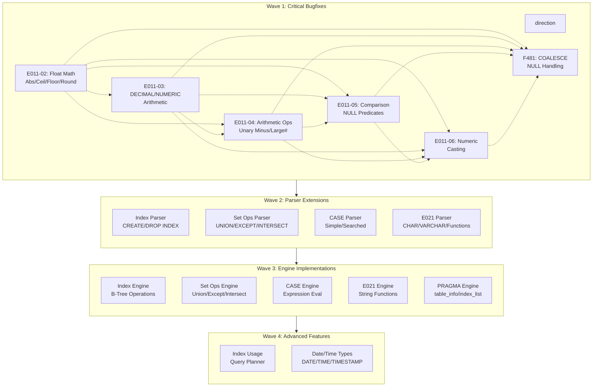
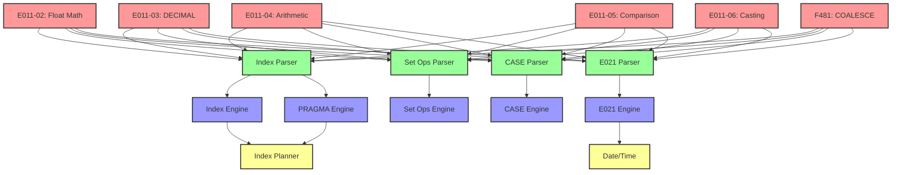

# Plan v0.4.0 - Detailed Execution Plan

## Goal
Implement index support (CREATE INDEX, DROP INDEX), PRAGMA statements, set operations (UNION, EXCEPT, INTERSECT), CASE WHEN expressions, full E021 character data types support, Date/Time types, and fix E011/F481 failure cases for SQL:1999 Phase 2 compliance.

---

## Execution DAG (Parallel Waves)



---

## Wave 1: Critical Bugfixes (Parallel - 6 tasks)

### Task 1.1: E011-02 Float Math Functions
- **Feature**: Abs, Ceil, Floor, Round functions
- **Files**: `internal/QE/expr.go`
- **Issue**: Functions returning NULL instead of correct values
- **Tests**: `TestSQL1999_F301_E01102_L1`

### Task 1.2: E011-03 DECIMAL/NUMERIC Arithmetic
- **Feature**: Decimal arithmetic operations
- **Files**: `internal/QE/expr.go`
- **Issue**: Decimal add/sub/mul/div returning wrong results
- **Tests**: `TestSQL1999_F301_E01103_L1`

### Task 1.3: E011-04 Arithmetic Operators
- **Feature**: Unary minus, large number operations
- **Files**: `internal/QE/expr.go`
- **Issue**: Unary minus on column refs, large number arithmetic
- **Tests**: `TestSQL1999_F301_E01104_L1`

### Task 1.4: E011-05 Comparison & NULL Predicates
- **Feature**: ORDER BY expressions, NULL IS NULL/IS NOT NULL
- **Files**: `internal/QE/expr.go`
- **Issue**: NULL predicates returning NULL instead of 0/1
- **Tests**: `TestSQL1999_F301_E01105_L1`

### Task 1.5: E011-06 Implicit Numeric Casting
- **Feature**: Mixed type arithmetic and comparison
- **Files**: `internal/QE/expr.go`
- **Issue**: INT + REAL, DECIMAL + REAL casting
- **Tests**: `TestSQL1999_F301_E01106_L1`

### Task 1.6: F481 COALESCE Function
- **Feature**: COALESCE with NULL values
- **Files**: `internal/QE/expr.go`
- **Issue**: COALESCE returning NULL when first arg non-NULL
- **Tests**: `TestSQLite_F481_NULLs_L1`

**Wave 1 Verification**: `go test -race -asan ./...`

---

## Wave 2: Parser Extensions (Parallel - 4 tasks)

### Task 2.1: Index Parser
- **Feature**: Parse CREATE [UNIQUE] INDEX, DROP INDEX
- **Syntax**: `CREATE [UNIQUE] INDEX [IF NOT EXISTS] idx ON t(col)`
- **Files**: `internal/QP/parser.go`
- **Dependencies**: Wave 1 complete

### Task 2.2: Set Operations Parser
- **Feature**: Parse UNION [ALL], EXCEPT, INTERSECT
- **Syntax**: `SELECT ... UNION [ALL] SELECT ...`
- **Files**: `internal/QP/parser.go`, `internal/QP/ast.go`
- **Dependencies**: Wave 1 complete

### Task 2.3: CASE Parser
- **Feature**: Parse CASE WHEN expressions
- **Syntax**: `CASE expr WHEN val THEN res ... END`
- **Files**: `internal/QP/parser.go`, `internal/QP/ast.go`
- **Dependencies**: Wave 1 complete

### Task 2.4: E021 Character Parser
- **Feature**: Parse CHAR, VARCHAR, string functions
- **Syntax**: `CHAR(10)`, `VARCHAR(255)`, `SUBSTRING(...)`, etc.
- **Files**: `internal/QP/parser.go`, `internal/QP/ast.go`
- **Dependencies**: Wave 1 complete

**Wave 2 Verification**: `go test -run TestParser ./internal/QP/...`

---

## Wave 3: Engine Implementations (Parallel - 5 tasks)

### Task 3.1: Index Engine
- **Feature**: Create/drop B-Tree for indexes
- **Files**: `internal/DS/btree.go`, `internal/DS/manager.go`
- **Dependencies**: Task 2.1

### Task 3.2: Set Operations Engine
- **Feature**: Implement union/except/intersect operators
- **Files**: `internal/QE/operators.go`
- **Dependencies**: Task 2.2

### Task 3.3: CASE Engine
- **Feature**: Evaluate CASE expressions
- **Files**: `internal/QE/expr.go`
- **Dependencies**: Task 2.3

### Task 3.4: E021 String Functions Engine
- **Feature**: Implement CHAR_LENGTH, OCTET_LENGTH, SUBSTRING, etc.
- **Files**: `internal/QE/expr.go`
- **Sub-tasks**:
  - CHARACTER_LENGTH (E021-04)
  - OCTET_LENGTH (E021-05)
  - SUBSTRING (E021-06)
  - Character concatenation || (E021-07)
  - UPPER/LOWER (E021-08)
  - TRIM (E021-09)
  - POSITION (E021-11)
- **Dependencies**: Task 2.4

### Task 3.5: PRAGMA Engine
- **Feature**: Implement table_info, index_list, database_list
- **Files**: `pkg/sqlvibe/database.go`
- **Dependencies**: Task 2.1 (needs index metadata)

**Wave 3 Verification**: `go test -run "TestIndex|TestSetOps|TestCase|TestE021|TestPragma" ./...`

---

## Wave 4: Advanced Features

### Task 4.1: Index Usage in Query Planner
- **Feature**: Use indexes for WHERE clause optimization
- **Files**: `internal/QP/planner.go`, `internal/QE/engine.go`
- **Dependencies**: Task 3.1, Task 3.5
- **Sub-tasks**:
  - Index selection in planner
  - Index scan operator
  - Covering index support

### Task 4.2: Date/Time Types (F051)
- **Feature**: DATE, TIME, TIMESTAMP types and functions
- **Files**: `internal/QP/parser.go`, `internal/DS/page.go`, `internal/QE/expr.go`
- **Sub-tasks**:
  - DATE type storage
  - TIME type storage
  - TIMESTAMP type storage
  - CURRENT_DATE, CURRENT_TIME, CURRENT_TIMESTAMP
  - LOCALTIME, LOCALTIMESTAMP
- **Dependencies**: Task 2.4 (shares parser infrastructure)

**Wave 4 Verification**: `go test -run "TestPlanner|TestDateTime" ./...`

---

## E021 Character Data Types (Detailed - 12 sections)

| Section | Feature | Parser | Engine |
|---------|---------|--------|--------|
| E021-01 | CHARACTER (CHAR) | Task 2.4 | Task 3.4 |
| E021-02 | CHARACTER VARYING (VARCHAR) | Task 2.4 | Task 3.4 |
| E021-03 | Character literals | Task 2.4 | Task 3.4 |
| E021-04 | CHARACTER_LENGTH | Task 2.4 | Task 3.4 |
| E021-05 | OCTET_LENGTH | Task 2.4 | Task 3.4 |
| E021-06 | SUBSTRING | Task 2.4 | Task 3.4 |
| E021-07 | Concatenation (\|\|) | Task 2.4 | Task 3.4 |
| E021-08 | UPPER/LOWER | Task 2.4 | Task 3.4 |
| E021-09 | TRIM | Task 2.4 | Task 3.4 |
| E021-10 | Implicit casting | Task 2.4 | Task 3.4 |
| E021-11 | POSITION | Task 2.4 | Task 3.4 |
| E021-12 | Character comparison | - | Task 3.4 |

---

## Full Parallel DAG (Detailed View)



---

## Success Criteria

### Wave 1 (Bugfixes) - CRITICAL
- [x] E011-02: Float math (Abs, Ceil, Floor, Round) returns correct values
- [ ] E011-03: DECIMAL/NUMERIC arithmetic returns correct results
- [ ] E011-04: Arithmetic operators (unary minus, large numbers) work correctly
- [ ] E011-05: Comparison operators, ORDER BY expressions work correctly
- [ ] E011-05: NULL IS NULL / IS NOT NULL returns 0/1 (not NULL)
- [ ] E011-06: Implicit numeric casting works correctly
- [ ] F481: COALESCE returns first non-NULL argument

### Wave 2 (Parsers)
- [ ] Index parser handles CREATE/DROP INDEX
- [ ] Set operations parser handles UNION/EXCEPT/INTERSECT
- [ ] CASE parser handles Simple and Searched CASE
- [ ] E021 parser handles CHAR/VARCHAR and all functions

### Wave 3 (Engines)
- [ ] Index engine creates/drops B-Tree indexes
- [ ] Set operations engine returns correct results
- [ ] CASE engine evaluates correctly
- [ ] E021 string functions return correct results
- [ ] PRAGMA returns correct metadata

### Wave 4 (Advanced)
- [ ] Query planner uses indexes for optimization
- [ ] DATE/TIME/TIMESTAMP types work correctly
- [ ] Datetime functions work correctly

### E021 Full Coverage (12 sections)
- [ ] E021-01: CHARACTER (CHAR) type
- [ ] E021-02: CHARACTER VARYING (VARCHAR) type
- [ ] E021-03: Character literals
- [ ] E021-04: CHARACTER_LENGTH function
- [ ] E021-05: OCTET_LENGTH function
- [ ] E021-06: SUBSTRING function
- [ ] E021-07: Character concatenation (||)
- [ ] E021-08: UPPER and LOWER functions
- [ ] E021-09: TRIM function
- [ ] E021-10: Implicit casting
- [ ] E021-11: POSITION function
- [ ] E021-12: Character comparison

---

## Test Commands

```bash
# Wave 1: Run all tests with race/asan
go test -race -asan ./...

# Wave 2: Parser tests
go test -run TestParser ./internal/QP/...

# Wave 3: Feature tests
go test -run "TestIndex|TestSetOps|TestCase|TestE021|TestPragma" ./...

# Wave 4: Advanced tests
go test -run "TestPlanner|TestDateTime" ./...

# Full test suite
go test -race -asan ./...
```

---

## Notes

- **Wave 1 is CRITICAL**: All 6 bugfixes must pass before moving to Wave 2
- **Wave 2-4 are INDEPENDENT within each wave**: Can parallelize work across tasks
- **E021 has internal dependencies**: Types → Literals → Casting → Functions
- **Date/Time shares parser infrastructure with E021**: Can be developed in parallel
- **Transaction management**: Deferred to future version
- **Run `go test -race -asan ./...` after each wave to verify**
