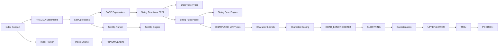

# Plan v0.4.0

## Goal
Implement index support (CREATE INDEX, DROP INDEX), PRAGMA statements, set operations (UNION, EXCEPT, INTERSECT), CASE WHEN expressions, full E021 character data types support, and Date/Time types for SQL:1999 Phase 2 compliance.

## Requirements

### HIGH Priority
- CREATE INDEX (from sqlite.reqs.md)
- DROP INDEX (from sqlite.reqs.md)
- Index usage in query planning (from sqlite.reqs.md)
- UNION/EXCEPT/INTERSECT set operations (from sql1999.reqs.md E071)

### MEDIUM Priority
- PRAGMA statements (pragma_table_info, pragma_index_list, pragma_database_list)
- CASE WHEN expressions (from sqlite.reqs.md)
- DISTINCT improvements (from sqlite.reqs.md)
- LIMIT with OFFSET improvements (from sqlite.reqs.md)
- Date/Time types (from sql1999.reqs.md F051)
- Improved subquery support (ALL/ANY, EXISTS improvements)
- Failure case fixes from test results:
  - E011-02: Float math (Abs, Ceil, Floor, Round)
  - E011-03: DECIMAL/NUMERIC arithmetic
  - E011-04: Arithmetic operators (unary minus, large numbers)
  - E011-05: Comparison operators, ORDER BY expressions, NULL predicates
  - E011-06: Implicit numeric casting
  - F481: COALESCE function with NULL values
- E021 Character Data Types (ALL 12 sections):
  - E021-01: CHARACTER (CHAR)
  - E021-02: CHARACTER VARYING (VARCHAR)
  - E021-03: Character literals
  - E021-04: CHARACTER_LENGTH function
  - E021-05: OCTET_LENGTH function
  - E021-06: SUBSTRING function
  - E021-07: Character concatenation (||)
  - E021-08: UPPER and LOWER functions
  - E021-09: TRIM function
  - E021-10: Implicit casting among character types
  - E021-11: POSITION function
  - E021-12: Character comparison

## Implementation DAG



**Notes:**
- Index support builds on existing DS (Data Storage) B-Tree
- Set operations require query engine modifications
- E021 has strict dependencies: Types → Literals → Casting → Basic Functions → Advanced Functions
- Date/Time types require both storage and expression changes
- Transaction management deferred to future version

## Detailed Design

### 1. Index Support

#### 1.1 CREATE INDEX
- **Parser changes**: Parse CREATE [UNIQUE] INDEX statement
- **Engine changes**: Create new B-Tree for index
- **Files affected**: `internal/QP/parser.go`, `internal/DS/btree.go`

**Implementation:**
```
CREATE [UNIQUE] INDEX [IF NOT EXISTS] index_name ON table_name (column_name [, ...])
```

#### 1.2 DROP INDEX
- **Parser changes**: Parse DROP INDEX statement
- **Engine changes**: Remove index B-Tree from database
- **Files affected**: `internal/QP/parser.go`, `internal/DS/manager.go`

#### 1.3 Index Usage in Queries
- **Goal**: Use indexes for WHERE clause optimization
- **Files affected**: `internal/QP/planner.go`, `internal/QE/engine.go`

**Implementation:**
- Index selection in query planner
- Index scan operator
- Covering index support

### 2. PRAGMA Statements

#### 2.1 pragma_table_info
- **Goal**: Return table column information
- **Syntax**: `PRAGMA table_info(table_name)`
- **Files affected**: `pkg/sqlvibe/database.go`

**Implementation:**
- Parse PRAGMA statement
- Return columns: cid, name, type, notnull, dflt_value, pk

#### 2.2 pragma_index_list
- **Goal**: Return list of indexes for table
- **Syntax**: `PRAGMA index_list(table_name)`
- **Files affected**: `pkg/sqlvibe/database.go`

#### 2.3 pragma_database_list
- **Goal**: Return list of attached databases
- **Syntax**: `PRAGMA database_list`
- **Files affected**: `pkg/sqlvibe/database.go`

### 3. Set Operations (UNION, EXCEPT, INTERSECT)

#### 3.1 UNION
- **Parser changes**: Detect UNION [ALL] between SELECT statements
- **Engine changes**: Implement set union operator
- **Files affected**: `internal/QP/parser.go`, `internal/QE/operators.go`

**Implementation:**
- Parse: `SELECT ... UNION [ALL] SELECT ...`
- Implement union-all (no deduplication)
- Implement union (with deduplication using hash or sort)

#### 3.2 EXCEPT
- **Parser changes**: Detect EXCEPT between SELECT statements
- **Engine changes**: Implement set difference operator
- **Files affected**: `internal/QP/parser.go`, `internal/QE/operators.go`

#### 3.3 INTERSECT
- **Parser changes**: Detect INTERSECT between SELECT statements
- **Engine changes**: Implement set intersection operator
- **Files affected**: `internal/QP/parser.go`, `internal/QE/operators.go`

### 4. CASE WHEN Expressions

#### 4.1 Simple CASE
- **Goal**: `CASE expr WHEN value THEN result ... [ELSE result] END`
- **Parser changes**: Parse CASE expression
- **Engine changes**: Implement case evaluation in expression evaluator
- **Files affected**: `internal/QP/ast.go`, `internal/QE/expr.go`

#### 4.2 Searched CASE
- **Goal**: `CASE WHEN condition THEN result ... [ELSE result] END`
- **Parser changes**: Same as simple CASE
- **Engine changes**: Evaluate each WHEN condition

### 5. E021 Character Data Types (ALL 12 Sections)

#### 5.1 CHARACTER (CHAR) - E021-01
- **Goal**: Support CHAR(n) fixed-length string type
- **Files affected**: `internal/QP/parser.go`, `internal/QP/ast.go`, `internal/DS/page.go`

#### 5.2 CHARACTER VARYING (VARCHAR) - E021-02
- **Goal**: Support VARCHAR(n) variable-length string type
- **Files affected**: `internal/QP/parser.go`, `internal/QP/ast.go`, `internal/DS/page.go`

#### 5.3 Character Literals - E021-03
- **Goal**: Support single-quoted string constants with escape sequences
- **Files affected**: `internal/QP/tokenizer.go`, `internal/QP/parser.go`

#### 5.4 CHARACTER_LENGTH - E021-04
- **Goal**: Return character length of string
- **Syntax**: `CHAR_LENGTH(string)` or `CHARACTER_LENGTH(string)`
- **Files affected**: `internal/QP/parser.go`, `internal/QE/expr.go`

#### 5.5 OCTET_LENGTH - E021-05
- **Goal**: Return length of string in bytes
- **Syntax**: `OCTET_LENGTH(string)`
- **Files affected**: `internal/QP/parser.go`, `internal/QE/expr.go`

#### 5.6 SUBSTRING - E021-06
- **Goal**: Extract substring from string
- **Syntax**: `SUBSTRING(string FROM start [FOR length])` or `SUBSTR(string, start, length)`
- **Files affected**: `internal/QP/parser.go`, `internal/QE/expr.go`

#### 5.7 Character Concatenation - E021-07
- **Goal**: Concatenate strings using || operator
- **Syntax**: `string1 || string2`
- **Files affected**: `internal/QP/parser.go`, `internal/QE/expr.go`

#### 5.8 UPPER and LOWER Functions - E021-08
- **Goal**: Convert string to upper/lower case
- **Syntax**: `UPPER(string)`, `LOWER(string)`
- **Files affected**: `internal/QP/parser.go`, `internal/QE/expr.go`

#### 5.9 TRIM Function - E021-09
- **Goal**: Remove leading/trailing whitespace (or specified chars)
- **Syntax**: `TRIM(string)`, `TRIM(LEADING 'x' FROM string)`, `TRIM(TRAILING string)`, `TRIM(BOTH string)`
- **Files affected**: `internal/QP/parser.go`, `internal/QE/expr.go`

#### 5.10 Implicit Casting - E021-10
- **Goal**: Support implicit casting between character types
- **Files affected**: `internal/QP/ast.go`, `internal/QE/expr.go`

#### 5.11 POSITION Function - E021-11
- **Goal**: Find substring position in string
- **Syntax**: `POSITION(substring IN string)`
- **Files affected**: `internal/QP/parser.go`, `internal/QE/expr.go`

#### 5.12 Character Comparison - E021-12
- **Goal**: Support comparison operators on character strings
- **Files affected**: `internal/QE/expr.go`

### 6. Date/Time Types (F051)

#### 6.1 DATE Type
- **Goal**: Support DATE column type
- **Files affected**: `internal/QP/parser.go`, `internal/DS/page.go`

#### 6.2 TIME Type
- **Goal**: Support TIME column type
- **Files affected**: `internal/QP/parser.go`, `internal/DS/page.go`

#### 6.3 TIMESTAMP Type
- **Goal**: Support TIMESTAMP column type
- **Files affected**: `internal/QP/parser.go`, `internal/DS/page.go`

#### 6.4 Datetime Functions
- **Goal**: CURRENT_DATE, CURRENT_TIME, CURRENT_TIMESTAMP, LOCALTIME, LOCALTIMESTAMP
- **Files affected**: `internal/QE/expr.go`

### 7. E011 Failure Case Fixes

#### 7.1 E011-02: Float Math Functions
- **Goal**: Fix Abs, Ceil, Floor, Round functions
- **Files affected**: `internal/QE/expr.go`
- **Issues**: Functions returning NULL instead of correct values

#### 7.2 E011-03: DECIMAL/NUMERIC Arithmetic
- **Goal**: Fix decimal arithmetic operations
- **Files affected**: `internal/QE/expr.go`
- **Issues**: Decimal add/sub/mul/div operations returning wrong results

#### 7.3 E011-04: Arithmetic Operators
- **Goal**: Fix unary minus, large number operations
- **Files affected**: `internal/QE/expr.go`
- **Issues**: Unary minus on column references, large number arithmetic

#### 7.4 E011-05: Comparison Operators
- **Goal**: Fix ORDER BY expressions, NULL IS NULL / IS NOT NULL predicates
- **Files affected**: `internal/QE/expr.go`
- **Issues**: ORDER BY with expressions, NULL predicates returning NULL instead of 0/1

#### 7.5 E011-06: Implicit Numeric Casting
- **Goal**: Fix mixed type arithmetic and comparison
- **Files affected**: `internal/QE/expr.go`
- **Issues**: INT + REAL, DECIMAL + REAL casting and operations

#### 7.6 F481: COALESCE Function
- **Goal**: Fix COALESCE with NULL values
- **Files affected**: `internal/QE/expr.go`
- **Issues**: COALESCE returning NULL when first argument is non-NULL

## Success Criteria

- [ ] CREATE INDEX creates index B-Tree
- [ ] DROP INDEX removes index
- [ ] Query planner uses indexes for WHERE optimization
- [ ] PRAGMA table_info returns column metadata
- [ ] PRAGMA index_list returns indexes for table
- [ ] PRAGMA database_list returns attached databases
- [ ] UNION returns combined results
- [ ] UNION ALL returns combined results without deduplication
- [ ] EXCEPT returns difference of two result sets
- [ ] INTERSECT returns intersection of two result sets
- [ ] Simple CASE expression works correctly
- [ ] Searched CASE expression works correctly

### E021 Success Criteria (ALL 12 Sections)

- [ ] E021-01: CHARACTER (CHAR) type works correctly
- [ ] E021-02: CHARACTER VARYING (VARCHAR) type works correctly
- [ ] E021-03: Character literals with escape sequences work correctly
- [ ] E021-04: CHARACTER_LENGTH function returns correct character count
- [ ] E021-05: OCTET_LENGTH function returns correct byte length
- [ ] E021-06: SUBSTRING function extracts substrings correctly
- [ ] E021-07: Character concatenation (||) works correctly
- [ ] E021-08: UPPER function converts to uppercase
- [ ] E021-08: LOWER function converts to lowercase
- [ ] E021-09: TRIM function removes leading/trailing characters
- [ ] E021-10: Implicit casting among character types works correctly
- [ ] E021-11: POSITION function returns substring index
- [ ] E021-12: Character comparison works correctly

### E011/F481 Failure Fix Criteria

- [ ] E011-02: Float math (Abs, Ceil, Floor, Round) returns correct values
- [ ] E011-03: DECIMAL/NUMERIC arithmetic returns correct results
- [ ] E011-04: Arithmetic operators (unary minus, large numbers) work correctly
- [ ] E011-05: Comparison operators, ORDER BY expressions work correctly
- [ ] E011-05: NULL IS NULL / IS NOT NULL returns 0/1 (not NULL)
- [ ] E011-06: Implicit numeric casting works correctly
- [ ] F481: COALESCE returns first non-NULL argument

### Date/Time Success Criteria

- [ ] DATE type stores dates correctly
- [ ] TIME type stores times correctly
- [ ] TIMESTAMP type stores timestamps correctly
- [ ] Datetime functions (CURRENT_DATE, etc.) work correctly

## Notes

- Indexes: Test with `go test -run TestIndex ./pkg/sqlvibe`
- PRAGMA: Test with `go test -run TestPragma ./pkg/sqlvibe`
- Set Operations: Test with `go test -run TestSetOperations ./pkg/sqlvibe`
- CASE: Test with `go test -run TestCaseExpression ./pkg/sqlvibe`
- E021 Tests: Test with `go test -run TestE021 /internal/TS/SQL1999/E021/...`
- Date/Time: Test with `go test -run TestDateTime ./pkg/sqlvibe`
- Failure Fixes: Test with `go test -race -asan ./...`
- Index usage in queries requires planner modifications
- Transaction management deferred to future version
