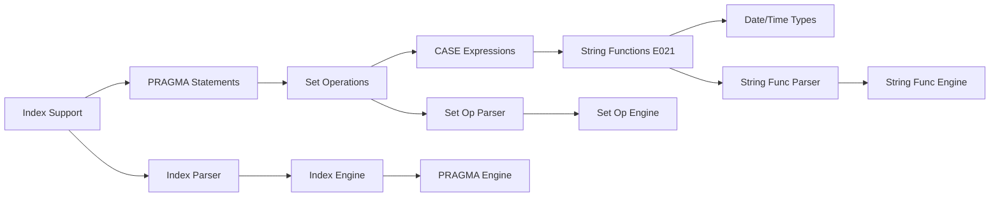

# Plan v0.4.0

## Goal
Implement index support (CREATE INDEX, DROP INDEX), PRAGMA statements, set operations (UNION, EXCEPT, INTERSECT), CASE WHEN expressions, string functions (E021-05, E021-07, E021-08, E021-09, E021-11), and Date/Time types for SQL:1999 Phase 2 compliance.

## Requirements

### HIGH Priority
- CREATE INDEX (from sqlite.reqs.md)
- DROP INDEX (from sqlite.reqs.md)
- Index usage in query planning (from sqlite.reqs.md)
- UNION/EXCEPT/INTERSECT set operations (from sql1999.reqs.md E071)

### MEDIUM Priority
- PRAGMA statements (pragma_table_info, pragma_index_list, pragma_database_list)
- CASE WHEN expressions (from sqlite.reqs.md)
- DISTINCT improvements (from sqlite.reqs.md)
- LIMIT with OFFSET improvements (from sqlite.reqs.md)
- Date/Time types (from sql1999.reqs.md F051)
- Improved subquery support (ALL/ANY, EXISTS improvements)
- E021 Character Functions:
  - E021-05: OCTET_LENGTH function
  - E021-07: Character concatenation (||)
  - E021-08: UPPER and LOWER functions
  - E021-09: TRIM function
  - E021-11: POSITION function

## Implementation DAG



**Notes:**
- Index support builds on existing DS (Data Storage) B-Tree
- Set operations require query engine modifications
- String functions (E021) depend on expression evaluator - can parallel with CASE
- Date/Time types require both storage and expression changes
- Transaction management deferred to future version

## Detailed Design

### 1. Index Support

#### 1.1 CREATE INDEX
- **Parser changes**: Parse CREATE [UNIQUE] INDEX statement
- **Engine changes**: Create new B-Tree for index
- **Files affected**: `internal/QP/parser.go`, `internal/DS/btree.go`

**Implementation:**
```
CREATE [UNIQUE] INDEX [IF NOT EXISTS] index_name ON table_name (column_name [, ...])
```

#### 1.2 DROP INDEX
- **Parser changes**: Parse DROP INDEX statement
- **Engine changes**: Remove index B-Tree from database
- **Files affected**: `internal/QP/parser.go`, `internal/DS/manager.go`

#### 1.3 Index Usage in Queries
- **Goal**: Use indexes for WHERE clause optimization
- **Files affected**: `internal/QP/planner.go`, `internal/QE/engine.go`

**Implementation:**
- Index selection in query planner
- Index scan operator
- Covering index support

### 2. PRAGMA Statements

#### 2.1 pragma_table_info
- **Goal**: Return table column information
- **Syntax**: `PRAGMA table_info(table_name)`
- **Files affected**: `pkg/sqlvibe/database.go`

**Implementation:**
- Parse PRAGMA statement
- Return columns: cid, name, type, notnull, dflt_value, pk

#### 2.2 pragma_index_list
- **Goal**: Return list of indexes for table
- **Syntax**: `PRAGMA index_list(table_name)`
- **Files affected**: `pkg/sqlvibe/database.go`

#### 2.3 pragma_database_list
- **Goal**: Return list of attached databases
- **Syntax**: `PRAGMA database_list`
- **Files affected**: `pkg/sqlvibe/database.go`

### 3. Set Operations (UNION, EXCEPT, INTERSECT)

#### 3.1 UNION
- **Parser changes**: Detect UNION [ALL] between SELECT statements
- **Engine changes**: Implement set union operator
- **Files affected**: `internal/QP/parser.go`, `internal/QE/operators.go`

**Implementation:**
- Parse: `SELECT ... UNION [ALL] SELECT ...`
- Implement union-all (no deduplication)
- Implement union (with deduplication using hash or sort)

#### 3.2 EXCEPT
- **Parser changes**: Detect EXCEPT between SELECT statements
- **Engine changes**: Implement set difference operator
- **Files affected**: `internal/QP/parser.go`, `internal/QE/operators.go`

#### 3.3 INTERSECT
- **Parser changes**: Detect INTERSECT between SELECT statements
- **Engine changes**: Implement set intersection operator
- **Files affected**: `internal/QP/parser.go`, `internal/QE/operators.go`

### 4. CASE WHEN Expressions

#### 4.1 Simple CASE
- **Goal**: `CASE expr WHEN value THEN result ... [ELSE result] END`
- **Parser changes**: Parse CASE expression
- **Engine changes**: Implement case evaluation in expression evaluator
- **Files affected**: `internal/QP/ast.go`, `internal/QE/expr.go`

#### 4.2 Searched CASE
- **Goal**: `CASE WHEN condition THEN result ... [ELSE result] END`
- **Parser changes**: Same as simple CASE
- **Engine changes**: Evaluate each WHEN condition

### 5. String Functions (E021 Character Functions)

#### 5.1 OCTET_LENGTH (E021-05)
- **Goal**: Return length of string in bytes
- **Syntax**: `OCTET_LENGTH(string)`
- **Files affected**: `internal/QP/parser.go`, `internal/QE/expr.go`

#### 5.2 Character Concatenation (E021-07)
- **Goal**: Concatenate strings using || operator
- **Syntax**: `string1 || string2`
- **Files affected**: `internal/QP/parser.go`, `internal/QE/expr.go`

#### 5.3 UPPER and LOWER Functions (E021-08)
- **Goal**: Convert string to upper/lower case
- **Syntax**: `UPPER(string)`, `LOWER(string)`
- **Files affected**: `internal/QP/parser.go`, `internal/QE/expr.go`

#### 5.4 TRIM Function (E021-09)
- **Goal**: Remove leading/trailing whitespace (or specified chars)
- **Syntax**: `TRIM(string)`, `TRIM(LEADING 'x' FROM string)`, `TRIM(TRAILING string)`, `TRIM(BOTH string)`
- **Files affected**: `internal/QP/parser.go`, `internal/QE/expr.go`

#### 5.5 POSITION Function (E021-11)
- **Goal**: Find substring position in string
- **Syntax**: `POSITION(substring IN string)`
- **Files affected**: `internal/QP/parser.go`, `internal/QE/expr.go`

### 6. Date/Time Types (F051)

#### 6.1 DATE Type
- **Goal**: Support DATE column type
- **Files affected**: `internal/QP/parser.go`, `internal/DS/page.go`

#### 6.2 TIME Type
- **Goal**: Support TIME column type
- **Files affected**: `internal/QP/parser.go`, `internal/DS/page.go`

#### 6.3 TIMESTAMP Type
- **Goal**: Support TIMESTAMP column type
- **Files affected**: `internal/QP/parser.go`, `internal/DS/page.go`

#### 6.4 Datetime Functions
- **Goal**: CURRENT_DATE, CURRENT_TIME, CURRENT_TIMESTAMP, LOCALTIME, LOCALTIMESTAMP
- **Files affected**: `internal/QE/expr.go`

## Success Criteria

- [ ] CREATE INDEX creates index B-Tree
- [ ] DROP INDEX removes index
- [ ] Query planner uses indexes for WHERE optimization
- [ ] PRAGMA table_info returns column metadata
- [ ] PRAGMA index_list returns indexes for table
- [ ] PRAGMA database_list returns attached databases
- [ ] UNION returns combined results
- [ ] UNION ALL returns combined results without deduplication
- [ ] EXCEPT returns difference of two result sets
- [ ] INTERSECT returns intersection of two result sets
- [ ] Simple CASE expression works correctly
- [ ] Searched CASE expression works correctly
- [ ] OCTET_LENGTH function returns correct byte length
- [ ] Character concatenation (||) works correctly
- [ ] UPPER function converts to uppercase
- [ ] LOWER function converts to lowercase
- [ ] TRIM function removes leading/trailing characters
- [ ] POSITION function returns substring index
- [ ] DATE type stores dates correctly
- [ ] TIME type stores times correctly
- [ ] TIMESTAMP type stores timestamps correctly
- [ ] Datetime functions (CURRENT_DATE, etc.) work correctly
- [ ] E021-05: OCTET_LENGTH test cases pass
- [ ] E021-07: Character concatenation test cases pass
- [ ] E021-08: UPPER/LOWER test cases pass
- [ ] E021-09: TRIM test cases pass
- [ ] E021-11: POSITION test cases pass

## Notes

- Indexes: Test with `go test -run TestIndex ./pkg/sqlvibe`
- PRAGMA: Test with `go test -run TestPragma ./pkg/sqlvibe`
- Set Operations: Test with `go test -run TestSetOperations ./pkg/sqlvibe`
- CASE: Test with `go test -run TestCaseExpression ./pkg/sqlvibe`
- String Functions: Test with `go test -run TestE021 /internal/TS/SQL1999/E021/...`
- Date/Time: Test with `go test -run TestDateTime ./pkg/sqlvibe`
- Index usage in queries requires planner modifications
- Transaction management deferred to future version
