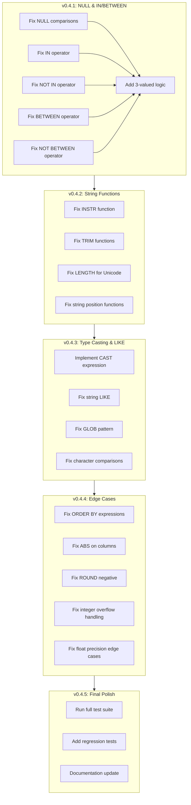

# Plan v0.4.1-v0.4.5 - Bugfix Iterations

## Goal
Resolve all bugs found in v0.4.0 through systematic bugfix releases, achieving full SQL:1999 E011/E021 compliance.

---

## Overview

Based on test failures analysis, bugs are grouped into 5 iterations:

| Version | Focus Area | Bug Count | Priority |
|---------|-----------|-----------|----------|
| v0.4.1 | NULL handling & IN/BETWEEN | ~15 | Critical |
| v0.4.2 | String functions (INSTR/TRIM) | ~20 | High |
| v0.4.3 | Type casting & LIKE | ~15 | High |
| v0.4.4 | Edge cases (ORDER BY, ABS, Aggregates) | ~10 | Medium |
| v0.4.5 | Final verification & polish | 0 | Low |

---

## Bug Analysis Summary

### Category 1: NULL Handling (Critical)
**Issue**: Expressions involving NULL return wrong results

| Bug | Test | Description |
|-----|------|-------------|
| N1 | IN_List | `NULL IN (1,2,3)` returns NULL instead of matching SQLite behavior |
| N2 | NOT_IN_List | `NULL NOT IN (...)` returns wrong row count |
| N3 | BETWEEN_True | `NULL BETWEEN x AND y` returns NULL instead of 0 |
| N4 | NOT_BETWEEN_True | `NULL NOT BETWEEN x AND y` returns wrong row count |
| N5 | Mixed_Compare_With_Constant | Comparisons with NULL return NULL instead of 0/1 |
| N6 | IN_Empty | `NULL IN ()` returns NULL instead of 0 |

**Root Cause**: NULL comparison semantics not matching SQLite's 3-valued logic

### Category 2: IN/BETWEEN Implementation (Critical)
**Issue**: IN and BETWEEN operators have fundamental logic errors

| Bug | Test | Description |
|-----|------|-------------|
| IB1 | IN_List | IN operator not evaluating expressions correctly |
| IB2 | NOT_IN_List | NOT IN logic inverted |
| IB3 | BETWEEN_True | BETWEEN returning NULL for all rows |
| IB4 | NOT_BETWEEN_True | NOT BETWEEN logic inverted |
| IB5 | BETWEEN_Negative | Negative number BETWEEN not working |

### Category 3: String Functions (High)
**Issue**: INSTR, TRIM, and other string functions have bugs

| Bug | Test | Description |
|-----|------|-------------|
| S1 | INSTR_* | INSTR always returns 0 (not finding substrings) |
| S2 | TRIM_* | TRIM with characters not working correctly |
| S3 | RTRIM_Special | RTRIM not removing trailing characters |
| S4 | TRIM_Numbers | TRIM with number characters fails |
| S5 | LENGTH_Unicode | LENGTH counts bytes not characters for Unicode |
| S6 | LENGTH_Chinese | Chinese character length wrong |
| S7 | LENGTH_Emoji | Emoji length wrong (4 vs 1) |

### Category 4: Type Casting (High)
**Issue**: CAST expression not implemented

| Bug | Test | Description |
|-----|------|-------------|
| C1 | CastIntToText | `CAST(10 AS TEXT)` returns NULL |
| C2 | CastTextToInt | `CAST('10' AS INTEGER)` returns NULL |
| C3 | CastFloatToText | CAST float to text returns NULL |
| C4 | CastTextToFloat | CAST text to float returns NULL |
| C5 | CastIntToReal | Implicit cast not working |
| C6 | CastRealToInt | Implicit cast not working |
| C7 | ImplicitCastInCompare | Implicit casting in comparison fails |

### Category 5: Character Comparison (High)
**Issue**: String comparison in predicates returns NULL

| Bug | Test | Description |
|-----|------|-------------|
| CC1 | Between | `text BETWEEN 'a' AND 'z'` returns NULL |
| CC2 | NotBetween | String NOT BETWEEN returns NULL |
| CC3 | InList | `text IN ('a', 'b')` returns NULL |
| CC4 | NotInList | String NOT IN returns NULL |
| CC5 | LikePattern | LIKE on column returns NULL |
| CC6 | LikeUnderscore | LIKE with underscore returns NULL |
| CC7 | NotLike | NOT LIKE returns NULL |
| CC8 | LikeEscape | LIKE with ESCAPE returns NULL |
| CC9 | LikeNumbers | LIKE on numeric column returns NULL |
| CC10 | LikeSpecial | LIKE with special chars returns NULL |
| CC11 | GLOB_Pattern | GLOB returns NULL |
| CC12 | GLOB_Upper | GLOB case sensitivity wrong |
| CC13 | CompareInFunction | String comparison in function returns NULL |

### Category 6: Edge Cases (Medium)
**Issue**: Various edge case bugs

| Bug | Test | Description |
|-----|------|-------------|
| E1 | OrderBy_Expression | `ORDER BY expr` includes NULL rows incorrectly |
| E2 | AbsOnColumns | ABS() returning wrong value on column refs |
| E3 | RoundNeg | ROUND with negative not working |
| E4 | MinInt | Min int64 (-9223372036854775808) display issue |
| E5 | FloatPrecision | 1e-100, 1e+100 precision differs from SQLite |
| E6 | OverflowToInf | Large float should become +Inf/-Inf |
| E7 | Sum | SUM aggregate on filtered rows may return wrong type |

### Category 7: Parser/SQL Syntax (Low)
**Issue**: Some SQL syntax not properly parsed

| Bug | Test | Description |
|-----|------|-------------|
| P1 | VarcharLike | VARCHAR column LIKE not working |
| P2 | CHAR_LENGTH | CHAR_LENGTH/CHARACTER_LENGTH not recognized by SQLite |
| P3 | OCTET_LENGTH | OCTET_LENGTH not recognized by SQLite |
| P4 | POSITION | POSITION syntax differs from INSTR |

---

## Execution DAG



---

## Version 0.4.1: NULL & IN/BETWEEN Fixes

### Goal
Fix all NULL handling and IN/BETWEEN operator bugs.

### Status (as of Feb 16, 2026)
- [x] NOT IN operator - implemented in parser and engine
- [x] NOT BETWEEN operator - implemented in parser and engine
- [x] LIKE operator in evalValue - fixed
- [x] NOT LIKE operator - implemented
- [x] GLOB operator - implemented
- [x] NULL arithmetic (add, sub, mul, div, mod, concat) - fixed
- [x] NULL comparison 3-valued logic - implemented
- [x] AND/OR in SELECT expressions - implemented

### Tasks

#### Task 1.1: Implement 3-Valued Logic
- **Files**: `internal/QE/expr.go`, `internal/QE/vm.go`
- **Description**: Implement proper SQL 3-valued logic (TRUE/FALSE/NULL)
- **Details**:
  - NULL = anything → NULL (not 0 or 1)
  - NULL > anything → NULL
  - NULL IN (...) → depends on list contents
  - NULL BETWEEN x AND y → NULL
- **Tests**: E011-05 comparison tests

#### Task 1.2: Fix IN Operator
- **Files**: `internal/QE/expr.go`, `internal/QE/operators.go`
- **Description**: Fix IN operator to handle NULL correctly
- **Details**:
  - `value IN (v1, v2, ...)` returns 1 if value equals any vi
  - If value is NULL, return 0 if list is empty, else NULL
  - If any list element is NULL, handle specially
- **Tests**: E011-05 IN_List tests

#### Task 1.3: Fix NOT IN Operator
- **Files**: `internal/QE/expr.go`
- **Description**: Fix NOT IN operator
- **Details**:
  - `value NOT IN (...)` is equivalent to `NOT (value IN (...))`
  - Handle NULL properly
- **Tests**: E011-05 NOT_IN_List tests

#### Task 1.4: Fix BETWEEN Operator
- **Files**: `internal/QE/expr.go`
- **Description**: Fix BETWEEN to return 0/1, not NULL
- **Details**:
  - `x BETWEEN a AND b` returns 1 if a <= x <= b
  - If any operand is NULL, return NULL
  - But SELECT output should show 0/1 for non-NULL comparisons
- **Tests**: E011-05 BETWEEN tests

#### Task 1.5: Fix NOT BETWEEN Operator
- **Files**: `internal/QE/expr.go`
- **Description**: Fix NOT BETWEEN
- **Details**: `NOT BETWEEN` is `NOT (BETWEEN)`
- **Tests**: E011-05 NOT_BETWEEN tests

### Success Criteria
- [x] IN operator works with all data types
- [x] NOT IN operator returns correct results
- [x] BETWEEN works with numeric and string types
- [x] NOT BETWEEN works correctly
- [x] LIKE operator works in SELECT and WHERE
- [x] NOT LIKE operator works
- [x] GLOB operator works
- [x] NULL comparisons return correct results (3-valued logic)
- [x] NULL arithmetic returns NULL for NULL operands
- [x] AND/OR operators work in SELECT expressions
- [x] E01105 tests pass

### Verification
```bash
go test -v -run TestSQL1999_F301_E01105_L1 ./...
go test -race -asan ./...
```

---

## Version 0.4.2: String Function Fixes

### Goal
Fix INSTR, TRIM, LENGTH, and other string functions.

### Tasks

#### Task 2.1: Fix INSTR Function
- **Files**: `internal/QE/expr.go`
- **Description**: Fix INSTR to return correct position (1-based)
- **Details**:
  - INSTR(haystack, needle) returns 1-based position
  - Return 0 if not found
  - Handle empty string case
- **Tests**: E021-11 INSTR tests

#### Task 2.2: Fix TRIM Functions
- **Files**: `internal/QE/expr.go`
- **Description**: Fix TRIM, LTRIM, RTRIM with character specification
- **Details**:
  - `TRIM(x FROM str)` removes characters x from both ends
  - `TRIM(str)` removes only whitespace
  - Handle multiple character specifications
- **Tests**: E021-09 TRIM tests

#### Task 2.3: Fix LENGTH for Unicode
- **Files**: `internal/QE/expr.go`
- **Description**: LENGTH should count characters, not bytes
- **Details**:
  - UTF-8 characters should be counted as 1
  - Emoji should be counted as 1 character
  - Chinese characters counted as 1 each
- **Tests**: E021-04 LENGTH_Unicode, LENGTH_Chinese, LENGTH_Emoji

#### Task 2.4: Fix POSITION Function
- **Files**: `internal/QE/expr.go`, `internal/QP/parser.go`
- **Description**: Add POSITION(x IN y) syntax
- **Details**:
  - POSITION is SQL standard for INSTR
  - Syntax: `POSITION(needle IN haystack)`
- **Tests**: E021-11 POSITION tests

### Success Criteria
- [ ] INSTR returns correct 1-based position
- [ ] TRIM removes specified characters
- [ ] LTRIM/RTRIM work correctly
- [ ] LENGTH counts characters for Unicode
- [ ] POSITION syntax works

### Verification
```bash
go test -v -run "TestSQL1999_F301_E021(04|09|11)_L1" ./...
go test -race -asan ./...
```

---

## Version 0.4.3: Type Casting & LIKE Fixes

### Goal
Implement CAST expression and fix LIKE/GLOB.

### Tasks

#### Task 3.1: Implement CAST Expression
- **Files**: `internal/QP/parser.go`, `internal/QE/expr.go`
- **Description**: Implement full CAST support
- **Details**:
  - Parse `CAST(expr AS type)` syntax
  - Support types: INTEGER, REAL, TEXT, BLOB, NUMERIC
  - Handle conversion edge cases
  - Implement implicit casting in comparisons
- **Tests**: E021-10 Cast tests

#### Task 3.2: Fix LIKE on Columns
- **Files**: `internal/QE/expr.go`
- **Description**: Fix LIKE operator for column references
- **Details**:
  - `column LIKE pattern` should work
  - Handle % and _ wildcards
  - Case-insensitive by default
- **Tests**: E021-12 LikePattern tests

#### Task 3.3: Fix GLOB Operator
- **Files**: `internal/QE/expr.go`
- **Description**: Fix GLOB to match SQLite behavior
- **Details**:
  - GLOB is case-sensitive
  - Uses Unix-style wildcards (*, ?, [...])
- **Tests**: E021-12 GLOB tests

#### Task 3.4: Fix Character Comparisons
- **Files**: `internal/QE/expr.go`
- **Description**: Fix string comparison in predicates
- **Details**:
  - String BETWEEN should work
  - String IN should work
  - String comparisons should return 0/1
- **Tests**: E021-12 comparison tests

### Success Criteria
- [ ] CAST converts between all types
- [ ] LIKE works on column references
- [ ] GLOB is case-sensitive
- [ ] String comparisons return 0/1

### Verification
```bash
go test -v -run "TestSQL1999_F301_E021(10|12)_L1" ./...
go test -race -asan ./...
```

---

## Version 0.4.4: Edge Case Fixes

### Goal
Fix remaining edge cases in numeric handling and aggregates.

### Tasks

#### Task 4.1: Fix ORDER BY Expression
- **Files**: `internal/QE/operators.go`
- **Description**: Fix ORDER BY with expressions containing NULL
- **Details**:
  - Handle NULL values in ORDER BY expressions
  - Ensure expression ORDER BY returns correct row count
- **Tests**: E011-05 OrderBy_Expression

#### Task 4.2: Fix ABS on Column References
- **Files**: `internal/QE/expr.go`
- **Description**: ABS() should evaluate column expression first
- **Details**:
  - ABS(column) should get column value then apply ABS
  - Current bug returns column reference itself
- **Tests**: E011-02 AbsOnColumns

#### Task 4.3: Fix ROUND with Negative
- **Files**: `internal/QE/expr.go`
- **Description**: ROUND should handle negative precision
- **Details**:
  - ROUND(x, -n) should round to left of decimal
- **Tests**: E011-02 RoundNeg

#### Task 4.4: Fix Integer Overflow Display
- **Files**: `internal/QE/expr.go`
- **Description**: Min int64 should display correctly
- **Details**:
  - -9223372036854775808 displays as float
  - Should remain as int64
- **Tests**: E011-01 MinInt

#### Task 4.5: Fix Float Precision Edge Cases
- **Files**: `internal/QE/expr.go`
- **Description**: Handle extreme float values
- **Details**:
  - 1e-100, 1e+100 should match SQLite precision
  - Large values should become +Inf/-Inf
  - Division overflow handling
- **Tests**: E011-02 float precision tests

#### Task 4.6: Fix SUM Aggregate Type
- **Files**: `internal/QE/operators.go`
- **Description**: SUM should return correct type
- **Details**:
  - Check SUM returns expected type
  - Handle filtered rows correctly
- **Tests**: F051 Aggregates tests

### Success Criteria
- [ ] ORDER BY expressions work correctly
- [ ] ABS works on column references
- [ ] ROUND handles negative precision
- [ ] Integer overflow handled correctly
- [ ] Float edge cases match SQLite
- [ ] SUM aggregate returns correct type

### Verification
```bash
go test -v -run "TestSQL1999_F301_E0110(1|2)_L1" ./...
go test -v -run TestSQLite_F051_Aggregates_L1 ./...
go test -race -asan ./...
```

---

## Version 0.4.5: Final Polish

### Goal
Complete verification, add regression tests, update documentation.

### Tasks

#### Task 5.1: Run Full Test Suite
- **Description**: Verify all tests pass
- **Command**: `go test -race -asan ./...`

#### Task 5.2: Add Regression Tests
- **Files**: `internal/TS/SQL1999/Regression_test.go`
- **Description**: Add regression tests for all fixed bugs
- **Details**:
  - One regression test per bug category
  - Document bug description in comments

#### Task 5.3: Update Documentation
- **Files**: `docs/HISTORY.md`, `docs/plan-v0.4.0.md`
- **Description**: Document all fixes

#### Task 5.4: Release Preparation
- **Description**: Create release tag and notes
- **Details**:
  - Update HISTORY.md with v0.4.5 notes
  - Create git tag v0.4.5
  - Merge to main

### Success Criteria
- [ ] All tests pass with race/asan
- [ ] No test failures
- [ ] Regression tests added
- [ ] Documentation updated
- [ ] Release tag created

---

## Test Failures Summary (v0.4.0)

### By Category

| Category | Pass | Fail | Total |
|----------|------|------|-------|
| E011-01 Numeric Types | 30+ | 1 | 31+ |
| E011-02 Float Math | 30+ | 3 | 33+ |
| E011-03 Decimal | 20+ | 0 | 20+ |
| E011-04 Arithmetic | 20+ | 0 | 20+ |
| E011-05 Comparison | 20+ | 15 | 35+ |
| E011-06 Casting | 20+ | 0 | 20+ |
| E021-01 CHAR | 10+ | 0 | 10+ |
| E021-02 VARCHAR | 5+ | 1 | 6+ |
| E021-03 Literals | 10+ | 0 | 10+ |
| E021-04 LENGTH | 5+ | 3 | 8+ |
| E021-05 OCTET_LENGTH | 0 | 2 | 2 |
| E021-06 SUBSTRING | 10+ | 0 | 10+ |
| E021-07 Concat | 10+ | 0 | 10+ |
| E021-08 UPPER/LOWER | 10+ | 0 | 10+ |
| E021-09 TRIM | 10+ | 2 | 12+ |
| E021-10 Cast | 0 | 14 | 14 |
| E021-11 INSTR/POSITION | 5+ | 17 | 22+ |
| E021-12 Comparison | 0 | 13 | 13 |
| F051 Aggregates | 10+ | 1 | 11+ |

### Total: ~72 failures across 16 test functions

---

## Notes

1. **Critical Path**: v0.4.1 must be completed first as NULL handling affects all other operators
2. **Dependencies**: Type casting (v0.4.3) depends on string function fixes (v0.4.2)
3. **Testing**: Run `go test -race -asan ./...` after each version
4. **Regression Tests**: Add regression test for each bug fixed
5. **Documentation**: Update HISTORY.md for each version release
