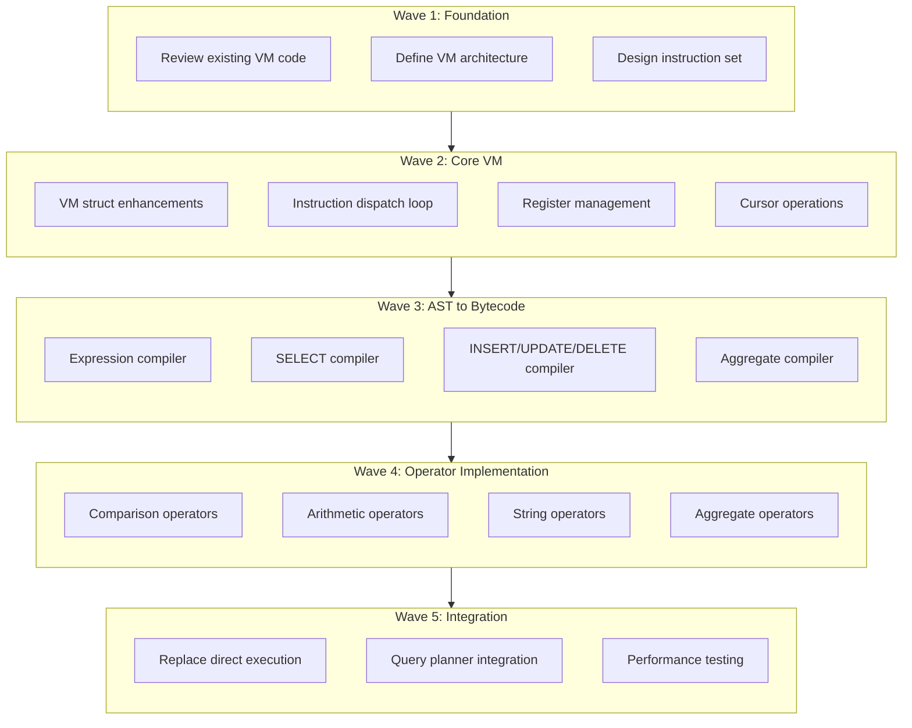

# Plan v0.5.0 - VM Subsystem

## Goal
Introduce VM (Virtual Machine) as a proper VM subsystem to replace direct execution model. This fundamental architectural change will enable:
- Bytecode compilation from AST
- VM-based execution with instruction dispatch
- Cursor-based operations
- Proper register allocation
- Optimizer infrastructure (future)

---

## Current State Analysis

### Existing VM Infrastructure
The codebase already has basic VM infrastructure in `internal/QE/vm.go`:
- `OpCode` enum with 100+ opcodes
- `Instruction` struct with P1, P2, P3, P4 fields
- `VM` struct with registers and PC

### Current Execution Model
Currently uses direct execution:
- Parser → AST → Direct function calls in engine.go
- Expression evaluation via `evalValue()` / `evalExpr()`
- No bytecode compilation
- No virtual register usage

### Problems VM Will Solve
1. **Test failures due to expression evaluation bugs** - Hard to debug expression tree traversal
2. **No bytecode-level optimization** - Cannot do common subexpression elimination
3. **Code complexity** - All logic in engine.go functions
4. **Hard to extend** - New operations require modifying engine.go

---

## Package Structure

### Current Architecture
```
internal/
├── PB/          # Platform Bridges
├── DS/          # Data Storage (B-Tree, Manager)
├── QP/          # Query Processing (Parser, AST, Planner)
└── QE/          # Query Execution (Engine, Expressions)
    └── vm.go    # Existing VM infrastructure (100+ opcodes)
```

### Target Architecture (v0.5.0)
```
internal/
├── PB/          # Platform Bridges (unchanged)
├── DS/          # Data Storage (unchanged)
├── QP/          # Query Processing (unchanged)
└── VM/          # NEW: Virtual Machine Subsystem (replaces QE direct execution)
    ├── cursor.go     # Cursor operations
    ├── compiler.go   # AST to bytecode compiler
    ├── engine.go     # VM engine (replaces QE/engine.go)
    ├── exec.go       # VM execution loop
    ├── opcodes.go    # Opcode definitions (moves from QE/vm.go)
    ├── program.go    # Compiled program representation
    └── registers.go  # Register allocator
```

### Package Responsibilities

| Package | Responsibility |
|---------|----------------|
| `PB` | Platform abstraction layer |
| `DS` | Data storage, B-Tree, page management |
| `QP` | SQL parsing, AST, query planning |
| `VM` | Bytecode compilation, VM execution, cursor management |

### Integration Flow
```
QP (Parser) → AST → VM (Compiler) → Bytecode → VM (Engine) → Results
                     ↓
              DS (Cursors)
```

---

## Execution DAG (Waves)



---

## Wave 1: Foundation (Analysis & Design)

### Task 1.1: Review Existing VM Code
- **Files**: `internal/QE/vm.go`
- **Description**: Analyze existing VM infrastructure
- **Details**:
  - Document all existing OpCodes
  - Identify gaps vs SQLite VM
  - Define what to keep/modify/remove
- **Output**: VM Analysis Document

### Task 1.2: Define VM Architecture
- **Files**: New `internal/VM/`
- **Description**: Design new VM subsystem structure
- **Details**:
  - Create directory structure
  - Define core interfaces
  - Document compilation pipeline
- **New Files**:
  - `internal/VM/opcodes.go` - Opcode definitions (move from QE/vm.go)
  - `internal/VM/program.go` - Program representation
  - `internal/VM/engine.go` - VM engine core
  - `internal/VM/compiler.go` - AST to bytecode
  - `internal/VM/registers.go` - Register allocator
  - `internal/VM/cursor.go` - Cursor operations

### Task 1.3: Design Instruction Set
- **Files**: `internal/VM/opcodes.go`
- **Description**: Define complete instruction set
- **Details**:
  - Review existing opcodes in vm.go
  - Add missing SQLite-style opcodes
  - Define operand semantics (P1, P2, P3, P4)
- **Opcodes to Implement**:
  - Memory: `Op_Move`, `Op_Copy`, `Op_Null`, `Op_LoadConst`
  - Cursor: `Op_OpenRead`, `Op_OpenWrite`, `Op_Close`, `Op_Reset`
  - Data: `Op_Column`, `Op_Rowid`, `Op_Insert`, `Op_Delete`
  - Expression: `Op_Add`, `Op_Subtract`, `Op_Multiply`, `Op_Divide`
  - Compare: `Op_Eq`, `Op_Ne`, `Op_Lt`, `Op_Le`, `Op_Gt`, `Op_Ge`
  - Jump: `Op_Goto`, `Op_Jump`, `Op_If`, `Op_IfNot`
  - Function: `Op_Function`, `Op_AggStep`, `Op_AggFinal`
  - Result: `Op_ResultRow`, `Op_Halt`

---

## Wave 2: Core VM Implementation

### Task 2.1: VM Struct Enhancements
- **Files**: `internal/VM/engine.go`
- **Description**: Enhance VM struct for bytecode execution
- **Details**:
  - Add instruction memory
  - Add program counter
  - Add stack for gosub/return
  - Add context (database, transaction)
- **Methods**:
  - `Run()` - Main execution loop
  - `Step()` - Execute single instruction
  - `Execute()` - Run with breakpoint support

### Task 2.2: Instruction Dispatch Loop
- **Files**: `internal/VM/exec.go`
- **Description**: Implement main VM loop
- **Details**:
  - Switch-based dispatch
  - Case for each opcode
  - Error handling
  - Yield point for long-running queries

### Task 2.3: Register Management
- **Files**: `internal/VM/registers.go`
- **Description**: Implement register allocator
- **Details**:
  - Register allocation strategy
  - Register types (integer, float, string, null)
  - Register vs memory distinction
  - Pseudo-register handling

### Task 2.4: Cursor Operations
- **Files**: `internal/VM/cursor.go`
- **Description**: Implement cursor-based table access
- **Details**:
  - Cursor struct definition
  - Open/close cursors
  - Fetch columns from rows
  - Seek operations

---

## Wave 3: AST to Bytecode Compiler

### Task 3.1: Expression Compiler
- **Files**: `internal/VM/compiler.go`
- **Description**: Compile expressions to bytecode
- **Details**:
  - Literal compilation
  - Column reference compilation
  - Binary expression compilation
  - Unary expression compilation
  - Function call compilation
- **Target**: All expression types in QP AST

### Task 3.2: SELECT Compiler
- **Files**: `internal/VM/compiler.go`
- **Description**: Compile SELECT statements to bytecode
- **Details**:
  - FROM clause (table scan)
  - WHERE clause (filter)
  - SELECT list (projection)
  - ORDER BY
  - GROUP BY / HAVING
  - LIMIT / OFFSET

### Task 3.3: DML Compiler
- **Files**: `internal/VM/compiler.go`
- **Description**: Compile INSERT/UPDATE/DELETE
- **Details**:
  - INSERT: Parse values, emit store instructions
  - UPDATE: Parse set, emit update instructions
  - DELETE: Parse where, emit delete instructions

### Task 3.4: Aggregate Compiler
- **Files**: `internal/VM/compiler.go`
- **Description**: Compile aggregate functions
- **Details**:
  - COUNT, SUM, AVG, MIN, MAX
  - GROUP BY handling
  - AggStep + AggFinal pattern

---

## Wave 4: Operator Implementation

### Task 4.1: Comparison Operators
- **Files**: `internal/VM/exec.go`
- **Description**: Implement comparison opcodes
- **Opcodes**: `Op_Eq`, `Op_Ne`, `Op_Lt`, `Op_Le`, `Op_Gt`, `Op_Ge`, `Op_Is`, `Op_IsNot`

### Task 4.2: Arithmetic Operators
- **Files**: `internal/VM/exec.go`
- **Description**: Implement arithmetic opcodes
- **Opcodes**: `Op_Add`, `Op_Subtract`, `Op_Multiply`, `Op_Divide`, `Op_Remainder`

### Task 4.3: String Operators
- **Files**: `internal/VM/exec.go`
- **Description**: Implement string operation opcodes
- **Opcodes**: `Op_Concat`, `Op_Substr`, `Op_Length`, `Op_UPPER`, `Op_LOWER`, `Op_Trim`

### Task 4.4: Aggregate Operators
- **Files**: `internal/VM/exec.go`
- **Description**: Implement aggregate opcodes
- **Opcodes**: `Op_AggStep`, `Op_AggFinal`, `Op_Count`, `Op_Sum`, `Op_Avg`, `Op_Min`, `Op_Max`

---

## Wave 5: Integration & Testing

### Task 5.1: Replace Direct Execution
- **Files**: `internal/VM/`, `internal/QE/`
- **Description**: Switch query execution to use VM
- **Details**:
  - Modify QE engine to compile + run VM
  - Keep legacy mode for fallback
  - Benchmark comparison

### Task 5.2: Query Planner Integration
- **Files**: `internal/VM/`, `internal/QP/`
- **Description**: Integrate with query planning
- **Details**:
  - Use compiled bytecode for optimization
  - Index usage decisions
  - Join order planning

### Task 5.3: Performance Testing
- **Files**: Test suite
- **Description**: Verify VM correctness and performance
- **Details**:
  - Run all existing tests
  - Benchmark vs direct execution
  - Memory usage analysis

---

## New Directory Structure

```
internal/VM/
├── cursor.go      # Cursor operations
├── compiler.go    # AST to bytecode
├── engine.go      # VM engine core
├── exec.go        # VM execution loop
├── opcodes.go     # Opcode definitions
├── program.go     # Compiled program
└── registers.go  # Register management
```

---

## Integration Points

### With QP (Query Processing)
- Compiler receives QP.SelectStmt, QP.InsertStmt, QP.UpdateStmt, QP.DeleteStmt
- Returns compiled Program

### With DS (Data Storage)
- Cursors read from DS tables
- Index operations via DS interfaces

### With TM (Transaction Monitor)
- Transaction begin/end
- Lock management
- WAL integration

---

## Success Criteria

- [ ] All existing tests pass with VM
- [ ] Bytecode execution matches direct execution
- [ ] Performance not degraded (>80% of direct)
- [ ] Clear compilation pipeline documented
- [ ] Extensible for future optimizations

---

## Verification

```bash
# Run all tests
go test ./...

# Run SQL logic tests
go test ./test/sqllogictest/...

# Benchmark comparison
go test -bench=BenchmarkQuery -benchmem ./...

# Race and memory checks
go test -race -asan ./...
```

---

## Dependencies

- Wave 1 depends on: Current codebase analysis
- Wave 2 depends on: Wave 1 complete
- Wave 3 depends on: Wave 2 complete
- Wave 4 depends on: Wave 2 complete
- Wave 5 depends on: Waves 3 & 4 complete

---

## Risk Assessment

| Risk | Impact | Mitigation |
|------|--------|------------|
| Performance regression | High | Benchmark continuously, keep fallback |
| Complexity explosion | Medium | Incremental implementation, clear interfaces |
| Test failures | Medium | Run tests after each wave |
| Scope creep | Medium | Strict task boundaries |

---

## Timeline Estimate (Waves)

- Wave 1: 1-2 days (Analysis)
- Wave 2: 2-3 days (Core VM)
- Wave 3: 3-4 days (Compiler)
- Wave 4: 2-3 days (Operators)
- Wave 5: 2-3 days (Integration)

**Total: ~10-15 days**
