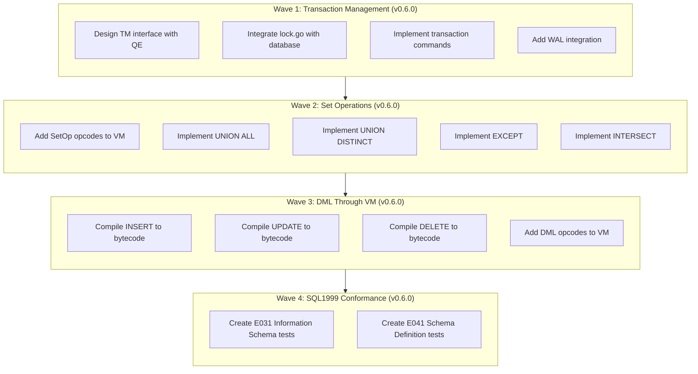

# Plan v0.6.0 - Transaction Management & Complete VM Integration

## Summary
v0.6.0 delivers two major architectural milestones:
1. **Complete Transaction Management (TM)** - ACID transactions with WAL support
2. **Full VM Integration** - All SQL operations (SELECT, DML, SetOps) through VM

Plus comprehensive SQL1999 conformance test coverage.

## Context
- **Previous**: v0.5.1 delivered CG/VFS/BTree with bug fixes
- **Current**: TM partially exists (lock.go, wal.go) but not integrated; SetOps and DML not in VM
- **Goal**: Complete transaction support, full VM coverage, and SQL1999 conformance

## Priority: HIGH
This release enables ACID transactions, completes VM integration, and adds comprehensive SQL1999 conformance tests.

---

## Achievement Status: **IN PROGRESS**

---

## Delivered Components

### Wave 1: Transaction Management (TM) - v0.6.0 - IN PROGRESS

### Wave 2: Set Operations in VM - v0.6.0 - PENDING

### Wave 3: DML Through VM - v0.6.0 - PENDING

### Wave 4: SQL1999 Conformance Tests (E031, E041) - v0.6.0 - PENDING

---

## Package Structure After v0.6.0

```
internal/
├── CG/          # Code Generator (Bytecode Compiler)
├── DS/          # Data Storage (BTree, encoding, etc.)
├── PB/          # Platform Bridges (VFS implementations)
├── SF/          # System Framework (VFS interface, logging)
├── QP/          # Query Processing (Parser, AST)
├── VM/          # Virtual Machine (Complete - SELECT, DML, SetOps)
├── TM/          # Transaction Monitor (Complete - ACID, WAL, Locks)
├── QE/          # Query Execution (Uses VM + TM)
└── TS/
    └── SQL1999/
        ├── E011/  # SQL1999 Basic (existing)
        ├── E021/  # SQL1999 Character string (existing)
        ├── E031/  # SQL1999 Information Schema (NEW - 6 test files)
        └── E041/  # SQL1999 Schema Definition (NEW - 12 test files)
```

---

## Success Criteria

### Wave 1: Transaction Management
- [ ] TM package integrated with QE engine
- [ ] BEGIN/COMMIT/ROLLBACK commands work
- [ ] WAL mode functional (optional, can be deferred)
- [ ] Lock management integrated with database operations

### Wave 2: Set Operations
- [ ] UNION ALL implemented in VM
- [ ] UNION (DISTINCT) implemented in VM
- [ ] EXCEPT implemented in VM
- [ ] INTERSECT implemented in VM

### Wave 3: DML Through VM
- [ ] INSERT through VM compilation
- [ ] UPDATE through VM compilation
- [ ] DELETE through VM compilation

### Wave 4: SQL1999 Conformance Tests
- [ ] E031 Information Schema tests (treated as E011 level)
- [ ] E041 Schema Definition tests (treated as E021 level)
- [ ] All E011 tests pass
- [ ] All E021 tests pass
- [ ] All E031 tests pass
- [ ] All E041 tests pass

---

## Execution DAG (Waves)



---

## Wave 1: Transaction Management (TM) - v0.6.0

### Overview
Complete the Transaction Monitor (TM) subsystem that was started in earlier versions. Integrate existing lock.go and wal.go with the database engine to provide ACID transaction guarantees.

### Task 1.1: Design TM Interface
- **Files**: `internal/TM/transaction.go` (new)
- **Description**: Define transaction interface and integrate with QE
- **Details**:
  - Define `Transaction` interface with Begin, Commit, Rollback
  - Define `TransactionManager` interface
  - Integrate with QE engine: QE should acquire TM before operations
  - Support: DEFERRED, IMMEDIATE, EXCLUSIVE transaction types
- **Reference**: https://www.sqlite.org/lang_transaction.html

### Task 1.2: Integrate Lock Management
- **Files**: `internal/TM/lock.go`, `internal/QE/engine.go`
- **Description**: Connect existing lock.go with database operations
- **Details**:
  - Database operations acquire appropriate locks
  - Shared lock for reads, exclusive for writes
  - Handle lock timeout and busy handling
  - Implement SQLite-compatible locking levels:
    - DEFERRED (default): no lock until needed
    - IMMEDIATE: acquire RESERVED lock at BEGIN
    - EXCLUSIVE: acquire EXCLUSIVE lock at BEGIN

### Task 1.3: Implement Transaction Commands
- **Files**: `internal/TM/transaction.go`, `internal/QP/parser.go`
- **Description**: Implement BEGIN, COMMIT, ROLLBACK
- **Details**:
  - BEGIN: Start transaction, acquire locks based on type
  - COMMIT: Flush WAL (if enabled), release locks
  - ROLLBACK: Undo changes, release locks
  - Support SAVEPOINT and RELEASE SAVEPOINT
  - Auto-rollback on connection close

### Task 1.4: WAL Integration (Optional)
- **Files**: `internal/TM/wal.go`, `internal/TM/checkpoint.go`
- **Description**: Complete WAL implementation
- **Details**:
  - WAL already exists (wal.go) - integrate it
  - Implement WAL checkpoint (manual and auto)
  - Support PRAGMA journal_mode=WAL
  - WAL recovery on crash
- **Note**: Can be deferred to v0.6.1 if time permits

### Task 1.5: Add Transaction Tests
- **Files**: `internal/TM/transaction_test.go`
- **Description**: Comprehensive transaction testing
- **Details**:
  - Test BEGIN/COMMIT/ROLLBACK
  - Test concurrent transactions
  - Test isolation levels
  - Test WAL mode (if implemented)

---

## Wave 2: Set Operations in VM - v0.6.0

### Overview
Implement set operations (UNION, EXCEPT, INTERSECT) in the VM. Currently, these operations use direct execution in database.go. This wave moves them to VM bytecode.

### Task 2.1: Design SetOp Opcodes
- **Files**: `internal/VM/opcodes.go`, `internal/VM/exec.go`
- **Description**: Add opcodes for set operations
- **Details**:
  - Add `OpUnion` - UNION ALL (combine results, keep duplicates)
  - Add `OpUnionDistinct` - UNION (combine, remove duplicates via temporary table)
  - Add `OpExcept` - EXCEPT (left minus right)
  - Add `OpIntersect` - INTERSECT (common rows)
  - Each opcode manages two result sets and produces output

### Task 2.2: Implement UNION ALL
- **Files**: `internal/VM/exec.go`, `internal/CG/compiler.go`
- **Description**: Implement UNION ALL in VM
- **Details**:
  - Compile both SELECTs to separate programs
  - Use `OpUnion` to combine results
  - Results streamed directly to output

### Task 2.3: Implement UNION (DISTINCT)
- **Files**: `internal/VM/exec.go`, `internal/CG/compiler.go`
- **Description**: Implement UNION in VM
- **Details**:
  - Use ephemeral table to track seen rows
  - Insert each row, skip if already exists
  - Return unique rows in order

### Task 2.4: Implement EXCEPT
- **Files**: `internal/VM/exec.go`, `internal/CG/compiler.go`
- **Description**: Implement EXCEPT in VM
- **Details**:
  - Use ephemeral table to track right-side rows
  - Output rows from left that don't exist in right

### Task 2.5: Implement INTERSECT
- **Files**: `internal/VM/exec.go`, `internal/CG/compiler.go`
- **Description**: Implement INTERSECT in VM
- **Details**:
  - Use ephemeral table to track both sides
  - Output rows that exist in both

### Task 2.6: Add SetOp Tests
- **Files**: Test files for set operations
- **Details**:
  - Test UNION ALL with duplicates
  - Test UNION DISTINCT
  - Test EXCEPT behavior
  - Test INTERSECT behavior
  - Compare with SQLite results

---

## Wave 3: DML Through VM - v0.6.0

### Overview
Complete the VM integration by moving DML operations (INSERT, UPDATE, DELETE) from direct execution to VM bytecode compilation.

### Task 3.1: Add DML Opcodes
- **Files**: `internal/VM/opcodes.go`, `internal/VM/exec.go`
- **Description**: Add opcodes for DML
- **Details**:
  - Add `OpInsert` - Insert row into table
  - Add `OpUpdate` - Update rows matching condition
  - Add `OpDelete` - Delete rows matching condition
  - Add `OpEphemeralCreate` - Create ephemeral table for row tracking
  - Add `OpEphemeralInsert` - Insert into ephemeral table
  - Add `OpEphemeralFind` - Check if row exists in ephemeral table
  - Add `OpRowSetAdd` - Add to row set (for DISTINCT)

### Task 3.2: Compile INSERT to Bytecode
- **Files**: `internal/CG/dml.go`
- **Description**: Compile INSERT statements to VM
- **Details**:
  - Parse column list and VALUES
  - Generate OpInsert bytecode
  - Handle DEFAULT values
  - Handle NULL values
  - Support INSERT...SELECT

### Task 3.3: Compile UPDATE to Bytecode
- **Files**: `internal/CG/dml.go`
- **Description**: Compile UPDATE statements to VM
- **Details**:
  - Parse SET clause (column = expression)
  - Parse WHERE clause
  - Generate OpUpdate bytecode with condition check
  - Update affected row count

### Task 3.4: Compile DELETE to Bytecode
- **Files**: `internal/CG/dml.go`
- **Description**: Compile DELETE statements to VM
- **Details**:
  - Parse WHERE clause
  - Generate OpDelete bytecode with condition check
  - Use cursor for table scan + deletion

### Task 3.5: Replace Direct DML Execution
- **Files**: `internal/QE/engine.go`, `pkg/sqlvibe/database.go`
- **Description**: Switch from direct execution to VM
- **Details**:
  - Remove direct DS calls for DML
  - Use CG.CompileInsert/Update/Delete
  - Execute via VM
  - Update result type with changes count

### Task 3.6: Add DML Tests
- **Files**: Test files for DML operations
- **Details**:
  - Test INSERT with various values
  - Test UPDATE with WHERE
  - Test DELETE with WHERE
  - Test INSERT...SELECT
  - Compare with SQLite results

---

## Wave 4: SQL1999 Conformance Tests - v0.6.0

### Overview
Add comprehensive SQL1999 conformance tests for E031 (Information Schema) and E041 (Schema Definition and Manipulation) families. These tests verify SQLite compatibility for metadata queries and schema operations.

**IMPORTANT**: All tests must follow the exact same structure as existing E011/E021 tests:
- Test files: `NN_test.go` (e.g., `01_test.go`, `02_test.go`)
- Test function: `TestSQL1999_F301_EXXXNN_L1`
- Use `:memory:` for both sqlvibe and sqlite paths
- Use helper functions: `SQL1999.CompareQueryResults`, `SQL1999.CompareExecResults`
- Import: `"github.com/sqlvibe/sqlvibe/internal/TS/SQL1999"`

### Task 4.1: Create E031 Test Directory and Structure
- **Files**: `internal/TS/SQL1999/E031/` (new)
- **Description**: Create Information Schema test directory following E011/E021 pattern
- **Details**:
  - Create directory structure: `internal/TS/SQL1999/E031/`
  - Test files: `01_test.go`, `02_test.go`, etc.
  - Use same package: `package E031`
  - Use same imports as E011/E021

### Task 4.2: Implement Information Schema Tests (E031)
- **Files**: `internal/TS/SQL1999/E031/` tests
- **Description**: Implement comprehensive Information Schema tests following E011/E021 pattern
- **Test File Structure Example**:
```go
package E031

import (
    "database/sql"
    "testing"

    "github.com/sqlvibe/sqlvibe/internal/TS/SQL1999"
    "github.com/sqlvibe/sqlvibe/pkg/sqlvibe"
)

func TestSQL1999_F301_E03101_L1(t *testing.T) {
    sqlvibePath := ":memory:"
    sqlitePath := ":memory:"

    sqlvibeDB, err := sqlvibe.Open(sqlvibePath)
    if err != nil {
        t.Fatalf("Failed to open sqlvibe: %v", err)
    }
    defer sqlvibeDB.Close()

    sqliteDB, err := sql.Open("sqlite", sqlitePath)
    if err != nil {
        t.Fatalf("Failed to open sqlite: %v", err)
    }
    defer sqliteDB.Close()

    // Test cases using SQL1999.CompareExecResults and SQL1999.CompareQueryResults
}
```

#### 4.2.1: E031-01 - Information Schema Tables View
- **Test**: `TestSQL1999_F301_E03101_L1`
- **File**: `01_test.go`
- **Tests**:
  - Query `information_schema.tables`
  - Filter by table_schema = 'main'
  - Compare results with SQLite

#### 4.2.2: E031-02 - Information Schema Columns View
- **Test**: `TestSQL1999_F301_E03102_L1`
- **File**: `02_test.go`
- **Tests**:
  - Query `information_schema.columns`
  - Filter by table_name
  - Check column_name, data_type, is_nullable

#### 4.2.3: E031-03 - Information Schema Views View
- **Test**: `TestSQL1999_F301_E03103_L1`
- **File**: `03_test.go`
- **Tests**:
  - Query `information_schema.views`
  - CREATE VIEW then query metadata

#### 4.2.4: E031-04 - Information Schema Table Constraints
- **Test**: `TestSQL1999_F301_E03104_L1`
- **File**: `04_test.go`
- **Tests**:
  - Query `information_schema.table_constraints`
  - PRIMARY KEY, UNIQUE, CHECK, FOREIGN KEY

#### 4.2.5: E031-05 - Information Schema Key Column Usage
- **Test**: `TestSQL1999_F301_E03105_L1`
- **File**: `05_test.go`
- **Tests**:
  - Query `information_schema.key_column_usage`
  - PRIMARY KEY and FOREIGN KEY columns

#### 4.2.6: E031-06 - Information Schema Referential Constraints
- **Test**: `TestSQL1999_F301_E03106_L1`
- **File**: `06_test.go`
- **Tests**:
  - Query `information_schema.referential_constraints`
  - Foreign key relationships

### Task 4.3: Create E041 Test Directory and Structure
- **Files**: `internal/TS/SQL1999/E041/` (new)
- **Description**: Create Schema Definition test directory following E011/E021 pattern
- **Details**:
  - Create directory: `internal/TS/SQL1999/E041/`
  - Test files: `01_test.go`, `02_test.go`, etc.
  - Use same package: `package E041`
  - Use same imports and helpers as E011/E021

### Task 4.4: Implement Schema Definition Tests (E041)
- **Files**: `internal/TS/SQL1999/E041/` tests
- **Description**: Implement comprehensive Schema Definition tests following E011/E021 pattern

#### 4.4.1: E041-01 - CREATE TABLE Basic
- **Test**: `TestSQL1999_F301_E04101_L1`
- **File**: `01_test.go`
- **Tests**:
  - Simple CREATE TABLE
  - Multiple column types

#### 4.4.2: E041-02 - CREATE TABLE with Constraints
- **Test**: `TestSQL1999_F301_E04102_L1`
- **File**: `02_test.go`
- **Tests**:
  - NOT NULL constraints
  - UNIQUE constraints
  - DEFAULT values

#### 4.4.3: E041-03 - PRIMARY KEY
- **Test**: `TestSQL1999_F301_E04103_L1`
- **File**: `03_test.go`
- **Tests**:
  - PRIMARY KEY on single column
  - PRIMARY KEY on multiple columns (composite)

#### 4.4.4: E041-04 - FOREIGN KEY
- **Test**: `TestSQL1999_F301_E04104_L1`
- **File**: `04_test.go`
- **Tests**:
  - Basic FOREIGN KEY
  - REFERENCES with ON DELETE/UPDATE

#### 4.4.5: E041-05 - CHECK Constraints
- **Test**: `TestSQL1999_F301_E04105_L1`
- **File**: `05_test.go`
- **Tests**:
  - CHECK constraint validation

#### 4.4.6: E041-06 - ALTER TABLE
- **Test**: `TestSQL1999_F301_E04106_L1`
- **File**: `06_test.go`
- **Tests**:
  - ADD COLUMN
  - RENAME TO

#### 4.4.7: E041-07 - DROP TABLE
- **Test**: `TestSQL1999_F301_E04107_L1`
- **File**: `07_test.go`
- **Tests**:
  - DROP TABLE
  - DROP TABLE IF EXISTS
  - DROP TABLE with CASCADE/RESTRICT

#### 4.4.8: E041-08 - CREATE INDEX
- **Test**: `TestSQL1999_F301_E04108_L1`
- **File**: `08_test.go`
- **Tests**:
  - Simple CREATE INDEX
  - UNIQUE index
  - Composite index
  - CREATE INDEX IF NOT EXISTS

#### 4.4.9: E041-09 - DROP INDEX
- **Test**: `TestSQL1999_F301_E04109_L1`
- **File**: `09_test.go`
- **Tests**:
  - DROP INDEX
  - DROP INDEX IF EXISTS

#### 4.4.10: E041-10 - CREATE VIEW
- **Test**: `TestSQL1999_F301_E04110_L1`
- **File**: `10_test.go`
- **Tests**:
  - Simple CREATE VIEW
  - CREATE VIEW IF NOT EXISTS

#### 4.4.11: E041-11 - DROP VIEW
- **Test**: `TestSQL1999_F301_E04111_L1`
- **File**: `11_test.go`
- **Tests**:
  - DROP VIEW
  - DROP VIEW IF EXISTS

#### 4.4.12: E041-12 - CREATE TABLE AS SELECT
- **Test**: `TestSQL1999_F301_E04112_L1`
- **File**: `12_test.go`
- **Tests**:
  - CREATE TABLE AS SELECT
  - Verify schema from SELECT

### Task 4.5: Run and Verify All SQL1999 Tests
- **Command**: `go test ./internal/TS/SQL1999/...`
- **Verify**:
  - All E011 tests pass
  - All E021 tests pass
  - All E031 tests pass (similar pass rate to E011/E021)
  - All E041 tests pass (similar pass rate to E011/E021)

---

## Integration Points

### With TM (Transaction Monitor)
- QE engine creates transaction before operations
- Transaction manages locks on database
- Commit/Rollback calls WAL if enabled

### With CG (Code Generator)
- CG now compiles: SELECT, INSERT, UPDATE, DELETE, SetOps
- All statements produce VM bytecode
- CG returns Program to VM for execution

### With VM (Virtual Machine)
- VM executes all SQL operations
- VM manages cursors for table access
- VM reports changes count for DML

### With DS (Data Storage)
- VM cursors read/write to DS BTree
- DS operations are transactional
- DS provides row-level operations

---

## Verification

```bash
# Run all tests
go test ./...

# Run TM tests
go test ./internal/TM/...

# Run VM tests
go test ./internal/VM/...

# Run SQL1999 tests (all conformance)
go test ./internal/TS/SQL1999/...

# Run specific E031 tests
go test ./internal/TS/SQL1999/E031/...

# Run specific E041 tests
go test ./internal/TS/SQL1999/E041/...

# Transaction tests
go test ./... -run "TestTransaction"

# Set operation tests
go test ./... -run "TestSetOp"

# DML tests
go test ./... -run "TestDML"

# Schema tests
go test ./... -run "TestSchema"
```

---

## Timeline Estimate

### Wave 1: Transaction Management
- Task 1.1: Design TM interface - 2 hours
- Task 1.2: Integrate lock management - 3 hours
- Task 1.3: Implement transaction commands - 4 hours
- Task 1.4: WAL integration (optional) - 4 hours
- Task 1.5: Add transaction tests - 2 hours

**Subtotal**: ~15 hours (or ~11 hours if WAL deferred)

### Wave 2: Set Operations
- Task 2.1: Design SetOp opcodes - 2 hours
- Task 2.2: Implement UNION ALL - 2 hours
- Task 2.3: Implement UNION DISTINCT - 3 hours
- Task 2.4: Implement EXCEPT - 2 hours
- Task 2.5: Implement INTERSECT - 2 hours
- Task 2.6: Add SetOp tests - 2 hours

**Subtotal**: ~13 hours

### Wave 3: DML Through VM
- Task 3.1: Add DML opcodes - 3 hours
- Task 3.2: Compile INSERT to bytecode - 3 hours
- Task 3.3: Compile UPDATE to bytecode - 3 hours
- Task 3.4: Compile DELETE to bytecode - 2 hours
- Task 3.5: Replace direct DML - 2 hours
- Task 3.6: Add DML tests - 2 hours

**Subtotal**: ~15 hours

### Wave 4: SQL1999 Conformance Tests
- Task 4.1: Create E031 directory - 1 hour
- Task 4.2: Implement Information Schema tests (6 tests) - 4 hours
- Task 4.3: Create E041 directory - 1 hour
- Task 4.4: Implement Schema Definition tests (12 tests) - 6 hours
- Task 4.5: Run and verify tests - 1 hour

**Subtotal**: ~13 hours

**Total**: ~56 hours (~52 hours if WAL deferred)

---

## Dependencies

- Wave 1 (TM) depends on: v0.5.1 complete (TM exists but not integrated)
- Wave 2 (SetOps) depends on: Wave 1 complete
- Wave 3 (DML) depends on: Wave 1 complete
- Wave 4 (Conformance Tests) depends on: Waves 1-3 complete (features must exist to test)

**Critical Path**: Wave 1 → Wave 2 → Wave 3 → Wave 4

---

## Risk Assessment

| Risk | Impact | Mitigation |
|------|--------|------------|
| Transaction integration complexity | High | Incremental integration, test each step |
| Lock contention | Medium | Test concurrent access, use SQLite patterns |
| WAL edge cases | Medium | Defer to v0.6.1 if complex |
| DML VM performance | Low | Benchmark vs direct execution |
| Conformance test coverage | Medium | Add comprehensive test cases |
| Schema tests edge cases | Medium | Test all constraint types |

---

## Notes

1. **Post-v0.6.0**: The database will have full ACID transaction support, complete VM coverage, and comprehensive SQL1999 conformance
2. **SetOps Order**: UNION ALL first (simplest), then UNION DISTINCT, EXCEPT, INTERSECT
3. **DML Order**: INSERT first (simplest), then UPDATE, then DELETE
4. **WAL is Optional**: Can defer to v0.6.1 if timeline is tight
5. **All operations through VM**: After this release, no direct execution paths should remain
6. **Conformance Tests**: E031 (Information Schema) and E041 (Schema Definition) follow the same pattern as E011/E021

---

## Success Criteria Summary

### Transaction Management
- [ ] Transaction management (BEGIN/COMMIT/ROLLBACK) works
- [ ] Lock management integrated with database operations

### Set Operations
- [ ] UNION ALL implemented in VM
- [ ] UNION DISTINCT implemented in VM
- [ ] EXCEPT implemented in VM
- [ ] INTERSECT implemented in VM

### DML Through VM
- [ ] INSERT through VM
- [ ] UPDATE through VM
- [ ] DELETE through VM

### SQL1999 Conformance Tests
- [ ] E011 tests pass (existing)
- [ ] E021 tests pass (existing)
- [ ] E031-01: Information Schema Tables - TestSQL1999_F301_E03101_L1
- [ ] E031-02: Information Schema Columns - TestSQL1999_F301_E03102_L1
- [ ] E031-03: Information Schema Views - TestSQL1999_F301_E03103_L1
- [ ] E031-04: Information Schema Constraints - TestSQL1999_F301_E03104_L1
- [ ] E031-05: Key Column Usage - TestSQL1999_F301_E03105_L1
- [ ] E031-06: Referential Constraints - TestSQL1999_F301_E03106_L1
- [ ] E041-01: CREATE TABLE Basic - TestSQL1999_F301_E04101_L1
- [ ] E041-02: CREATE TABLE Constraints - TestSQL1999_F301_E04102_L1
- [ ] E041-03: PRIMARY KEY - TestSQL1999_F301_E04103_L1
- [ ] E041-04: FOREIGN KEY - TestSQL1999_F301_E04104_L1
- [ ] E041-05: CHECK Constraints - TestSQL1999_F301_E04105_L1
- [ ] E041-06: ALTER TABLE - TestSQL1999_F301_E04106_L1
- [ ] E041-07: DROP TABLE - TestSQL1999_F301_E04107_L1
- [ ] E041-08: CREATE INDEX - TestSQL1999_F301_E04108_L1
- [ ] E041-09: DROP INDEX - TestSQL1999_F301_E04109_L1
- [ ] E041-10: CREATE VIEW - TestSQL1999_F301_E04110_L1
- [ ] E041-11: DROP VIEW - TestSQL1999_F301_E04111_L1
- [ ] E041-12: CREATE TABLE AS SELECT - TestSQL1999_F301_E04112_L1
- [ ] All existing tests still pass

### Overall
- [ ] All new tests pass
- [ ] SQLite comparison tests pass
- [ ] No regressions in existing functionality
