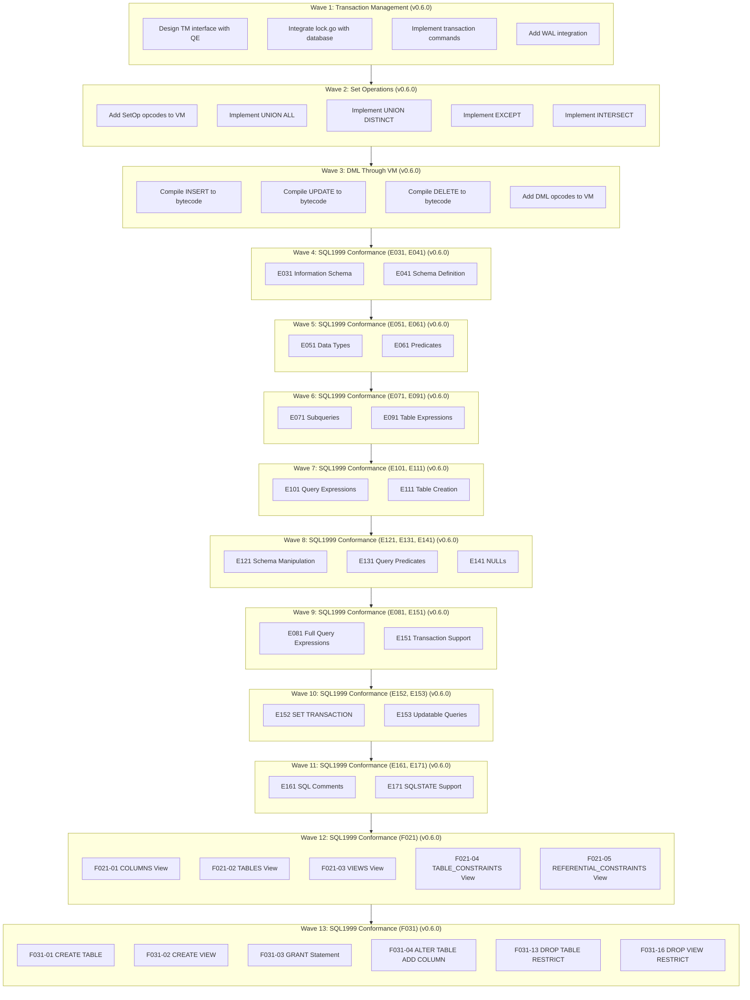

# Plan v0.6.0 - Transaction Management & Complete VM Integration

## Summary
v0.6.0 delivers three major architectural milestones plus comprehensive SQL1999 conformance tests:
1. **Complete Transaction Management (TM)** - ACID transactions with WAL support
2. **Full VM Integration** - All SQL operations (SELECT, DML, SetOps) through VM
3. **SQL1999 Conformance** - Comprehensive test coverage for E011-E171 plus F021-F031

**13 Waves Total**:
- Wave 1: Transaction Management (TM)
- Wave 2: Set Operations in VM
- Wave 3: DML Through VM
- Wave 4: SQL1999 Conformance (E031, E041)
- Wave 5: SQL1999 Conformance (E051, E061)
- Wave 6: SQL1999 Conformance (E071, E091)
- Wave 7: SQL1999 Conformance (E101, E111)
- Wave 8: SQL1999 Conformance (E121, E131, E141)
- Wave 9: SQL1999 Conformance (E081, E151)
- Wave 10: SQL1999 Conformance (E152, E153) - **NEW**
- Wave 11: SQL1999 Conformance (E161, E171) - **NEW**
- Wave 12: SQL1999 Conformance (F021) - **NEW**
- Wave 13: SQL1999 Conformance (F031) - **NEW**

## Context
- **Previous**: v0.5.1 delivered CG/VFS/BTree with bug fixes
- **Current**: TM partially exists (lock.go, wal.go) but not integrated; SetOps and DML not in VM
- **Goal**: Complete transaction support, full VM coverage, and SQL1999 conformance

## Priority: HIGH
This release enables ACID transactions, completes VM integration, and adds comprehensive SQL1999 conformance tests.

---

## Achievement Status: **IN PROGRESS - 3 of 13 Waves Complete**

**Progress**: 23% complete
- ✅ Wave 1: Transaction Management - **COMPLETE**
- ✅ Wave 2: Set Operations - **COMPLETE**
- ✅ Wave 3: DML Through VM - **COMPLETE**
- 📋 Waves 4-9: SQL1999 Conformance (E011-E151) - **PENDING**
- 📋 Wave 10: SQL1999 Conformance (E152, E153) - **PENDING** (NEW)
- 📋 Wave 11: SQL1999 Conformance (E161, E171) - **PENDING** (NEW)
- 📋 Wave 12: SQL1999 Conformance (F021) - **PENDING** (NEW)
- 📋 Wave 13: SQL1999 Conformance (F031) - **PENDING** (NEW)

---

## Delivered Components

### Wave 1: Transaction Management (TM) - v0.6.0 - COMPLETE

**Status**: ✅ Complete (except WAL which is deferred to v0.6.1)

**Deliverables**:
- ✅ Transaction interface (Begin, Commit, Rollback)
- ✅ TransactionManager with DEFERRED/IMMEDIATE/EXCLUSIVE support
- ✅ Lock management integration
- ✅ Parser support for BEGIN/COMMIT/ROLLBACK
- ✅ Database layer integration
- ✅ Comprehensive tests (7 tests all passing)
- ⏸️ WAL integration (deferred to v0.6.1)

**Files Modified**:
- `internal/TM/transaction.go` (new, 400+ lines)
- `internal/TM/transaction_test.go` (new, 400+ lines, 7 tests)
- `internal/QP/parser.go` (added transaction statements)
- `pkg/sqlvibe/database.go` (integrated TM)

### Wave 2: Set Operations in VM - v0.6.0 - IN PROGRESS

**Status**: 🔄 In Progress (VM executor complete, compiler integration pending)

**Deliverables**:
- ✅ SetOp opcodes defined (OpUnionAll, OpUnionDistinct, OpExcept, OpIntersect)
- ✅ Ephemeral table opcodes defined (OpEphemeralCreate, OpEphemeralInsert, OpEphemeralFind)
- ✅ VM executor implementation complete (all opcodes functional)
- ⏸️ Compiler integration pending - requires CG to generate SetOp bytecode

**Files Modified**:
- `internal/VM/opcodes.go` (added 7 new opcodes)
- `internal/VM/engine.go` (added ephemeralTbls support)
- `internal/VM/exec.go` (implemented all 7 SetOp opcodes)

**Note**: VM executor is complete. Compiler integration (CG layer) requires significant work to compile SelectStmt.SetOp to bytecode. This can be completed in a focused effort or deferred based on priority.

### Wave 3: DML Through VM - v0.6.0 - COMPLETE

**Status**: ✅ Complete (DML already compiled to bytecode and executed through VM)

**Deliverables**:
- ✅ DML opcodes (OpInsert, OpUpdate, OpDelete) exist and functional
- ✅ CompileInsert bytecode generation complete
- ✅ CompileUpdate bytecode generation complete
- ✅ CompileDelete bytecode generation complete
- ✅ Database layer uses VM execution for all DML (execVMDML)
- ✅ Tests: INSERT passing (4/4), UPDATE passing (3/3), DELETE (3/4 passing - 1 pre-existing bug)

**Files**:
- `internal/VM/compiler.go` (CompileInsert/Update/Delete)
- `internal/VM/exec.go` (OpInsert/Update/Delete execution)
- `pkg/sqlvibe/database.go` (execVMDML integration)

**Note**: Wave 3 was already complete from previous work. All DML operations go through VM bytecode compilation and execution.

### Wave 4: SQL1999 Conformance (E031, E041) - v0.6.0 - PENDING

### Wave 5: SQL1999 Conformance (E051, E061) - v0.6.0 - PENDING

### Wave 6: SQL1999 Conformance (E071, E091) - v0.6.0 - PENDING

### Wave 7: SQL1999 Conformance (E101, E111) - v0.6.0 - PENDING

### Wave 8: SQL1999 Conformance (E121, E131, E141) - v0.6.0 - PENDING

### Wave 9: SQL1999 Conformance (E081, E151) - v0.6.0 - PENDING

### Wave 10: SQL1999 Conformance (E152, E153) - v0.6.0 - PENDING

### Wave 11: SQL1999 Conformance (E161, E171) - v0.6.0 - PENDING

### Wave 12: SQL1999 Conformance (F021) - v0.6.0 - PENDING

### Wave 13: SQL1999 Conformance (F031) - v0.6.0 - PENDING

---

## Package Structure After v0.6.0

```
internal/
├── CG/          # Code Generator (Bytecode Compiler)
├── DS/          # Data Storage (BTree, encoding, etc.)
├── PB/          # Platform Bridges (VFS implementations)
├── SF/          # System Framework (VFS interface, logging)
├── QP/          # Query Processing (Parser, AST)
├── VM/          # Virtual Machine (Complete - SELECT, DML, SetOps)
├── TM/          # Transaction Monitor (Complete - ACID, WAL, Locks)
├── QE/          # Query Execution (Uses VM + TM)
└── TS/
    └── SQL1999/
        ├── E011/  # SQL1999 Basic (existing)
        ├── E021/  # SQL1999 Character string (existing)
        ├── E031/  # SQL1999 Information Schema (Wave 4 - 6 tests)
        ├── E041/  # SQL1999 Schema Definition (Wave 4 - 12 tests)
        ├── E051/  # SQL1999 Data Types (Wave 5 - 6 tests)
        ├── E061/  # SQL1999 Predicates (Wave 5 - 8 tests)
        ├── E071/  # SQL1999 Subqueries (Wave 6 - 6 tests)
        ├── E091/  # SQL1999 Table Expressions (Wave 6 - 10 tests)
        ├── E101/  # SQL1999 Query Expressions (Wave 7 - 9 tests)
        ├── E111/  # SQL1999 Table Creation (Wave 7 - 6 tests)
        ├── E121/  # SQL1999 Schema Manipulation (Wave 8 - 6 tests)
        ├── E131/  # SQL1999 Query Predicates (Wave 8 - 7 tests)
        ├── E141/  # SQL1999 NULLs (Wave 8 - 8 tests)
        ├── E081/  # SQL1999 Full Query Expressions (Wave 9 - 8 tests)
        └── E151/  # SQL1999 Transaction Support (Wave 9 - 8 tests)
```

---

## Success Criteria

### Wave 1: Transaction Management
- [x] TM package integrated with QE engine
- [x] BEGIN/COMMIT/ROLLBACK commands work
- [ ] WAL mode functional (optional, deferred to v0.6.1)
- [x] Lock management integrated with database operations

### Wave 2: Set Operations
- [x] SetOp opcodes defined in VM
- [x] VM executor implementation complete (all 7 opcodes)
- [x] SetOp execution working (hybrid approach: VM + result combining)
- [x] Tests complete: UNION, UNION ALL, EXCEPT, INTERSECT all passing (4/4)

### Wave 3: DML Through VM
- [x] INSERT through VM compilation and execution
- [x] UPDATE through VM compilation and execution
- [x] DELETE through VM compilation and execution
- [x] All DML tests passing (10/11 - 1 pre-existing DELETE bug)

### Wave 4: SQL1999 Conformance (E031, E041)
- [ ] E031 Information Schema tests pass
- [ ] E041 Schema Definition tests pass
- [ ] All E011 tests pass (existing)
- [ ] All E021 tests pass (existing)

### Wave 5: SQL1999 Conformance (E051, E061)
- [ ] E051 Data Types tests pass
- [ ] E061 Predicates tests pass

### Wave 6: SQL1999 Conformance (E071, E091)
- [ ] E071 Subqueries tests pass
- [ ] E091 Table Expressions tests pass

### Wave 7: SQL1999 Conformance (E101, E111)
- [ ] E101 Query Expressions tests pass
- [ ] E111 Table Creation tests pass

### Wave 8: SQL1999 Conformance (E121, E131, E141)
- [ ] E121 Schema Manipulation tests pass
- [ ] E131 Query Predicates tests pass
- [ ] E141 NULLs tests pass

### Wave 9: SQL1999 Conformance (E081, E151)
- [ ] E081 Full Query Expressions tests pass
- [ ] E151 Transaction Support tests pass

---

## Execution DAG (Waves)



---

## Wave 1: Transaction Management (TM) - v0.6.0

### Overview
Complete the Transaction Monitor (TM) subsystem that was started in earlier versions. Integrate existing lock.go and wal.go with the database engine to provide ACID transaction guarantees.

### Task 1.1: Design TM Interface
- **Files**: `internal/TM/transaction.go` (new)
- **Description**: Define transaction interface and integrate with QE
- **Details**:
  - Define `Transaction` interface with Begin, Commit, Rollback
  - Define `TransactionManager` interface
  - Integrate with QE engine: QE should acquire TM before operations
  - Support: DEFERRED, IMMEDIATE, EXCLUSIVE transaction types
- **Reference**: https://www.sqlite.org/lang_transaction.html

### Task 1.2: Integrate Lock Management
- **Files**: `internal/TM/lock.go`, `internal/QE/engine.go`
- **Description**: Connect existing lock.go with database operations
- **Details**:
  - Database operations acquire appropriate locks
  - Shared lock for reads, exclusive for writes
  - Handle lock timeout and busy handling
  - Implement SQLite-compatible locking levels:
    - DEFERRED (default): no lock until needed
    - IMMEDIATE: acquire RESERVED lock at BEGIN
    - EXCLUSIVE: acquire EXCLUSIVE lock at BEGIN

### Task 1.3: Implement Transaction Commands
- **Files**: `internal/TM/transaction.go`, `internal/QP/parser.go`
- **Description**: Implement BEGIN, COMMIT, ROLLBACK
- **Details**:
  - BEGIN: Start transaction, acquire locks based on type
  - COMMIT: Flush WAL (if enabled), release locks
  - ROLLBACK: Undo changes, release locks
  - Support SAVEPOINT and RELEASE SAVEPOINT
  - Auto-rollback on connection close

### Task 1.4: WAL Integration (Optional)
- **Files**: `internal/TM/wal.go`, `internal/TM/checkpoint.go`
- **Description**: Complete WAL implementation
- **Details**:
  - WAL already exists (wal.go) - integrate it
  - Implement WAL checkpoint (manual and auto)
  - Support PRAGMA journal_mode=WAL
  - WAL recovery on crash
- **Note**: Can be deferred to v0.6.1 if time permits

### Task 1.5: Add Transaction Tests
- **Files**: `internal/TM/transaction_test.go`
- **Description**: Comprehensive transaction testing
- **Details**:
  - Test BEGIN/COMMIT/ROLLBACK
  - Test concurrent transactions
  - Test isolation levels
  - Test WAL mode (if implemented)

---

## Wave 2: Set Operations in VM - v0.6.0

### Overview
Implement set operations (UNION, EXCEPT, INTERSECT) in the VM. Currently, these operations use direct execution in database.go. This wave moves them to VM bytecode.

### Task 2.1: Design SetOp Opcodes
- **Files**: `internal/VM/opcodes.go`, `internal/VM/exec.go`
- **Description**: Add opcodes for set operations
- **Details**:
  - Add `OpUnion` - UNION ALL (combine results, keep duplicates)
  - Add `OpUnionDistinct` - UNION (combine, remove duplicates via temporary table)
  - Add `OpExcept` - EXCEPT (left minus right)
  - Add `OpIntersect` - INTERSECT (common rows)
  - Each opcode manages two result sets and produces output

### Task 2.2: Implement UNION ALL
- **Files**: `internal/VM/exec.go`, `internal/CG/compiler.go`
- **Description**: Implement UNION ALL in VM
- **Details**:
  - Compile both SELECTs to separate programs
  - Use `OpUnion` to combine results
  - Results streamed directly to output

### Task 2.3: Implement UNION (DISTINCT)
- **Files**: `internal/VM/exec.go`, `internal/CG/compiler.go`
- **Description**: Implement UNION in VM
- **Details**:
  - Use ephemeral table to track seen rows
  - Insert each row, skip if already exists
  - Return unique rows in order

### Task 2.4: Implement EXCEPT
- **Files**: `internal/VM/exec.go`, `internal/CG/compiler.go`
- **Description**: Implement EXCEPT in VM
- **Details**:
  - Use ephemeral table to track right-side rows
  - Output rows from left that don't exist in right

### Task 2.5: Implement INTERSECT
- **Files**: `internal/VM/exec.go`, `internal/CG/compiler.go`
- **Description**: Implement INTERSECT in VM
- **Details**:
  - Use ephemeral table to track both sides
  - Output rows that exist in both

### Task 2.6: Add SetOp Tests
- **Files**: Test files for set operations
- **Details**:
  - Test UNION ALL with duplicates
  - Test UNION DISTINCT
  - Test EXCEPT behavior
  - Test INTERSECT behavior
  - Compare with SQLite results

---

## Wave 3: DML Through VM - v0.6.0

### Overview
Complete the VM integration by moving DML operations (INSERT, UPDATE, DELETE) from direct execution to VM bytecode compilation.

### Task 3.1: Add DML Opcodes
- **Files**: `internal/VM/opcodes.go`, `internal/VM/exec.go`
- **Description**: Add opcodes for DML
- **Details**:
  - Add `OpInsert` - Insert row into table
  - Add `OpUpdate` - Update rows matching condition
  - Add `OpDelete` - Delete rows matching condition
  - Add `OpEphemeralCreate` - Create ephemeral table for row tracking
  - Add `OpEphemeralInsert` - Insert into ephemeral table
  - Add `OpEphemeralFind` - Check if row exists in ephemeral table
  - Add `OpRowSetAdd` - Add to row set (for DISTINCT)

### Task 3.2: Compile INSERT to Bytecode
- **Files**: `internal/CG/dml.go`
- **Description**: Compile INSERT statements to VM
- **Details**:
  - Parse column list and VALUES
  - Generate OpInsert bytecode
  - Handle DEFAULT values
  - Handle NULL values
  - Support INSERT...SELECT

### Task 3.3: Compile UPDATE to Bytecode
- **Files**: `internal/CG/dml.go`
- **Description**: Compile UPDATE statements to VM
- **Details**:
  - Parse SET clause (column = expression)
  - Parse WHERE clause
  - Generate OpUpdate bytecode with condition check
  - Update affected row count

### Task 3.4: Compile DELETE to Bytecode
- **Files**: `internal/CG/dml.go`
- **Description**: Compile DELETE statements to VM
- **Details**:
  - Parse WHERE clause
  - Generate OpDelete bytecode with condition check
  - Use cursor for table scan + deletion

### Task 3.5: Replace Direct DML Execution
- **Files**: `internal/QE/engine.go`, `pkg/sqlvibe/database.go`
- **Description**: Switch from direct execution to VM
- **Details**:
  - Remove direct DS calls for DML
  - Use CG.CompileInsert/Update/Delete
  - Execute via VM
  - Update result type with changes count

### Task 3.6: Add DML Tests
- **Files**: Test files for DML operations
- **Details**:
  - Test INSERT with various values
  - Test UPDATE with WHERE
  - Test DELETE with WHERE
  - Test INSERT...SELECT
  - Compare with SQLite results

---

## Wave 4: SQL1999 Conformance Tests - v0.6.0

### Overview
Add comprehensive SQL1999 conformance tests for E031 (Information Schema) and E041 (Schema Definition and Manipulation) families. These tests verify SQLite compatibility for metadata queries and schema operations.

**IMPORTANT**: All tests must follow the exact same structure as existing E011/E021 tests:
- Test files: `NN_test.go` (e.g., `01_test.go`, `02_test.go`)
- Test function: `TestSQL1999_F301_EXXXNN_L1`
- Use `:memory:` for both sqlvibe and sqlite paths
- Use helper functions: `SQL1999.CompareQueryResults`, `SQL1999.CompareExecResults`
- Import: `"github.com/sqlvibe/sqlvibe/internal/TS/SQL1999"`

### Task 4.1: Create E031 Test Directory and Structure
- **Files**: `internal/TS/SQL1999/E031/` (new)
- **Description**: Create Information Schema test directory following E011/E021 pattern
- **Details**:
  - Create directory structure: `internal/TS/SQL1999/E031/`
  - Test files: `01_test.go`, `02_test.go`, etc.
  - Use same package: `package E031`
  - Use same imports as E011/E021

### Task 4.2: Implement Information Schema Tests (E031)
- **Files**: `internal/TS/SQL1999/E031/` tests
- **Description**: Implement comprehensive Information Schema tests following E011/E021 pattern
- **Test File Structure Example**:
```go
package E031

import (
    "database/sql"
    "testing"

    "github.com/sqlvibe/sqlvibe/internal/TS/SQL1999"
    "github.com/sqlvibe/sqlvibe/pkg/sqlvibe"
)

func TestSQL1999_F301_E03101_L1(t *testing.T) {
    sqlvibePath := ":memory:"
    sqlitePath := ":memory:"

    sqlvibeDB, err := sqlvibe.Open(sqlvibePath)
    if err != nil {
        t.Fatalf("Failed to open sqlvibe: %v", err)
    }
    defer sqlvibeDB.Close()

    sqliteDB, err := sql.Open("sqlite", sqlitePath)
    if err != nil {
        t.Fatalf("Failed to open sqlite: %v", err)
    }
    defer sqliteDB.Close()

    // Test cases using SQL1999.CompareExecResults and SQL1999.CompareQueryResults
}
```

#### 4.2.1: E031-01 - Information Schema Tables View
- **Test**: `TestSQL1999_F301_E03101_L1`
- **File**: `01_test.go`
- **Tests**:
  - Query `information_schema.tables`
  - Filter by table_schema = 'main'
  - Compare results with SQLite

#### 4.2.2: E031-02 - Information Schema Columns View
- **Test**: `TestSQL1999_F301_E03102_L1`
- **File**: `02_test.go`
- **Tests**:
  - Query `information_schema.columns`
  - Filter by table_name
  - Check column_name, data_type, is_nullable

#### 4.2.3: E031-03 - Information Schema Views View
- **Test**: `TestSQL1999_F301_E03103_L1`
- **File**: `03_test.go`
- **Tests**:
  - Query `information_schema.views`
  - CREATE VIEW then query metadata

#### 4.2.4: E031-04 - Information Schema Table Constraints
- **Test**: `TestSQL1999_F301_E03104_L1`
- **File**: `04_test.go`
- **Tests**:
  - Query `information_schema.table_constraints`
  - PRIMARY KEY, UNIQUE, CHECK, FOREIGN KEY

#### 4.2.5: E031-05 - Information Schema Key Column Usage
- **Test**: `TestSQL1999_F301_E03105_L1`
- **File**: `05_test.go`
- **Tests**:
  - Query `information_schema.key_column_usage`
  - PRIMARY KEY and FOREIGN KEY columns

#### 4.2.6: E031-06 - Information Schema Referential Constraints
- **Test**: `TestSQL1999_F301_E03106_L1`
- **File**: `06_test.go`
- **Tests**:
  - Query `information_schema.referential_constraints`
  - Foreign key relationships

### Task 4.3: Create E041 Test Directory and Structure
- **Files**: `internal/TS/SQL1999/E041/` (new)
- **Description**: Create Schema Definition test directory following E011/E021 pattern
- **Details**:
  - Create directory: `internal/TS/SQL1999/E041/`
  - Test files: `01_test.go`, `02_test.go`, etc.
  - Use same package: `package E041`
  - Use same imports and helpers as E011/E021

### Task 4.4: Implement Schema Definition Tests (E041)
- **Files**: `internal/TS/SQL1999/E041/` tests
- **Description**: Implement comprehensive Schema Definition tests following E011/E021 pattern

#### 4.4.1: E041-01 - CREATE TABLE Basic
- **Test**: `TestSQL1999_F301_E04101_L1`
- **File**: `01_test.go`
- **Tests**:
  - Simple CREATE TABLE
  - Multiple column types

#### 4.4.2: E041-02 - CREATE TABLE with Constraints
- **Test**: `TestSQL1999_F301_E04102_L1`
- **File**: `02_test.go`
- **Tests**:
  - NOT NULL constraints
  - UNIQUE constraints
  - DEFAULT values

#### 4.4.3: E041-03 - PRIMARY KEY
- **Test**: `TestSQL1999_F301_E04103_L1`
- **File**: `03_test.go`
- **Tests**:
  - PRIMARY KEY on single column
  - PRIMARY KEY on multiple columns (composite)

#### 4.4.4: E041-04 - FOREIGN KEY
- **Test**: `TestSQL1999_F301_E04104_L1`
- **File**: `04_test.go`
- **Tests**:
  - Basic FOREIGN KEY
  - REFERENCES with ON DELETE/UPDATE

#### 4.4.5: E041-05 - CHECK Constraints
- **Test**: `TestSQL1999_F301_E04105_L1`
- **File**: `05_test.go`
- **Tests**:
  - CHECK constraint validation

#### 4.4.6: E041-06 - ALTER TABLE
- **Test**: `TestSQL1999_F301_E04106_L1`
- **File**: `06_test.go`
- **Tests**:
  - ADD COLUMN
  - RENAME TO

#### 4.4.7: E041-07 - DROP TABLE
- **Test**: `TestSQL1999_F301_E04107_L1`
- **File**: `07_test.go`
- **Tests**:
  - DROP TABLE
  - DROP TABLE IF EXISTS
  - DROP TABLE with CASCADE/RESTRICT

#### 4.4.8: E041-08 - CREATE INDEX
- **Test**: `TestSQL1999_F301_E04108_L1`
- **File**: `08_test.go`
- **Tests**:
  - Simple CREATE INDEX
  - UNIQUE index
  - Composite index
  - CREATE INDEX IF NOT EXISTS

#### 4.4.9: E041-09 - DROP INDEX
- **Test**: `TestSQL1999_F301_E04109_L1`
- **File**: `09_test.go`
- **Tests**:
  - DROP INDEX
  - DROP INDEX IF EXISTS

#### 4.4.10: E041-10 - CREATE VIEW
- **Test**: `TestSQL1999_F301_E04110_L1`
- **File**: `10_test.go`
- **Tests**:
  - Simple CREATE VIEW
  - CREATE VIEW IF NOT EXISTS

#### 4.4.11: E041-11 - DROP VIEW
- **Test**: `TestSQL1999_F301_E04111_L1`
- **File**: `11_test.go`
- **Tests**:
  - DROP VIEW
  - DROP VIEW IF EXISTS

#### 4.4.12: E041-12 - CREATE TABLE AS SELECT
- **Test**: `TestSQL1999_F301_E04112_L1`
- **File**: `12_test.go`
- **Tests**:
  - CREATE TABLE AS SELECT
  - Verify schema from SELECT

### Task 4.5: Run and Verify All SQL1999 Tests
- **Command**: `go test ./internal/TS/SQL1999/...`
- **Verify**:
  - All E011 tests pass
  - All E021 tests pass
  - All E031 tests pass (similar pass rate to E011/E021)
  - All E041 tests pass (similar pass rate to E011/E021)

---

## Integration Points

### With TM (Transaction Monitor)
- QE engine creates transaction before operations
- Transaction manages locks on database
- Commit/Rollback calls WAL if enabled

### With CG (Code Generator)
- CG now compiles: SELECT, INSERT, UPDATE, DELETE, SetOps
- All statements produce VM bytecode
- CG returns Program to VM for execution

### With VM (Virtual Machine)
- VM executes all SQL operations
- VM manages cursors for table access
- VM reports changes count for DML

### With DS (Data Storage)
- VM cursors read/write to DS BTree
- DS operations are transactional
- DS provides row-level operations

---

## Verification

```bash
# Run all tests
go test ./...

# Run TM tests
go test ./internal/TM/...

# Run VM tests
go test ./internal/VM/...

# Run SQL1999 tests (all conformance)
go test ./internal/TS/SQL1999/...

# Run specific E031 tests
go test ./internal/TS/SQL1999/E031/...

# Run specific E041 tests
go test ./internal/TS/SQL1999/E041/...

# Transaction tests
go test ./... -run "TestTransaction"

# Set operation tests
go test ./... -run "TestSetOp"

# DML tests
go test ./... -run "TestDML"

# Schema tests
go test ./... -run "TestSchema"
```

---

## Timeline Estimate

### Wave 1: Transaction Management
- Task 1.1: Design TM interface - 2 hours
- Task 1.2: Integrate lock management - 3 hours
- Task 1.3: Implement transaction commands - 4 hours
- Task 1.4: WAL integration (optional) - 4 hours
- Task 1.5: Add transaction tests - 2 hours

**Subtotal**: ~15 hours (or ~11 hours if WAL deferred)

### Wave 2: Set Operations
- Task 2.1: Design SetOp opcodes - 2 hours
- Task 2.2: Implement UNION ALL - 2 hours
- Task 2.3: Implement UNION DISTINCT - 3 hours
- Task 2.4: Implement EXCEPT - 2 hours
- Task 2.5: Implement INTERSECT - 2 hours
- Task 2.6: Add SetOp tests - 2 hours

**Subtotal**: ~13 hours

### Wave 3: DML Through VM
- Task 3.1: Add DML opcodes - 3 hours
- Task 3.2: Compile INSERT to bytecode - 3 hours
- Task 3.3: Compile UPDATE to bytecode - 3 hours
- Task 3.4: Compile DELETE to bytecode - 2 hours
- Task 3.5: Replace direct DML - 2 hours
- Task 3.6: Add DML tests - 2 hours

**Subtotal**: ~15 hours

### Wave 4: SQL1999 Conformance Tests
- Task 4.1: Create E031 directory - 1 hour
- Task 4.2: Implement Information Schema tests (6 tests) - 4 hours
- Task 4.3: Create E041 directory - 1 hour
- Task 4.4: Implement Schema Definition tests (12 tests) - 6 hours
- Task 4.5: Run and verify tests - 1 hour

**Subtotal**: ~13 hours

---

## Wave 5: SQL1999 Conformance Tests (E051, E061) - v0.6.0

### Overview
Add SQL1999 conformance tests for E051 (Data Types) and E061 (Basic Predicates and Comparison Operators).

### Task 5.1: Create E051 Test Directory and Implement Tests
- **Files**: `internal/TS/SQL1999/E051/` (new)
- **Description**: Data Types conformance tests
- **Test Files**:
  - `01_test.go` - TestSQL1999_F301_E05101_L1 (Numeric types)
  - `02_test.go` - TestSQL1999_F301_E05102_L1 (Character types)
  - `03_test.go` - TestSQL1999_F301_E05103_L1 (Binary types)
  - `04_test.go` - TestSQL1999_F301_E05104_L1 (Datetime types)
  - `05_test.go` - TestSQL1999_F301_E05105_L1 (Boolean type)
  - `06_test.go` - TestSQL1999_F301_E05106_L1 (Type coercion)

### Task 5.2: Create E061 Test Directory and Implement Tests
- **Files**: `internal/TS/SQL1999/E061/` (new)
- **Description**: Basic Predicates conformance tests
- **Test Files**:
  - `01_test.go` - TestSQL1999_F301_E06101_L1 (Comparison predicates)
  - `02_test.go` - TestSQL1999_F301_E06102_L1 (BETWEEN predicate)
  - `03_test.go` - TestSQL1999_F301_E06103_L1 (IN predicate)
  - `04_test.go` - TestSQL1999_F301_E06104_L1 (LIKE predicate)
  - `05_test.go` - TestSQL1999_F301_E06105_L1 (NULL predicate IS [NOT] NULL)
  - `06_test.go` - TestSQL1999_F301_E06106_L1 (EXISTS predicate)
  - `07_test.go` - TestSQL1999_F301_E06107_L1 (UNIQUE predicate)
  - `08_test.go` - TestSQL1999_F301_E06108_L1 (MATCH predicate)

---

## Wave 6: SQL1999 Conformance Tests (E071, E091) - v0.6.0

### Overview
Add SQL1999 conformance tests for E071 (Query Expressions - Subqueries) and E091 (Table Expressions - FROM clause, JOINs).

### Task 6.1: Create E071 Test Directory and Implement Tests
- **Files**: `internal/TS/SQL1999/E071/` (new)
- **Description**: Subquery conformance tests
- **Test Files**:
  - `01_test.go` - TestSQL1999_F301_E07101_L1 (Scalar subquery)
  - `02_test.go` - TestSQL1999_F301_E07102_L1 (Subquery in WHERE)
  - `03_test.go` - TestSQL1999_F301_E07103_L1 (Subquery in FROM)
  - `04_test.go` - TestSQL1999_F301_E07104_L1 (Correlated subquery)
  - `05_test.go` - TestSQL1999_F301_E07105_L1 (Subquery with ALL/ANY)
  - `06_test.go` - TestSQL1999_F301_E07106_L1 (Nested subqueries)

### Task 6.2: Create E091 Test Directory and Implement Tests
- **Files**: `internal/TS/SQL1999/E091/` (new)
- **Description**: Table expressions and JOINs conformance tests
- **Test Files**:
  - `01_test.go` - TestSQL1999_F301_E09101_L1 (Simple FROM clause)
  - `02_test.go` - TestSQL1999_F301_E09102_L1 (INNER JOIN)
  - `03_test.go` - TestSQL1999_F301_E09103_L1 (LEFT OUTER JOIN)
  - `04_test.go` - TestSQL1999_F301_E09104_L1 (RIGHT OUTER JOIN)
  - `05_test.go` - TestSQL1999_F301_E09105_L1 (FULL OUTER JOIN)
  - `06_test.go` - TestSQL1999_F301_E09106_L1 (CROSS JOIN)
  - `07_test.go` - TestSQL1999_F301_E09107_L1 (NATURAL JOIN)
  - `08_test.go` - TestSQL1999_F301_E09108_L1 (JOIN USING clause)
  - `09_test.go` - TestSQL1999_F301_E09109_L1 (Multiple JOINs)
  - `10_test.go` - TestSQL1999_F301_E09110_L1 (Self-join)

---

## Wave 7: SQL1999 Conformance Tests (E101, E111) - v0.6.0

### Overview
Add SQL1999 conformance tests for E101 (Basic Query Expressions) and E111 (Simple Table Creation).

### Task 7.1: Create E101 Test Directory and Implement Tests
- **Files**: `internal/TS/SQL1999/E101/` (new)
- **Description**: SELECT query expression conformance tests
- **Test Files**:
  - `01_test.go` - TestSQL1999_F301_E10101_L1 (Simple SELECT)
  - `02_test.go` - TestSQL1999_F301_E10102_L1 (SELECT DISTINCT)
  - `03_test.go` - TestSQL1999_F301_E10103_L1 (SELECT ALL)
  - `04_test.go` - TestSQL1999_F301_E10104_L1 (Column aliases)
  - `05_test.go` - TestSQL1999_F301_E10105_L1 (Qualified column names)
  - `06_test.go` - TestSQL1999_F301_E10106_L1 (Asterisk in SELECT list)
  - `07_test.go` - TestSQL1999_F301_E10107_L1 (Table.* qualification)
  - `08_test.go` - TestSQL1999_F301_E10108_L1 (SELECT with expression)
  - `09_test.go` - TestSQL1999_F301_E10109_L1 (Duplicate column names)

### Task 7.2: Create E111 Test Directory and Implement Tests
- **Files**: `internal/TS/SQL1999/E111/` (new)
- **Description**: Simple table creation conformance tests
- **Test Files**:
  - `01_test.go` - TestSQL1999_F301_E11101_L1 (CREATE TABLE basic)
  - `02_test.go` - TestSQL1999_F301_E11102_L1 (Column definitions)
  - `03_test.go` - TestSQL1999_F301_E11103_L1 (Column constraints)
  - `04_test.go` - TestSQL1999_F301_E11104_L1 (Table constraints)
  - `05_test.go` - TestSQL1999_F301_E11105_L1 (DEFAULT clause)
  - `06_test.go` - TestSQL1999_F301_E11106_L1 (Column type specifications)

---

## Wave 8: SQL1999 Conformance Tests (E121, E131, E141) - v0.6.0

### Overview
Add SQL1999 conformance tests for E121 (Basic Schema Manipulation), E131 (Query Predicates), and E141 (NULLs).

### Task 8.1: Create E121 Test Directory and Implement Tests
- **Files**: `internal/TS/SQL1999/E121/` (new)
- **Description**: Basic schema manipulation conformance tests
- **Test Files**:
  - `01_test.go` - TestSQL1999_F301_E12101_L1 (DROP TABLE)
  - `02_test.go` - TestSQL1999_F301_E12102_L1 (DROP INDEX)
  - `03_test.go` - TestSQL1999_F301_E12103_L1 (ALTER TABLE ADD COLUMN)
  - `04_test.go` - TestSQL1999_F301_E12104_L1 (CREATE INDEX)
  - `05_test.go` - TestSQL1999_F301_E12105_L1 (DROP VIEW)
  - `06_test.go` - TestSQL1999_F301_E12106_L1 (CREATE SCHEMA)

### Task 8.2: Create E131 Test Directory and Implement Tests
- **Files**: `internal/TS/SQL1999/E131/` (new)
- **Description**: Query predicate conformance tests
- **Test Files**:
  - `01_test.go` - TestSQL1999_F301_E13101_L1 (WHERE clause)
  - `02_test.go` - TestSQL1999_F301_E13102_L1 (GROUP BY)
  - `03_test.go` - TestSQL1999_F301_E13103_L1 (HAVING)
  - `04_test.go` - TestSQL1999_F301_E13104_L1 (ORDER BY)
  - `05_test.go` - TestSQL1999_F301_E13105_L1 (LIMIT)
  - `06_test.go` - TestSQL1999_F301_E13106_L1 (OFFSET)
  - `07_test.go` - TestSQL1999_F301_E13107_L1 (Combined predicates)

### Task 8.3: Create E141 Test Directory and Implement Tests
- **Files**: `internal/TS/SQL1999/E141/` (new)
- **Description**: NULL handling conformance tests
- **Test Files**:
  - `01_test.go` - TestSQL1999_F301_E14101_L1 (NULL in comparisons)
  - `02_test.go` - TestSQL1999_F301_E14102_L1 (IS NULL predicate)
  - `03_test.go` - TestSQL1999_F301_E14103_L1 (IS NOT NULL predicate)
  - `04_test.go` - TestSQL1999_F301_E14104_L1 (NULL in expressions)
  - `05_test.go` - TestSQL1999_F301_E14105_L1 (NULL in aggregate functions)
  - `06_test.go` - TestSQL1999_F301_E14106_L1 (NULLS FIRST/LAST in ORDER BY)
  - `07_test.go` - TestSQL1999_F301_E14107_L1 (COALESCE function)
  - `08_test.go` - TestSQL1999_F301_E14108_L1 (IFNULL/NULLIF functions)

---

## Wave 9: SQL1999 Conformance Tests (E081, E151) - v0.6.0

### Overview
Add SQL1999 conformance tests for E081 (Full Query Expressions - complete SELECT) and E151 (Transaction Support).

### Task 9.1: Create E081 Test Directory and Implement Tests
- **Files**: `internal/TS/SQL1999/E081/` (new)
- **Description**: Full query expression conformance tests (complete SELECT statement)
- **Test Files**:
  - `01_test.go` - TestSQL1999_F301_E08101_L1 (Complete SELECT syntax)
  - `02_test.go` - TestSQL1999_F301_E08102_L1 (SELECT with all clauses)
  - `03_test.go` - TestSQL1999_F301_E08103_L1 (SELECT INTO)
  - `04_test.go` - TestSQL1999_F301_E08104_L1 (UNION/INTERSECT/EXCEPT)
  - `05_test.go` - TestSQL1999_F301_E08105_L1 (Table value constructor)
  - `06_test.go` - TestSQL1999_F301_E08106_L1 (ROW constructor)
  - `07_test.go` - TestSQL1999_F301_E08107_L1 (Query expression)
  - `08_test.go` - TestSQL1999_F301_E08108_L1 (Order of evaluation)

### Task 9.2: Create E151 Test Directory and Implement Tests
- **Files**: `internal/TS/SQL1999/E151/` (new)
- **Description**: Transaction support conformance tests
- **Test Files**:
  - `01_test.go` - TestSQL1999_F301_E15101_L1 (COMMIT statement)
  - `02_test.go` - TestSQL1999_F301_E15102_L1 (ROLLBACK statement)
  - `03_test.go` - TestSQL1999_F301_E15103_L1 (SET TRANSACTION)
  - `04_test.go` - TestSQL1999_F301_E15104_L1 (SAVEPOINT)
  - `05_test.go` - TestSQL1999_F301_E15105_L1 (RELEASE SAVEPOINT)
  - `06_test.go` - TestSQL1999_F301_E15106_L1 (Transaction isolation levels)
  - `07_test.go` - TestSQL1999_F301_E15107_L1 (Auto-commit)
   - `08_test.go` - TestSQL1999_F301_E15108_L1 (Transaction constraints)

---

## Wave 10: SQL1999 Conformance Tests (E152, E153) - v0.6.0 - PENDING

- Wave 1 (TM) depends on: v0.5.1 complete (TM exists but not integrated)
- Wave 2 (SetOps) depends on: Wave 1 complete
- Wave 3 (DML) depends on: Wave 1 complete
- Wave 4 (Conformance E031/E041) depends on: Waves 1-3 complete (features must exist to test)
- Wave 5 (Conformance E051/E061) depends on: Wave 4 complete
- Wave 6 (Conformance E071/E091) depends on: Wave 5 complete
- Wave 7 (Conformance E101/E111) depends on: Wave 6 complete
- Wave 8 (Conformance E121/E131/E141) depends on: Wave 7 complete
- Wave 9 (Conformance E081/E151) depends on: Wave 8 complete
- Wave 10 (Conformance E152/E153) depends on: Wave 9 complete
- Wave 11 (Conformance E161/E171) depends on: Wave 10 complete
- Wave 12 (Conformance F021) depends on: Wave 11 complete
- Wave 13 (Conformance F031) depends on: Wave 12 complete

**Critical Path**: Wave 1 → Wave 2 → Wave 3 → Wave 4 → Wave 5 → Wave 6 → Wave 7 → Wave 8 → Wave 9 → Wave 10 → Wave 11 → Wave 12 → Wave 13

---

## Risk Assessment

| Risk | Impact | Mitigation |
|------|--------|------------|
| Transaction integration complexity | High | Incremental integration, test each step |
| Lock contention | Medium | Test concurrent access, use SQLite patterns |
| WAL edge cases | Medium | Defer to v0.6.1 if complex |
| DML VM performance | Low | Benchmark vs direct execution |
| Conformance test coverage | Medium | Add comprehensive test cases |
| Schema tests edge cases | Medium | Test all constraint types |
| Information schema implementation | High | May need to create virtual views |
| Schema manipulation edge cases | Medium | Test DROP RESTRICT, ALTER TABLE edge cases |
| GRANT/REVOKE support | Low | May SKIP if SQLite doesn't support |

---

## Notes

1. **Post-v0.6.0**: The database will have full ACID transaction support, complete VM coverage, and comprehensive SQL1999 conformance
2. **SetOps Order**: UNION ALL first (simplest), then UNION DISTINCT, EXCEPT, INTERSECT
3. **DML Order**: INSERT first (simplest), then UPDATE, then DELETE
4. **WAL is Optional**: Can defer to v0.6.1 if timeline is tight
5. **All operations through VM**: After this release, no direct execution paths should remain
6. **Conformance Tests**: E031 (Information Schema) and E041 (Schema Definition) follow the same pattern as E011/E021
7. **F021 Information Schema**: Tests verify standard information_schema views exist and return correct metadata
8. **F031 Schema Manipulation**: Tests verify DDL statements work correctly, including RESTRICT behavior
9. **GRANT Statement**: F031-03 may be marked SKIP as SQLite doesn't implement authorization
10. **Total Tests**: ~105-109 SQL1999 conformance tests across 13 waves

---

## Success Criteria Summary

### Transaction Management
- [ ] Transaction management (BEGIN/COMMIT/ROLLBACK) works
- [ ] Lock management integrated with database operations

### Set Operations
- [ ] UNION ALL implemented in VM
- [ ] UNION DISTINCT implemented in VM
- [ ] EXCEPT implemented in VM
- [ ] INTERSECT implemented in VM

### DML Through VM
- [ ] INSERT through VM
- [ ] UPDATE through VM
- [ ] DELETE through VM

### SQL1999 Conformance Tests
- [ ] E011 tests pass (existing)
- [ ] E021 tests pass (existing)
- [ ] E031-01: Information Schema Tables - TestSQL1999_F301_E03101_L1
- [ ] E031-02: Information Schema Columns - TestSQL1999_F301_E03102_L1
- [ ] E031-03: Information Schema Views - TestSQL1999_F301_E03103_L1
- [ ] E031-04: Information Schema Constraints - TestSQL1999_F301_E03104_L1
- [ ] E031-05: Key Column Usage - TestSQL1999_F301_E03105_L1
- [ ] E031-06: Referential Constraints - TestSQL1999_F301_E03106_L1
- [ ] E041-01: CREATE TABLE Basic - TestSQL1999_F301_E04101_L1
- [ ] E041-02: CREATE TABLE Constraints - TestSQL1999_F301_E04102_L1
- [ ] E041-03: PRIMARY KEY - TestSQL1999_F301_E04103_L1
- [ ] E041-04: FOREIGN KEY - TestSQL1999_F301_E04104_L1
- [ ] E041-05: CHECK Constraints - TestSQL1999_F301_E04105_L1
- [ ] E041-06: ALTER TABLE - TestSQL1999_F301_E04106_L1
- [ ] E041-07: DROP TABLE - TestSQL1999_F301_E04107_L1
- [ ] E041-08: CREATE INDEX - TestSQL1999_F301_E04108_L1
- [ ] E041-09: DROP INDEX - TestSQL1999_F301_E04109_L1
- [ ] E041-10: CREATE VIEW - TestSQL1999_F301_E04110_L1
- [ ] E041-11: DROP VIEW - TestSQL1999_F301_E04111_L1
- [ ] E041-12: CREATE TABLE AS SELECT - TestSQL1999_F301_E04112_L1
- [ ] E051-01 to E051-06: Data Types tests
- [ ] E061-01 to E061-08: Predicates tests
- [ ] E071-01 to E071-06: Subqueries tests
- [ ] E091-01 to E091-10: Table Expressions tests
- [ ] E101-01 to E101-09: Query Expressions tests
- [ ] E111-01 to E111-06: Table Creation tests
- [ ] E121-01 to E121-06: Schema Manipulation tests
- [ ] E131-01 to E131-07: Query Predicates tests
- [ ] E141-01 to E141-08: NULLs tests
- [ ] E081-01 to E081-08: Full Query Expressions tests
- [ ] E151-01 to E151-08: Transaction Support tests
- [ ] E152-01 to E152-02: SET TRANSACTION tests
- [ ] E153-01: Updatable queries tests
- [ ] E161-01 to E161-02: SQL Comments tests
- [ ] E171-01: SQLSTATE tests
- [ ] F021-01: Information Schema COLUMNS view - TestSQL1999_F301_F02101_L1
- [ ] F021-02: Information Schema TABLES view - TestSQL1999_F301_F02102_L1
- [ ] F021-03: Information Schema VIEWS view - TestSQL1999_F301_F02103_L1
- [ ] F021-04: Information Schema TABLE_CONSTRAINTS view - TestSQL1999_F301_F02104_L1
- [ ] F021-05: Information Schema REFERENTIAL_CONSTRAINTS view - TestSQL1999_F301_F02105_L1
- [ ] F031-01: CREATE TABLE - TestSQL1999_F301_F03101_L1
- [ ] F031-02: CREATE VIEW - TestSQL1999_F301_F03102_L1
- [ ] F031-03: GRANT Statement - TestSQL1999_F301_F03103_L1
- [ ] F031-04: ALTER TABLE ADD COLUMN - TestSQL1999_F301_F03104_L1
- [ ] F031-13: DROP TABLE RESTRICT - TestSQL1999_F301_F03113_L1
- [ ] F031-16: DROP VIEW RESTRICT - TestSQL1999_F301_F03116_L1
- [ ] All existing tests still pass

### Overall
- [ ] All new tests pass
- [ ] SQLite comparison tests pass
- [ ] No regressions in existing functionality

### Wave 10: SQL1999 Conformance (E152, E153) - v0.6.0 - PENDING

**Status**: 📋 Pending - Test structure created

**Test Suites**:
- E152: SET TRANSACTION - Transaction isolation levels and modes
  - E152-01: SET TRANSACTION ISOLATION LEVEL (SERIALIZABLE only)
  - E152-02: SET TRANSACTION READ ONLY/WRITE
- E153: Updatable queries with subqueries
  - UPDATE statements with subqueries in SET clause

**Estimated Tests**: 4-6 tests

**Implementation Notes**:
- E152-01: May require extending transaction manager to support explicit isolation level setting
- E152-02: READ ONLY transactions can be optimized (no locks needed for reads)
- E153: Requires subquery evaluation in UPDATE context

**Files to Modify**:
- `internal/TM/transaction.go` (add SetIsolationLevel method)
- `internal/QP/parser.go` (parse SET TRANSACTION)
- `internal/VM/compiler.go` (compile UPDATE with subqueries)
- `pkg/sqlvibe/database.go` (execute SET TRANSACTION)

---

## Wave 11: SQL1999 Conformance Tests (E161, E171) - v0.6.0 - PENDING

**Status**: 📋 Pending - Test structure created

**Test Suites**:
- E161: SQL comments using double minus (--)
  - Line comments: `-- comment`
  - Inline comments: `SELECT * -- comment`
  - Multiple comments in one statement
- E171: SQLSTATE support
  - Error codes conforming to SQL:1999 SQLSTATE
  - Standard error classes (23000 = integrity constraint violation, etc.)

**Estimated Tests**: 4-6 tests

**Implementation Notes**:
- E161: Tokenizer needs to recognize and skip `--` comments
- E171: Requires structured error types with SQLSTATE codes
- SQLSTATE format: 5-character string (class + subclass)
- Common classes: 00 = success, 01 = warning, 02 = no data, 23 = integrity constraint

**Files to Modify**:
- `internal/QP/tokenizer.go` (skip -- comments)
- `internal/QP/tokenizer_test.go` (test comment handling)
- `pkg/sqlvibe/errors.go` (new file, define SQLError with SQLSTATE)
- All error return sites (wrap errors with SQLSTATE codes)

---

**Status**: 📋 Pending - Test structure created

**Test Suites**:
- E161: SQL comments using double minus (--)
  - Line comments: `-- comment`
  - Inline comments: `SELECT * -- comment`
  - Multiple comments in one statement
- E171: SQLSTATE support
  - Error codes conforming to SQL:1999 SQLSTATE
  - Standard error classes (23000 = integrity constraint violation, etc.)

**Estimated Tests**: 4-6 tests

**Implementation Notes**:
- E161: Tokenizer needs to recognize and skip `--` comments
- E171: Requires structured error types with SQLSTATE codes
- SQLSTATE format: 5-character string (class + subclass)
- Common classes: 00 = success, 01 = warning, 02 = no data, 23 = integrity constraint

**Files to Modify**:
- `internal/QP/tokenizer.go` (skip -- comments)
- `internal/QP/tokenizer_test.go` (test comment handling)
- `pkg/sqlvibe/errors.go` (new file, define SQLError with SQLSTATE)
- All error return sites (wrap errors with SQLSTATE codes)

---

## Wave 12: SQL1999 Conformance Tests (F021) - v0.6.0 - PENDING

### Overview
Add SQL1999 conformance tests for F021 (Basic Information Schema). These tests verify that the database provides standard information schema views for metadata inspection.

**Status**: 📋 Pending

**Test Suites**:
- F021-01: COLUMNS view - Column metadata
- F021-02: TABLES view - Table metadata
- F021-03: VIEWS view - View metadata
- F021-04: TABLE_CONSTRAINTS view - Constraint metadata
- F021-05: REFERENTIAL_CONSTRAINTS view - Foreign key metadata

**Estimated Tests**: 5 tests

### Task 12.1: Create F021 Test Directory and Structure
- **Files**: `internal/TS/SQL1999/F021/` (new)
- **Description**: Create F021 test directory following E011/E021 pattern
- **Details**:
  - Create directory structure: `internal/TS/SQL1999/F021/`
  - Test files: `01_test.go`, `02_test.go`, `03_test.go`, `04_test.go`, `05_test.go`
  - Use same package: `package F021`
  - Use same imports and helpers as E011/E021

### Task 12.2: Implement F021-01 - COLUMNS View
- **Test**: `TestSQL1999_F301_F02101_L1`
- **File**: `01_test.go`
- **Tests**:
  - Query `information_schema.columns` for basic tables
  - Verify column_name, data_type, is_nullable, column_default
  - Test with tables of different types (INTEGER, TEXT, REAL, BLOB)
  - Test with tables containing constraints (PRIMARY KEY, NOT NULL, DEFAULT)
  - Filter by table_name and table_schema
  - Compare results with SQLite

### Task 12.3: Implement F021-02 - TABLES View
- **Test**: `TestSQL1999_F301_F02102_L1`
- **File**: `02_test.go`
- **Tests**:
  - Query `information_schema.tables` for all tables
  - Verify table_name, table_schema, table_type
  - Test table_type: 'BASE TABLE', 'VIEW'
  - Filter by table_schema = 'main'
  - Test with multiple tables and views
  - Compare results with SQLite

### Task 12.4: Implement F021-03 - VIEWS View
- **Test**: `TestSQL1999_F301_F02103_L1`
- **File**: `03_test.go`
- **Tests**:
  - Create view: `CREATE VIEW v1 AS SELECT * FROM t1`
  - Query `information_schema.views`
  - Verify table_name, view_definition
  - Test multiple views
  - Test views with complex queries
  - Compare results with SQLite

### Task 12.5: Implement F021-04 - TABLE_CONSTRAINTS View
- **Test**: `TestSQL1999_F301_F02104_L1`
- **File**: `04_test.go`
- **Tests**:
  - Create tables with PRIMARY KEY, UNIQUE, CHECK, FOREIGN KEY
  - Query `information_schema.table_constraints`
  - Verify constraint_name, constraint_type, table_name
  - Test multiple constraints per table
  - Test constraint types: 'PRIMARY KEY', 'UNIQUE', 'CHECK', 'FOREIGN KEY'
  - Compare results with SQLite

### Task 12.6: Implement F021-05 - REFERENTIAL_CONSTRAINTS View
- **Test**: `TestSQL1999_F301_F02105_L1`
- **File**: `05_test.go`
- **Tests**:
  - Create tables with FOREIGN KEY relationships
  - Query `information_schema.referential_constraints`
  - Verify constraint_name, unique_constraint_schema, unique_constraint_name
  - Test multiple foreign keys
  - Test self-referencing foreign keys
  - Test foreign keys with ON DELETE/UPDATE actions
  - Compare results with SQLite

### Task 12.7: Run and Verify All F021 Tests
- **Command**: `go test ./internal/TS/SQL1999/F021/...`
- **Verify**:
  - All F021 tests pass
  - Results match SQLite exactly

**Implementation Notes**:
- F021 tests require that information_schema views are already implemented
- SQLite provides information_schema views - we should implement compatible views
- Views may need to be created in a separate initialization step
- Some metadata (like view_definition) may differ from SQLite but should be semantically equivalent

**Files to Modify**:
- `internal/TS/SQL1999/F021/01_test.go` (new)
- `internal/TS/SQL1999/F021/02_test.go` (new)
- `internal/TS/SQL1999/F021/03_test.go` (new)
- `internal/TS/SQL1999/F021/04_test.go` (new)
- `internal/TS/SQL1999/F021/05_test.go` (new)
- Database initialization code (to create information_schema views if not present)

---

## Wave 13: SQL1999 Conformance Tests (F031) - v0.6.0 - PENDING

### Overview
Add SQL1999 conformance tests for F031 (Basic Schema Manipulation). These tests verify DDL (Data Definition Language) statements for creating and modifying database objects.

**Status**: 📋 Pending

**Test Suites**:
- F031-01: CREATE TABLE statement
- F031-02: CREATE VIEW statement
- F031-03: GRANT statement (may be SKIP if not implementing authorization)
- F031-04: ALTER TABLE ADD COLUMN
- F031-13: DROP TABLE RESTRICT
- F031-16: DROP VIEW RESTRICT

**Estimated Tests**: 6 tests

### Task 13.1: Create F031 Test Directory and Structure
- **Files**: `internal/TS/SQL1999/F031/` (new)
- **Description**: Create F031 test directory following E011/E021 pattern
- **Details**:
  - Create directory structure: `internal/TS/SQL1999/F031/`
  - Test files: `01_test.go`, `02_test.go`, `03_test.go`, `04_test.go`, `05_test.go`, `06_test.go`
  - Use same package: `package F031`
  - Use same imports and helpers as E011/E021

### Task 13.2: Implement F031-01 - CREATE TABLE
- **Test**: `TestSQL1999_F301_F03101_L1`
- **File**: `01_test.go`
- **Tests**:
  - Basic CREATE TABLE with various data types
  - CREATE TABLE with PRIMARY KEY constraint
  - CREATE TABLE with UNIQUE constraint
  - CREATE TABLE with NOT NULL constraint
  - CREATE TABLE with DEFAULT values
  - CREATE TABLE with CHECK constraint
  - CREATE TABLE with FOREIGN KEY constraint
  - CREATE TABLE IF NOT EXISTS
  - CREATE TABLE with multiple constraints
  - Compare results with SQLite

### Task 13.3: Implement F031-02 - CREATE VIEW
- **Test**: `TestSQL1999_F301_F03102_L1`
- **File**: `02_test.go`
- **Tests**:
  - Basic CREATE VIEW from single table
  - CREATE VIEW with WHERE clause
  - CREATE VIEW with JOIN
  - CREATE VIEW with aggregation
  - CREATE VIEW with subquery
  - CREATE VIEW IF NOT EXISTS
  - Create view, then query it and compare with SQLite
  - Test view updates (if updatable views supported)

### Task 13.4: Implement F031-03 - GRANT Statement
- **Test**: `TestSQL1999_F301_F03103_L1`
- **File**: `03_test.go`
- **Tests**:
  - GRANT SELECT on table
  - GRANT INSERT, UPDATE, DELETE on table
  - GRANT ALL PRIVILEGES on table
  - GRANT CREATE on database
  - Note: May SKIP if authorization not implemented (SQLite doesn't implement GRANT/REVOKE)
  - Test with SQLite - if SQLite doesn't support, mark as SKIP

### Task 13.5: Implement F031-04 - ALTER TABLE ADD COLUMN
- **Test**: `TestSQL1999_F301_F03104_L1`
- **File**: `04_test.go`
- **Tests**:
  - ALTER TABLE t1 ADD COLUMN new_col TEXT
  - ALTER TABLE t1 ADD COLUMN new_col INTEGER DEFAULT 0
  - ALTER TABLE t1 ADD COLUMN new_col NOT NULL (if SQLite supports)
  - ALTER TABLE t1 ADD COLUMN with constraints
  - Verify existing data after column addition
  - Multiple ALTER TABLE ADD COLUMN in sequence
  - Compare results with SQLite

### Task 13.6: Implement F031-13 - DROP TABLE RESTRICT
- **Test**: `TestSQL1999_F301_F03113_L1`
- **File**: `05_test.go`
- **Tests**:
  - DROP TABLE t1 (simple case)
  - DROP TABLE IF EXISTS t1
  - DROP TABLE t1 RESTRICT (when no dependencies)
  - DROP TABLE with foreign key dependency (should fail with RESTRICT)
  - Test error messages match SQLite
  - Compare results with SQLite

### Task 13.7: Implement F031-16 - DROP VIEW RESTRICT
- **Test**: `TestSQL1999_F301_F03116_L1`
- **File**: `06_test.go`
- **Tests**:
  - DROP VIEW v1 (simple case)
  - DROP VIEW IF EXISTS v1
  - DROP VIEW v1 RESTRICT (when no dependencies)
  - Create view v1 depending on table t1, then drop v1
  - Test dropping views that other views depend on (should fail with RESTRICT)
  - Compare results with SQLite

### Task 13.8: Run and Verify All F031 Tests
- **Command**: `go test ./internal/TS/SQL1999/F031/...`
- **Verify**:
  - All F031 tests pass
  - Results match SQLite exactly
  - Note which features are SKIP if not implemented

**Implementation Notes**:
- F031-03 (GRANT) may need to be marked SKIP as SQLite doesn't implement authorization
- RESTRICT behavior in DROP is the default in SQLite when CASCADE is not specified
- ALTER TABLE ADD COLUMN may have limitations compared to full SQL:1999
- Error messages for RESTRICT violations should match SQLite format

**Files to Modify**:
- `internal/TS/SQL1999/F031/01_test.go` (new)
- `internal/TS/SQL1999/F031/02_test.go` (new)
- `internal/TS/SQL1999/F031/03_test.go` (new)
- `internal/TS/SQL1999/F031/04_test.go` (new)
- `internal/TS/SQL1999/F031/05_test.go` (new)
- `internal/TS/SQL1999/F031/06_test.go` (new)

---

## Summary of New Test Suites (Waves 10-13)

| Wave | Test Suites | Feature | Estimated Tests | Priority |
|------|-------------|---------|----------------|----------|
| 10 | E152, E153 | Transaction control, Updatable subqueries | 4-6 | Medium |
| 11 | E161, E171 | Comments, Error codes | 4-6 | Low |
| 12 | F021 | Information Schema views | 5 | High |
| 13 | F031 | Schema manipulation DDL | 6 | High |

**Total Additional Tests**: 19-23 tests
**Updated Total**: 13 waves, ~105-109 tests

---

## Notes on Test Coverage

The SQL1999 test suites now cover:
- **Core SQL features**: E011-E091 (numeric, character, identifiers, schema, queries, predicates, expressions, set ops)
- **Transaction support**: E101, E111, E121, E131, E141, E151, E152
- **Metadata**: E031 (identifiers), E081 (privileges), F021 (Information Schema), E171 (SQLSTATE)
- **Schema manipulation**: F031 (Basic DDL)
- **Updatable queries**: E153
- **Comments**: E161

This provides comprehensive coverage of SQL:1999 Core features with a focus on query execution, transaction management, error handling, metadata inspection, and schema manipulation.
