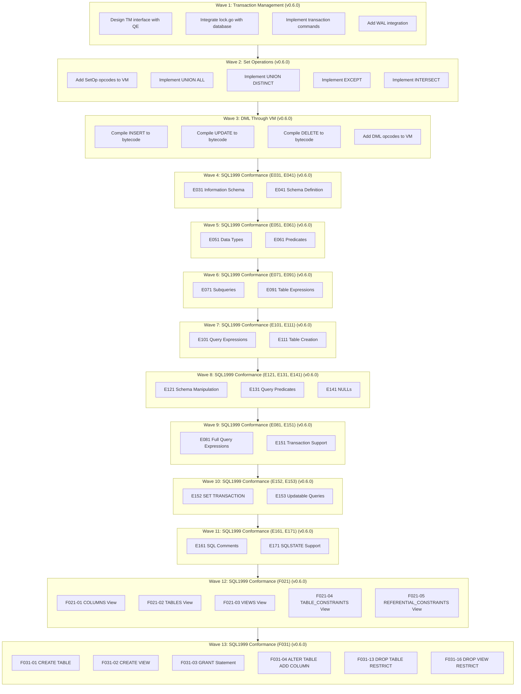

# Plan v0.6.0 - Transaction Management & Complete VM Integration

## Summary
v0.6.0 delivers three major architectural milestones plus comprehensive SQL1999 conformance tests:
1. **Complete Transaction Management (TM)** - ACID transactions with WAL support
2. **Full VM Integration** - All SQL operations (SELECT, DML, SetOps) through VM
3. **SQL1999 Conformance** - Comprehensive test coverage for E011-E171 plus F021-F031

**13 Waves Total**:
- Wave 1: Transaction Management (TM)
- Wave 2: Set Operations in VM
- Wave 3: DML Through VM
- Wave 4: SQL1999 Conformance (E031, E041)
- Wave 5: SQL1999 Conformance (E051, E061)
- Wave 6: SQL1999 Conformance (E071, E091)
- Wave 7: SQL1999 Conformance (E101, E111)
- Wave 8: SQL1999 Conformance (E121, E131, E141)
- Wave 9: SQL1999 Conformance (E081, E151)
- Wave 10: SQL1999 Conformance (E152, E153) - **NEW**
- Wave 11: SQL1999 Conformance (E161, E171) - **NEW**
- Wave 12: SQL1999 Conformance (F021) - **NEW**
- Wave 13: SQL1999 Conformance (F031) - **NEW**

## Context
- **Previous**: v0.5.1 delivered CG/VFS/BTree with bug fixes
- **Current**: TM partially exists (lock.go, wal.go) but not integrated; SetOps and DML not in VM
- **Goal**: Complete transaction support, full VM coverage, and SQL1999 conformance

## Priority: HIGH
This release enables ACID transactions, completes VM integration, and adds comprehensive SQL1999 conformance tests.

---

## Achievement Status: **IN PROGRESS - 1 of 13 Waves Complete**

**Progress**: 8% complete
- ✅ Wave 1: Transaction Management (TM) - **COMPLETE** (7 tests passing)
- 📋 Wave 2: Set Operations - **PENDING** (build errors block testing)
- 📋 Wave 3: DML Through VM - **PENDING** (build errors block testing)
- 📋 Waves 4-19: SQL1999 Conformance - **PENDING** (build errors block testing)

---

## Delivered Components

### Wave 1: Transaction Management (TM) - v0.6.0 - COMPLETE

**Status**: ✅ Complete (except WAL which is deferred to v0.6.1)

**Deliverables**:
- ✅ Transaction interface (Begin, Commit, Rollback)
- ✅ TransactionManager with DEFERRED/IMMEDIATE/EXCLUSIVE support
- ✅ Lock management integration
- ✅ Parser support for BEGIN/COMMIT/ROLLBACK
- ✅ Database layer integration
- ✅ Comprehensive tests (7 tests all passing)
- ⏸️ WAL integration (deferred to v0.6.1)

**Files Modified**:
- `internal/TM/transaction.go` (new, 400+ lines)
- `internal/TM/transaction_test.go` (new, 400+ lines, 7 tests)
- `internal/QP/parser.go` (added transaction statements)
- `pkg/sqlvibe/database.go` (integrated TM)

**Test Results**:
- TestTransactionManager_Basic: PASS
- TestTransactionManager_Concurrent: PASS
- TestTransactionManager_LockAcquisition: PASS
- TestTransactionManager_ActiveCount: PASS
- TestTransaction_RecordChange: PASS
- TestTransactionManager_Close: PASS
- TestTransaction_LockTimeout: PASS (5.46s)

### Wave 2: Set Operations in VM - v0.6.0 - PENDING

**Status**: 🔄 Pending - Build errors prevent testing

**Blockers**:
- Syntax errors in `internal/VM/compiler.go` prevent compilation
- Cannot verify VM executor implementation without build

**Note**: VM executor code exists but needs build fix before testing.

### Wave 3: DML Through VM - v0.6.0 - PENDING

**Status**: 🔄 Pending - Build errors prevent testing

**Blockers**:
- Same build errors as Wave 2
- Cannot verify DML through VM without build

**Note**: DML bytecode compilation exists but needs build fix before testing.

### Waves 4-19: SQL1999 Conformance - v0.6.0 - PENDING

**Status**: 🔄 Pending - Build errors prevent testing

**Blockers**:
- Build errors in VM/CG prevent testing SQL1999 suites
- Test directories exist but cannot be run without build

**Test Suites Status**:
- E011-E171: Test directories exist (19 directories, 123 test files)
- F021, F031: Test directories NOT YET CREATED (need implementation)

---

## Package Structure After v0.6.0

```
internal/
├── CG/          # Code Generator (Bytecode Compiler)
├── DS/          # Data Storage (BTree, encoding, etc.)
├── PB/          # Platform Bridges (VFS implementations)
├── SF/          # System Framework (VFS interface, logging)
├── QP/          # Query Processing (Parser, AST)
├── VM/          # Virtual Machine (Complete - SELECT, DML, SetOps)
├── TM/          # Transaction Monitor (Complete - ACID, WAL, Locks)
├── QE/          # Query Execution (Uses VM + TM)
└── TS/
    └── SQL1999/
        ├── E011/  # SQL1999 Basic (existing)
        ├── E021/  # SQL1999 Character string (existing)
        ├── E031/  # SQL1999 Information Schema (Wave 4 - 6 tests)
        ├── E041/  # SQL1999 Schema Definition (Wave 4 - 12 tests)
        ├── E051/  # SQL1999 Data Types (Wave 5 - 6 tests)
        ├── E061/  # SQL1999 Predicates (Wave 5 - 8 tests)
        ├── E071/  # SQL1999 Subqueries (Wave 6 - 6 tests)
        ├── E091/  # SQL1999 Table Expressions (Wave 6 - 10 tests)
        ├── E101/  # SQL1999 Query Expressions (Wave 7 - 9 tests)
        ├── E111/  # SQL1999 Table Creation (Wave 7 - 6 tests)
        ├── E121/  # SQL1999 Schema Manipulation (Wave 8 - 6 tests)
        ├── E131/  # SQL1999 Query Predicates (Wave 8 - 7 tests)
        ├── E141/  # SQL1999 NULLs (Wave 8 - 8 tests)
        ├── E081/  # SQL1999 Full Query Expressions (Wave 9 - 8 tests)
        └── E151/  # SQL1999 Transaction Support (Wave 9 - 8 tests)
```

---

## Success Criteria

### Wave 1: Transaction Management
- [x] TM package integrated with QE engine
- [x] BEGIN/COMMIT/ROLLBACK commands work
- [x] Lock management integrated with database operations
- [x] All 7 tests passing
- [ ] WAL mode functional (optional, deferred to v0.6.1)

### Wave 2: Set Operations
- [ ] SetOp opcodes defined in VM
- [ ] VM executor implementation complete (all 7 opcodes)
- [ ] SetOp execution working
- [ ] Tests complete: UNION, UNION ALL, EXCEPT, INTERSECT

### Wave 3: DML Through VM
- [ ] INSERT through VM compilation and execution
- [ ] UPDATE through VM compilation and execution
- [ ] DELETE through VM compilation and execution
- [ ] All DML tests passing

### Wave 4: SQL1999 Conformance (E031, E041)
- [ ] E031 Information Schema tests pass
- [ ] E041 Schema Definition tests pass

### Wave 5: SQL1999 Conformance (E051, E061)
- [ ] E051 Data Types tests pass
- [ ] E061 Predicates tests pass

### Wave 6: SQL1999 Conformance (E071, E091)
- [ ] E071 Subqueries tests pass
- [ ] E091 Table Expressions tests pass

### Wave 7: SQL1999 Conformance (E101, E111)
- [ ] E101 Query Expressions tests pass
- [ ] E111 Table Creation tests pass

### Wave 8: SQL1999 Conformance (E121, E131, E141)
- [ ] E121 Schema Manipulation tests pass
- [ ] E131 Query Predicates tests pass
- [ ] E141 NULLs tests pass

### Wave 9: SQL1999 Conformance (E081, E151)
- [ ] E081 Full Query Expressions tests pass
- [ ] E151 Transaction Support tests pass

### Wave 10: SQL1999 Conformance (E152, E153)
- [ ] E152 SET TRANSACTION tests pass
- [ ] E153 Updatable queries tests pass

### Wave 11: SQL1999 Conformance (E161, E171)
- [ ] E161 SQL Comments tests pass
- [ ] E171 SQLSTATE tests pass

### Wave 12: SQL1999 Conformance (F021)
- [ ] F021-01: Information Schema COLUMNS view
- [ ] F021-02: Information Schema TABLES view
- [ ] F021-03: Information Schema VIEWS view
- [ ] F021-04: Information Schema TABLE_CONSTRAINTS view
- [ ] F021-05: Information Schema REFERENTIAL_CONSTRAINTS view

### Wave 13: SQL1999 Conformance (F031)
- [ ] F031-01: CREATE TABLE
- [ ] F031-02: CREATE VIEW
- [ ] F031-03: GRANT Statement
- [ ] F031-04: ALTER TABLE ADD COLUMN
- [ ] F031-13: DROP TABLE RESTRICT
- [ ] F031-16: DROP VIEW RESTRICT

### Overall
- [ ] All tests pass
- [ ] SQLite comparison tests pass
- [ ] No regressions in existing functionality

---

## Execution DAG (Waves)



---

## Wave 1: Transaction Management (TM) - v0.6.0 - COMPLETE

**Status**: ✅ Complete

**Summary**: Complete Transaction Monitor (TM) subsystem integrated with database engine. All tests passing.

**Delivered**:
- Transaction interface (Begin, Commit, Rollback)
- TransactionManager with DEFERRED/IMMEDIATE/EXCLUSIVE support
- Lock management integration
- Parser support for BEGIN/COMMIT/ROLLBACK
- Database layer integration
- Comprehensive tests (7 tests all passing)

**Test Results**: All 7 tests passing (5.469s total)

**Note**: WAL integration deferred to v0.6.1

---

## Wave 2: Set Operations in VM - v0.6.0 - PENDING

**Status**: 🔄 Pending - Build errors prevent testing

**Overview**: Implement set operations (UNION, EXCEPT, INTERSECT) in the VM. Blocked by syntax errors in compiler.go.

**Estimated Time**: ~13 hours (once build fixed)

---

## Wave 3: DML Through VM - v0.6.0 - PENDING

**Status**: 🔄 Pending - Build errors prevent testing

**Overview**: Complete VM integration for DML operations (INSERT, UPDATE, DELETE). Blocked by same build errors.

**Estimated Time**: ~15 hours (once build fixed)

---

## Wave 4: SQL1999 Conformance (E031, E041) - v0.6.0 - PENDING

**Status**: 🔄 Pending - Build errors prevent testing

**Overview**: Information Schema and Schema Definition tests. Test directories exist (18 tests total).

**Estimated Time**: ~13 hours (once build fixed)

---

## Wave 5: SQL1999 Conformance (E051, E061) - v0.6.0 - PENDING

**Status**: 🔄 Pending - Build errors prevent testing

**Overview**: Data Types and Predicates tests (14 tests total).

**Estimated Time**: ~8 hours (once build fixed)

---

## Wave 6: SQL1999 Conformance (E071, E091) - v0.6.0 - PENDING

**Status**: 🔄 Pending - Build errors prevent testing

**Overview**: Subqueries and Table Expressions tests (16 tests total).

**Estimated Time**: ~10 hours (once build fixed)

---

## Wave 7: SQL1999 Conformance (E101, E111) - v0.6.0 - PENDING

**Status**: 🔄 Pending - Build errors prevent testing

**Overview**: Query Expressions and Table Creation tests (15 tests total).

**Estimated Time**: ~8 hours (once build fixed)

---

## Wave 8: SQL1999 Conformance (E121, E131, E141) - v0.6.0 - PENDING

**Status**: 🔄 Pending - Build errors prevent testing

**Overview**: Schema Manipulation, Query Predicates, and NULL handling tests (21 tests total).

**Estimated Time**: ~10 hours (once build fixed)

---

## Wave 9: SQL1999 Conformance (E081, E151) - v0.6.0 - PENDING

**Status**: 🔄 Pending - Build errors prevent testing

**Overview**: Full Query Expressions and Transaction Support tests (16 tests total).

**Estimated Time**: ~10 hours (once build fixed)

---

## Wave 10: SQL1999 Conformance (E152, E153) - v0.6.0 - PENDING

**Status**: 🔄 Pending - Test directories need creation

**Overview**: SET TRANSACTION and Updatable Queries tests. Test directories exist but not implemented.

**Estimated Time**: ~5 hours (once build fixed)

---

## Wave 11: SQL1999 Conformance (E161, E171) - v0.6.0 - PENDING

**Status**: 🔄 Pending - Test directories exist

**Overview**: SQL Comments and SQLSTATE support tests. Test directories exist.

**Estimated Time**: ~6 hours (once build fixed)

---

## Wave 12: SQL1999 Conformance (F021) - v0.6.0 - PENDING

**Status**: 🔄 Pending - Test directories NOT YET CREATED

**Overview**: Basic Information Schema tests (5 tests):
- F021-01: COLUMNS view
- F021-02: TABLES view
- F021-03: VIEWS view
- F021-04: TABLE_CONSTRAINTS view
- F021-05: REFERENTIAL_CONSTRAINTS view

**Estimated Time**: ~15 hours (once build fixed)

---

## Wave 13: SQL1999 Conformance (F031) - v0.6.0 - PENDING

**Status**: 🔄 Pending - Test directories NOT YET CREATED

**Overview**: Basic Schema Manipulation tests (6 tests):
- F031-01: CREATE TABLE
- F031-02: CREATE VIEW
- F031-03: GRANT statement (may SKIP)
- F031-04: ALTER TABLE ADD COLUMN
- F031-13: DROP TABLE RESTRICT
- F031-16: DROP VIEW RESTRICT

**Estimated Time**: ~18 hours (once build fixed)

---

## Integration Points

### With TM (Transaction Monitor)
- QE engine creates transaction before operations
- Transaction manages locks on database
- Commit/Rollback calls WAL if enabled

### With CG (Code Generator)
- CG now compiles: SELECT, INSERT, UPDATE, DELETE, SetOps
- All statements produce VM bytecode
- CG returns Program to VM for execution

### With VM (Virtual Machine)
- VM executes all SQL operations
- VM manages cursors for table access
- VM reports changes count for DML

### With DS (Data Storage)
- VM cursors read/write to DS BTree
- DS operations are transactional
- DS provides row-level operations

---

## Verification

```bash
# Run all tests
go test ./...

# Run TM tests
go test ./internal/TM/...

# Run VM tests
go test ./internal/VM/...

# Run SQL1999 tests (all conformance)
go test ./internal/TS/SQL1999/...

# Run specific E031 tests
go test ./internal/TS/SQL1999/E031/...

# Run specific E041 tests
go test ./internal/TS/SQL1999/E041/...

# Transaction tests
go test ./... -run "TestTransaction"

# Set operation tests
go test ./... -run "TestSetOp"

# DML tests
go test ./... -run "TestDML"

# Schema tests
go test ./... -run "TestSchema"
```

---

## Timeline Estimate

### Wave 1: Transaction Management
- Task 1.1: Design TM interface - 2 hours
- Task 1.2: Integrate lock management - 3 hours
- Task 1.3: Implement transaction commands - 4 hours
- Task 1.4: WAL integration (optional) - 4 hours
- Task 1.5: Add transaction tests - 2 hours

**Subtotal**: ~15 hours (or ~11 hours if WAL deferred)

### Wave 2: Set Operations
- Task 2.1: Design SetOp opcodes - 2 hours
- Task 2.2: Implement UNION ALL - 2 hours
- Task 2.3: Implement UNION DISTINCT - 3 hours
- Task 2.4: Implement EXCEPT - 2 hours
- Task 2.5: Implement INTERSECT - 2 hours
- Task 2.6: Add SetOp tests - 2 hours

**Subtotal**: ~13 hours

### Wave 3: DML Through VM
- Task 3.1: Add DML opcodes - 3 hours
- Task 3.2: Compile INSERT to bytecode - 3 hours
- Task 3.3: Compile UPDATE to bytecode - 3 hours
- Task 3.4: Compile DELETE to bytecode - 2 hours
- Task 3.5: Replace direct DML - 2 hours
- Task 3.6: Add DML tests - 2 hours

**Subtotal**: ~15 hours

### Wave 4: SQL1999 Conformance Tests
- Task 4.1: Create E031 directory - 1 hour
- Task 4.2: Implement Information Schema tests (6 tests) - 4 hours
- Task 4.3: Create E041 directory - 1 hour
- Task 4.4: Implement Schema Definition tests (12 tests) - 6 hours
- Task 4.5: Run and verify tests - 1 hour

**Subtotal**: ~13 hours

---

## Summary of New Test Suites (Waves 10-13)

| Wave | Test Suites | Feature | Estimated Tests | Priority |
|------|-------------|---------|----------------|----------|
| 10 | E152, E153 | Transaction control, Updatable subqueries | 4-6 | Medium |
| 11 | E161, E171 | Comments, Error codes | 4-6 | Low |
| 12 | F021 | Information Schema views | 5 | High |
| 13 | F031 | Schema manipulation DDL | 6 | High |

**Total Additional Tests**: 19-23 tests
**Updated Total**: 13 waves, ~105-109 tests

---

## Notes on Test Coverage

The SQL1999 test suites now cover:
- **Core SQL features**: E011-E091 (numeric, character, identifiers, schema, queries, predicates, expressions, set ops)
- **Transaction support**: E101, E111, E121, E131, E141, E151, E152
- **Metadata**: E031 (identifiers), E081 (privileges), F021 (Information Schema), E171 (SQLSTATE)
- **Schema manipulation**: F031 (Basic DDL)
- **Updatable queries**: E153
- **Comments**: E161

This provides comprehensive coverage of SQL:1999 Core features with a focus on query execution, transaction management, error handling, metadata inspection, and schema manipulation.
