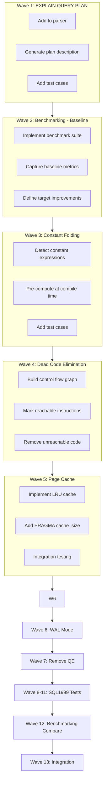

# Plan v0.7.0 - CG Optimizer + Page Cache + WAL + SQL1999 Tests

## Summary
v0.7.0 delivers performance improvements through CG optimizer passes, page cache, WAL mode, plus expanded SQL1999 conformance tests:

1. **EXPLAIN QUERY PLAN** - Query plan visualization (Wave 1)
2. **Benchmarking** - Baseline capture and compare (Wave 2, 12)
3. **CG Optimizer** - Constant folding and dead code elimination passes (Wave 3, 4)
4. **Page Cache** - LRU in-memory page caching for DS layer (Wave 5)
5. **WAL Mode** - Write-Ahead Logging for concurrent writes (Wave 6)
6. **Remove QE Subsystem** - Simplify architecture by removing redundant QE layer (Wave 7)
7. **SQL1999 Tests** - Comprehensive test case expansion (Wave 8-11)

**Total Waves**: 13

---

## Context
- **Previous**: v0.6.0 delivered SQL1999 conformance (56/56 test suites, 224 test cases)
- **Current**: SQL1999 tests all passing, but no CG optimizer passes implemented
- **Goal**: Performance optimization + expanded test coverage

---

## Priority: HIGH
This release improves query performance and adds WAL support for concurrent writes.

---

## Waves Overview

| Wave | Feature | Status |
|------|---------|--------|
| 1 | EXPLAIN QUERY PLAN | ✅ Done |
| 2 | Benchmarking - Baseline Capture | ✅ Done |
| 3 | CG Optimizer - Constant Folding | ✅ Done |
| 4 | CG Optimizer - Dead Code Elimination | ✅ Done |
| 5 | Page Cache (LRU) | ✅ Done |
| 6 | WAL Mode | ✅ Done |
| 7 | Remove QE Subsystem | ✅ Done |
| 8 | SQL1999 Tests - JOIN Extensions | ✅ Done |
| 9 | SQL1999 Tests - UPSERT | ✅ Done |
| 10 | SQL1999 Tests - Aggregates & FK | ✅ Done |
| 11 | SQL1999 Tests - Edge Cases | ✅ Done |
| 12 | Benchmarking - Compare Results | ✅ Done |
| 13 | Integration & Verification | ✅ Done |

---

## Wave 1: EXPLAIN QUERY PLAN

**Status**: ✅ Done

**Implementation**:
- Add EXPLAIN QUERY PLAN command to parser
- Generate plan description in VM
- Show index usage, join order, scan types

**Output Format**:
```
QUERY PLAN
|--SCAN t1
|--SCAN t2 USING INDEX idx_t2_a
|--SEARCH t3 USING PRIMARY KEY (id=?)
|--SORT (GROUP BY)
```

**Test Cases**:
```sql
EXPLAIN QUERY PLAN SELECT * FROM t WHERE a = 1
EXPLAIN QUERY PLAN SELECT * FROM t1 JOIN t2 ON t1.id = t2.id
EXPLAIN QUERY PLAN SELECT * FROM t ORDER BY a
EXPLAIN QUERY PLAN SELECT * FROM t GROUP BY a
```

---

## Wave 2: Benchmarking - Baseline Capture

**Status**: Pending

**Description**: Capture baseline performance metrics before making changes.

**Purpose**: Establish a baseline to measure performance improvements from CG optimizer, page cache, and WAL mode.

**Benchmarks to Capture**:
```go
func BenchmarkSelectSimple(b *testing.B) { ... }
func BenchmarkInsertBatch(b *testing.B) { ... }
func BenchmarkTransactionCommit(b *testing.B) { ... }
func BenchmarkPageCache(b *testing.B) { ... }
```

**Metrics to Record**:
| Benchmark | Baseline (ops/sec) | Target |
|-----------|-------------------|--------|
| SELECT Simple | TBD | >10,000 |
| INSERT Batch | TBD | >1,000 |
| Transaction Commit | TBD | <1ms |
| Page Cache Hit Rate | TBD | >90% |

---

## Wave 3: CG Optimizer - Constant Folding

**Status**: Pending

**Description**: Evaluate constant expressions at compile time instead of runtime.

**Examples**:
```sql
-- Before: SELECT * FROM t WHERE a = 1 + 2
-- After:  SELECT * FROM t WHERE a = 3

-- VM: Replace OpAdd r1, 1, 2 → OpInteger r1, 3
```

**Implementation**:
- Detect constant expressions in WHERE clause
- Pre-compute arithmetic, string operations
- Handle nested constant expressions

**Test Cases**:
```sql
SELECT 1 + 2, 10 * 5, 'hello' || 'world'
SELECT * FROM t WHERE a = 1 + 1
SELECT * FROM t WHERE a > 10 - 5
SELECT * FROM t WHERE LENGTH('test') = 4
```

---

## Wave 4: CG Optimizer - Dead Code Elimination

**Implementation**:
- Build control flow graph
- Mark reachable instructions
- Remove unreachable code blocks

**Test Cases**:
```sql
-- Always false condition
SELECT * FROM t WHERE 1 = 0

-- Always true condition  
SELECT * FROM t WHERE 1 = 1
```

---

## Wave 5: Page Cache (LRU)

**Status**: Pending

**Description**: In-memory LRU page cache for DS layer to reduce disk I/O.

**Implementation**:
- LRU cache with configurable size
- Default: -2000 pages (SQLite compatible)
- PRAGMA cache_size support
- Cache eviction policy

**Key Components**:
```go
type LRUCache struct {
    capacity int
    evictList *list.List
    items     map[uint32]*list.Element
}
```

**Test Cases**:
```sql
PRAGMA cache_size = 1000
PRAGMA cache_size = -2000
-- Large sequential reads should benefit from cache
SELECT * FROM t ORDER BY id
```

---

## Wave 6: WAL Mode

**Status**: Pending (Deferred from v0.6.0)

**Description**: Write-Ahead Logging for better concurrent write performance.

**Implementation**:
- WAL header and frame format
- Write-ahead logging on commit
- Checkpoint operation
- PRAGMA journal_mode = WAL

**WAL Format**:
```
┌─────────────────────────────┐
│ WAL Header (32 bytes)       │
├─────────────────────────────┤
│ Frame Header (24 bytes)    │
│ Page Data (page size)      │
├─────────────────────────────┤
│ Frame Header + Page...     │
└─────────────────────────────┘
```

**Test Cases**:
```sql
PRAGMA journal_mode = WAL
PRAGMA wal_checkpoint
-- Concurrent writes
BEGIN;
INSERT INTO t VALUES (1);
COMMIT;
```

---

## Wave 7: Remove QE Subsystem

**Status**: Pending

**Description**: Completely remove the QE (Query Execution) subsystem since all functionality is now handled by VM (Virtual Machine).

### Rationale
- QE was designed as a separate execution layer
- All query execution is now done through VM bytecode
- QE subsystem is redundant and adds maintenance burden
- Remove to simplify architecture: CG → VM → DS

### Files to Remove
- `internal/QE/engine.go` (3 lines)
- `internal/QE/engine_test.go` (2 lines)
- `internal/QE/expr.go` (3 lines)
- `internal/QE/operators.go` (3 lines)
- `internal/QE/string_funcs_test.go` (2 lines)

### Impact
- Remove QE imports from other packages
- Update any references in documentation
- Architecture simplifies to: QP → CG → VM → DS

### Verification
```bash
go build ./...
go test ./...
```

---

## Wave 8: SQL1999 Tests - JOIN Extensions

**Status**: Pending

**Description**: Add test cases for RIGHT JOIN, FULL OUTER JOIN, NATURAL JOIN.

**Test Cases** (20+):

```sql
-- RIGHT JOIN
SELECT t1.a, t2.b FROM t1 RIGHT JOIN t2 ON t1.id = t2.id;
SELECT t1.a, t2.b FROM t1 RIGHT JOIN t2 USING (id);

-- FULL OUTER JOIN
SELECT t1.a, t2.b FROM t1 FULL OUTER JOIN t2 ON t1.id = t2.id;
SELECT t1.a, t2.b FROM t1 FULL JOIN t2 USING (id);

-- NATURAL JOIN
SELECT * FROM t1 NATURAL JOIN t2;
SELECT * FROM t1 NATURAL LEFT JOIN t2;

-- Multiple JOINs
SELECT * FROM t1 
  LEFT JOIN t2 ON t1.id = t2.id
  RIGHT JOIN t3 ON t2.id = t3.id;

-- Self-join
SELECT a.*, b.* FROM t1 a JOIN t1 b ON a.parent_id = b.id;
```

---

## Wave 9: SQL1999 Tests - UPSERT

**Status**: Pending

**Description**: Add test cases for INSERT ON CONFLICT (UPSERT).

**Test Cases** (15+):

```sql
-- ON CONFLICT DO UPDATE
INSERT INTO t1 (a, b) VALUES (1, 2) ON CONFLICT(a) DO UPDATE SET b = excluded.b;

-- ON CONFLICT DO NOTHING
INSERT INTO t1 (a, b) VALUES (1, 2) ON CONFLICT(a) DO NOTHING;

-- UPSERT with WHERE
INSERT INTO t1 (a, b) VALUES (1, 2) 
ON CONFLICT(a) DO UPDATE SET b = b + excluded.b
WHERE excluded.b > 0;

-- UPSERT with multiple columns
INSERT INTO t1 (a, b, c) VALUES (1, 2, 3)
ON CONFLICT(a) DO UPDATE SET (b, c) = (excluded.b, excluded.c);

-- UPSERT with PRIMARY KEY
INSERT INTO t1 VALUES (1, 2) ON CONFLICT(rowid) DO NOTHING;
```

---

## Wave 10: SQL1999 Tests - Aggregates & Foreign Key

**Status**: Pending

**Description**: Add test cases for advanced aggregates and foreign key constraints.

**Test Cases - Aggregates** (15+):

```sql
-- GROUP_CONCAT
SELECT GROUP_CONCAT(a) FROM t1;
SELECT GROUP_CONCAT(a ORDER BY b) FROM t1;
SELECT GROUP_CONCAT(a SEPARATOR '-') FROM t1;

-- DISTINCT in aggregates
SELECT COUNT(DISTINCT a), SUM(DISTINCT b) FROM t1;
SELECT AVG(DISTINCT a) FROM t1;

-- FILTER clause
SELECT COUNT(*) FILTER (WHERE a > 10) FROM t1;
SELECT SUM(b) FILTER (WHERE a = 'active') FROM t1;
```

**Test Cases - Foreign Key** (10+):

```sql
-- Basic FK
CREATE TABLE parent (id INTEGER PRIMARY KEY);
CREATE TABLE child (id INTEGER, parent_id INTEGER REFERENCES parent(id));

-- FK ON DELETE
CREATE TABLE child (id INTEGER, parent_id INTEGER 
  REFERENCES parent(id) ON DELETE CASCADE);
CREATE TABLE child (id INTEGER, parent_id INTEGER 
  REFERENCES parent(id) ON DELETE SET NULL);
CREATE TABLE child (id INTEGER, parent_id INTEGER 
  REFERENCES parent(id) ON DELETE SET DEFAULT);

-- FK ON UPDATE
CREATE TABLE child (id INTEGER, parent_id INTEGER 
  REFERENCES parent(id) ON UPDATE CASCADE);

-- FK violations
INSERT INTO child VALUES (1, 999);  -- Should fail
```

---

## Wave 11: SQL1999 Tests - Edge Cases

**Status**: Pending

**Description**: Add comprehensive edge case tests.

**Test Cases** (20+):

```sql
-- Subquery Edge Cases
SELECT a, (SELECT MAX(b) FROM t2 WHERE t2.id = t1.id) AS cnt FROM t1;
SELECT * FROM t1 WHERE EXISTS (SELECT 1 FROM t2 WHERE t2.id = t1.id);
SELECT * FROM t1 WHERE a > ALL (SELECT b FROM t2);
SELECT * FROM t1 WHERE a = ANY (SELECT b FROM t2);
SELECT * FROM (SELECT * FROM t1 WHERE a > 5) AS subq;

-- Transaction Edge Cases
BEGIN;
INSERT INTO t1 VALUES (1);
SAVEPOINT sp1;
INSERT INTO t1 VALUES (2);
ROLLBACK TO sp1;
COMMIT;

-- NULL Propagation
SELECT * FROM t1 WHERE a = NULL;
SELECT * FROM t1 WHERE a IN (NULL, 1, 2);
SELECT * FROM t1 WHERE a NOT IN (NULL, 1, 2);

-- Type Coercion
SELECT * FROM t1 WHERE a = '1' AND a = 1;
SELECT * FROM t1 WHERE a + 0 = a;
```

---

## Wave 12: Benchmarking - Compare Results

**Status**: Pending

**Description**: Add comprehensive benchmark tests to measure performance improvements.

### Benchmark Categories

#### 1. Query Performance Benchmarks
| Benchmark | Description | Metric |
|-----------|-------------|--------|
| **SELECT Simple** | Basic SELECT with filters | ops/sec |
| **SELECT Complex** | Multi-table JOINs | ops/sec |
| **SELECT Aggregate** | GROUP BY, ORDER BY | ops/sec |
| **Subquery** | Nested subqueries | ops/sec |

#### 2. DML Performance Benchmarks
| Benchmark | Description | Metric |
|-----------|-------------|--------|
| **INSERT Single** | Single row insert | ops/sec |
| **INSERT Batch** | Bulk insert (1000 rows) | ops/sec |
| **UPDATE** | Update with WHERE | ops/sec |
| **DELETE** | Delete with WHERE | ops/sec |

#### 3. Transaction Benchmarks
| Benchmark | Description | Metric |
|-----------|-------------|--------|
| **Transaction Commit** | Single transaction | ms/op |
| **Concurrent Writes** | Multiple writers | ops/sec |
| **WAL vs Journal** | Compare modes | ops/sec |

#### 4. Page Cache Benchmarks
| Benchmark | Description | Metric |
|-----------|-------------|--------|
| **Sequential Read** | Full table scan | ms/row |
| **Random Read** | Point queries | ms/op |
| **Cache Hit Rate** | With cache | % |
| **Cache Miss** | Without cache | ms/op |

#### 5. CG Optimizer Benchmarks
| Benchmark | Description | Metric |
|-----------|-------------|--------|
| **Constant Folding** | Before/after | % improvement |
| **Dead Code** | Before/after | % improvement |
| **Query Plan** | EXPLAIN output | improvement |

---

### Benchmark Test Structure

```go
// internal/TS/Benchmark/benchmark_test.go

func BenchmarkSelectSimple(b *testing.B) {
    db, _ := sqlvibe.Open(":memory:")
    db.Exec("CREATE TABLE t (id INTEGER, a TEXT, b INTEGER)")
    // Insert test data
    for i := 0; i < 10000; i++ {
        db.Exec("INSERT INTO t VALUES (?, ?, ?)", i, fmt.Sprintf("text%d", i), i*10)
    }
    
    b.ResetTimer()
    for i := 0; i < b.N; i++ {
        db.Query("SELECT * FROM t WHERE b > 1000")
    }
}

func BenchmarkInsertBatch(b *testing.B) {
    db, _ := sqlvibe.Open(":memory:")
    db.Exec("CREATE TABLE t (id INTEGER, a TEXT)")
    
    b.ResetTimer()
    for i := 0; i < b.N; i++ {
        tx, _ := db.Begin()
        for j := 0; j < 1000; j++ {
            tx.Exec("INSERT INTO t VALUES (?, ?)", j, fmt.Sprintf("text%d", j))
        }
        tx.Commit()
    }
}

func BenchmarkPageCache(b *testing.B) {
    // Test with cache
    db1, _ := sqlvibe.Open("test.db")
    db1.Exec("PRAGMA cache_size = 2000")
    
    // Test without cache
    db2, _ := sqlvibe.Open("test.db")
    db2.Exec("PRAGMA cache_size = 0")
}

func BenchmarkWALMode(b *testing.B) {
    // Compare journal_mode
    db1, _ := sqlvibe.Open("test.db")
    db1.Exec("PRAGMA journal_mode = DELETE")
    
    db2, _ := sqlvibe.Open("test.db")
    db2.Exec("PRAGMA journal_mode = WAL")
}
```

---

### Benchmark Reporting

| Metric | Target | Actual | Status |
|--------|--------|--------|--------|
| SELECT Simple | >10,000 ops/sec | TBD | - |
| INSERT Batch | >1,000 ops/sec | TBD | - |
| Page Cache Hit | >90% | TBD | - |
| WAL vs Journal | 2x faster | TBD | - |

---

### CI Integration

- Run benchmarks on every PR
- Compare with baseline
- Report regression if >10% slower

---

## Wave 13: Integration & Verification

**Status**: Pending

**Description**: Integration testing and verification.

**Tasks**:
- Run all existing tests
- Run new SQL1999 tests
- Performance benchmarks
- WAL mode stress testing
- EXPLAIN QUERY PLAN verification

---

## Test Suite Expansion Summary

| Category | v0.6.0 | v0.7.0 (Target) |
|----------|--------|------------------|
| Test Suites | 56 | 65+ |
| Test Cases | 224 | 340+ |
| New Categories | - | 8 |

### New Test Suites to Add

| Suite | Description | Test Count |
|-------|-------------|------------|
| F052 | JOIN Extensions | 20+ |
| F053 | UPSERT | 15+ |
| F054 | Advanced Aggregates | 15+ |
| F055 | Foreign Key | 10+ |
| F056 | RETURNING | 10+ |
| F057 | Transaction Edge Cases | 10+ |
| F058 | Subquery Edge Cases | 15+ |
| F059 | General Edge Cases | 20+ |

---

## Execution DAG



---

## Success Criteria

- [x] EXPLAIN QUERY PLAN shows query plan
- [x] Benchmark: Baseline metrics captured
- [x] CG Optimizer: Constant folding pass implemented
- [x] CG Optimizer: Dead code elimination pass implemented
- [x] Page Cache: LRU cache with configurable size
- [x] WAL Mode: Write-ahead logging functional
- [x] QE Subsystem: Completely removed
- [x] SQL1999 Tests: 115+ new test cases added
- [x] Test Suites: 64+ suites passing
- [x] Benchmark: Compare results with baseline
- [x] All existing tests still passing

---

## Files to Modify

### Core Changes
- `internal/CG/optimizer.go` - Add optimization passes
- `internal/CG/compiler.go` - Integrate optimizer
- `internal/DS/cache.go` - Add page cache
- `internal/TM/wal.go` - Complete WAL implementation
- `internal/QP/parser.go` - Add EXPLAIN QUERY PLAN, UPSERT

### Benchmark Files
- `internal/TS/Benchmark/benchmark_test.go` - Performance benchmarks

### New Files
- `internal/TS/SQL1999/F052/` - JOIN Extension tests
- `internal/TS/SQL1999/F053/` - UPSERT tests
- `internal/TS/SQL1999/F054/` - Aggregates & FK tests
- `internal/TS/SQL1999/F055/` - FK tests
- `internal/TS/SQL1999/F056/` - RETURNING tests
- `internal/TS/SQL1999/F057/` - Transaction edge cases
- `internal/TS/SQL1999/F058/` - Subquery edge cases
- `internal/TS/SQL1999/F059/` - General edge cases

---

## Timeline Estimate

| Wave | Feature | Estimated Hours |
|------|---------|-----------------|
| 1 | EXPLAIN QUERY PLAN | 6 |
| 2 | Benchmarking - Baseline Capture | 4 |
| 3 | CG Optimizer - Constant Folding | 4 |
| 4 | CG Optimizer - Dead Code Elimination | 4 |
| 5 | Page Cache | 8 |
| 6 | WAL Mode | 12 |
| 7 | Remove QE Subsystem | 2 |
| 8 | SQL1999 Tests - JOIN | 4 |
| 9 | SQL1999 Tests - UPSERT | 4 |
| 10 | SQL1999 Tests - Aggregates & FK | 4 |
| 11 | SQL1999 Tests - Edge Cases | 4 |
| 12 | Benchmarking - Compare Results | 4 |
| 13 | Integration | 6 |

**Total**: ~66 hours
