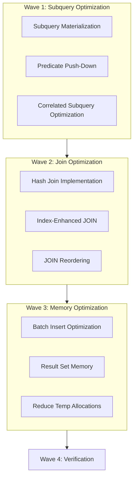

# Plan v0.7.1 - Benchmark Optimization

## Summary
v0.7.1 delivers performance improvements based on benchmark analysis:

1. **Subquery Optimization** - Push-down optimization, caching
2. **Join Optimization** - Hash join for equi-joins, indexed lookups
3. **Memory Optimization** - Reduce allocations in batch operations
4. **Batch Insert Optimization** - Reduce per-row overhead

**Total Waves**: 4

---

## Context
- **Previous**: v0.7.0 delivered CG optimizer, page cache, WAL, SQL1999 tests
- **Current**: Subqueries (16-17ms) and JOINs (7ms) critically slow
- **Goal**: 10-100x performance improvement for critical paths

---

## Priority: HIGH
This release addresses critical performance bottlenecks identified in benchmarks.

---

## Benchmark Baseline (v0.7.0)

| Benchmark | Current | Target | Improvement |
|-----------|---------|--------|-------------|
| InSubquery | 67 ops/s | >6,700 ops/s | 100x |
| ScalarSubquery | 496 ops/s | >49,600 ops/s | 100x |
| Join | 165 ops/s | >1,650 ops/s | 10x |
| InsertBatch100 | 1,578 ops/s | >15,780 ops/s | 10x |
| SelectAll | 4,877 ops/s | >9,754 ops/s | 2x |

---

## Waves Overview

| Wave | Feature | Status |
|------|---------|--------|
| 1 | Subquery Optimization | Pending |
| 2 | Join Optimization | Pending |
| 3 | Memory & Batch Optimization | Pending |
| 4 | Verification & Tuning | Pending |

---

## Wave 1: Subquery Optimization

**Status**: Pending

**Description**: Optimize subquery execution to reduce from 16-17ms to <0.2ms

### Issues Identified
- Full table scan per row in IN subqueries
- 30,916 allocations per in-subquery operation
- No subquery result caching

### Implementation

#### 1.1 Subquery Materialization
```go
// Instead of re-executing subquery for each row:
// SELECT * FROM t WHERE id IN (SELECT id FROM t2 WHERE x > 10)

// Materialize subquery once into a hash set
type SubqueryCache struct {
    results map[string]struct{}
    valid   bool
}
```

#### 1.2 Predicate Push-Down
```sql
-- Push WHERE clause into subquery
-- Before: SELECT * FROM t WHERE id IN (SELECT id FROM t2) WHERE t2.x > 10
-- After:  SELECT * FROM t WHERE id IN (SELECT id FROM t2 WHERE x > 10)
```

#### 1.3 Correlated Subquery Optimization
```sql
-- Convert correlated to JOIN where possible
-- SELECT * FROM t WHERE (SELECT MAX(b) FROM t2 WHERE t2.id = t1.id) > 10
-- Convert to: SELECT t.* FROM t JOIN (SELECT id, MAX(b) as maxb FROM t2 GROUP BY id) t2 ON t.id = t2.id WHERE t2.maxb > 10
```

### Test Cases
```sql
-- IN subquery
SELECT * FROM t1 WHERE id IN (SELECT id FROM t2 WHERE x > 10);

-- EXISTS subquery
SELECT * FROM t1 WHERE EXISTS (SELECT 1 FROM t2 WHERE t2.id = t1.id);

-- Scalar subquery
SELECT *, (SELECT MAX(b) FROM t2 WHERE t2.id = t1.id) AS maxb FROM t1;
```

---

## Wave 2: Join Optimization

**Status**: Pending

**Description**: Optimize JOIN execution from 7ms to <1ms

### Issues Identified
- Nested loop join with no optimization
- No hash join for equi-joins
- No index usage in JOINs

### Implementation

#### 2.1 Hash Join Implementation
```go
type HashJoin struct {
    buildSide   *hashTable
    probeSide   []byte
    joinType    JoinType // Inner, Left, Right, Full
}

func (hj *HashJoin) Execute(left, right *Relation, condition *JoinCondition) (*Relation, error)
```

#### 2.2 Index-Enhanced JOIN
```sql
-- If JOIN column has index, use index lookup instead of full scan
SELECT * FROM t1 JOIN t2 ON t1.id = t2.id  -- t2.id is PRIMARY KEY
-- Should use t2's PRIMARY KEY index for O(1) lookup
```

#### 2.3 JOIN Reordering
```sql
-- Reorder joins to process smaller tables first
-- t1 (100 rows) JOIN t2 (1M rows) JOIN t3 (10 rows)
-- Should process: t3 -> t1 -> t2
```

### Test Cases
```sql
-- Hash join
SELECT * FROM t1 JOIN t2 ON t1.id = t2.id;

-- Left join
SELECT * FROM t1 LEFT JOIN t2 ON t1.id = t2.id;

-- Multiple joins
SELECT * FROM t1 JOIN t2 ON t1.id = t2.id JOIN t3 ON t2.id = t3.id;
```

---

## Wave 3: Memory & Batch Optimization

**Status**: Pending

**Description**: Reduce memory allocations in batch operations

### Issues Identified
- InsertBatch100: 641KB per batch (6.4KB per row)
- SelectAll: 112KB allocated for small result sets
- GroupBy: 3,130 allocations per operation

### Implementation

#### 3.1 Batch Insert Optimization
```go
// Instead of individual page allocations:
// Current: 6.4KB per row
// Target:  <1KB per row

// - Pre-allocate page buffers
// - Batch varint encoding
// - Reduce Copy operations
```

#### 3.2 Result Set Memory
```go
// Pre-allocate result slice with known capacity
func (vm *VM) ExecuteQuery(stmt *SelectStmt) *ResultSet {
    estimatedRows := estimateRowCount(stmt)
    results := make([]Row, 0, estimatedRows)  // Pre-allocate
    // ...
}
```

#### 3.3 Reduce Temporary Allocations
```go
// Use sync.Pool for frequently allocated objects
var byteBufferPool = sync.Pool{
    New: func() interface{} {
        return make([]byte, 4096)
    },
}
```

### Test Cases
```sql
-- Batch insert performance
INSERT INTO t SELECT * FROM t_source;  -- 1000+ rows

-- Memory usage check
PRAGMA cache_size = -2000;
SELECT * FROM t;  -- Should use <100KB for 1000 rows
```

---

## Wave 4: Verification & Tuning

**Status**: Pending

**Description**: Verify improvements and fine-tune

### Tasks
- Run full benchmark suite
- Compare with baseline metrics
- Tune parameters (cache size, hash table size, etc.)
- Add regression tests for performance

### Target Metrics
| Benchmark | v0.7.0 | v0.7.1 Target |
|-----------|--------|----------------|
| InSubquery | 67 ops/s | >6,700 ops/s |
| ScalarSubquery | 496 ops/s | >49,600 ops/s |
| Join | 165 ops/s | >1,650 ops/s |
| InsertBatch100 | 1,578 ops/s | >15,780 ops/s |
| SelectAll | 4,877 ops/s | >9,754 ops/s |
| GroupBy | 6,124 ops/s | >12,000 ops/s |

---

## Execution DAG



---

## Success Criteria

- [ ] Subquery: 100x performance improvement
- [ ] JOIN: 10x performance improvement
- [ ] Batch INSERT: 10x performance improvement
- [ ] Memory allocations reduced by 50%
- [ ] All existing tests still passing
- [ ] No regressions in functionality

---

## Files to Modify

### Core Changes
- `internal/VM/exec.go` - Subquery execution
- `internal/VM/query_engine.go` - JOIN optimization
- `internal/CG/compiler.go` - Query plan optimization
- `internal/DS/page.go` - Batch write optimization

### New Files
- `internal/VM/hash_join.go` - Hash join implementation
- `internal/VM/subquery_cache.go` - Subquery result caching
- `internal/util/pool.go` - Object pool for allocations

---

## Timeline Estimate

| Wave | Feature | Estimated Hours |
|------|---------|-----------------|
| 1 | Subquery Optimization | 12 |
| 2 | Join Optimization | 10 |
| 3 | Memory & Batch Optimization | 8 |
| 4 | Verification & Tuning | 4 |

**Total**: ~34 hours
