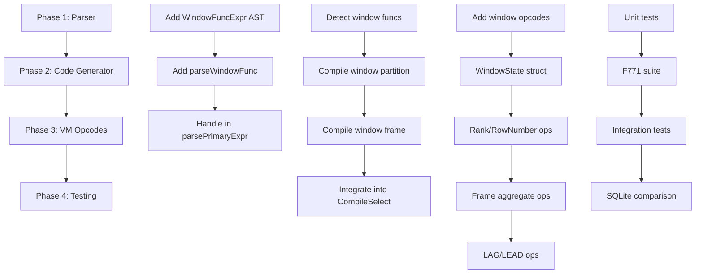

# Plan v0.8.4 - SQL Compatibility: Window Functions + Extended Features

## Summary

Implement SQL:1999 window functions plus extended SQL features to maximize compatibility. This includes core window functions (F771) plus GROUP_CONCAT, VALUES, RETURNING, Recursive CTE, ON CONFLICT, and ANY/ALL subqueries.

**Previous**: v0.8.3 delivers batch INSERT, sync.Pool allocations, aggregate fast paths

**v0.8.4 Scope**: ~91 hours total
- Core: Window Functions (F771) - 45h
- Group A: GROUP_CONCAT, VALUES, RETURNING - 13h
- Group B: Recursive CTE - 15h  
- Group C: ON CONFLICT, ANY/ALL - 18h

---

## Problem Statement

Current state:
- Parser can parse `PARTITION BY` and `ORDER BY` in window spec
- CG (Code Generator) has NO window function support
- VM (Virtual Machine) has NO window opcodes
- Missing extended SQL features: GROUP_CONCAT, recursive CTE, UPSERT, etc.

Example queries that fail:
```sql
-- Window Functions
SELECT name, dept, salary,
       RANK() OVER (PARTITION BY dept ORDER BY salary DESC) as rank
FROM employees;

-- Recursive CTE
WITH RECURSIVE tree AS (
    SELECT id, name FROM employees WHERE manager_id IS NULL
    UNION ALL
    SELECT e.id, e.name FROM employees e JOIN tree t ON e.manager_id = t.id
)
SELECT * FROM tree;

-- ON CONFLICT
INSERT INTO users (id, name) VALUES (1, 'Alice')
ON CONFLICT (id) DO UPDATE SET name = EXCLUDED.name;
```

---

## Solution Architecture

```
Query: SELECT RANK() OVER (PARTITION BY dept ORDER BY salary) FROM employees

Parser (QP)
  ├── parseSelect() → SelectStmt
  ├── parseWindowSpec() → existing
  └── NEW: parseWindowFunc() → WindowFuncExpr

Code Generator (CG)
  ├── compileSelect() → existing
  ├── NEW: detectWindowFuncs() → identify window expressions
  └── NEW: compileWindowFunc() → window program

Virtual Machine (VM)
  ├── OpWindowInit      ← NEW: Initialize window state
  ├── OpWindowStep      ← NEW: Advance window frame
  ├── OpRank            ← NEW: RANK() / DENSE_RANK()
  ├── OpRowNumber       ← NEW: ROW_NUMBER()
  ├── OpLag             ← NEW: LAG() / LEAD()
  └── OpWindowAgg      ← NEW: SUM/AVG over window
```

---

## Phase 1: Parser Enhancements

### Task 1.1: Add WindowFuncExpr AST Node

```go
// In internal/QP/ast.go (or parser.go)
type WindowFuncExpr struct {
    Func     string     // "RANK", "ROW_NUMBER", "SUM", etc.
    Args     []Expr    // Function arguments
    Over     *WindowSpec // OVER (PARTITION BY ... ORDER BY ...)
}

type WindowSpec struct {
    PartitionBy []Expr
    OrderBy     []OrderBy
    Frame       *WindowFrame // ROWS/RANGE BETWEEN ...
}

type WindowFrame struct {
    Type    string // "ROWS" or "RANGE"
    Start   *FrameBound
    End     *FrameBound
}

type FrameBound struct {
    Type  string // "PRECEDING", "FOLLOWING", "CURRENT ROW", "UNBOUNDED"
    Value Expr   // For "N PRECEDING/FOLLOWING"
}
```

### Task 1.2: Enhance Expression Parser

```go
// In internal/QP/parser.go
func (p *Parser) parseWindowFunc() (Expr, error) {
    // Detect window function name
    // Parse arguments
    // Parse OVER clause
    // Return WindowFuncExpr
}
```

### Tasks

- [ ] Add WindowFuncExpr, WindowSpec, WindowFrame types to QP
- [ ] Add parseWindowFunc() to parser.go
- [ ] Handle in parsePrimaryExpr() - detect function name, check for OVER
- [ ] Add IsWindowFunc() helper to detect window expressions

---

## Phase 2: Code Generator (CG) Window Support

### Task 2.1: Detect Window Functions

```go
// In internal/CG/compiler.go
func hasWindowFuncs(stmt *QP.SelectStmt) bool {
    // Walk Columns, Where, etc. looking for WindowFuncExpr
}

func (c *Compiler) compileWindowFuncs(stmt *QP.SelectStmt) {
    // Group window functions by their window spec
    // Generate window opcodes
}
```

### Task 2.2: Window Partition Logic

```go
func (c *Compiler) compileWindowPartition(spec *QP.WindowSpec) {
    // Emit opcodes to:
    // 1. Sort by partition keys (if not already sorted)
    // 2. Track partition boundaries
    // 3. Initialize window state
}
```

### Task 2.3: Window Frame Logic

```go
func (c *Compiler) compileWindowFrame(frame *QP.WindowFrame) {
    // Handle ROWS BETWEEN:
    // - UNBOUNDED PRECEDING
    // - N PRECEDING
    // - CURRENT ROW
    // - N FOLLOWING
    // - UNBOUNDED FOLLOWING
}
```

### Tasks

- [ ] Add hasWindowFuncs() detector
- [ ] Add compileWindowFuncs() entry point
- [ ] Add compileWindowPartition() for PARTITION BY
- [ ] Add compileWindowFrame() for frame spec
- [ ] Integrate into CompileSelect() - detect window funcs, route to window path

---

## Phase 3: VM Opcodes

### Task 3.1: Window Opcodes

```go
// In internal/VM/opcodes.go
const (
    OpWindowInit OpCode = iota + OpLastCode + 1
    OpWindowStep
    OpWindowAgg
    OpRank
    OpDenseRank
    OpRowNumber
    OpLag
    OpLead
    OpFirstValue
    OpLastValue
    OpNtile
    // ...
)
```

### Task 3.2: Window Execution Engine

```go
// In internal/VM/exec.go
type WindowState struct {
    partitionKeys []interface{}
    partitionEnd  int
    rowNum        int
    rank          int
    denseRank     int
    frameStart    int
    frameEnd      int
    buffer        []interface{} // For frame-based aggregates
}

func (vm *VM) opWindowInit(ctx *ExecContext) {
    // Initialize window state for new partition
}

func (vm *VM) opWindowStep(ctx *ExecContext) {
    // Move to next row, update frame boundaries
}

func (vm *VM) opRank(ctx *ExecContext) {
    // Calculate rank within current partition
}

func (vm *VM) opRowNumber(ctx *ExecContext) {
    // Return row number within partition
}
```

### Task 3.3: Frame-Based Aggregates

```go
func (vm *VM) opWindowAgg(ctx *ExecContext) {
    // Calculate SUM/AVG/MIN/MAX over window frame
    // Use cached values for efficiency
}
```

### Tasks

- [ ] Add window opcodes to opcodes.go
- [ ] Implement WindowState struct
- [ ] Implement opWindowInit, opWindowStep
- [ ] Implement opRank, opDenseRank, opRowNumber
- [ ] Implement opLag, opLead
- [ ] Implement opWindowAgg for frame aggregates

---

## Phase 4: Testing

### Task 4.1: Unit Tests

```go
// internal/CG/window_test.go
func TestWindowFunc_RowNumber(t *testing.T) {}
func TestWindowFunc_Rank(t *testing.T) {}
func TestWindowFunc_DenseRank(t *testing.T) {}
func TestWindowFunc_PartitionBy(t *testing.T) {}
func TestWindowFunc_OrderBy(t *testing.T) {}
func TestWindowFunc_FrameRows(t *testing.T) {}
func TestWindowFunc_FrameRange(t *testing.T) {}
func TestWindowFunc_Lag(t *testing.T) {}
func TestWindowFunc_Lead(t *testing.T) {}
func TestWindowFunc_FirstValue(t *testing.T) {}
func TestWindowFunc_LastValue(t *testing.T) {}
```

### Task 4.2: SQL:1999 F771 Test Suite

SQL:1999 F771 - "Window functions" test suite:
- Test ROW_NUMBER
- Test RANK, DENSE_RANK
- Test PARTITION BY
- Test ORDER BY in window
- Test frame specifiers

### Task 4.3: Integration Tests

```go
// Test queries that should work after implementation:
func TestWindowIntegration(t *testing.T) {
    // SELECT RANK() OVER (ORDER BY salary) FROM employees
    // SELECT SUM(amount) OVER (PARTITION BY dept ORDER BY date) FROM sales
    // SELECT LAG(salary, 1) OVER (PARTITION BY dept ORDER BY date) FROM employees
}
```

### Tasks

- [ ] Add CG window unit tests
- [ ] Add SQL:1999 F771 test suite
- [ ] Add integration tests
- [ ] Compare with SQLite results

---

## Phase 5: SQL:1999 Test Requirements

### 5.1 Test Suite: F771 (Window Functions)

Create directory: `internal/TS/SQL1999/F771/`

#### F771_01: ROW_NUMBER

```sql
-- Basic ROW_NUMBER without partition
CREATE TABLE employees (id INT, name TEXT, salary INT);
INSERT INTO employees VALUES (1, 'Alice', 5000), (2, 'Bob', 3000), (3, 'Charlie', 4000);
SELECT ROW_NUMBER() OVER () AS rn FROM employees;
-- Expected: 1, 2, 3
```

#### F771_02: RANK and DENSE_RANK

```sql
-- Ranking with ties
CREATE TABLE sales (id INT, product TEXT, amount INT);
INSERT INTO sales VALUES (1, 'A', 100), (2, 'B', 200), (3, 'C', 200), (4, 'D', 300);
SELECT product, amount, 
       RANK() OVER (ORDER BY amount DESC) as rnk,
       DENSE_RANK() OVER (ORDER BY amount DESC) as drnk 
FROM sales;
-- Expected: D=300,1,1 | B=200,2,2 | C=200,2,2 | A=100,4,3
```

#### F771_03: PARTITION BY

```sql
-- Window partition by department
CREATE TABLE dept_emp (id INT, dept TEXT, salary INT);
INSERT INTO dept_emp VALUES 
  (1, 'ENG', 5000), (2, 'ENG', 6000), (3, 'ENG', 4500),
  (4, 'SALES', 3000), (5, 'SALES', 3500);
SELECT id, dept, salary,
       ROW_NUMBER() OVER (PARTITION BY dept ORDER BY salary DESC) as rn
FROM dept_emp;
-- ENG: 2,1 | 1,2 | 3,3 | SALES: 5,1 | 4,2
```

#### F771_04: ORDER BY in Window

```sql
-- Ordered window
CREATE TABLE ordered_sales (id INT, date TEXT, amount INT);
INSERT INTO ordered_sales VALUES 
  (1, '2024-01-01', 100), (2, '2024-01-02', 200), (3, '2024-01-03', 150);
SELECT id, amount,
       SUM(amount) OVER (ORDER BY id) as running_total,
       AVG(amount) OVER (ORDER BY id) as running_avg
FROM ordered_sales;
-- Expected: 1,100,100,100 | 2,200,300,150 | 3,150,450,150
```

#### F771_05: Frame Specifiers - ROWS

```sql
-- Frame: ROWS BETWEEN
CREATE TABLE moving (id INT, val INT);
INSERT INTO moving VALUES (1, 10), (2, 20), (3, 30), (4, 40), (5, 50);

-- 2 preceding rows + current
SELECT id, val,
       SUM(val) OVER (ORDER BY id ROWS BETWEEN 2 PRECEDING AND CURRENT ROW) as sum_3
FROM moving;

-- All preceding rows
SELECT id, val,
       SUM(val) OVER (ORDER BY id ROWS UNBOUNDED PRECEDING) as sum_all
FROM moving;

-- Between 1 preceding and 1 following
SELECT id, val,
       AVG(val) OVER (ORDER BY id ROWS BETWEEN 1 PRECEDING AND 1 FOLLOWING) as avg_3
FROM moving;
```

#### F771_06: Frame Specifiers - RANGE

```sql
-- Frame: RANGE BETWEEN (same values treated as group)
CREATE TABLE range_test (id INT, val INT);
INSERT INTO range_test VALUES (1, 10), (2, 20), (3, 20), (4, 30);

SELECT id, val,
       SUM(val) OVER (ORDER BY val RANGE BETWEEN 10 PRECEDING AND 10 FOLLOWING) as sum_range
FROM range_test;
```

#### F771_07: LAG and LEAD

```sql
-- Navigation functions
CREATE TABLE timeline (id INT, event TEXT);
INSERT INTO timeline VALUES 
  (1, 'start'), (2, 'middle'), (3, 'end');

SELECT id, event,
       LAG(event, 1) OVER (ORDER BY id) as prev_event,
       LEAD(event, 1) OVER (ORDER BY id) as next_event
FROM timeline;
-- Expected: 1,start,NULL,middle | 2,middle,start,end | 3,end,middle,NULL
```

#### F771_08: FIRST_VALUE and LAST_VALUE

```sql
-- First/Last in window
CREATE TABLE scores (id INT, student TEXT, score INT);
INSERT INTO scores VALUES 
  (1, 'Alice', 85), (2, 'Bob', 90), (3, 'Charlie', 78);

SELECT student, score,
       FIRST_VALUE(score) OVER (ORDER BY score DESC) as highest,
       LAST_VALUE(score) OVER (ORDER BY score DESC) as lowest
FROM scores;
```

#### F771_09: NTILE

```sql
-- Distribute rows into buckets
CREATE TABLE distribute (id INT, val INT);
INSERT INTO distribute VALUES (1, 10), (2, 20), (3, 30), (4, 40), (5, 50);

SELECT id, val, NTILE(2) OVER (ORDER BY id) as bucket FROM distribute;
-- Expected: 1,10,1 | 2,20,1 | 3,30,2 | 4,40,2 | 5,50,2
```

#### F771_10: Multiple Window Functions

```sql
-- Multiple windows in single query
CREATE TABLE multi_window (id INT, dept TEXT, salary INT);
INSERT INTO multi_window VALUES 
  (1, 'ENG', 5000), (2, 'ENG', 6000), (3, 'SALES', 3000);

SELECT id, dept, salary,
       ROW_NUMBER() OVER (PARTITION BY dept ORDER BY salary DESC) as rn,
       RANK() OVER (PARTITION BY dept ORDER BY salary DESC) as rnk,
       SUM(salary) OVER (PARTITION BY dept) as dept_total
FROM multi_window;
```

### 5.2 Test Suite: T611 (OLAP Functions - Optional)

If F771 completes early, add T611 tests for advanced OLAP:

```sql
-- Percent rank, cumulative distribution
SELECT id, val,
       PERCENT_RANK() OVER (ORDER BY val) as pct_rank,
       CUME_DIST() OVER (ORDER BY val) as cum_dist
FROM test;
```

### 5.3 Test File Structure

```
internal/TS/SQL1999/F771/
├── 01_test.go    # ROW_NUMBER basic
├── 02_test.go    # RANK/DENSE_RANK
├── 03_test.go    # PARTITION BY
├── 04_test.go    # ORDER BY in window
├── 05_test.go    # ROWS frame
├── 06_test.go    # RANGE frame
├── 07_test.go    # LAG/LEAD
├── 08_test.go    # FIRST_VALUE/LAST_VALUE
├── 09_test.go    # NTILE
└── 10_test.go    # Multiple windows
```

### 5.4 Test Naming Convention

Follow existing pattern: `TestSQL1999_F771_<TestName>_L1`

```go
func TestSQL1999_F771_RowNumberBasic_L1(t *testing.T) {}
func TestSQL1999_F771_RankWithTies_L1(t *testing.T) {}
func TestSQL1999_F771_PartitionBy_L1(t *testing.T) {}
func TestSQL1999_F771_OrderedWindow_L1(t *testing.T) {}
func TestSQL1999_F771_FrameRows_L1(t *testing.T) {}
func TestSQL1999_F771_FrameRange_L1(t *testing.T) {}
func TestSQL1999_F771_LagLead_L1(t *testing.T) {}
func TestSQL1999_F771_FirstLastValue_L1(t *testing.T) {}
func TestSQL1999_F771_Ntile_L1(t *testing.T) {}
func TestSQL1999_F771_MultipleWindows_L1(t *testing.T) {}
```

### 5.5 Test Execution Commands

```bash
# Run F771 test suite
go test ./internal/TS/SQL1999/F771/... -v

# Run all window tests
go test ./internal/TS/SQL1999/... -v -run "F771"

# Compare with SQLite
go test ./internal/TS/SQL1999/F771/... -v -run "Compare"
```

---

## Implementation Order (DAG)



---

## Success Criteria

### Core: Window Functions (F771)

| Criteria | Target | Status |
|----------|--------|--------|
| ROW_NUMBER() | Works | [ ] |
| RANK() / DENSE_RANK() | Works | [ ] |
| PARTITION BY | Works | [ ] |
| ORDER BY in window | Works | [ ] |
| Frame: ROWS BETWEEN | Works | [ ] |
| Frame: RANGE BETWEEN | Works | [ ] |
| LAG/LEAD | Works | [ ] |
| FIRST_VALUE/LAST_VALUE | Works | [ ] |
| NTILE | Works | [ ] |
| Multiple windows per query | Works | [ ] |
| Window aggregates (SUM/AVG) | Works | [ ] |
| SQL:1999 F771 tests (10 test files) | Pass | [ ] |
| SQLite comparison | Match | [ ] |
| No regressions | 0 | [ ] |

### Group A: Conservative Extensions

| Criteria | Target | Status |
|----------|--------|--------|
| GROUP_CONCAT | Works | [ ] |
| VALUES multi-row INSERT | Works | [ ] |
| VALUES as derived table | Works | [ ] |
| RETURNING clause | Works | [ ] |

### Group B: Balanced Extensions

| Criteria | Target | Status |
|----------|--------|--------|
| Recursive CTE (WITH RECURSIVE) | Works | [ ] |
| Cycle detection | Works | [ ] |

### Group C: Aggressive Extensions

| Criteria | Target | Status |
|----------|--------|--------|
| ON CONFLICT DO UPDATE | Works | [ ] |
| ON CONFLICT DO NOTHING | Works | [ ] |
| ANY/SOME subquery | Works | [ ] |
| ALL subquery | Works | [ ] |

---

## Benchmark Targets

| Query | Target | Baseline (est.) |
|-------|--------|-----------------|
| SELECT ROW_NUMBER() OVER () FROM t | < 1 µs | ~5 µs (no window) |
| SELECT RANK() OVER (ORDER BY id) FROM t | < 2 µs | N/A |
| SELECT SUM(x) OVER (ORDER BY id) FROM t | < 3 µs | N/A |

---

## Timeline Estimate

### Core: Window Functions (F771)

| Phase | Tasks | Hours |
|-------|-------|-------|
| 1 | Parser Enhancements | 5 |
| 2 | Code Generator | 10 |
| 3 | VM Opcodes | 15 |
| 4a | Unit & Integration Tests | 5 |
| 4b | SQL:1999 F771 Test Suite | 10 |

**Subtotal**: ~45 hours

### Group A: Conservative Extensions

| Feature | Hours |
|---------|-------|
| GROUP_CONCAT | 5 |
| VALUES multi-row | 3 |
| RETURNING clause | 5 |

**Subtotal**: ~13 hours

### Group B: Balanced Extensions

| Feature | Hours |
|---------|-------|
| Recursive CTE | 15 |

### Group C: Aggressive Extensions

| Feature | Hours |
|---------|-------|
| ON CONFLICT (UPSERT) | 10 |
| ANY/SOME/ALL | 8 |

---

## v0.8.4 Full Scope

**Total**: ~91 hours

| Component | Hours |
|-----------|-------|
| Window Functions (Core) | 45 |
| Group A Extensions | 13 |
| Group B Extensions | 15 |
| Group C Extensions | 18 |

---

## Alternative Features (If Window Functions Complete Early)

> Note: All features below are now included in v0.8.4 scope.

---

## Extended Features: Group A (Conservative)

### Feature A1: GROUP_CONCAT

SQL:1999 string aggregation function.

```sql
SELECT dept, GROUP_CONCAT(name ORDER BY name SEPARATOR ',') FROM employees GROUP BY dept;
```

**Implementation:**
- Add `GROUP_CONCAT` to aggregate functions in parser
- Add `OpGroupConcat` opcode in VM
- Implement string aggregation in window/aggregate context

**Workload:** ~5 hours

### Feature A2: VALUES Table Constructor

Support for multi-row VALUES in INSERT and as derived table.

```sql
-- INSERT with multiple rows
INSERT INTO t (a, b) VALUES (1, 2), (3, 4), (5, 6);

-- VALUES as derived table
SELECT * FROM (VALUES (1, 'a'), (2, 'b')) AS t(x, y);
```

**Implementation:**
- Parser already supports multi-row INSERT VALUES
- Add VALUES as TableRef in FROM clause
- Test and verify edge cases

**Workload:** ~3 hours

### Feature A3: RETURNING Clause

Return modified rows from INSERT/UPDATE/DELETE.

```sql
INSERT INTO log (msg) VALUES ('hello') RETURNING id, msg;
UPDATE t SET x = x + 1 WHERE id = 1 RETURNING id, x;
DELETE FROM t WHERE old = true RETURNING id;
```

**Implementation:**
- Add `Returning` field to InsertStmt, UpdateStmt, DeleteStmt
- Parse RETURNING column list
- Add `OpReturnRow` in VM to emit rows during write operations

**Workload:** ~5 hours

---

## Extended Features: Group B (Balanced)

All Group A features +:

### Feature B1: Recursive CTE (WITH RECURSIVE)

Recursive common table expressions for hierarchical data.

```sql
-- Tree traversal
WITH RECURSIVE tree AS (
    SELECT id, parent_id, name FROM employees WHERE manager_id IS NULL
    UNION ALL
    SELECT e.id, e.parent_id, e.name FROM employees e JOIN tree t ON e.manager_id = t.id
)
SELECT * FROM tree;

-- Fibonacci sequence
WITH RECURSIVE fib(a, b) AS (
    VALUES (0, 1)
    UNION ALL
    SELECT b, a + b FROM fib WHERE b < 100
)
SELECT a FROM fib;
```

**Implementation:**
- Add `Recursive` flag to CTEClause
- Detect recursive reference in parser
- Implement iterative execution with anchor + recursive parts
- Handle cycle detection (optional for v0.8.4)

**Workload:** ~15 hours

---

## Extended Features: Group C (Aggressive)

All Group A + B features +:

### Feature C1: ON CONFLICT (UPSERT)

Insert with conflict resolution.

```sql
INSERT INTO users (id, name, email) VALUES (1, 'Alice', 'alice@example.com')
ON CONFLICT (id) DO UPDATE SET name = EXCLUDED.name, email = EXCLUDED.email;

INSERT INTO counters (key, count) VALUES ('visits', 1)
ON CONFLICT (key) DO NOTHING;
```

**Implementation:**
- Parse ON CONFLICT clause (already have OnConflict struct)
- Add conflict detection in INSERT execution
- Implement DO UPDATE with special EXCLUDED table reference
- Add OpUpsert opcode

**Workload:** ~10 hours

### Feature C2: ANY/SOME/ALL Subquery Comparison

Scalar comparison with subqueries.

```sql
-- ANY/SOME equivalent
SELECT * FROM t WHERE x > ANY(SELECT y FROM other);
SELECT * FROM t WHERE x = SOME(SELECT y FROM other);

-- ALL
SELECT * FROM t WHERE x > ALL(SELECT y FROM other);
```

**Implementation:**
- Add `SubqueryComp` Expr type: {Op, Left, Subquery}
- Supported ops: =, <>, <, >, <=, >= with ANY/ALL
- Implement in expression evaluator
- Add test cases

**Workload:** ~8 hours

---

## Combined Timeline

| Feature Group | Features | Hours |
|--------------|----------|-------|
| Core (Window Functions) | F771 | 45 |
| Group A (Conservative) | GROUP_CONCAT + VALUES + RETURNING | 13 |
| Group B (Balanced) | + Recursive CTE | +15 |
| Group C (Aggressive) | + ON CONFLICT + ANY/ALL | +18 |

**v0.8.4 Full Scope: 68-91 hours**

---

## Benchmark Commands

```bash
# Run window function tests
go test ./internal/CG/... -v -run Window

# Run SQL:1999 F771 tests
go test ./internal/TS/SQL1999/F771/...

# Compare with SQLite
go test ./internal/TS/SQLLogic/... -v -run Window

# Benchmarks
go test ./internal/TS/Benchmark/... -bench=Window -benchtime=3s
```

---

## Risk Assessment

| Risk | Impact | Mitigation |
|------|--------|------------|
| Window frame logic complexity | High | Implement ROWS first, RANGE later |
| Performance regression | Medium | Benchmark extensively |
| Parser edge cases | Medium | Add comprehensive tests |

---

## Notes

- Window functions are the most significant SQL:1999 feature missing
- Implementation will enable many analytical queries that currently require complex workarounds
- Consider adding to parse cache since window queries are often repeated
