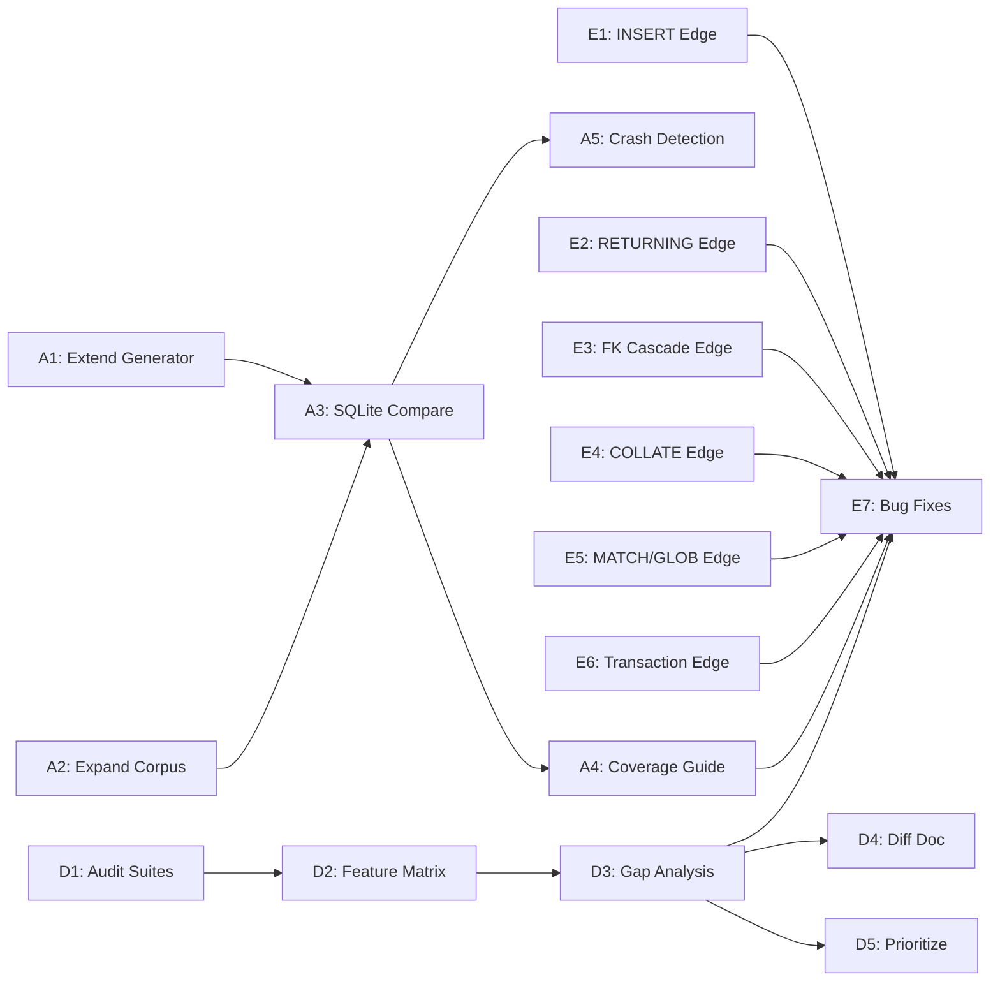

# Plan v0.9.7 - Quality & Stability Focus

## Summary

This version focuses on **finding and fixing bugs** through comprehensive testing strategies. No new features will be added. Three parallel tracks: Fuzzing, SQL:1999 Audit, and Edge Case Testing.

---

## Track A: Fuzzing Test Expansion

### Goal

Discover hidden bugs and edge cases through randomized SQL generation with SQLite comparison.

### Tasks

| # | Task | Description | Priority |
|---|------|-------------|----------|
| A1 | Extend SQL Generator | Add CTE, subqueries, window functions, RETURNING, UPSERT patterns | High |
| A2 | Expand Corpus | Cover v0.9.3-v0.9.6 features (INSERT OR REPLACE, FK cascade, COLLATE) | High |
| A3 | SQLite Auto-Compare | Run generated SQL against both engines, report differences | High |
| A4 | Coverage-Guided Fuzzing | Identify untested code paths, generate targeted cases | Medium |
| A5 | Crash Detection | Capture panics, assertion failures, memory issues | High |

### Success Criteria

| Criteria | Target | Status |
|----------|--------|--------|
| New SQL patterns generated | 50+ | [ ] |
| Fuzzer runs without crash | 10K+ iterations | [ ] |
| SQLite diff report generated | Yes | [ ] |
| Code coverage improved | +5% | [ ] |
| Bugs found & fixed | TBD | [ ] |

---

## Track D: SQL:1999 Compatibility Audit

### Goal

Systematically review SQL:1999 feature coverage and document gaps.

### Tasks

| # | Task | Description | Priority |
|---|------|-------------|----------|
| D1 | Audit All Test Suites | Review 90+ SQL:1999 test directories | High |
| D2 | Feature Matrix | Create comprehensive feature coverage table | High |
| D3 | Gap Analysis | Identify missing/incomplete features | High |
| D4 | SQLite Diff Doc | Document intentional divergences from SQLite | Medium |
| D5 | Prioritize Gaps | Rank missing features by usage frequency | Medium |

### Success Criteria

| Criteria | Target | Status |
|----------|--------|--------|
| All test suites reviewed | 100% | [ ] |
| Feature matrix created | Yes | [ ] |
| Missing features documented | Complete list | [ ] |
| SQLite diffs documented | All known | [ ] |
| Priority roadmap created | Yes | [ ] |

---

## Track E: Edge Case Deep Testing

### Goal

Deep testing of v0.9.3-v0.9.6 new features with focus on boundary conditions.

### E1: INSERT OR REPLACE / IGNORE Edge Cases

| Test Case | Description |
|-----------|-------------|
| Self-referencing FK | Row references itself via FK |
| Multi-column UNIQUE | REPLACE on composite unique constraint |
| NULL in UNIQUE column | Behavior with NULL in UNIQUE columns |
| Empty table | INSERT OR REPLACE on empty table |
| All columns NULL | INSERT OR REPLACE with all NULL values |

### E2: RETURNING Edge Cases

| Test Case | Description |
|-----------|-------------|
| Multi-row RETURNING | RETURNING on INSERT with multiple rows |
| RETURNING with triggers | Trigger interaction with RETURNING |
| RETURNING in transaction | RETURNING within BEGIN/COMMIT |
| RETURNING expressions | RETURNING col*2, UPPER(col), etc. |
| RETURNING with conflict | INSERT ON CONFLICT + RETURNING |

### E3: Foreign Key Cascade Edge Cases

| Test Case | Description |
|-----------|-------------|
| Deep cascade (3+ levels) | A→B→C→D cascade chain |
| Circular FK detection | A→B→A reference loop |
| SET NULL on non-nullable | Error handling |
| Cascade + trigger | Trigger fires during cascade |
| Self-referencing cascade | DELETE cascades to same table |

### E4: COLLATE Edge Cases

| Test Case | Description |
|-----------|-------------|
| Mixed collations | ORDER BY with multiple collations |
| COLLATE in JOIN | JOIN ON with different collations |
| Index + COLLATE | Index on COLLATE column |
| COLLATE change | ALTER TABLE modify collation |
| Unicode edge cases | Emoji, CJK, RTL text sorting |

### E5: MATCH/GLOB Edge Cases

| Test Case | Description |
|-----------|-------------|
| Empty pattern | col MATCH '' |
| Empty string | '' MATCH pattern |
| Long strings | 10KB+ strings |
| Special chars | %, _, [, ], *, ? in patterns |
| NULL handling | NULL MATCH pattern, col MATCH NULL |

### E6: Transaction Edge Cases

| Test Case | Description |
|-----------|-------------|
| Nested BEGIN | BEGIN within transaction |
| ROLLBACK without BEGIN | Error handling |
| COMMIT after ROLLBACK | State consistency |
| Savepoint depth | 10+ nested savepoints |
| ROLLBACK TO multiple | Jump back multiple savepoints |

### Success Criteria

| Criteria | Target | Status |
|----------|--------|--------|
| E1 tests created | 10+ | [ ] |
| E2 tests created | 10+ | [ ] |
| E3 tests created | 10+ | [ ] |
| E4 tests created | 10+ | [ ] |
| E5 tests created | 10+ | [ ] |
| E6 tests created | 10+ | [ ] |
| All tests pass | 100% | [ ] |
| Bugs found & fixed | TBD | [ ] |

---

## Timeline Estimate

| Track | Tasks | Hours |
|-------|-------|-------|
| A: Fuzzing | A1-A5 | 8h |
| D: SQL:1999 Audit | D1-D5 | 12h |
| E: Edge Cases | E1-E6 | 8h |
| Bug Fixes | As discovered | 6h |
| Documentation | Final report | 4h |

**Total:** ~38 hours

---

## Implementation DAG

---

## Expected Deliverables

### 1. Fuzzing Report

- SQL patterns tested
- Crashes/assertions found
- SQLite diffs discovered
- Code coverage metrics

### 2. SQL:1999 Feature Matrix

| Feature ID | Feature Name | Status | Notes |
|------------|--------------|--------|-------|
| E011 | Numeric data types | Complete | |
| E021 | Character string types | Complete | |
| ... | ... | ... | ... |

### 3. Edge Case Test Suite

- 60+ new test cases in `internal/TS/Regression/`
- All validated against SQLite
- Bug fixes with regression guards

### 4. Stability Report

- Bugs found (by category)
- Bugs fixed
- Remaining known issues
- Recommendations for v0.9.8

---

## Bug Categories

When bugs are found, categorize them:

| Category | Description | Example |
|----------|-------------|---------|
| P1-Critical | Crash, data loss, corruption | Assertion failure, panic |
| P2-High | Wrong results, constraint violation | FK not enforced, wrong aggregate |
| P3-Medium | SQLite incompatibility | Different error message, NULL handling |
| P4-Low | Performance, usability | Slow query, confusing error |

---

## Dependencies

- Existing test infrastructure (`internal/TS/`)
- SQLite for comparison testing
- Go fuzzing infrastructure (`testing.F`)
- Code coverage tools

---

## Success Metrics

| Metric | Target |
|--------|--------|
| Fuzzer iterations | 10,000+ |
| SQL:1999 features audited | 90+ |
| Edge case tests added | 60+ |
| Critical bugs fixed | 0 remaining |
| Code coverage | +5% |
| All tests passing | 100% |
