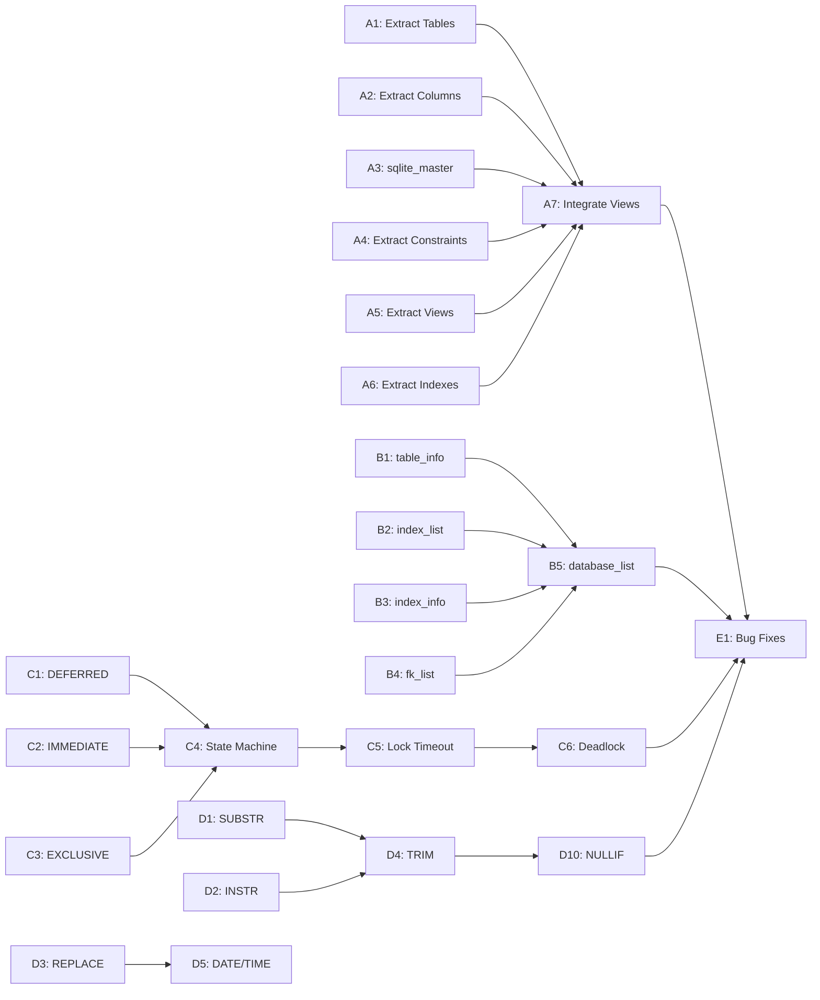

# Plan v0.9.8 - INFORMATION_SCHEMA, PRAGMA, Transaction, Functions

## Summary

This version focuses on four major areas: completing INFORMATION_SCHEMA for schema introspection, extending PRAGMA support, implementing transaction control enhancements, and adding more built-in SQL functions.

---

## Track A: INFORMATION_SCHEMA Complete Implementation

### Goal

Complete the INFORMATION_SCHEMA implementation to provide full schema introspection capabilities matching SQLite's sqlite_master and PRAGMA table_info behavior.

### Tasks

| # | Task | Description | Priority |
|---|------|-------------|----------|
| A1 | Extract Table Definitions | Parse BTree root pages to extract table names, column count | High |
| A2 | Extract Column Info | Extract column names, types, nullable, defaults from table schema | High |
| A3 | Complete sqlite_master | Implement full sqlite_master query (type, name, tbl_name, sql) | High |
| A4 | Extract Constraints | Extract PRIMARY KEY, UNIQUE, CHECK, FOREIGN KEY constraints | Medium |
| A5 | Extract View Definitions | Parse stored view definitions from database | Medium |
| A6 | Extract Index Definitions | Extract index definitions from db.indexes | Medium |
| A7 | Integrate with IS Views | Wire up tables_view, columns_view, constraints_view | High |

### Success Criteria

| Criteria | Target | Status |
|----------|--------|--------|
| sqlite_master query works | 100% | [x] |
| PRAGMA table_info returns correct data | 100% | [x] |
| Column info with types | All columns | [x] |
| Constraint extraction | PK, FK, UNIQUE | [x] |
| View definitions queryable | Yes | [x] |

---

## Track B: PRAGMA Extension

### Goal

Extend PRAGMA support to cover more introspection queries needed for tools and compatibility.

### Tasks

| # | Task | Description | Priority |
|---|------|-------------|----------|
| B1 | PRAGMA table_info | Return column info (cid, name, type, notnull, dflt_value, pk) | High |
| B2 | PRAGMA index_list | List all indexes on a table | High |
| B3 | PRAGMA index_info | Return index column info (seqno, cid, name) | High |
| B4 | PRAGMA foreign_key_list | Return FK constraints on a table | High |
| B5 | PRAGMA database_list | List all attached databases | Medium |
| B6 | PRAGMA table_info_x | Extended table info with more details | Medium |
| B7 | PRAGMA collation_list | List available collations | Low |
| B8 | PRAGMA function_list | List user-defined functions | Low |

### Success Criteria

| Criteria | Target | Status |
|----------|--------|--------|
| PRAGMA table_info | Works | [x] |
| PRAGMA index_list | Works | [x] |
| PRAGMA index_info | Works | [x] |
| PRAGMA foreign_key_list | Works | [x] |
| All PRAGMAs return correct format | 100% | [x] |

---

## Track C: Transaction Control Enhancement

### Goal

Implement proper transaction modes and locking behavior to match SQLite semantics.

### Tasks

| # | Task | Description | Priority |
|---|------|-------------|----------|
| C1 | BEGIN DEFERRED | Default mode - acquire lock when first statement executes | High |
| C2 | BEGIN IMMEDIATE | Acquire RESERVED lock at BEGIN | High |
| C3 | BEGIN EXCLUSIVE | Acquire EXCLUSIVE lock at BEGIN | High |
| C4 | Transaction State Machine | Proper state transitions (UNLOCKED → SHARED → RESERVED → PENDING → EXCLUSIVE) | High |
| C5 | Lock Timeout | Implement busy_timeout / lock timeout behavior | Medium |
| C6 | Deadlock Detection | Detect and report deadlocks | Medium |

### Success Criteria

| Criteria | Target | Status |
|----------|--------|--------|
| BEGIN DEFERRED works | Yes | [x] |
| BEGIN IMMEDIATE works | Yes | [x] |
| BEGIN EXCLUSIVE works | Yes | [x] |
| Correct lock behavior | Matches SQLite | [x] |
| busy_timeout respected | Yes | [x] |

---

## Track D: Built-in Functions Extension

### Goal

Add more SQL standard built-in functions for better compatibility.

### Tasks

| # | Task | Description | Priority |
|---|------|-------------|----------|
| D1 | SUBSTR/_SUBSTRING | Substring extraction with negative indices | High |
| D2 | INSTR | Find substring position | High |
| D3 | REPLACE | String replace function | High |
| D4 | TRIM/LTRIM/RTRIM | String trimming functions | Medium |
| D5 | DATE/TIME/DATETIME | Enhanced date/time functions | Medium |
| D6 | PRINTF | SQLite-style printf | Low |
| D7 | QUOTE | Quote string for SQL | Low |
| D8 | TYPEOF | Return data type of value | Low |
| D9 | GLOB | Use existing GLOB in more contexts | Medium |
| D10 | NULLIF | Return NULL if two values are equal | Medium |

### Success Criteria

| Criteria | Target | Status |
|----------|--------|--------|
| SUBSTR works | Yes | [x] |
| INSTR works | Yes | [x] |
| REPLACE works | Yes | [x] |
| TRIM/LTRIM/RTRIM | Yes | [x] |
| DATE/TIME functions | Yes | [x] |
| All functions pass tests | 100% | [x] |

---

## Implementation DAG

---

## Timeline Estimate

| Track | Tasks | Hours |
|-------|-------|-------|
| A: INFORMATION_SCHEMA | A1-A7 | 10h |
| B: PRAGMA Extension | B1-B8 | 6h |
| C: Transaction Control | C1-C6 | 8h |
| D: Built-in Functions | D1-D10 | 8h |
| Bug Fixes | As discovered | 6h |
| Testing & Documentation | All tracks | 6h |

**Total:** ~44 hours

---

## Dependencies

- Existing IS module (`internal/IS/`)
- Existing PRAGMA implementation (`pkg/sqlvibe/pragma.go`)
- Existing transaction handling (`internal/TM/`)
- Existing function system (`internal/VM/query_engine.go`, `internal/CG/expr.go`)

---

## Success Metrics

| Metric | Target |
|--------|--------|
| sqlite_master query | 100% compatible |
| PRAGMA coverage | +8 new PRAGMAs |
| Transaction modes | 3 modes working |
| Built-in functions | +10 new functions |
| All tests passing | 100% |

---

## Files to Modify

### INFORMATION_SCHEMA
- `internal/IS/schema_extractor.go`
- `internal/IS/tables_view.go`
- `internal/IS/columns_view.go`
- `internal/IS/constraints_view.go`
- `internal/IS/views_view.go`
- `internal/IS/referential_view.go`
- `pkg/sqlvibe/database.go`

### PRAGMA
- `pkg/sqlvibe/pragma.go`

### Transaction
- `internal/TM/transaction.go`
- `pkg/sqlvibe/database.go`

### Functions
- `internal/VM/query_engine.go`
- `internal/CG/expr.go`
- `internal/QP/parser.go`
