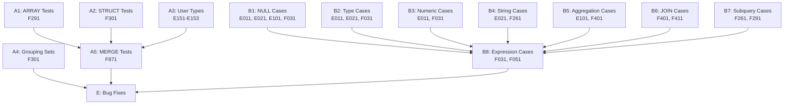

# Plan v0.9.9 - Test Suite Enhancement & Edge Cases

## Summary

This version focuses on expanding SQL:1999 test suite coverage with comprehensive edge cases to ensure robust behavior in boundary conditions.

---

## Track A: SQL:1999 Test Suite Expansion

### Goal

Complete the remaining SQL:1999 feature tests and add comprehensive edge case coverage.

### A1: ARRAY/LIST Type Tests (F291)

| # | Test | Description | Priority |
|---|------|-------------|----------|
| A1.1 | F291 Array Basic | Basic ARRAY type creation and query | High |
| A1.2 | F291 Array Insert | INSERT with ARRAY values | High |
| A1.3 | F291 Array Select | SELECT ARRAY elements | High |
| A1.4 | F291 Array Functions | ARRAY_LENGTH, ARRAY_AGG | High |
| A1.5 | F291 Nested Array | Multi-dimensional arrays | Medium |

### A2: STRUCT Type Tests (F301)

| # | Test | Description | Priority |
|---|------|-------------|----------|
| A2.1 | F301 Struct Basic | Basic STRUCT type | Medium |
| A2.2 | F301 Struct Query | Query STRUCT fields | Medium |
| A2.3 | F301 Struct Insert | INSERT with STRUCT | Medium |

### A3: User-Defined Types (E151-E153)

| # | Test | Description | Priority |
|---|------|-------------|----------|
| A3.1 | E151 Type Basic | CREATE TYPE basic | Medium |
| A3.2 | E152 Type Values | User-defined values | Low |
| A3.3 | E153 Type Methods | Type methods | Low |

### A4: Advanced Query Features (F051, F301)

| # | Test | Description | Priority |
|---|------|-------------|----------|
| A4.1 | F051 Fetch First | FETCH FIRST n ROWS ONLY | Medium |
| A4.2 | F051 Fetch Percent | FETCH FIRST n PERCENT | Low |
| A4.3 | F051 Fetch Ties | FETCH FIRST n ROWS WITH TIES | Low |
| A4.4 | F301 Grouping Sets | GROUP BY GROUPING SETS | Medium |
| A4.5 | F301 Rollup | ROLLUP(a, b, c) | Medium |
| A4.6 | F301 Cube | CUBE(a, b, c) | Low |

### A5: MERGE Statement (F871)

| # | Test | Description | Priority |
|---|------|-------------|----------|
| A5.1 | F871 Merge Basic | Basic MERGE INTO | High |
| A5.2 | F871 Merge Update | MERGE with UPDATE | High |
| A5.3 | F871 Merge Delete | MERGE with DELETE | High |
| A5.4 | F871 Merge Conditions | MERGE with WHEN MATCHED/NOT MATCHED | High |

### Success Criteria

| Criteria | Target | Status |
|----------|--------|--------|
| ARRAY tests added (F291) | 5+ | [ ] |
| STRUCT tests added (F301) | 3+ | [ ] |
| MERGE tests added (F871) | 4+ | [ ] |
| GROUPING SETS tests (F301) | 3+ | [ ] |
| All new tests pass | 100% | [ ] |

---

## Track B: Edge Case Testing (Feature-Based Grouping)

### Goal

Add extensive edge case tests organized by SQL:1999 feature packages.

### B1: NULL Handling (E011, E021, E101, F031)

| # | Test | Description | Feature |
|---|------|-------------|---------|
| B1.1 | E021_Null_IsNull | IS NULL / IS NOT NULL comparison | E021 |
| B1.2 | E021_Null_Coalesce | COALESCE with multiple NULLs | E021 |
| B1.3 | E021_Null_IfNull | IFNULL(NULL, default) behavior | E021 |
| B1.4 | E021_Null_NullIf | NULLIF(equal values) returns NULL | E021 |
| B1.5 | E101_Null_Aggregate | NULL handling in COUNT, SUM, AVG | E101 |
| B1.6 | F031_Null_Expression | NULL in arithmetic (+ - * /) | F031 |
| B1.7 | F051_Null_Distinct | DISTINCT with NULL values | F051 |
| B1.8 | F051_Null_Order | ORDER BY NULL ordering | F051 |

### B2: Type Conversion (E011, E021, F031)

| # | Test | Description | Feature |
|---|------|-------------|---------|
| B2.1 | E011_Type_ImplicitNum | Implicit string to number | E011 |
| B2.2 | E021_Type_ImplicitStr | Implicit number to string | E021 |
| B2.3 | E011_Type_CastBoundary | CAST on boundary values | E011 |
| B2.4 | E021_Type_Affinity | Type affinity rules | E021 |
| B2.5 | F031_Type_Expression | Type coercion in expressions | F031 |
| B2.6 | E011_Type_CastNull | CAST NULL behavior | E011 |

### B3: Numeric Boundaries (E011, F031)

| # | Test | Description | Feature |
|---|------|-------------|---------|
| B3.1 | E011_Num_Overflow | Integer overflow (+1, -1) | E011 |
| B3.2 | E011_Num_FloatPrec | Floating point precision (1.1 + 2.2) | E011 |
| B3.3 | F031_Num_DivZero | Division by zero handling | F031 |
| B3.4 | E011_Num_ModNegative | Negative modulo operations | E011 |
| B3.5 | E011_Num_Extreme | MIN/MAX value boundaries | E011 |
| B3.6 | E011_Num_Scientific | Scientific notation | E011 |

### B4: String Edge Cases (E021, F261)

| # | Test | Description | Feature |
|---|------|-------------|---------|
| B4.1 | E021_Str_Empty | Empty string '' behavior | E021 |
| B4.2 | E021_Str_Whitespace | Whitespace-only strings | E021 |
| B4.3 | F261_Str_SpecialChars | Special chars (\n, \t, ') | F261 |
| B4.4 | F261_Str_LikeEscape | LIKE escape sequences | F261 |
| B4.5 | F261_Str_GlobCase | GLOB case sensitivity | F261 |
| B4.6 | E021_Str_LengthBound | String length limits | E021 |

### B5: Aggregation Edge Cases (E101, F401)

| # | Test | Description | Feature |
|---|------|-------------|---------|
| B5.1 | E101_Agg_CountDistinctNull | COUNT(DISTINCT col) with NULL | E101 |
| B5.2 | E101_Agg_SumAvgNull | SUM/AVG with NULL values | E101 |
| B5.3 | F401_Agg_GroupByMixed | GROUP BY with mixed NULL | F401 |
| B5.4 | E101_Agg_EmptyTable | Aggregation on empty table | E101 |
| B5.5 | F401_Agg_String | String aggregation functions | F401 |
| B5.6 | F401_Agg_MultiColumn | Multi-column GROUP BY | F401 |

### B6: JOIN Edge Cases (F401, F411)

| # | Test | Description | Feature |
|---|------|-------------|---------|
| B6.1 | F411_Join_LeftNull | LEFT JOIN with NULL keys | F411 |
| B6.2 | F401_Join_CrossEmpty | CROSS JOIN with empty table | F401 |
| B6.3 | F401_Join_Self | Self-join behavior | F401 |
| B6.4 | F401_Join_MultiTable | Multi-table JOIN (5+ tables) | F401 |
| B6.5 | F411_Join_UsingOn | USING vs ON difference | F411 |
| B6.6 | F411_Join_Natural | NATURAL JOIN behavior | F411 |

### B7: Subquery Edge Cases (F261, F291)

| # | Test | Description | Feature |
|---|------|-------------|---------|
| B7.1 | F291_Sub_ScalarMulti | Scalar subquery returning multiple rows | F291 |
| B7.2 | F291_Sub_Correlated | Correlated subquery behavior | F291 |
| B7.3 | F291_Sub_Exists | EXISTS / NOT EXISTS edge cases | F291 |
| B7.4 | F291_Sub_InNull | IN / NOT IN with NULL values | F291 |
| B7.5 | F291_Sub_NestedDepth | Deep nested subqueries | F291 |

### B8: Expression Edge Cases (F031, F051)

| # | Test | Description | Feature |
|---|------|-------------|---------|
| B8.1 | F031_Expr_ShortCircuit | Short-circuit evaluation | F031 |
| B8.2 | F031_Expr_Precedence | Operator precedence | F031 |
| B8.3 | F031_Expr_CaseNull | CASE WHEN with NULL | F031 |
| B8.4 | F031_Expr_BetweenNull | BETWEEN with NULL | F031 |
| B8.5 | F051_Expr_Complex | Complex expression combinations | F051 |

### Success Criteria

| Criteria | Target | Status |
|----------|--------|--------|
| NULL edge case tests | 8+ | [ ] |
| Type conversion tests | 6+ | [ ] |
| Numeric boundary tests | 6+ | [ ] |
| String edge tests | 6+ | [ ] |
| Aggregation tests | 6+ | [ ] |
| JOIN edge tests | 6+ | [ ] |
| Subquery tests | 5+ | [ ] |
| Expression tests | 5+ | [ ] |
| All edge tests pass | 100% | [ ] |

---

## Implementation DAG



---

## Timeline Estimate

| Track | Tasks | Hours |
|-------|-------|-------|
| A: SQL:1999 Features | A1-A5 | 12h |
| B: Edge Cases | B1-B8 | 20h |
| Bug Fixes | As discovered | 8h |
| Testing & Documentation | All tracks | 4h |

**Total:** ~44 hours

---

## Dependencies

- Existing SQL:1999 test infrastructure (`internal/TS/SQL1999/`)
- Existing regression tests (`internal/TS/Regression/`)

---

## Success Metrics

| Metric | Target |
|--------|--------|
| New SQL:1999 tests | +15 |
| New edge case tests | +48 |
| Total test functions | 450+ |
| All tests passing | 100% |

---

## Test Package Organization

All edge case tests must be organized within existing feature packages:

```
internal/TS/SQL1999/
├── E011/                    # Add numeric edge cases
│   └── *_test.go            # Type, Numeric, Overflow tests
├── E021/                    # Add string/NULL edge cases  
│   └── *_test.go            # Type, String, NULL tests
├── E101/                    # Add aggregation edge cases
│   └── *_test.go            # Aggregation, NULL tests
├── F031/                    # Add expression edge cases
│   └── *_test.go            # Expression, NULL, Type tests
├── F051/                    # Add query result edge cases
│   └── *__test.go           # DISTINCT, ORDER, Expression tests
├── F261/                    # Add string/subquery tests
│   └── *_test.go            # String, Subquery tests
├── F291/                    # Add subquery edge cases
│   └── *_test.go            # Subquery edge tests
├── F301/                    # Add STRUCT, GROUPING SETS
│   └── *_test.go            # STRUCT, GROUPING tests
├── F401/                    # Add aggregation/JOIN edge
│   └── *_test.go            # Aggregation, JOIN tests
├── F411/                    # Add JOIN edge cases
│   └── *_test.go            # JOIN edge tests
├── F871/                    # Add MERGE tests
│   └── *_test.go            # MERGE tests
└── F291/                    # Add ARRAY tests (new directory)
    └── *_test.go            # ARRAY tests
```

---

## Files to Modify

### Test Suite Expansion (Add to existing packages)
- `internal/TS/SQL1999/E011/` - Add numeric/type edge cases
- `internal/TS/SQL1999/E021/` - Add string/NULL edge cases
- `internal/TS/SQL1999/E101/` - Add aggregation edge cases
- `internal/TS/SQL1999/F031/` - Add expression edge cases
- `internal/TS/SQL1999/F051/` - Add query result edge cases
- `internal/TS/SQL1999/F261/` - Add string/subquery edge cases
- `internal/TS/SQL1999/F291/` - Add ARRAY tests (new)
- `internal/TS/SQL1999/F301/` - Add STRUCT, GROUPING SETS
- `internal/TS/SQL1999/F401/` - Add aggregation/JOIN edge
- `internal/TS/SQL1999/F411/` - Add JOIN edge cases
- `internal/TS/SQL1999/F871/` - Add MERGE tests

---

## Test Coverage Summary

After v0.9.9:

| Category | Before | After |
|----------|--------|-------|
| SQL:1999 Test Suites | 92 | 93 |
| Test Functions | 396 | 440+ |
| NULL Edge Cases | Partial | Complete (8+) |
| Type Conversion | Basic | Complete (6+) |
| Numeric Boundaries | Basic | Complete (6+) |
| String Edge Cases | Basic | Complete (6+) |
| Aggregation Edge | Basic | Complete (6+) |
| JOIN Edge | Basic | Complete (6+) |
| Subquery Edge | Basic | Complete (5+) |
| Expression Edge | Basic | Complete (5+) |
