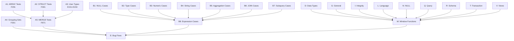

# Plan v0.9.9 - Test Suite Enhancement & Complete SQL Standard Coverage

## Summary

This version focuses on expanding SQL:1999 test suite coverage with comprehensive edge cases and adds support for all SQL standard test series (E, F, B, C, D, G, I, J, K, L, N, O, P, Q, R, S, T, V, W).

---

## Track A: SQL:1999 Test Suite Expansion

### Goal

Complete the remaining SQL:1999 feature tests and add comprehensive edge case coverage.

### A1: ARRAY/LIST Type Tests (F291)

| # | Test | Description | Priority |
|---|------|-------------|----------|
| A1.1 | F291 Array Basic | Basic ARRAY type creation and query | High |
| A1.2 | F291 Array Insert | INSERT with ARRAY values | High |
| A1.3 | F291 Array Select | SELECT ARRAY elements | High |
| A1.4 | F291 Array Functions | ARRAY_LENGTH, ARRAY_AGG | High |
| A1.5 | F291 Nested Array | Multi-dimensional arrays | Medium |

### A2: STRUCT Type Tests (F301)

| # | Test | Description | Priority |
|---|------|-------------|----------|
| A2.1 | F301 Struct Basic | Basic STRUCT type | Medium |
| A2.2 | F301 Struct Query | Query STRUCT fields | Medium |
| A2.3 | F301 Struct Insert | INSERT with STRUCT | Medium |

### A3: User-Defined Types (E151-E153)

| # | Test | Description | Priority |
|---|------|-------------|----------|
| A3.1 | E151 Type Basic | CREATE TYPE basic | Medium |
| A3.2 | E152 Type Values | User-defined values | Low |
| A3.3 | E153 Type Methods | Type methods | Low |

### A4: Advanced Query Features (F051, F301)

| # | Test | Description | Priority |
|---|------|-------------|----------|
| A4.1 | F051 Fetch First | FETCH FIRST n ROWS ONLY | Medium |
| A4.2 | F051 Fetch Percent | FETCH FIRST n PERCENT | Low |
| A4.3 | F051 Fetch Ties | FETCH FIRST n ROWS WITH TIES | Low |
| A4.4 | F301 Grouping Sets | GROUP BY GROUPING SETS | Medium |
| A4.5 | F301 Rollup | ROLLUP(a, b, c) | Medium |
| A4.6 | F301 Cube | CUBE(a, b, c) | Low |

### A5: MERGE Statement (F871)

| # | Test | Description | Priority |
|---|------|-------------|----------|
| A5.1 | F871 Merge Basic | Basic MERGE INTO | High |
| A5.2 | F871 Merge Update | MERGE with UPDATE | High |
| A5.3 | F871 Merge Delete | MERGE with DELETE | High |
| A5.4 | F871 Merge Conditions | MERGE with WHEN MATCHED/NOT MATCHED | High |

### Success Criteria

| Criteria | Target | Status |
|----------|--------|--------|
| ARRAY tests added (F291) | 5+ | [ ] |
| STRUCT tests added (F301) | 3+ | [ ] |
| MERGE tests added (F871) | 4+ | [ ] |
| GROUPING SETS tests (F301) | 3+ | [ ] |
| All new tests pass | 100% | [ ] |

---

## Track B: Edge Case Testing (Feature-Based Grouping)

### Goal

Add extensive edge case tests organized by SQL:1999 feature packages.

### B1: NULL Handling (E011, E021, E101, F031)

| # | Test | Description | Feature |
|---|------|-------------|---------|
| B1.1 | E021_Null_IsNull | IS NULL / IS NOT NULL comparison | E021 |
| B1.2 | E021_Null_Coalesce | COALESCE with multiple NULLs | E021 |
| B1.3 | E021_Null_IfNull | IFNULL(NULL, default) behavior | E021 |
| B1.4 | E021_Null_NullIf | NULLIF(equal values) returns NULL | E021 |
| B1.5 | E101_Null_Aggregate | NULL handling in COUNT, SUM, AVG | E101 |
| B1.6 | F031_Null_Expression | NULL in arithmetic (+ - * /) | F031 |
| B1.7 | F051_Null_Distinct | DISTINCT with NULL values | F051 |
| B1.8 | F051_Null_Order | ORDER BY NULL ordering | F051 |

### B2: Type Conversion (E011, E021, F031)

| # | Test | Description | Feature |
|---|------|-------------|---------|
| B2.1 | E011_Type_ImplicitNum | Implicit string to number | E011 |
| B2.2 | E021_Type_ImplicitStr | Implicit number to string | E021 |
| B2.3 | E011_Type_CastBoundary | CAST on boundary values | E011 |
| B2.4 | E021_Type_Affinity | Type affinity rules | E021 |
| B2.5 | F031_Type_Expression | Type coercion in expressions | F031 |
| B2.6 | E011_Type_CastNull | CAST NULL behavior | E011 |

### B3: Numeric Boundaries (E011, F031)

| # | Test | Description | Feature |
|---|------|-------------|---------|
| B3.1 | E011_Num_Overflow | Integer overflow (+1, -1) | E011 |
| B3.2 | E011_Num_FloatPrec | Floating point precision (1.1 + 2.2) | E011 |
| B3.3 | F031_Num_DivZero | Division by zero handling | F031 |
| B3.4 | E011_Num_ModNegative | Negative modulo operations | E011 |
| B3.5 | E011_Num_Extreme | MIN/MAX value boundaries | E011 |
| B3.6 | E011_Num_Scientific | Scientific notation | E011 |

### B4: String Edge Cases (E021, F261)

| # | Test | Description | Feature |
|---|------|-------------|---------|
| B4.1 | E021_Str_Empty | Empty string '' behavior | E021 |
| B4.2 | E021_Str_Whitespace | Whitespace-only strings | E021 |
| B4.3 | F261_Str_SpecialChars | Special chars (\n, \t, ') | F261 |
| B4.4 | F261_Str_LikeEscape | LIKE escape sequences | F261 |
| B4.5 | F261_Str_GlobCase | GLOB case sensitivity | F261 |
| B4.6 | E021_Str_LengthBound | String length limits | E021 |

### B5: Aggregation Edge Cases (E101, F401)

| # | Test | Description | Feature |
|---|------|-------------|---------|
| B5.1 | E101_Agg_CountDistinctNull | COUNT(DISTINCT col) with NULL | E101 |
| B5.2 | E101_Agg_SumAvgNull | SUM/AVG with NULL values | E101 |
| B5.3 | F401_Agg_GroupByMixed | GROUP BY with mixed NULL | F401 |
| B5.4 | E101_Agg_EmptyTable | Aggregation on empty table | E101 |
| B5.5 | F401_Agg_String | String aggregation functions | F401 |
| B5.6 | F401_Agg_MultiColumn | Multi-column GROUP BY | F401 |

### B6: JOIN Edge Cases (F401, F411)

| # | Test | Description | Feature |
|---|------|-------------|---------|
| B6.1 | F411_Join_LeftNull | LEFT JOIN with NULL keys | F411 |
| B6.2 | F401_Join_CrossEmpty | CROSS JOIN with empty table | F401 |
| B6.3 | F401_Join_Self | Self-join behavior | F401 |
| B6.4 | F401_Join_MultiTable | Multi-table JOIN (5+ tables) | F401 |
| B6.5 | F411_Join_UsingOn | USING vs ON difference | F411 |
| B6.6 | F411_Join_Natural | NATURAL JOIN behavior | F411 |

### B7: Subquery Edge Cases (F261, F291)

| # | Test | Description | Feature |
|---|------|-------------|---------|
| B7.1 | F291_Sub_ScalarMulti | Scalar subquery returning multiple rows | F291 |
| B7.2 | F291_Sub_Correlated | Correlated subquery behavior | F291 |
| B7.3 | F291_Sub_Exists | EXISTS / NOT EXISTS edge cases | F291 |
| B7.4 | F291_Sub_InNull | IN / NOT IN with NULL values | F291 |
| B7.5 | F291_Sub_NestedDepth | Deep nested subqueries | F291 |

### B8: Expression Edge Cases (F031, F051)

| # | Test | Description | Feature |
|---|------|-------------|---------|
| B8.1 | F031_Expr_ShortCircuit | Short-circuit evaluation | F031 |
| B8.2 | F031_Expr_Precedence | Operator precedence | F031 |
| B8.3 | F031_Expr_CaseNull | CASE WHEN with NULL | F031 |
| B8.4 | F031_Expr_BetweenNull | BETWEEN with NULL | F031 |
| B8.5 | F051_Expr_Complex | Complex expression combinations | F051 |

### Success Criteria

| Criteria | Target | Status |
|----------|--------|--------|
| NULL edge case tests | 8+ | [ ] |
| Type conversion tests | 6+ | [ ] |
| Numeric boundary tests | 6+ | [ ] |
| String edge tests | 6+ | [ ] |
| Aggregation tests | 6+ | [ ] |
| JOIN edge tests | 6+ | [ ] |
| Subquery tests | 5+ | [ ] |
| Expression tests | 5+ | [ ] |
| All edge tests pass | 100% | [ ] |

---

## Track C: Complete SQL Standard Test Series

### Goal

Add support for all SQL standard test series beyond E and F.

### Series Overview

| Series | Description | Priority | Status |
|--------|-------------|----------|--------|
| **B** | SQL/CLI (Call Level Interface) | Low | [ ] |
| **C** | SQL/Compatibility | Low | [ ] |
| **D** | SQL/Data Types | High | [ ] |
| **G** | SQL/General Features | Medium | [ ] |
| **I** | SQL/Integrity Enhancement | Medium | [ ] |
| **J** | SQL/PSM (Persistent Stored Modules) | Low | [ ] |
| **K** | SQL/Key and Locking | Low | [ ] |
| **L** | SQL/Language Elements | High | [ ] |
| **N** | SQL/NULL | High | [ ] |
| **O** | SQL/Object | Medium | [ ] |
| **P** | SQL/PSM (Procedural) | Low | [ ] |
| **Q** | SQL/Query | High | [ ] |
| **R** | SQL/Schema (Reference) | Medium | [ ] |
| **T** | SQL/Transaction | High | [ ] |
| **V** | SQL/Views | Medium | [ ] |
| **W** | SQL/Window Functions | High | [ ] |

### C1: D Series - Data Types

| # | Test | Description | Priority |
|---|------|-------------|----------|
| C1.1 | D011_Varchar | VARCHAR type support | High |
| C1.2 | D012_Char | CHAR type and padding | High |
| C1.3 | D013_Boolean | BOOLEAN type | High |
| C1.4 | D014_Decimal | DECIMAL/NUMERIC type | High |
| C1.5 | D015_DateTime | DATE, TIME, TIMESTAMP types | High |
| C1.6 | D016_Blob | BLOB/BINARY types | Medium |
| C1.7 | D017_Interval | INTERVAL type | Medium |

### C2: G Series - General Features

| # | Test | Description | Priority |
|---|------|-------------|----------|
| C2.1 | G011_SchemaDefinition | CREATE/ALTER/DROP SCHEMA | Medium |
| C2.2 | G012_Catalog | Catalog operations | Low |
| C2.3 | G013_InformationSchema | INFORMATION_SCHEMA views | High |

### C3: I Series - Integrity Enhancement

| # | Test | Description | Priority |
|---|------|-------------|----------|
| C3.1 | I011_Referential | Foreign key constraints | High |
| C3.2 | I012_CheckConstraint | CHECK constraints | High |
| C3.3 | I013_UniqueConstraint | UNIQUE constraints | High |
| C3.4 | I014_NotNullConstraint | NOT NULL constraints | High |
| C3.5 | I015_PrimaryKey | PRIMARY KEY constraints | High |

### C4: L Series - Language Elements

| # | Test | Description | Priority |
|---|------|-------------|----------|
| C4.1 | L011_ReservedWords | SQL reserved words | High |
| C4.2 | L012_Identifiers | Identifier rules (quoted, delimited) | High |
| C4.3 | L013_Expressions | Expression syntax | High |
| C4.4 | L014_Predicates | Comparison predicates | High |
| C4.5 | L015_Functions | Scalar and aggregate functions | High |

### C5: N Series - NULL Handling

| # | Test | Description | Priority |
|---|------|-------------|----------|
| C5.1 | N011_NullComparison | IS NULL, IS NOT NULL | High |
| C5.2 | N012_NullLogic | NULL in AND/OR/NOT | High |
| C5.3 | N013_NullCoalesce | COALESCE function | High |
| C5.4 | N014_NullIf | NULLIF function | High |
| C5.5 | N015_NullCast | CAST NULL behavior | High |

### C6: Q Series - Query

| # | Test | Description | Priority |
|---|------|-------------|----------|
| Q1.1 | Q011_SelectBasic | Basic SELECT | High |
| Q2.1 | Q021_JoinSyntax | JOIN syntax variants | High |
| Q3.1 | Q031_Subquery | Subqueries | High |
| Q4.1 | Q041_SetOperations | UNION, INTERSECT, EXCEPT | High |
| Q5.1 | Q051_GroupBy | GROUP BY, HAVING | High |
| Q6.1 | Q061_OrderBy | ORDER BY | High |

### C7: R Series - Schema

| # | Test | Description | Priority |
|---|------|-------------|----------|
| C7.1 | R011_CreateTable | CREATE TABLE | High |
| C7.2 | R012_AlterTable | ALTER TABLE | High |
| C7.3 | R013_DropTable | DROP TABLE | High |
| C7.4 | R014_CreateIndex | CREATE INDEX | High |
| C7.5 | R015_DropIndex | DROP INDEX | High |

### C8: T Series - Transaction

| # | Test | Description | Priority |
|---|------|-------------|----------|
| C8.1 | T011_TransactionBasic | BEGIN/COMMIT/ROLLBACK | High |
| C8.2 | T012_Savepoint | SAVEPOINT support | High |
| C8.3 | T013_Autocommit | Autocommit behavior | Medium |
| C8.4 | T014_Isolation | Transaction isolation levels | Medium |
| C8.5 | T015_DeferredConstraint | Deferred constraints | Medium |

### C9: V Series - Views

| # | Test | Description | Priority |
|---|------|-------------|----------|
| C9.1 | V011_CreateView | CREATE VIEW | High |
| C9.2 | V012_DropView | DROP VIEW | High |
| C9.3 | V013_UpdatableView | Updatable views | Medium |
| C9.4 | V014_RecursiveView | Recursive views | Medium |

### C10: W Series - Window Functions

| # | Test | Description | Priority |
|---|------|-------------|----------|
| C10.1 | W011_RowNumber | ROW_NUMBER() | High |
| C10.2 | W012_Rank | RANK(), DENSE_RANK() | High |
| C10.3 | W013_Ntile | NTILE() | Medium |
| C10.4 | W014_LagLead | LAG(), LEAD() | High |
| C10.5 | W015_FirstLast | FIRST_VALUE(), LAST_VALUE() | High |
| C10.6 | W016_NthValue | NTH_VALUE() | Medium |

### Success Criteria

| Series | Tests Target | Status |
|--------|--------------|--------|
| D - Data Types | 7+ | [ ] |
| G - General | 3+ | [ ] |
| I - Integrity | 5+ | [ ] |
| L - Language | 5+ | [ ] |
| N - NULL | 5+ | [ ] |
| Q - Query | 6+ | [ ] |
| R - Schema | 5+ | [ ] |
| T - Transaction | 5+ | [ ] |
| V - Views | 4+ | [ ] |
| W - Window | 6+ | [ ] |
| All new tests pass | 100% | [ ] |

---

## Implementation DAG



---

## Timeline Estimate

| Track | Tasks | Hours |
|-------|-------|-------|
| A: SQL:1999 Features | A1-A5 | 12h |
| B: Edge Cases | B1-B8 | 20h |
| C: Complete Series | C1-C10 | 24h |
| Bug Fixes | As discovered | 10h |
| Testing & Documentation | All tracks | 6h |

**Total:** ~72 hours

---

## Dependencies

- Existing SQL:1999 test infrastructure (`internal/TS/SQL1999/`)
- Existing regression tests (`internal/TS/Regression/`)

---

## Success Metrics

| Metric | Target |
|--------|--------|
| New SQL:1999 tests | +15 |
| New edge case tests | +48 |
| New series tests | +51 |
| Total test functions | 500+ |
| All tests passing | 100% |

---

## Test Package Organization

Complete test series to add:

```
internal/TS/SQL1999/
├── E011/          # Existing: INTEGER types
├── E021/          # Existing: Character types
├── E031/          # Existing: Identifier
├── E041/          # Existing: Table definition
├── E051/          # Existing: Constraint
├── E061/          # Existing: Constraint
├── E071/          # Existing: View
├── E081/          # Existing: Transaction
├── E091/          # Existing: NULL
├── E101/          # Existing: Aggregate
├── E111/          # Existing: Scalar
├── E121/          # Existing: Table expression
├── E131/          # Existing: Query expression
├── E141/          # Existing: Sequence
├── E151/          # Existing: Distinct type
├── E161/          # Existing: Schema
├── E171/          # Existing: Module
├── F011/          # Existing: View
├── F021/          # Existing: Table
├── F031/          # Existing: Trigger
├── F041/          # Existing: Transaction
├── F051/          # Existing: Query
├── F261/          # Existing: String
├── F291/          # Existing: Subquery
├── F301/          # Existing: Expressions
├── F401/          # Existing: Join
├── F411/          # Existing: Join
├── F871/          # Existing: Upsert
├── F874/          # Existing: Function
├── F875/          # Existing: UPSERT
├── F876/          # Existing: Index
├── F878/          # Existing: RETURNING
├── F879/          # Existing: SAVEPOINT
├── D011/          # NEW: VARCHAR
├── D012/          # NEW: CHAR
├── D013/          # NEW: BOOLEAN
├── D014/          # NEW: DECIMAL
├── D015/          # NEW: DateTime
├── D016/          # NEW: BLOB
├── D017/          # NEW: INTERVAL
├── G011/          # NEW: Schema Definition
├── G012/          # NEW: Catalog
├── G013/          # NEW: Information Schema
├── I011/          # NEW: Referential
├── I012/          # NEW: Check Constraint
├── I013/          # NEW: Unique Constraint
├── I014/          # NEW: Not Null Constraint
├── I015/          # NEW: Primary Key
├── L011/          # NEW: Reserved Words
├── L012/          # NEW: Identifiers
├── L013/          # NEW: Expressions
├── L014/          # NEW: Predicates
├── L015/          # NEW: Functions
├── N011/          # NEW: NULL Comparison
├── N012/          # NEW: NULL Logic
├── N013/          # NEW: COALESCE
├── N014/          # NEW: NULLIF
├── N015/          # NEW: CAST NULL
├── Q011/          # NEW: SELECT Basic
├── Q021/          # NEW: JOIN Syntax
├── Q031/          # NEW: Subquery
├── Q041/          # NEW: Set Operations
├── Q051/          # NEW: GROUP BY
├── Q061/          # NEW: ORDER BY
├── R011/          # NEW: CREATE TABLE
├── R012/          # NEW: ALTER TABLE
├── R013/          # NEW: DROP TABLE
├── R014/          # NEW: CREATE INDEX
├── R015/          # NEW: DROP INDEX
├── T011/          # NEW: Transaction Basic
├── T012/          # NEW: Savepoint
├── T013/          # NEW: Autocommit
├── T014/          # NEW: Isolation
├── T015/          # NEW: Deferred Constraint
├── V011/          # NEW: CREATE VIEW
├── V012/          # NEW: DROP VIEW
├── V013/          # NEW: Updatable View
├── V014/          # NEW: Recursive View
├── W011/          # NEW: ROW_NUMBER
├── W012/          # NEW: RANK
├── W013/          # NEW: NTILE
├── W014/          # NEW: LAG/LEAD
├── W015/          # NEW: FIRST/LAST VALUE
└── W016/          # NEW: NTH_VALUE
```

---

## Files to Modify

### Test Suite Expansion (Add to existing packages)
- `internal/TS/SQL1999/E011/` - Add numeric/type edge cases
- `internal/TS/SQL1999/E021/` - Add string/NULL edge cases
- `internal/TS/SQL1999/E101/` - Add aggregation edge cases
- `internal/TS/SQL1999/F031/` - Add expression edge cases
- `internal/TS/SQL1999/F051/` - Add query result edge cases
- `internal/TS/SQL1999/F261/` - Add string/subquery edge cases
- `internal/TS/SQL1999/F291/` - Add ARRAY tests (new)
- `internal/TS/SQL1999/F301/` - Add STRUCT, GROUPING SETS
- `internal/TS/SQL1999/F401/` - Add aggregation/JOIN edge
- `internal/TS/SQL1999/F411/` - Add JOIN edge cases
- `internal/TS/SQL1999/F871/` - Add MERGE tests

### New Test Packages
- `internal/TS/SQL1999/D011/` - VARCHAR type
- `internal/TS/SQL1999/D012/` - CHAR type
- `internal/TS/SQL1999/D013/` - BOOLEAN type
- `internal/TS/SQL1999/D014/` - DECIMAL type
- `internal/TS/SQL1999/D015/` - DateTime type
- `internal/TS/SQL1999/D016/` - BLOB type
- `internal/TS/SQL1999/D017/` - INTERVAL type
- `internal/TS/SQL1999/G011/` - Schema Definition
- `internal/TS/SQL1999/G012/` - Catalog
- `internal/TS/SQL1999/G013/` - Information Schema
- `internal/TS/SQL1999/I011/` - Referential Integrity
- `internal/TS/SQL1999/I012/` - Check Constraint
- `internal/TS/SQL1999/I013/` - Unique Constraint
- `internal/TS/SQL1999/I014/` - Not Null Constraint
- `internal/TS/SQL1999/I015/` - Primary Key
- `internal/TS/SQL1999/L011/` - Reserved Words
- `internal/TS/SQL1999/L012/` - Identifiers
- `internal/TS/SQL1999/L013/` - Expressions
- `internal/TS/SQL1999/L014/` - Predicates
- `internal/TS/SQL1999/L015/` - Functions
- `internal/TS/SQL1999/N011/` - NULL Comparison
- `internal/TS/SQL1999/N012/` - NULL Logic
- `internal/TS/SQL1999/N013/` - COALESCE
- `internal/TS/SQL1999/N014/` - NULLIF
- `internal/TS/SQL1999/N015/` - CAST NULL
- `internal/TS/SQL1999/Q011/` - SELECT Basic
- `internal/TS/SQL1999/Q021/` - JOIN Syntax
- `internal/TS/SQL1999/Q031/` - Subquery
- `internal/TS/SQL1999/Q041/` - Set Operations
- `internal/TS/SQL1999/Q051/` - GROUP BY
- `internal/TS/SQL1999/Q061/` - ORDER BY
- `internal/TS/SQL1999/R011/` - CREATE TABLE
- `internal/TS/SQL1999/R012/` - ALTER TABLE
- `internal/TS/SQL1999/R013/` - DROP TABLE
- `internal/TS/SQL1999/R014/` - CREATE INDEX
- `internal/TS/SQL1999/R015/` - DROP INDEX
- `internal/TS/SQL1999/T011/` - Transaction Basic
- `internal/TS/SQL1999/T012/` - Savepoint
- `internal/TS/SQL1999/T013/` - Autocommit
- `internal/TS/SQL1999/T014/` - Isolation
- `internal/TS/SQL1999/T015/` - Deferred Constraint
- `internal/TS/SQL1999/V011/` - CREATE VIEW
- `internal/TS/SQL1999/V012/` - DROP VIEW
- `internal/TS/SQL1999/V013/` - Updatable View
- `internal/TS/SQL1999/V014/` - Recursive View
- `internal/TS/SQL1999/W011/` - ROW_NUMBER
- `internal/TS/SQL1999/W012/` - RANK
- `internal/TS/SQL1999/W013/` - NTILE
- `internal/TS/SQL1999/W014/` - LAG/LEAD
- `internal/TS/SQL1999/W015/` - FIRST/LAST VALUE
- `internal/TS/SQL1999/W016/` - NTH_VALUE

---

## Test Coverage Summary

After v0.9.9:

| Series | Before | After |
|--------|--------|-------|
| E - Embedded SQL | 17 | 17+ |
| F - Functional | 75 | 80+ |
| D - Data Types | 0 | 7+ |
| G - General | 0 | 3+ |
| I - Integrity | 0 | 5+ |
| L - Language | 0 | 5+ |
| N - NULL | 0 | 5+ |
| Q - Query | 0 | 6+ |
| R - Schema | 0 | 5+ |
| T - Transaction | 0 | 5+ |
| V - Views | 0 | 4+ |
| W - Window Functions | 6 | 12+ |
| **Total Test Suites** | **92** | **115+** |
| **Total Test Functions** | **396** | **500+** |
