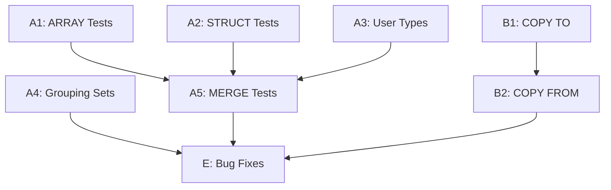

# Plan v0.9.9 - Test Suite Enhancement & COPY Support

## Summary

This version focuses on two major areas: expanding the SQL:1999 test suite coverage and adding COPY statement for data import/export.

---

## Track A: SQL:1999 Test Suite Expansion

### Goal

Complete the remaining SQL:1999 feature tests to achieve comprehensive coverage.

### A1: ARRAY/LIST Type Tests

| # | Test | Description | Priority |
|---|------|-------------|----------|
| A1.1 | F291 Array Basic | Basic ARRAY type creation and query | High |
| A1.2 | F291 Array Insert | INSERT with ARRAY values | High |
| A1.3 | F291 Array Select | SELECT ARRAY elements | High |
| A1.4 | F291 Array Functions | ARRAY_LENGTH, ARRAY_AGG | High |
| A1.5 | F291 Nested Array | Multi-dimensional arrays | Medium |

### A2: STRUCT Type Tests

| # | Test | Description | Priority |
|---|------|-------------|----------|
| A2.1 | F301 Struct Basic | Basic STRUCT type | Medium |
| A2.2 | F301 Struct Query | Query STRUCT fields | Medium |
| A2.3 | F301 Struct Insert | INSERT with STRUCT | Medium |

### A3: User-Defined Types

| # | Test | Description | Priority |
|---|------|-------------|----------|
| A3.1 | E151 Type Basic | CREATE TYPE basic | Medium |
| A3.2 | E152 Type Values | User-defined values | Low |
| A3.3 | E153 Type Methods | Type methods | Low |

### A4: Advanced Query Features

| # | Test | Description | Priority |
|---|------|-------------|----------|
| A4.1 | F051 Fetch First | FETCH FIRST n ROWS ONLY | Medium |
| A4.2 | F051 Fetch Percent | FETCH FIRST n PERCENT | Low |
| A4.3 | F051 Fetch Ties | FETCH FIRST n ROWS WITH TIES | Low |
| A4.4 | F301 Grouping Sets | GROUP BY GROUPING SETS | Medium |
| A4.5 | F301 Rollup | ROLLUP(a, b, c) | Medium |
| A4.6 | F301 Cube | CUBE(a, b, c) | Low |

### A5: MERGE Statement

| # | Test | Description | Priority |
|---|------|-------------|----------|
| A5.1 | F871 Merge Basic | Basic MERGE INTO | High |
| A5.2 | F871 Merge Update | MERGE with UPDATE | High |
| A5.3 | F871 Merge Delete | MERGE with DELETE | High |
| A5.4 | F871 Merge Conditions | MERGE with WHEN MATCHED/NOT MATCHED | High |

### Success Criteria

| Criteria | Target | Status |
|----------|--------|--------|
| ARRAY tests added | 5+ | [ ] |
| STRUCT tests added | 3+ | [ ] |
| MERGE tests added | 4+ | [ ] |
| GROUPING SETS tests | 3+ | [ ] |
| All new tests pass | 100% | [ ] |

---

## Track B: COPY Statement Implementation

### Goal

Add data import/export capability.

### B1: COPY TO

| # | Task | Description | Priority |
|---|------|-------------|----------|
| B1.1 | COPY TO CSV | Export to CSV file | High |
| B1.2 | COPY TO JSON | Export to JSON file | Medium |

### B2: COPY FROM

| # | Task | Description | Priority |
|---|------|-------------|----------|
| B2.1 | COPY FROM CSV | Import from CSV file | High |
| B2.2 | COPY FROM JSON | Import from JSON file | Medium |

### Success Criteria

| Criteria | Target | Status |
|----------|--------|--------|
| COPY TO CSV works | Yes | [ ] |
| COPY FROM CSV works | Yes | [ ] |
| COPY TO JSON works | Yes | [ ] |
| COPY FROM JSON works | Yes | [ ] |

---

## Implementation DAG

---

## Timeline Estimate

| Track | Tasks | Hours |
|-------|-------|-------|
| A: Test Suite | A1-A5 | 12h |
| B: COPY | B1-B2 | 6h |
| Bug Fixes | As discovered | 6h |
| Testing & Documentation | All tracks | 4h |

**Total:** ~28 hours

---

## Dependencies

- Existing SQL:1999 test infrastructure (`internal/TS/SQL1999/`)
- Existing regression tests (`internal/TS/Regression/`)

---

## Success Metrics

| Metric | Target |
|--------|--------|
| New SQL:1999 tests | +15 |
| COPY functionality | CSV + JSON |
| Binary size | < 7MB |
| All tests passing | 100% |

---

## Files to Modify

### Test Suite
- `internal/TS/SQL1999/F291/` - New directory for ARRAY tests
- `internal/TS/SQL1999/F301/` - New directory for STRUCT tests
- `internal/TS/SQL1999/F871/` - Add MERGE tests

### COPY Implementation
- `pkg/sqlvibe/copy.go` - New COPY statement handler
- `internal/QP/parser.go` - Add COPY syntax

---

## Test Coverage Summary

After v0.9.9:

| Category | Before | After |
|----------|--------|-------|
| SQL:1999 Test Suites | 92 | 95+ |
| Test Functions | 396 | 410+ |
| COPY Tests | 0 | 4+ |
