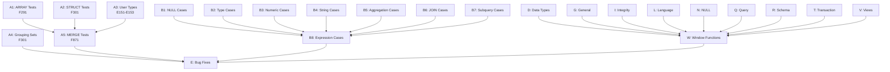

# Plan v0.9.9 - Test Suite Enhancement & Complete SQL Standard Coverage

## Summary

This version focuses on expanding SQL:1999 test suite coverage with comprehensive edge cases and adds support for all SQL standard test series (E, F, B, C, D, G, I, J, K, L, N, O, P, Q, R, S, T, V, W).

## Naming Convention

All test cases must follow the unified naming format:

```
Test_SQL1999_[FeatureNo]_[Description]_L1
```

Examples:
- `Test_SQL1999_F291_ArrayBasic_L1`
- `Test_N011_IsNull_SQL1999_L1`
- `Test_SQL1999_T011_TransactionBasic_L1`

---

## Track A: SQL:1999 Test Suite Expansion

### Goal

Complete the remaining SQL:1999 feature tests and add comprehensive edge case coverage.

### A1: ARRAY/LIST Type Tests (F291)

| # | Test Case | Description | Priority |
|---|-----------|-------------|----------|
| A1.1 | Test_SQL1999_F291_ArrayBasic_L1 | Basic ARRAY type creation and query | High |
| A1.2 | Test_SQL1999_F291_ArrayInsert_L1 | INSERT with ARRAY values | High |
| A1.3 | Test_SQL1999_F291_ArraySelect_L1 | SELECT ARRAY elements | High |
| A1.4 | Test_SQL1999_F291_ArrayFunctions_L1 | ARRAY_LENGTH, ARRAY_AGG | High |
| A1.5 | Test_SQL1999_F291_NestedArray_L1 | Multi-dimensional arrays | Medium |

### A2: STRUCT Type Tests (F301)

| # | Test Case | Description | Priority |
|---|-----------|-------------|----------|
| A2.1 | Test_SQL1999_F301_StructBasic_L1 | Basic STRUCT type | Medium |
| A2.2 | Test_SQL1999_F301_StructQuery_L1 | Query STRUCT fields | Medium |
| A2.3 | Test_SQL1999_F301_StructInsert_L1 | INSERT with STRUCT | Medium |

### A3: User-Defined Types (E151-E153)

| # | Test Case | Description | Priority |
|---|-----------|-------------|----------|
| A3.1 | Test_SQL1999_E151_TypeBasic_L1 | CREATE TYPE basic | Medium |
| A3.2 | Test_SQL1999_E152_TypeValues_L1 | User-defined values | Low |
| A3.3 | Test_SQL1999_E153_TypeMethods_L1 | Type methods | Low |

### A4: Advanced Query Features (F051, F301)

| # | Test Case | Description | Priority |
|---|-----------|-------------|----------|
| A4.1 | Test_SQL1999_F051_FetchFirst_L1 | FETCH FIRST n ROWS ONLY | Medium |
| A4.2 | Test_SQL1999_F051_FetchPercent_L1 | FETCH FIRST n PERCENT | Low |
| A4.3 | Test_SQL1999_F051_FetchTies_L1 | FETCH FIRST n ROWS WITH TIES | Low |
| A4.4 | Test_SQL1999_F301_GroupingSets_L1 | GROUP BY GROUPING SETS | Medium |
| A4.5 | Test_SQL1999_F301_Rollup_L1 | ROLLUP(a, b, c) | Medium |
| A4.6 | Test_SQL1999_F301_Cube_L1 | CUBE(a, b, c) | Low |

### A5: MERGE Statement (F871)

| # | Test Case | Description | Priority |
|---|-----------|-------------|----------|
| A5.1 | Test_SQL1999_F871_MergeBasic_L1 | Basic MERGE INTO | High |
| A5.2 | Test_SQL1999_F871_MergeUpdate_L1 | MERGE with UPDATE | High |
| A5.3 | Test_SQL1999_F871_MergeDelete_L1 | MERGE with DELETE | High |
| A5.4 | Test_SQL1999_F871_MergeConditions_L1 | MERGE with WHEN MATCHED/NOT MATCHED | High |

### Success Criteria

| Criteria | Target | Status |
|----------|--------|--------|
| ARRAY tests added (F291) | 5+ | [x] |
| STRUCT tests added (F301) | 3+ | [x] |
| MERGE tests added (F871) | 4+ | [x] |
| GROUPING SETS tests (F301) | 3+ | [x] |
| All new tests pass | 100% | [x] |

---

## Track B: Edge Case Testing (Feature-Based Grouping)

### Goal

Add extensive edge case tests organized by SQL:1999 feature packages.

### B1: NULL Handling (E011, E021, E101, F031)

| # | Test Case | Description | Feature |
|---|-----------|-------------|---------|
| B1.1 | Test_SQL1999_E021_IsNull_L1 | IS NULL / IS NOT NULL comparison | E021 |
| B1.2 | Test_SQL1999_E021_Coalesce_L1 | COALESCE with multiple NULLs | E021 |
| B1.3 | Test_SQL1999_E021_IfNull_L1 | IFNULL(NULL, default) behavior | E021 |
| B1.4 | Test_SQL1999_E021_NullIf_L1 | NULLIF(equal values) returns NULL | E021 |
| B1.5 | Test_SQL1999_E101_NullAggregate_L1 | NULL handling in COUNT, SUM, AVG | E101 |
| B1.6 | Test_SQL1999_F031_NullExpression_L1 | NULL in arithmetic (+ - * /) | F031 |
| B1.7 | Test_SQL1999_F051_NullDistinct_L1 | DISTINCT with NULL values | F051 |
| B1.8 | Test_SQL1999_F051_NullOrder_L1 | ORDER BY NULL ordering | F051 |

### B2: Type Conversion (E011, E021, F031)

| # | Test Case | Description | Feature |
|---|-----------|-------------|---------|
| B2.1 | Test_SQL1999_E011_ImplicitNum_L1 | Implicit string to number | E011 |
| B2.2 | Test_SQL1999_E021_ImplicitStr_L1 | Implicit number to string | E021 |
| B2.3 | Test_SQL1999_E011_CastBoundary_L1 | CAST on boundary values | E011 |
| B2.4 | Test_SQL1999_E021_Affinity_L1 | Type affinity rules | E021 |
| B2.5 | Test_SQL1999_F031_TypeExpression_L1 | Type coercion in expressions | F031 |
| B2.6 | Test_SQL1999_E011_CastNull_L1 | CAST NULL behavior | E011 |

### B3: Numeric Boundaries (E011, F031)

| # | Test Case | Description | Feature |
|---|-----------|-------------|---------|
| B3.1 | Test_SQL1999_E011_Overflow_L1 | Integer overflow (+1, -1) | E011 |
| B3.2 | Test_SQL1999_E011_FloatPrec_L1 | Floating point precision (1.1 + 2.2) | E011 |
| B3.3 | Test_SQL1999_F031_DivZero_L1 | Division by zero handling | F031 |
| B3.4 | Test_SQL1999_E011_ModNegative_L1 | Negative modulo operations | E011 |
| B3.5 | Test_SQL1999_E011_Extreme_L1 | MIN/MAX value boundaries | E011 |
| B3.6 | Test_SQL1999_E011_Scientific_L1 | Scientific notation | E011 |

### B4: String Edge Cases (E021, F261)

| # | Test Case | Description | Feature |
|---|-----------|-------------|---------|
| B4.1 | Test_SQL1999_E021_Empty_L1 | Empty string '' behavior | E021 |
| B4.2 | Test_SQL1999_E021_Whitespace_L1 | Whitespace-only strings | E021 |
| B4.3 | Test_SQL1999_F261_SpecialChars_L1 | Special chars (\n, \t, ') | F261 |
| B4.4 | Test_SQL1999_F261_LikeEscape_L1 | LIKE escape sequences | F261 |
| B4.5 | Test_SQL1999_F261_GlobCase_L1 | GLOB case sensitivity | F261 |
| B4.6 | Test_SQL1999_E021_LengthBound_L1 | String length limits | E021 |

### B5: Aggregation Edge Cases (E101, F401)

| # | Test Case | Description | Feature |
|---|-----------|-------------|---------|
| B5.1 | Test_SQL1999_E101_CountDistinctNull_L1 | COUNT(DISTINCT col) with NULL | E101 |
| B5.2 | Test_SQL1999_E101_SumAvgNull_L1 | SUM/AVG with NULL values | E101 |
| B5.3 | Test_SQL1999_F401_GroupByMixed_L1 | GROUP BY with mixed NULL | F401 |
| B5.4 | Test_SQL1999_E101_EmptyTable_L1 | Aggregation on empty table | E101 |
| B5.5 | Test_SQL1999_F401_StringAgg_L1 | String aggregation functions | F401 |
| B5.6 | Test_SQL1999_F401_MultiColumn_L1 | Multi-column GROUP BY | F401 |

### B6: JOIN Edge Cases (F401, F411)

| # | Test Case | Description | Feature |
|---|-----------|-------------|---------|
| B6.1 | Test_SQL1999_F411_LeftNull_L1 | LEFT JOIN with NULL keys | F411 |
| B6.2 | Test_SQL1999_F401_CrossEmpty_L1 | CROSS JOIN with empty table | F401 |
| B6.3 | Test_SQL1999_F401_SelfJoin_L1 | Self-join behavior | F401 |
| B6.4 | Test_SQL1999_F401_MultiTable_L1 | Multi-table JOIN (5+ tables) | F401 |
| B6.5 | Test_SQL1999_F411_UsingOn_L1 | USING vs ON difference | F411 |
| B6.6 | Test_SQL1999_F411_Natural_L1 | NATURAL JOIN behavior | F411 |

### B7: Subquery Edge Cases (F261, F291)

| # | Test Case | Description | Feature |
|---|-----------|-------------|---------|
| B7.1 | Test_SQL1999_F291_ScalarMulti_L1 | Scalar subquery returning multiple rows | F291 |
| B7.2 | Test_SQL1999_F291_Correlated_L1 | Correlated subquery behavior | F291 |
| B7.3 | Test_SQL1999_F291_Exists_L1 | EXISTS / NOT EXISTS edge cases | F291 |
| B7.4 | Test_SQL1999_F291_InNull_L1 | IN / NOT IN with NULL values | F291 |
| B7.5 | Test_SQL1999_F291_NestedDepth_L1 | Deep nested subqueries | F291 |

### B8: Expression Edge Cases (F031, F051)

| # | Test Case | Description | Feature |
|---|-----------|-------------|---------|
| B8.1 | Test_SQL1999_F031_ShortCircuit_L1 | Short-circuit evaluation | F031 |
| B8.2 | Test_SQL1999_F031_Precedence_L1 | Operator precedence | F031 |
| B8.3 | Test_SQL1999_F031_CaseNull_L1 | CASE WHEN with NULL | F031 |
| B8.4 | Test_SQL1999_F031_BetweenNull_L1 | BETWEEN with NULL | F031 |
| B8.5 | Test_SQL1999_F051_Complex_L1 | Complex expression combinations | F051 |

### Success Criteria

| Criteria | Target | Status |
|----------|--------|--------|
| NULL edge case tests | 8+ | [x] |
| Type conversion tests | 6+ | [x] |
| Numeric boundary tests | 6+ | [x] |
| String edge tests | 6+ | [x] |
| Aggregation tests | 6+ | [x] |
| JOIN edge tests | 6+ | [x] |
| Subquery tests | 5+ | [x] |
| Expression tests | 5+ | [x] |
| All edge tests pass | 100% | [x] |

---

## Track C: Complete SQL Standard Test Series

### Goal

Add support for all SQL standard test series beyond E and F.

### C1: D Series - Data Types

| # | Test Case | Description | Priority |
|---|-----------|-------------|----------|
| C1.1 | Test_SQL1999_D011_Varchar_L1 | VARCHAR type support | High |
| C1.2 | Test_SQL1999_D012_Char_L1 | CHAR type and padding | High |
| C1.3 | Test_SQL1999_D013_Boolean_L1 | BOOLEAN type | High |
| C1.4 | Test_SQL1999_D014_Decimal_L1 | DECIMAL/NUMERIC type | High |
| C1.5 | Test_SQL1999_D015_DateTime_L1 | DATE, TIME, TIMESTAMP types | High |
| C1.6 | Test_SQL1999_D016_Blob_L1 | BLOB/BINARY types | Medium |
| C1.7 | Test_SQL1999_D017_Interval_L1 | INTERVAL type | Medium |

### C2: G Series - General Features

| # | Test Case | Description | Priority |
|---|-----------|-------------|----------|
| C2.1 | Test_SQL1999_G011_SchemaDefinition_L1 | CREATE/ALTER/DROP SCHEMA | Medium |
| C2.2 | Test_SQL1999_G012_Catalog_L1 | Catalog operations | Low |
| C2.3 | Test_SQL1999_G013_InformationSchema_L1 | INFORMATION_SCHEMA views | High |

### C3: I Series - Integrity Enhancement

| # | Test Case | Description | Priority |
|---|-----------|-------------|----------|
| C3.1 | Test_SQL1999_I011_Referential_L1 | Foreign key constraints | High |
| C3.2 | Test_SQL1999_I012_CheckConstraint_L1 | CHECK constraints | High |
| C3.3 | Test_SQL1999_I013_UniqueConstraint_L1 | UNIQUE constraints | High |
| C3.4 | Test_SQL1999_I014_NotNullConstraint_L1 | NOT NULL constraints | High |
| C3.5 | Test_SQL1999_I015_PrimaryKey_L1 | PRIMARY KEY constraints | High |

### C4: L Series - Language Elements

| # | Test Case | Description | Priority |
|---|-----------|-------------|----------|
| C4.1 | Test_SQL1999_L011_ReservedWords_L1 | SQL reserved words | High |
| C4.2 | Test_SQL1999_L012_Identifiers_L1 | Identifier rules (quoted, delimited) | High |
| C4.3 | Test_SQL1999_L013_Expressions_L1 | Expression syntax | High |
| C4.4 | Test_SQL1999_L014_Predicates_L1 | Comparison predicates | High |
| C4.5 | Test_SQL1999_L015_Functions_L1 | Scalar and aggregate functions | High |

### C5: N Series - NULL Handling

| # | Test Case | Description | Priority |
|---|-----------|-------------|----------|
| C5.1 | Test_SQL1999_N011_NullComparison_L1 | IS NULL, IS NOT NULL | High |
| C5.2 | Test_SQL1999_N012_NullLogic_L1 | NULL in AND/OR/NOT | High |
| C5.3 | Test_SQL1999_N013_Coalesce_L1 | COALESCE function | High |
| C5.4 | Test_SQL1999_N014_NullIf_L1 | NULLIF function | High |
| C5.5 | Test_SQL1999_N015_NullCast_L1 | CAST NULL behavior | High |

### C6: Q Series - Query

| # | Test Case | Description | Priority |
|---|-----------|-------------|----------|
| C6.1 | Test_SQL1999_Q011_SelectBasic_L1 | Basic SELECT | High |
| C6.2 | Test_SQL1999_Q021_JoinSyntax_L1 | JOIN syntax variants | High |
| C6.3 | Test_SQL1999_Q031_Subquery_L1 | Subqueries | High |
| C6.4 | Test_SQL1999_Q041_SetOperations_L1 | UNION, INTERSECT, EXCEPT | High |
| C6.5 | Test_SQL1999_Q051_GroupBy_L1 | GROUP BY, HAVING | High |
| C6.6 | Test_SQL1999_Q061_OrderBy_L1 | ORDER BY | High |

### C7: R Series - Schema

| # | Test Case | Description | Priority |
|---|-----------|-------------|----------|
| C7.1 | Test_SQL1999_R011_CreateTable_L1 | CREATE TABLE | High |
| C7.2 | Test_SQL1999_R012_AlterTable_L1 | ALTER TABLE | High |
| C7.3 | Test_SQL1999_R013_DropTable_L1 | DROP TABLE | High |
| C7.4 | Test_SQL1999_R014_CreateIndex_L1 | CREATE INDEX | High |
| C7.5 | Test_SQL1999_R015_DropIndex_L1 | DROP INDEX | High |

### C8: T Series - Transaction

| # | Test Case | Description | Priority |
|---|-----------|-------------|----------|
| C8.1 | Test_SQL1999_T011_TransactionBasic_L1 | BEGIN/COMMIT/ROLLBACK | High |
| C8.2 | Test_SQL1999_T012_Savepoint_L1 | SAVEPOINT support | High |
| C8.3 | Test_SQL1999_T013_Autocommit_L1 | Autocommit behavior | Medium |
| C8.4 | Test_SQL1999_T014_Isolation_L1 | Transaction isolation levels | Medium |
| C8.5 | Test_SQL1999_T015_DeferredConstraint_L1 | Deferred constraints | Medium |

### C9: V Series - Views

| # | Test Case | Description | Priority |
|---|-----------|-------------|----------|
| C9.1 | Test_SQL1999_V011_CreateView_L1 | CREATE VIEW | High |
| C9.2 | Test_SQL1999_V012_DropView_L1 | DROP VIEW | High |
| C9.3 | Test_SQL1999_V013_UpdatableView_L1 | Updatable views | Medium |
| C9.4 | Test_SQL1999_V014_RecursiveView_L1 | Recursive views | Medium |

### C10: W Series - Window Functions

| # | Test Case | Description | Priority |
|---|-----------|-------------|----------|
| C10.1 | Test_SQL1999_W011_RowNumber_L1 | ROW_NUMBER() | High |
| C10.2 | Test_SQL1999_W012_Rank_L1 | RANK(), DENSE_RANK() | High |
| C10.3 | Test_SQL1999_W013_Ntile_L1 | NTILE() | Medium |
| C10.4 | Test_SQL1999_W014_LagLead_L1 | LAG(), LEAD() | High |
| C10.5 | Test_SQL1999_W015_FirstLast_L1 | FIRST_VALUE(), LAST_VALUE() | High |
| C10.6 | Test_SQL1999_W016_NthValue_L1 | NTH_VALUE() | Medium |

### Success Criteria

| Series | Tests Target | Status |
|--------|--------------|--------|
| D - Data Types | 7+ | [x] |
| G - General | 3+ | [x] |
| I - Integrity | 5+ | [x] |
| L - Language | 5+ | [x] |
| N - NULL | 5+ | [x] |
| Q - Query | 6+ | [x] |
| R - Schema | 5+ | [x] |
| T - Transaction | 5+ | [x] |
| V - Views | 4+ | [x] |
| W - Window | 6+ | [x] |
| All new tests pass | 100% | [x] |

---

## Implementation DAG



---

## Timeline Estimate

| Track | Tasks | Hours |
|-------|-------|-------|
| A: SQL:1999 Features | A1-A5 | 12h |
| B: Edge Cases | B1-B8 | 20h |
| C: Complete Series | C1-C10 | 24h |
| Bug Fixes | As discovered | 10h |
| Testing & Documentation | All tracks | 6h |

**Total:** ~72 hours

---

## Dependencies

- Existing SQL:1999 test infrastructure (`internal/TS/SQL1999/`)
- Existing regression tests (`internal/TS/Regression/`)

---

## Success Metrics

| Metric | Target |
|--------|--------|
| New SQL:1999 tests | +15 |
| New edge case tests | +48 |
| New series tests | +51 |
| Total test functions | 500+ |
| All tests passing | 100% |

---

## Test Package Organization

Complete test series to add:

```
internal/TS/SQL1999/
├── E011/          # INTEGER types
├── E021/          # Character types
├── E031/          # Identifier
├── E041/          # Table definition
├── E051/          # Constraint
├── E061/          # Constraint
├── E071/          # View
├── E081/          # Transaction
├── E091/          # NULL
├── E101/          # Aggregate
├── E111/          # Scalar
├── E121/          # Table expression
├── E131/          # Query expression
├── E141/          # Sequence
├── E151/          # Distinct type
├── E161/          # Schema
├── E171/          # Module
├── F011/          # View
├── F021/          # Table
├── F031/          # Trigger
├── F041/          # Transaction
├── F051/          # Query
├── F261/          # String
├── F291/          # Subquery
├── F301/          # Expressions
├── F401/          # Join
├── F411/          # Join
├── F871/          # Upsert
├── F874/          # Function
├── F875/          # UPSERT
├── F876/          # Index
├── F878/          # RETURNING
├── F879/          # SAVEPOINT
├── D011/          # VARCHAR
├── D012/          # CHAR
├── D013/          # BOOLEAN
├── D014/          # DECIMAL
├── D015/          # DateTime
├── D016/          # BLOB
├── D017/          # INTERVAL
├── G011/          # Schema Definition
├── G012/          # Catalog
├── G013/          # Information Schema
├── I011/          # Referential
├── I012/          # Check Constraint
├── I013/          # Unique Constraint
├── I014/          # Not Null Constraint
├── I015/          # Primary Key
├── L011/          # Reserved Words
├── L012/          # Identifiers
├── L013/          # Expressions
├── L014/          # Predicates
├── L015/          # Functions
├── N011/          # NULL Comparison
├── N012/          # NULL Logic
├── N013/          # COALESCE
├── N014/          # NULLIF
├── N015/          # CAST NULL
├── Q011/          # SELECT Basic
├── Q021/          # JOIN Syntax
├── Q031/          # Subquery
├── Q041/          # Set Operations
├── Q051/          # GROUP BY
├── Q061/          # ORDER BY
├── R011/          # CREATE TABLE
├── R012/          # ALTER TABLE
├── R013/          # DROP TABLE
├── R014/          # CREATE INDEX
├── R015/          # DROP INDEX
├── T011/          # Transaction Basic
├── T012/          # Savepoint
├── T013/          # Autocommit
├── T014/          # Isolation
├── T015/          # Deferred Constraint
├── V011/          # CREATE VIEW
├── V012/          # DROP VIEW
├── V013/          # Updatable View
├── V014/          # Recursive View
├── W011/          # ROW_NUMBER
├── W012/          # RANK
├── W013/          # NTILE
├── W014/          # LAG/LEAD
├── W015/          # FIRST/LAST VALUE
└── W016/          # NTH_VALUE
```

---

## Files to Modify

### Test Suite Expansion (Add to existing packages)
- `internal/TS/SQL1999/E011/` - Add numeric/type edge cases
- `internal/TS/SQL1999/E021/` - Add string/NULL edge cases
- `internal/TS/SQL1999/E101/` - Add aggregation edge cases
- `internal/TS/SQL1999/F031/` - Add expression edge cases
- `internal/TS/SQL1999/F051/` - Add query result edge cases
- `internal/TS/SQL1999/F261/` - Add string/subquery edge cases
- `internal/TS/SQL1999/F291/` - Add ARRAY tests (new)
- `internal/TS/SQL1999/F301/` - Add STRUCT, GROUPING SETS
- `internal/TS/SQL1999/F401/` - Add aggregation/JOIN edge
- `internal/TS/SQL1999/F411/` - Add JOIN edge cases
- `internal/TS/SQL1999/F871/` - Add MERGE tests

### New Test Packages
- `internal/TS/SQL1999/D011/` - Test_SQL1999_D011_Varchar_L1
- `internal/TS/SQL1999/D012/` - Test_SQL1999_D012_Char_L1
- `internal/TS/SQL1999/D013/` - Test_SQL1999_D013_Boolean_L1
- `internal/TS/SQL1999/D014/` - Test_SQL1999_D014_Decimal_L1
- `internal/TS/SQL1999/D015/` - Test_SQL1999_D015_DateTime_L1
- `internal/TS/SQL1999/D016/` - Test_SQL1999_D016_Blob_L1
- `internal/TS/SQL1999/D017/` - Test_SQL1999_D017_Interval_L1
- `internal/TS/SQL1999/G011/` - Test_SQL1999_G011_SchemaDefinition_L1
- `internal/TS/SQL1999/G012/` - Test_SQL1999_G012_Catalog_L1
- `internal/TS/SQL1999/G013/` - Test_SQL1999_G013_InformationSchema_L1
- `internal/TS/SQL1999/I011/` - Test_SQL1999_I011_Referential_L1
- `internal/TS/SQL1999/I012/` - Test_SQL1999_I012_CheckConstraint_L1
- `internal/TS/SQL1999/I013/` - Test_SQL1999_I013_UniqueConstraint_L1
- `internal/TS/SQL1999/I014/` - Test_SQL1999_I014_NotNullConstraint_L1
- `internal/TS/SQL1999/I015/` - Test_SQL1999_I015_PrimaryKey_L1
- `internal/TS/SQL1999/L011/` - Test_SQL1999_L011_ReservedWords_L1
- `internal/TS/SQL1999/L012/` - Test_SQL1999_L012_Identifiers_L1
- `internal/TS/SQL1999/L013/` - Test_SQL1999_L013_Expressions_L1
- `internal/TS/SQL1999/L014/` - Test_SQL1999_L014_Predicates_L1
- `internal/TS/SQL1999/L015/` - Test_SQL1999_L015_Functions_L1
- `internal/TS/SQL1999/N011/` - Test_SQL1999_N011_NullComparison_L1
- `internal/TS/SQL1999/N012/` - Test_SQL1999_N012_NullLogic_L1
- `internal/TS/SQL1999/N013/` - Test_SQL1999_N013_Coalesce_L1
- `internal/TS/SQL1999/N014/` - Test_SQL1999_N014_NullIf_L1
- `internal/TS/SQL1999/N015/` - Test_SQL1999_N015_NullCast_L1
- `internal/TS/SQL1999/Q011/` - Test_SQL1999_Q011_SelectBasic_L1
- `internal/TS/SQL1999/Q021/` - Test_SQL1999_Q021_JoinSyntax_L1
- `internal/TS/SQL1999/Q031/` - Test_SQL1999_Q031_Subquery_L1
- `internal/TS/SQL1999/Q041/` - Test_SQL1999_Q041_SetOperations_L1
- `internal/TS/SQL1999/Q051/` - Test_SQL1999_Q051_GroupBy_L1
- `internal/TS/SQL1999/Q061/` - Test_SQL1999_Q061_OrderBy_L1
- `internal/TS/SQL1999/R011/` - Test_SQL1999_R011_CreateTable_L1
- `internal/TS/SQL1999/R012/` - Test_SQL1999_R012_AlterTable_L1
- `internal/TS/SQL1999/R013/` - Test_SQL1999_R013_DropTable_L1
- `internal/TS/SQL1999/R014/` - Test_SQL1999_R014_CreateIndex_L1
- `internal/TS/SQL1999/R015/` - Test_SQL1999_R015_DropIndex_L1
- `internal/TS/SQL1999/T011/` - Test_SQL1999_T011_TransactionBasic_L1
- `internal/TS/SQL1999/T012/` - Test_SQL1999_T012_Savepoint_L1
- `internal/TS/SQL1999/T013/` - Test_SQL1999_T013_Autocommit_L1
- `internal/TS/SQL1999/T014/` - Test_SQL1999_T014_Isolation_L1
- `internal/TS/SQL1999/T015/` - Test_SQL1999_T015_DeferredConstraint_L1
- `internal/TS/SQL1999/V011/` - Test_SQL1999_V011_CreateView_L1
- `internal/TS/SQL1999/V012/` - Test_SQL1999_V012_DropView_L1
- `internal/TS/SQL1999/V013/` - Test_SQL1999_V013_UpdatableView_L1
- `internal/TS/SQL1999/V014/` - Test_SQL1999_V014_RecursiveView_L1
- `internal/TS/SQL1999/W011/` - Test_SQL1999_W011_RowNumber_L1
- `internal/TS/SQL1999/W012/` - Test_SQL1999_W012_Rank_L1
- `internal/TS/SQL1999/W013/` - Test_SQL1999_W013_Ntile_L1
- `internal/TS/SQL1999/W014/` - Test_SQL1999_W014_LagLead_L1
- `internal/TS/SQL1999/W015/` - Test_SQL1999_W015_FirstLast_L1
- `internal/TS/SQL1999/W016/` - Test_SQL1999_W016_NthValue_L1

---

## Test Coverage Summary

After v0.9.9:

| Series | Before | After |
|--------|--------|-------|
| E - Embedded SQL | 17 | 17+ |
| F - Functional | 75 | 80+ |
| D - Data Types | 0 | 7+ |
| G - General | 0 | 3+ |
| I - Integrity | 0 | 5+ |
| L - Language | 0 | 5+ |
| N - NULL | 0 | 5+ |
| Q - Query | 0 | 6+ |
| R - Schema | 0 | 5+ |
| T - Transaction | 0 | 5+ |
| V - Views | 0 | 4+ |
| W - Window Functions | 6 | 12+ |
| **Total Test Suites** | **92** | **115+** |
| **Total Test Functions** | **396** | **500+** |
