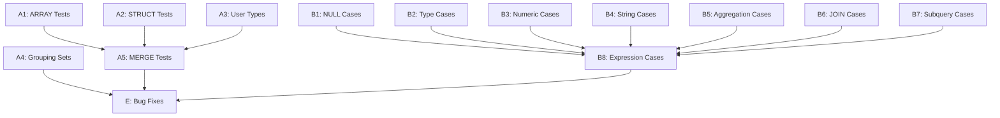

# Plan v0.9.9 - Test Suite Enhancement & Edge Cases

## Summary

This version focuses on expanding SQL:1999 test suite coverage with comprehensive edge cases to ensure robust behavior in boundary conditions.

---

## Track A: SQL:1999 Test Suite Expansion

### Goal

Complete the remaining SQL:1999 feature tests and add comprehensive edge case coverage.

### A1: ARRAY/LIST Type Tests

| # | Test | Description | Priority |
|---|------|-------------|----------|
| A1.1 | F291 Array Basic | Basic ARRAY type creation and query | High |
| A1.2 | F291 Array Insert | INSERT with ARRAY values | High |
| A1.3 | F291 Array Select | SELECT ARRAY elements | High |
| A1.4 | F291 Array Functions | ARRAY_LENGTH, ARRAY_AGG | High |
| A1.5 | F291 Nested Array | Multi-dimensional arrays | Medium |

### A2: STRUCT Type Tests

| # | Test | Description | Priority |
|---|------|-------------|----------|
| A2.1 | F301 Struct Basic | Basic STRUCT type | Medium |
| A2.2 | F301 Struct Query | Query STRUCT fields | Medium |
| A2.3 | F301 Struct Insert | INSERT with STRUCT | Medium |

### A3: User-Defined Types

| # | Test | Description | Priority |
|---|------|-------------|----------|
| A3.1 | E151 Type Basic | CREATE TYPE basic | Medium |
| A3.2 | E152 Type Values | User-defined values | Low |
| A3.3 | E153 Type Methods | Type methods | Low |

### A4: Advanced Query Features

| # | Test | Description | Priority |
|---|------|-------------|----------|
| A4.1 | F051 Fetch First | FETCH FIRST n ROWS ONLY | Medium |
| A4.2 | F051 Fetch Percent | FETCH FIRST n PERCENT | Low |
| A4.3 | F051 Fetch Ties | FETCH FIRST n ROWS WITH TIES | Low |
| A4.4 | F301 Grouping Sets | GROUP BY GROUPING SETS | Medium |
| A4.5 | F301 Rollup | ROLLUP(a, b, c) | Medium |
| A4.6 | F301 Cube | CUBE(a, b, c) | Low |

### A5: MERGE Statement

| # | Test | Description | Priority |
|---|------|-------------|----------|
| A5.1 | F871 Merge Basic | Basic MERGE INTO | High |
| A5.2 | F871 Merge Update | MERGE with UPDATE | High |
| A5.3 | F871 Merge Delete | MERGE with DELETE | High |
| A5.4 | F871 Merge Conditions | MERGE with WHEN MATCHED/NOT MATCHED | High |

### Success Criteria

| Criteria | Target | Status |
|----------|--------|--------|
| ARRAY tests added | 5+ | [ ] |
| STRUCT tests added | 3+ | [ ] |
| MERGE tests added | 4+ | [ ] |
| GROUPING SETS tests | 3+ | [ ] |
| All new tests pass | 100% | [ ] |

---

## Track B: Edge Case Testing (Comprehensive Coverage)

### Goal

Add extensive edge case tests to ensure robust behavior in boundary conditions.

### B1: NULL Edge Cases (High Priority)

| # | Test | Description | Priority |
|---|------|-------------|----------|
| B1.1 | NULL_IS_NULL | IS NULL / IS NOT NULL comparison | High |
| B1.2 | NULL_COALESCE | COALESCE with multiple NULLs | High |
| B1.3 | NULL_IFNULL | IFNULL(NULL, default) behavior | High |
| B1.4 | NULL_NULLIF | NULLIF(equal values) returns NULL | High |
| B1.5 | NULL_AGGREGATE | NULL handling in COUNT, SUM, AVG | High |
| B1.6 | NULL_EXPRESSION | NULL in arithmetic (+ - * /) | High |
| B1.7 | NULL_DISTINCT | DISTINCT with NULL values | Medium |
| B1.8 | NULL_ORDER | ORDER BY NULL ordering | Medium |

### B2: Type Conversion Edge Cases

| # | Test | Description | Priority |
|---|------|-------------|----------|
| B2.1 | TYPE_IMPLICIT_NUM | Implicit string to number | High |
| B2.2 | TYPE_IMPLICIT_STR | Implicit number to string | High |
| B2.3 | TYPE_CAST_BOUNDARY | CAST on boundary values | High |
| B2.4 | TYPE_AFFINITY | Type affinity rules | Medium |
| B2.5 | TYPE_EXPRESSION | Type coercion in expressions | Medium |
| B2.6 | TYPE_CAST_NULL | CAST NULL behavior | Medium |

### B3: Numeric Boundary Cases

| # | Test | Description | Priority |
|---|------|-------------|----------|
| B3.1 | NUM_OVERFLOW | Integer overflow (+1, -1) | High |
| B3.2 | NUM_FLOAT_PREC | Floating point precision (1.1 + 2.2) | High |
| B3.3 | NUM_DIV_ZERO | Division by zero handling | High |
| B3.4 | NUM_MOD_NEGATIVE | Negative modulo operations | Medium |
| B3.5 | NUM_EXTREME | MIN/MAX value boundaries | Medium |
| B3.6 | NUM_SCIENTIFIC | Scientific notation | Low |

### B4: String Edge Cases

| # | Test | Description | Priority |
|---|------|-------------|----------|
| B4.1 | STR_EMPTY | Empty string '' behavior | High |
| B4.2 | STR_WHITESPACE | Whitespace-only strings | High |
| B4.3 | STR_SPECIAL_CHARS | Special chars (\n, \t, ') | High |
| B4.4 | STR_LIKE_ESCAPE | LIKE escape sequences | Medium |
| B4.5 | STR_GLOB_CASE | GLOB case sensitivity | Medium |
| B4.6 | STR_LENGTH_BOUNDARY | String length limits | Low |

### B5: Aggregation Edge Cases

| # | Test | Description | Priority |
|---|------|-------------|----------|
| B5.1 | AGG_COUNT_DISTINCT_NULL | COUNT(DISTINCT col) with NULL | High |
| B5.2 | AGG_SUM_AVG_NULL | SUM/AVG with NULL values | High |
| B5.3 | AGG_GROUP_BY_MIXED | GROUP BY with mixed NULL | Medium |
| B5.4 | AGG_EMPTY_TABLE | Aggregation on empty table | Medium |
| B5.5 | AGG_STRING | String aggregation functions | Medium |
| B5.6 | AGG_MULTI_COLUMN | Multi-column GROUP BY | Medium |

### B6: JOIN Edge Cases

| # | Test | Description | Priority |
|---|------|-------------|----------|
| B6.1 | JOIN_LEFT_NULL | LEFT JOIN with NULL keys | High |
| B6.2 | JOIN_CROSS_EMPTY | CROSS JOIN with empty table | Medium |
| B6.3 | JOIN_SELF | Self-join behavior | Medium |
| B6.4 | JOIN_MULTI_TABLE | Multi-table JOIN (5+ tables) | Medium |
| B6.5 | JOIN_USING_ON | USING vs ON difference | Low |
| B6.6 | JOIN_NATURAL | NATURAL JOIN behavior | Low |

### B7: Subquery Edge Cases

| # | Test | Description | Priority |
|---|------|-------------|----------|
| B7.1 | SUB_SCALAR_MULTI | Scalar subquery returning multiple rows | High |
| B7.2 | SUB_CORRELATED | Correlated subquery behavior | Medium |
| B7.3 | SUB_EXISTS | EXISTS / NOT EXISTS edge cases | Medium |
| B7.4 | SUB_IN_NULL | IN / NOT IN with NULL values | Medium |
| B7.5 | SUB_NESTED_DEPTH | Deep nested subqueries | Low |

### B8: Expression Edge Cases

| # | Test | Description | Priority |
|---|------|-------------|----------|
| B8.1 | EXPR_SHORT_CIRCUIT | Short-circuit evaluation | Medium |
| B8.2 | EXPR_PRECEDENCE | Operator precedence | Medium |
| B8.3 | EXPR_CASE_NULL | CASE WHEN with NULL | High |
| B8.4 | EXPR_BETWEEN_NULL | BETWEEN with NULL | Medium |
| B8.5 | EXPR_COMPLEX | Complex expression combinations | Medium |

### Success Criteria

| Criteria | Target | Status |
|----------|--------|--------|
| NULL edge case tests | 8+ | [ ] |
| Type conversion tests | 6+ | [ ] |
| Numeric boundary tests | 6+ | [ ] |
| String edge tests | 6+ | [ ] |
| Aggregation tests | 6+ | [ ] |
| JOIN edge tests | 6+ | [ ] |
| Subquery tests | 5+ | [ ] |
| Expression tests | 5+ | [ ] |
| All edge tests pass | 100% | [ ] |

---

## Implementation DAG



---

## Timeline Estimate

| Track | Tasks | Hours |
|-------|-------|-------|
| A: SQL:1999 Features | A1-A5 | 12h |
| B: Edge Cases | B1-B8 | 20h |
| Bug Fixes | As discovered | 8h |
| Testing & Documentation | All tracks | 4h |

**Total:** ~44 hours

---

## Dependencies

- Existing SQL:1999 test infrastructure (`internal/TS/SQL1999/`)
- Existing regression tests (`internal/TS/Regression/`)

---

## Success Metrics

| Metric | Target |
|--------|--------|
| New SQL:1999 tests | +15 |
| New edge case tests | +48 |
| Total test functions | 450+ |
| All tests passing | 100% |

---

## New Test Directories to Create

```
internal/TS/SQL1999/
├── NULL/                         # NULL edge cases
│   ├── 01_is_null_test.go
│   ├── 02_coalesce_test.go
│   ├── 03_nullif_test.go
│   └── 04_agg_null_test.go
├── TypeConv/                     # Type conversion
│   ├── 01_implicit_cast_test.go
│   └── 02_explicit_cast_test.go
├── Numeric/                      # Numeric boundaries
│   ├── 01_overflow_test.go
│   └── 02_precision_test.go
├── String/                       # String edge cases
│   ├── 01_empty_test.go
│   └── 02_special_char_test.go
├── Aggregation/                  # Aggregation edge
│   └── 01_distinct_null_test.go
├── Join/                         # JOIN edge cases
│   └── 01_outer_join_null_test.go
└── Subquery/                     # Subquery edge
    └── 01_scalar_multi_row_test.go
```

---

## Files to Modify

### Test Suite Expansion
- `internal/TS/SQL1999/F291/` - New directory for ARRAY tests
- `internal/TS/SQL1999/F301/` - New directory for STRUCT tests
- `internal/TS/SQL1999/F871/` - Add MERGE tests
- `internal/TS/SQL1999/NULL/` - New NULL edge cases
- `internal/TS/SQL1999/TypeConv/` - New type conversion tests
- `internal/TS/SQL1999/Numeric/` - New numeric boundary tests
- `internal/TS/SQL1999/String/` - New string edge tests
- `internal/TS/SQL1999/Aggregation/` - New aggregation tests
- `internal/TS/SQL1999/Join/` - New JOIN edge tests
- `internal/TS/SQL1999/Subquery/` - New subquery tests
- `internal/TS/SQL1999/Expression/` - New expression tests

---

## Test Coverage Summary

After v0.9.9:

| Category | Before | After |
|----------|--------|-------|
| SQL:1999 Test Suites | 92 | 100+ |
| Test Functions | 396 | 440+ |
| NULL Edge Cases | Partial | Complete |
| Type Conversion | Basic | Complete |
| Numeric Boundaries | Basic | Complete |
| String Edge Cases | Basic | Complete |
| Aggregation Edge | Basic | Complete |
| JOIN Edge | Basic | Complete |
| Subquery Edge | Basic | Complete |
| Expression Edge | Basic | Complete |
