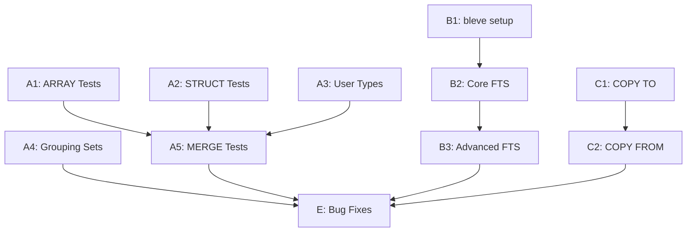

# Plan v0.9.9 - Test Suite Enhancement & Advanced Features

## Summary

This version focuses on two major areas: expanding the SQL:1999 test suite coverage and implementing advanced data types (ARRAY/STRUCT) that are commonly requested.

---

## Track A: SQL:1999 Test Suite Expansion

### Goal

Complete the remaining SQL:1999 feature tests to achieve comprehensive coverage.

### A1: ARRAY/LIST Type Tests

| # | Test | Description | Priority |
|---|------|-------------|----------|
| A1.1 | F291 Array Basic | Basic ARRAY type creation and query | High |
| A1.2 | F291 Array Insert | INSERT with ARRAY values | High |
| A1.3 | F291 Array Select | SELECT ARRAY elements | High |
| A1.4 | F291 Array Functions | ARRAY_LENGTH, ARRAY_AGG | High |
| A1.5 | F291 Nested Array | Multi-dimensional arrays | Medium |

### A2: STRUCT Type Tests

| # | Test | Description | Priority |
|---|------|-------------|----------|
| A2.1 | F301 Struct Basic | Basic STRUCT type | Medium |
| A2.2 | F301 Struct Query | Query STRUCT fields | Medium |
| A2.3 | F301 Struct Insert | INSERT with STRUCT | Medium |

### A3: User-Defined Types

| # | Test | Description | Priority |
|---|------|-------------|----------|
| A3.1 | E151 Type Basic | CREATE TYPE basic | Medium |
| A3.2 | E152 Type Values | User-defined values | Low |
| A3.3 | E153 Type Methods | Type methods | Low |

### A4: Advanced Query Features

| # | Test | Description | Priority |
|---|------|-------------|----------|
| A4.1 | F051 Fetch First | FETCH FIRST n ROWS ONLY | Medium |
| A4.2 | F051 Fetch Percent | FETCH FIRST n PERCENT | Low |
| A4.3 | F051 Fetch Ties | FETCH FIRST n ROWS WITH TIES | Low |
| A4.4 | F301 Grouping Sets | GROUP BY GROUPING SETS | Medium |
| A4.5 | F301 Rollup | ROLLUP(a, b, c) | Medium |
| A4.6 | F301 Cube | CUBE(a, b, c) | Low |

### A5: MERGE Statement

| # | Test | Description | Priority |
|---|------|-------------|----------|
| A5.1 | F871 Merge Basic | Basic MERGE INTO | High |
| A5.2 | F871 Merge Update | MERGE with UPDATE | High |
| A5.3 | F871 Merge Delete | MERGE with DELETE | High |
| A5.4 | F871 Merge Conditions | MERGE with WHEN MATCHED/NOT MATCHED | High |

### Success Criteria

| Criteria | Target | Status |
|----------|--------|--------|
| ARRAY tests added | 5+ | [ ] |
| STRUCT tests added | 3+ | [ ] |
| MERGE tests added | 4+ | [ ] |
| GROUPING SETS tests | 3+ | [ ] |
| All new tests pass | 100% | [ ] |

---

## Track B: FTS (Full-Text Search) Implementation

### Goal

Implement basic full-text search capability using bleve library.

### B1: Integration Setup

| # | Task | Description | Priority |
|---|------|-------------|----------|
| B1.1 | Add bleve dependency | Add bleve/v2 to go.mod | High |
| B1.2 | FTS Virtual Table | Implement FTS virtual table interface | High |
| B1.3 | Tokenizer | Configure ASCII/Unicode tokenizer | High |

### B2: Core FTS Features

| # | Task | Description | Priority |
|---|------|-------------|----------|
| B2.1 | CREATE FTS Table | CREATE VIRTUAL TABLE ... USING fts5 | High |
| B2.2 | FTS INSERT | Insert documents into FTS index | High |
| B2.3 | FTS Query | MATCH operator for full-text search | High |
| B2.4 | FTS Ranking | BM25 scoring | Medium |

### B3: Advanced FTS

| # | Task | Description | Priority |
|---|------|-------------|----------|
| B3.1 | Prefix Search | prefix* matching | Medium |
| B3.2 | Boolean Operators | AND, OR, NOT | Medium |
| B3.3 | Column Filter | Search specific columns | Low |
| B3.4 | Highlight Function | Highlight matching terms | Low |

### Success Criteria

| Criteria | Target | Status |
|----------|--------|--------|
| FTS table creation works | Yes | [ ] |
| Full-text search returns correct results | Yes | [ ] |
| Binary size increase | < 10MB | [ ] |
| Tests pass | 100% | [ ] |

---

## Track C: COPY Statement Implementation

### Goal

Add data import/export capability.

### C1: COPY TO

| # | Task | Description | Priority |
|---|------|-------------|----------|
| C1.1 | COPY TO CSV | Export to CSV file | High |
| C1.2 | COPY TO JSON | Export to JSON file | Medium |

### C2: COPY FROM

| # | Task | Description | Priority |
|---|------|-------------|----------|
| C2.1 | COPY FROM CSV | Import from CSV file | High |
| C2.2 | COPY FROM JSON | Import from JSON file | Medium |

### Success Criteria

| Criteria | Target | Status |
|----------|--------|--------|
| COPY TO CSV works | Yes | [ ] |
| COPY FROM CSV works | Yes | [ ] |
| COPY TO JSON works | Yes | [ ] |
| COPY FROM JSON works | Yes | [ ] |

---

## Implementation DAG

---

## Timeline Estimate

| Track | Tasks | Hours |
|-------|-------|-------|
| A: Test Suite | A1-A5 | 12h |
| B: FTS | B1-B3 | 10h |
| C: COPY | C1-C2 | 6h |
| Bug Fixes | As discovered | 6h |
| Testing & Documentation | All tracks | 4h |

**Total:** ~38 hours

---

## Dependencies

- Existing SQL:1999 test infrastructure (`internal/TS/SQL1999/`)
- Existing regression tests (`internal/TS/Regression/`)
- bleve library (v2.5.7+)

---

## Success Metrics

| Metric | Target |
|--------|--------|
| New SQL:1999 tests | +15 |
| FTS functionality | Working |
| COPY functionality | CSV + JSON |
| Binary size | < 17MB |
| All tests passing | 100% |

---

## Binary Size Impact

| Component | Size |
|-----------|------|
| sqlvibe baseline | 6.1 MB |
| + bleve (FTS) | +7 MB |
| **Total** | **~13 MB** |

---

## Files to Modify

### Test Suite
- `internal/TS/SQL1999/F291/` - New directory for ARRAY tests
- `internal/TS/SQL1999/F301/` - New directory for STRUCT tests
- `internal/TS/SQL1999/F871/` - Add MERGE tests

### FTS Implementation
- `pkg/sqlvibe/fts.go` - New FTS virtual table
- `internal/QP/parser.go` - Add FTS syntax
- `internal/VM/exec.go` - Add MATCH operator

### COPY Implementation
- `pkg/sqlvibe/copy.go` - New COPY statement handler
- `internal/QP/parser.go` - Add COPY syntax

---

## Test Coverage Summary

After v0.9.9:

| Category | Before | After |
|----------|--------|-------|
| SQL:1999 Test Suites | 92 | 95+ |
| Test Functions | 396 | 410+ |
| FTS Tests | 0 | 5+ |
| COPY Tests | 0 | 4+ |
